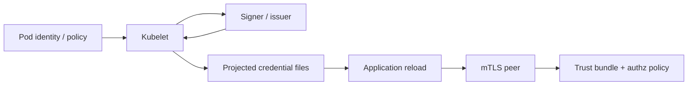
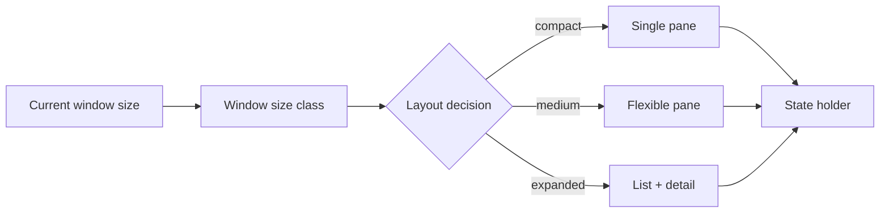

# 2026-09-19 12:00 — Interview Study Packages

README ve yakın `daily/2026-09-19/11-00.md` kontrol edildi. PostgreSQL 18 AIO ve Fenwick Tree tekrar edilmedi. Repo aramasında aşağıdaki iki konu için doğrudan önceki paket bulunmadı.

## Paket 1 — Mid → Principal Cloud/Security/Distributed Systems: Kubernetes Pod Certificates, Workload Identity & Rotation Semantics
**Süre:** 20–30 dk

### Konu anlatımı
Kubernetes `podCertificate` projected volume, Pod'a client veya server kimliği olarak kullanılabilecek private key + X.509 certificate chain sağlar. Özellik v1.34'te alpha olarak başladı ve güncel Kubernetes v1.37 dokümantasyonunda stable/enabled-by-default durumundadır. Kubelet sertifika ve private key'i expiration yaklaşınca yeniler; uygulamanın ise dosya değişimini izleyip yeni credential'ı gerçekten reload etmesi gerekir.

Bu mekanizma secret distribution ile workload identity arasındaki farkı görünür yapar. Uzun ömürlü static Secret kopyalamak yerine kısa ömürlü credential üretmek credential theft'in faydalı ömrünü küçültür; fakat authorization problemini çözmez. Sertifikayı alan workload'un hangi kaynağa erişebileceği ayrıca policy ile belirlenmelidir.

SPIFFE benzer problemi workload-centric identity modeliyle ele alır: SPIFFE ID kimliği, X509-SVID cryptographic proof'u, trust bundle ise doğrulama köklerini taşır. SPIFFE Workload API credential'ları workload'a stream edebilir. Kubernetes podCertificate ve SPIFFE aynı ürün değildir; mülakatta doğru karşılaştırma issuance/rotation/identity binding/trust distribution/authorization sınırları üzerinden yapılmalıdır.

### Mental model

**Invariant:** Credential rotation ancak consumer yeni key/certificate'i reload ederse production'da tamamlanmış sayılır; authentication kimliği kanıtlar, authorization yetkiyi ayrıca belirler.

### İçeride ne oluyor?
- `signerName`, hangi issuer/signer'ın credential vereceğini seçer; signer isteği reddedebilir.
- `keyType` ED25519, ECDSA ve RSA seçeneklerini destekler.
- `maxExpirationSeconds` kabul edilen üst lifetime sınırını ifade eder; signer daha kısa lifetime verebilir.
- Kubelet private key ve certificate chain'i projection'a yazar ve expiry yaklaşınca refresh eder.
- Uygulama `inotify`, polling veya library callback gibi bir mekanizmayla dosyayı reload etmelidir.
- SPIFFE X509-SVID'de SPIFFE ID URI SAN içinde taşınır; trust bundle peer doğrulamasında kullanılır.

### Yüksek getirili mülakat soruları
1. Static Kubernetes Secret ile short-lived workload certificate arasındaki risk farkı nedir?
2. Certificate rotation neden yalnız issuer/kubelet problemi değildir?
3. Authentication ve authorization burada nasıl ayrılır?
4. mTLS'de trust bundle ne işe yarar?
5. Certificate lifetime çok kısalırsa hangi availability/cost failure mode'ları oluşur?
6. Senior: uygulama reload etmiyorsa bunu production'da nasıl tespit edersin?
7. Staff: signer outage sırasında mevcut bağlantılar ve yeni bağlantılar nasıl davranmalı?
8. Principal: native pod certificates, SPIFFE/SPIRE veya service-mesh identity arasında nasıl seçim yaparsın?

### Seviyeye göre cevap derinliği
- **Mid:** certificate/key/trust bundle ve rotation lifecycle'ını açıklar.
- **Senior:** reload, expiry, clock skew, issuer outage ve mTLS failure'larını tasarlar.
- **Staff:** identity binding, trust-domain/federation, policy distribution ve telemetry'yi kurar.
- **Principal:** platform standardı, CA blast radius, migration, interoperability ve compliance kararlarını yönetir.

### Kısa alıştırma
30 dakikalık workload certificate kullanan bir servis çiz. Sertifika T=0'da issue edildiğinde refresh'i ne zaman başlatacağını, signer 10 dakika unavailable olursa retry/backoff'u ve uygulamanın reload ettiğini hangi metric/log ile kanıtlayacağını yaz.

### Proje fikri
`pod-cert-rotation-lab`: Kubernetes'te kısa ömürlü projected credential kullanan iki demo servis kur. mTLS handshake, certificate serial/expiry, reload latency ve issuer outage senaryosunu ölç. Eski connection'ın yaşamı ile yeni handshake'in davranışını ayrı gözlemle.

### Failure modes / trade-off / production bağlantısı
Credential dosyasını mount edip reload'u unutmak, identity'yi authorization sanmak, aşırı kısa TTL ile issuer'a load bindirmek, clock skew/CA rotation/trust bundle rollout'unu hesaba katmamak ve private-key file permissions'ı gevşek bırakmak tipik hatalardır. Production'da certificate time-to-expiry, refresh/reload success, issuance latency/error, TLS handshake failure, authorization deny, signer availability ve trust-bundle version izlenir.

### Kaynaklar
- Kubernetes Projected Volumes — podCertificate (güncel, v1.37 stable): https://kubernetes.io/docs/concepts/storage/projected-volumes/
- Kubernetes v1.34 docs — podCertificate alpha başlangıcı: https://v1-34.docs.kubernetes.io/docs/concepts/storage/projected-volumes/
- SPIFFE — Working with SVIDs: https://spiffe.io/docs/latest/deploying/svids/
- SPIFFE — X509-SVID specification: https://spiffe.io/docs/latest/spiffe-specs/x509-svid/

---

## Paket 2 — Junior → Staff Frontend/Mobile: Android Adaptive Layouts, Window Size Classes & State Preservation
**Süre:** 20–30 dk

### Konu anlatımı
Modern Android UI tasarımında cihaz modelini değil mevcut window'u düşünmek gerekir. Telefon, tablet, foldable, split-screen ve desktop windowing aynı uygulamayı farklı boyutlarda çalıştırabilir. Android 16'yı (API 36) hedefleyen uygulamalarda `sw600dp` ve üzeri display'lerde orientation, aspect-ratio ve resizability kısıtları varsayılan olarak yok sayılır; Android 17/API 37 hedefinde geçici opt-out da kaldırılır.

Bu değişiklik yalnız 'tablet UI' konusu değildir. Window boyutu runtime'da rotation, fold/unfold, multi-window veya desktop resize ile değişebilir. UI'nin adaptive olması; state'in configuration change sırasında korunması, layout kararının window size class üzerinden verilmesi ve navigation/content density'nin available space'e göre değişmesi demektir.

Responsive layout aynı yapıyı akışkan biçimde ölçekleyebilir; adaptive layout ise breakpoint/size-class değiştiğinde yapısal kompozisyonu değiştirebilir. Örneğin compact'ta listeden detail'e navigation yapılırken expanded window'da list + detail yan yana gösterilebilir.

### Mental model

**Invariant:** UI state ekran geometrisine ait değildir; window yeniden boyutlansa veya activity recreate olsa da kullanıcı bağlamı korunmalıdır.

### İçeride ne oluyor?
- Android 16/API 36 hedefinde large-screen (`smallest width >= 600dp`) orientation/aspect/resizability restrictions sistem tarafından ignore edilebilir.
- Android 17/API 37 hedefinde bu large-screen davranışı için temporary opt-out kaldırılır.
- Window size classes cihaz ismi yerine kullanılabilir alanı sınıflandırır.
- Configuration change varsayılan olarak Activity recreation tetikleyebilir; form/input/navigation state'i uygun state holder'da korunmalıdır.
- Fold/unfold ve desktop resize tek process yaşamında birçok geometry transition üretebilir.
- Camera/viewfinder gibi sensor-aspect bağımlı yüzeyler ayrıca rotation/crop/aspect testleri gerektirir.

### Yüksek getirili mülakat soruları
1. Responsive ve adaptive layout arasındaki fark nedir?
2. Neden 'tablet mi?' yerine window size ölçmek daha doğrudur?
3. Configuration change sırasında hangi state korunmalı?
4. `screenOrientation=portrait` neden modern large-screen stratejisi değildir?
5. List-detail UI compact ve expanded window'da nasıl değişir?
6. Mid: fold/unfold sırasında duplicate network request'i nasıl önlersin?
7. Senior: adaptive UI test matrix'ini nasıl kurarsın?
8. Staff: legacy fixed-layout uygulamayı telemetry ve rollout guardrail'leriyle nasıl migrate edersin?

### Seviyeye göre cevap derinliği
- **Junior:** responsive layout, rotation ve basic state preservation'ı açıklar.
- **Mid:** size-class tabanlı composition ve ViewModel/state-holder lifecycle'ını uygular.
- **Senior:** multi-window/fold/configuration testleri, performance ve accessibility edge-case'lerini yönetir.
- **Staff:** migration architecture, design-system primitives, product analytics ve compatibility rollout'unu standardize eder.

### Kısa alıştırma
E-posta uygulaması için compact/medium/expanded üç window durumunda navigation ve list-detail davranışını çiz. Kullanıcı draft yazarken window iki kez resize olursa hangi state'in UI tree dışında tutulacağını belirt.

### Proje fikri
`adaptive-mail-lab`: Compose ile list/detail demo yap. Window size class değişimlerinde single-pane ve dual-pane arasında geç; selected item ve draft state'i koru. Rotation, foldable emulator, split-screen ve desktop resize testlerini otomatikleştir.

### Failure modes / trade-off / production bağlantısı
Device-type branching, hard-coded width, orientation lock'a güvenmek, resize sırasında state kaybetmek, dual-pane'de duplicate navigation/event üretmek ve yalnız portrait phone screenshot test etmek tipik hatalardır. Production'da crash/ANR'ı window class'a göre kır, resize sonrası state-loss event'lerini ölç, layout overflow/accessibility telemetry'si ve large-screen conversion/engagement trendlerini izle.

### Kaynaklar
- Android Developers — App orientation, aspect ratio, and resizability: https://developer.android.com/develop/adaptive-apps/guides/app-orientation-aspect-ratio-resizability
- Android Developers — Android 16 behavior changes: https://developer.android.com/about/versions/16/behavior-changes-16
- Android Developers — Android 17 orientation/resizability restrictions: https://developer.android.com/about/versions/17/changes/ff-restrictions-ignored
- Android Developers — Support different display sizes: https://developer.android.com/develop/adaptive-apps/guides/support-different-display-sizes
