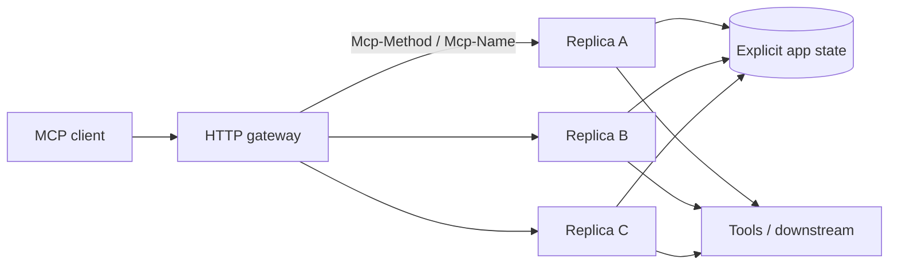
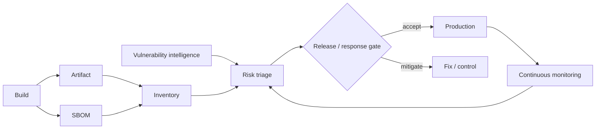

# 2026-09-19 13:00 — Interview Study Packages

README ve yakın `daily/2026-09-19/12-00.md` kontrol edildi. Kubernetes workload certificates ve Android adaptive layout tekrar edilmedi. Repo aramasında aşağıdaki iki konu için doğrudan önceki paket bulunmadı.

## Paket 1 — Mid → Principal Distributed Systems / Backend / AI Infrastructure: MCP 2026-07-28 Stateless Core, Routing & Cache Semantics
**Süre:** 20–30 dk

### Konu anlatımı
Model Context Protocol (MCP) 2026-07-28 sürümü protokol çekirdeğini stateful session modelinden stateless request/response modeline taşıdı. `initialize/initialized` handshake ve `Mcp-Session-Id` kaldırıldı; protocol version, client identity ve capabilities gerektiğinde her request'in `_meta` alanında taşınabiliyor. Capability keşfi isteyen client için `server/discover` var fakat her request öncesi zorunlu değil.

Bu değişiklik distributed-systems açısından önemlidir: protocol-level affinity kalkınca aynı client'ın ardışık request'leri farklı server replica'larına gidebilir. Böylece sticky session/shared session-store ihtiyacı protokol katmanında ortadan kalkar; fakat application state ortadan kalkmaz. Workflow/task state gerekiyorsa explicit durable store, request payload veya extension contract ile yönetilmelidir.

Streamable HTTP'de `Mcp-Method` ve `Mcp-Name` header'ları gateway'in body parse etmeden routing, authorization ve rate limiting yapabilmesini sağlar. List/resource sonuçlarındaki `ttlMs` ve `cacheScope` ise capability/tool catalog caching'i explicit hale getirir. W3C Trace Context'in `_meta` üzerinden standardize edilmesi tool call zincirini distributed trace içinde takip etmeyi kolaylaştırır.

### Mental model

**Invariant:** Stateless protocol, stateless application demek değildir. Correctness için request'in ihtiyaç duyduğu state ya request'te self-contained olmalı ya da explicit durable state'ten yeniden kurulabilmelidir.

### İçeride ne oluyor?
- `MCP-Protocol-Version` request'in hedeflediği wire contract'ı belirtir.
- `Mcp-Method` ve `Mcp-Name` gateway seviyesinde route/policy anahtarı olabilir; header/body uyuşmazlığı reddedilmelidir.
- `server/discover` capability discovery'yi connection handshake'den ayırır.
- Deterministic list ordering ve cache hints reconnect sonrası gereksiz catalog churn'ünü azaltır.
- `ttlMs` freshness süresini, `cacheScope` paylaşım sınırını ifade eder; yanlış scope cross-user data leakage yaratabilir.
- Trace Context propagation, host → MCP server → downstream tool zincirinde correlation sağlar.
- Long-running state gerekiyorsa Tasks gibi extension veya application-owned durable state gerekir.

### Yüksek getirili mülakat soruları
1. Stateless protocol ile stateless application arasındaki fark nedir?
2. Sticky session kaldırmak horizontal scaling'i neden kolaylaştırır?
3. Header-based routing body inspection'a göre hangi operasyonel avantajları verir?
4. `ttlMs` ve `cacheScope` yanlış uygulanırsa hangi correctness/security sorunları çıkar?
5. Bir request retry edilirse side effect duplicate olmamasını nasıl sağlarsın?
6. Senior: eski ve yeni MCP sürümlerini aynı gateway'de nasıl migrate edersin?
7. Staff: capability cache invalidation, auth policy ve trace propagation'ı nasıl standardize edersin?
8. Principal: MCP server platformunu multi-tenant çalıştırırken state, authorization, rate limit ve blast radius sınırlarını nasıl kurarsın?

### Seviyeye göre cevap derinliği
- **Mid:** stateless request, discovery, routing ve cache kavramlarını ayırır.
- **Senior:** retries/idempotency, cache freshness, version migration ve observability tasarlar.
- **Staff:** gateway policy, multi-replica deployment, distributed tracing ve tenant isolation kurar.
- **Principal:** protocol evolution, platform SLO, security boundary, extension governance ve build/buy kararlarını yönetir.

### Kısa alıştırma
Üç replica'lı MCP server çiz. Bir `tools/call` request'i A replica'sında başlayıp retry ile B'ye düşsün. Hangi bilgilerin request'te taşınacağını, hangi state'in durable store'da olacağını, idempotency key'i ve trace propagation'ı belirt.

### Proje fikri
`stateless-mcp-gateway-lab`: üç stateless MCP server replica'sını round-robin load balancer arkasında çalıştır. `Mcp-Method`/`Mcp-Name` ile routing/rate limit, catalog cache, trace propagation ve duplicate retry testi ekle. Sticky session olmadan correctness'i chaos test ile kanıtla.

### Failure modes / trade-off / production bağlantısı
Protocol stateless oldu diye workflow state'ini process memory'de tutmak, cacheScope'u fazla geniş seçmek, header/body consistency kontrolünü atlamak, non-idempotent tool'u kör retry etmek, version skew ve trace context'i göz ardı etmek tipik hatalardır. Production'da request/error rate, per-method latency, cache hit/stale serve, retry/duplicate suppression, authorization deny, version distribution, replica skew ve end-to-end trace completeness izlenir.

### Kaynaklar
- MCP — 2026-07-28 Specification release, 28 Temmuz 2026: https://blog.modelcontextprotocol.io/posts/2026-07-28/
- MCP — 2026-07-28 Release Candidate / architectural details: https://blog.modelcontextprotocol.io/posts/2026-07-28-release-candidate/
- MCP — Updated Roadmap, 22 Ağustos 2026: https://blog.modelcontextprotocol.io/posts/mcp-roadmap/

---

## Paket 2 — Senior → CTO Cybersecurity / Leadership / Product: SBOM as Operational Supply-Chain Control
**Süre:** 20–30 dk

### Konu anlatımı
Software Bill of Materials (SBOM), bir yazılım artefact'ının bileşenlerini ve bunların kimlik/ilişki metadata'sını makinece işlenebilir biçimde görünür kılar. Fakat production değeri 'bir SBOM dosyası ürettik' değildir. Değer, build provenance ile doğru artefact'a bağlanan SBOM'un vulnerability intelligence, asset inventory, procurement, incident response ve release policy içinde kullanılabilmesidir.

CISA'nın 2025 güncellenmiş Minimum Elements dokümanı baseline'ı üç kategoriye ayırır: Data Fields, Automation Support ve Practices and Processes. Kapsam yalnız klasik paketleri değil açık kaynak, AI software ve SaaS bileşenlerini de içerebilir. Bu çerçeve SBOM'u statik compliance eki yerine otomasyon girdisi olarak düşünmeyi teşvik eder.

Risk modeli önemlidir: 'CVE SBOM'da var' doğrudan exploitable demek değildir; 'CVE yok' da güvenli demek değildir. Reachability, deployment context, compensating controls, EPSS/known-exploited evidence, asset criticality ve fix availability birlikte triage edilir. CTO seviyesinde soru, coverage ile false-positive maliyetini ve supplier transparency ile delivery friction'ı nasıl dengeleyeceğindir.

### Mental model

**Invariant:** SBOM inventory evidence'ıdır; tek başına vulnerability exploitability veya software trustworthiness kanıtı değildir.

### İçeride ne oluyor?
- Component identity mümkün olduğunca supplier/name/version ve persistent identifier'larla normalize edilir.
- Dependency relationship, top-level artefact ile transitive component arasındaki bağı kurar.
- Automation-friendly format ingestion, diff ve continuous monitoring'i mümkün kılar.
- Build sırasında üretilen SBOM, release artefact digest/provenance ile bağlanmazsa yanlış binary'ye ait olabilir.
- Vulnerability feed değiştiği için aynı immutable SBOM zaman içinde yeni risk bulguları üretebilir.
- Supplier SBOM quality, freshness, completeness ve update SLA ayrı ölçülmelidir.

### Yüksek getirili mülakat soruları
1. SBOM ile vulnerability scan arasındaki fark nedir?
2. SBOM'u artefact digest'e bağlamak neden önemlidir?
3. Bir dependency'de CVE bulunması release'i otomatik bloklamalı mı?
4. Transitive dependency ve unknown component nasıl ele alınır?
5. SBOM freshness/completeness nasıl ölçülür?
6. Staff: monorepo + container + base image için SBOM aggregation modelini nasıl kurarsın?
7. Principal: supplier SBOM kalitesi düşükse procurement ve compensating controls nasıl tasarlanır?
8. CTO: hangi risk seviyesinde release gate, exception veya product withdrawal kararı verirsin?

### Seviyeye göre cevap derinliği
- **Senior:** component/dependency identity, generation, validation ve vulnerability correlation'ı açıklar.
- **Staff:** CI/CD ingestion, artefact binding, policy gate, exception ve incident workflow tasarlar.
- **Principal:** organization-wide schema/quality standardı, supplier controls ve risk prioritization kurar.
- **CTO:** regulatory/customer expectations, delivery velocity, supplier leverage, incident economics ve risk appetite'ı birlikte yönetir.

### Kısa alıştırma
Bir container image için SBOM pipeline çiz: source dependencies, OS packages ve base image'i tek release artefact'ına bağla. Kritik CVE geldiğinde hangi evidence ile block/exception kararı vereceğini ve exception expiry'yi yaz.

### Proje fikri
`sbom-risk-gate-lab`: küçük bir servis için build sırasında CycloneDX veya SPDX SBOM üret; image digest ile bağla; vulnerability feed ile correlate et; severity + exploitability + asset criticality tabanlı policy gate ve süreli exception ekle. Yeni advisory geldiğinde rebuild olmadan mevcut inventory'yi yeniden değerlendir.

### Failure modes / trade-off / production bağlantısı
SBOM'u release artefact'ına bağlamamak, yalnız direct dependency toplamak, stale supplier SBOM'a güvenmek, her CVE'yi aynı riskte görmek, false positive yüzünden gate'i bypass kültürüne çevirmek ve exception'ları süresiz bırakmak tipik hatalardır. Production'da SBOM coverage/completeness, unknown component rate, freshness age, critical finding MTTR, exception age, supplier conformance ve artefact-to-SBOM verification failure izlenir.

### Kaynaklar
- CISA — Minimum Elements for a Software Bill of Materials, 2025 update: https://www.cisa.gov/sites/default/files/2025-08/2025_CISA_SBOM_Minimum_Elements.pdf
- CISA / Enduring Security Framework — Recommended Practices for Managing OSS and SBOMs: https://www.cisa.gov/sites/default/files/2024-08/ESF_SECURING_THE_SOFTWARE_SUPPLY_CHAIN%20RECOMMENDED%20PRACTICES%20FOR%20MANAGING%20OPEN%20SOURCE%20SOFTWARE%20AND%20SOFTWARE%20BILL%20OF%20MATERIALS_508.pdf
