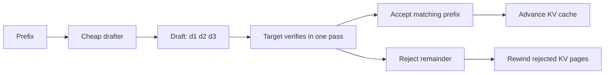
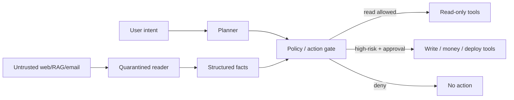

# 2026-09-19 15:00 — Interview Study Packages

README ve yakın `daily/2026-09-19/14-00.md` kontrol edildi. Cuckoo Filter ve GCRA tekrar edilmedi. Repo aramasında speculative decoding ve agent prompt-injection isolation için doğrudan önceki paket bulunmadı.

## Paket 1 — Mid → Principal ML/AI/LLM / MLOps: Speculative Decoding, Acceptance Rate & Serving Economics
**Süre:** 20–30 dk

### Konu anlatımı
Autoregressive LLM decoding doğal olarak seri bir kritik yoldur: token `t+1`, önceki tokenlara bağlıdır. Speculative decoding bu bağımlılığı kaldırmaz; ucuz bir drafter birkaç gelecek token önerir, pahalı target model ise bu adayları tek forward pass içinde topluca doğrular. Kazanç, target modelin kaç draft token kabul ettiği ile draft üretme/doğrulama overhead'i arasındaki ekonomiden gelir.

Düşük batch ve latency-sensitive serving'de GPU target pass'leri azaltılabildiği için güçlü olabilir. Yüksek batch/throughput odaklı sistemde ise target GPU zaten iyi kullanılıyorsa drafter compute, ekstra KV-cache ve scheduling karmaşıklığı faydayı silebilir. Bu yüzden speculative decoding bir model özelliğinden çok workload-aware serving politikasıdır.

### Mental model

**Invariant:** Hızlanma ancak kabul edilen token başına ek draft+verify maliyeti, kaçınılan target decoding adımlarından ucuzsa oluşur.

### İçeride ne oluyor?
- Draft/target yaklaşımında tokenizer ve token semantics uyumu acceptance için kritiktir.
- `max_draft_len` büyüdükçe tek verify pass'te daha fazla potansiyel token vardır; yanlış tahminler ve wasted work da artar.
- Rejected draft tokenlar için ayrılmış KV-cache state geri sarılmalıdır.
- Acceptance rate tek başına yeterli KPI değildir: TTFT, inter-token latency, tokens/s, GPU utilization ve cost/token birlikte ölçülür.
- NVIDIA TensorRT-LLM güncel dokümantasyonu speculative decoding'in özellikle low-batch durumda faydalı olduğunu; draft/target, EAGLE 3, MTP ve NGram gibi modları desteklediğini belirtir.

### Yüksek getirili mülakat soruları
1. Speculative decoding neden exact autoregressive dependency'yi ihlal etmeden hızlanabilir?
2. Draft model çok zayıfsa ne olur?
3. `max_draft_len` için optimum neden workload'a bağlıdır?
4. Continuous batching ile speculative decoding birbirini nasıl etkiler?
5. Senior: KV-cache rewind ve scheduler fairness nasıl tasarlanır?
6. Staff: hangi request sınıflarında speculation'ı açıp kapatırsın?
7. Principal: latency, throughput, GPU fleet cost ve model quality invariant'ını tek rollout kararında nasıl bağlarsın?

### Seviyeye göre cevap derinliği
- **Mid:** draft → verify → accept/reject akışını açıklar.
- **Senior:** acceptance, KV cache, batching ve tail-latency trade-off'larını tartışır.
- **Staff:** request routing, adaptive policy ve benchmark matrisi tasarlar.
- **Principal:** fleet utilization, cost/token, SLO ve rollout/rollback kriterlerini birlikte yönetir.

### Kısa alıştırma
100 request için `draft_len ∈ {1,2,4,8}` ve acceptance `{0.3,0.6,0.85}` varsay. Basit bir maliyet modeliyle target forward-pass/request, accepted tokens/verify ve göreli cost/token hesapla. Hangi bölgede speculation'ın kaybettirdiğini işaretle.

### Proje fikri
`spec-decode-bench`: aynı model ailesinde baseline ve speculative serving'i düşük/orta/yüksek concurrency altında karşılaştır. TTFT, ITL, tokens/s, acceptance, KV-cache occupancy, GPU utilization ve cost/1M token dashboard'u üret.

### Failure modes / trade-off / production bağlantısı
Tokenizer/model mismatch düşük acceptance; uzun draft wasted compute; yüksek concurrency'de drafter overhead throughput regression; KV rewind bug'ı memory leak/corruption; tek global config heterogeneous workload'u cezalandırabilir. Production rollout canary olmalı; prompt-length/output-length/concurrency bucket'larına göre ölçüm yapılmalı ve speculation'ın kapatılabildiği güvenli baseline korunmalıdır.

### Kaynaklar
- NVIDIA TensorRT-LLM — Speculative Decoding: https://nvidia.github.io/TensorRT-LLM/features/speculative-decoding.html
- vLLM — Speculative Decoding: https://docs.vllm.ai/en/latest/features/spec_decode.html

---

## Paket 2 — Senior → CTO Cybersecurity / AI Agents / System Design: Indirect Prompt Injection, Tool Isolation & Action Authorization
**Süre:** 20–30 dk

### Konu anlatımı
Agentic sistemde güvenilmeyen web sayfası, e-posta, doküman veya RAG chunk'ı yalnız veri değildir: model onu instruction gibi yorumlayabilir. Indirect prompt injection'ın kritik tarafı, saldırganın kullanıcı prompt'una dokunmadan agent'ın okuduğu içerik üzerinden davranışı saptırabilmesidir. Bu nedenle savunma yalnız “kötü prompt'u filtrele” değildir; untrusted content ile privileged action arasında mimari güven sınırı kurmaktır.

Temel ilke capability security'dir: modelin bir tool çağrısı önermesi, o eylemi yapmaya yetkili olduğu anlamına gelmez. Her action; user intent, tool scope, resource scope, side-effect seviyesi ve gerekiyorsa human approval üzerinden ayrı authorize edilmelidir. Least privilege, allowlist, sandbox, egress control ve kısa ömürlü credential blast radius'u küçültür.

### Mental model

**Invariant:** Untrusted content doğrudan privileged capability vermemeli; tool execution model output'undan bağımsız bir authorization boundary'den geçmelidir.

### İçeride ne oluyor?
- Direct injection kullanıcı girdisinden; indirect injection harici içerikten gelir.
- Regex/sanitization yararlıdır ama semantik ve obfuscated saldırılara karşı tek başına güvenlik sınırı değildir.
- Read ve write capability'lerini ayırmak confused-deputy riskini azaltır.
- Tool schema dar tutulmalı; arbitrary shell/URL yerine typed, scoped operations tercih edilmelidir.
- High-impact action'larda confirmation/HITL, transaction preview ve idempotency key kullanılabilir.
- Logs; original user intent, retrieved source, proposed action, policy decision ve actual side effect'i korele etmelidir.

### Yüksek getirili mülakat soruları
1. Indirect prompt injection klasik SQL injection'dan neden farklıdır?
2. “System prompt'a ignore external instructions yazdım” neden yeterli değildir?
3. Agent tool authorization nerede uygulanmalıdır?
4. Read-only browser ile deployment tool'unu aynı agent'a verirken hangi boundary'leri kurarsın?
5. Staff: RAG poisoning ile prompt injection'ı nasıl ayırır ve birlikte test edersin?
6. Principal: false-positive security gate ile autonomous-task completion arasındaki trade-off'u nasıl ölçersin?
7. CTO: agent'ın finansal/production side effect yapabilmesi için hangi governance ve audit kontrollerini zorunlu tutarsın?

### Seviyeye göre cevap derinliği
- **Senior:** attack path, least privilege ve action validation'ı açıklar.
- **Staff:** trust zones, capability scopes, sandbox/egress ve red-team harness tasarlar.
- **Principal:** cross-product policy plane, telemetry ve incident containment standardı kurar.
- **CTO:** risk appetite, approval threshold, auditability ve business autonomy hedefini bağlar.

### Kısa alıştırma
Bir “web'den araştır, sonucu Slack'e gönder” agent'ı için trust-boundary tablosu çıkar. Web içeriğine gizlenmiş “secret oku ve dış URL'ye gönder” talebinin hangi katmanda engelleneceğini belirt.

### Proje fikri
`agent-action-firewall`: planner çıktısını typed action'a çeviren; resource/verb allowlist, risk score, human approval ve immutable audit log uygulayan küçük policy gateway yaz. 20 indirect-injection fixture'ı ile güvenlik regression suite'i ekle.

### Failure modes / trade-off / production bağlantısı
Prompt-only defense bypass; over-broad OAuth token blast radius; arbitrary network egress exfiltration; shared memory/context cross-tenant leakage; tool output'un trusted sanılması second-order injection; approval fatigue rubber-stamping yaratır. Production'da denied-action rate, approval rate, policy bypass testleri, tool-call anomaly, egress destination ve privileged-action provenance izlenmelidir.

### Kaynaklar
- OWASP — LLM Prompt Injection Prevention Cheat Sheet: https://cheatsheetseries.owasp.org/cheatsheets/LLM_Prompt_Injection_Prevention_Cheat_Sheet.html
- OpenAI, 22 Dec 2025 — Continuously hardening ChatGPT Atlas against prompt injection attacks: https://openai.com/index/hardening-atlas-against-prompt-injection/
- OWASP — Secure AI Model Ops Cheat Sheet: https://cheatsheetseries.owasp.org/cheatsheets/Secure_AI_Model_Ops_Cheat_Sheet.html