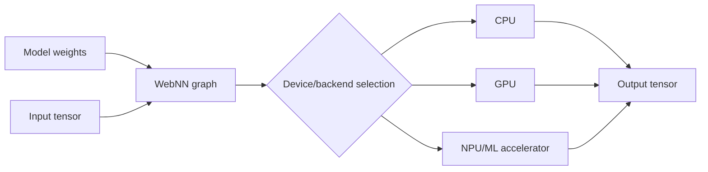
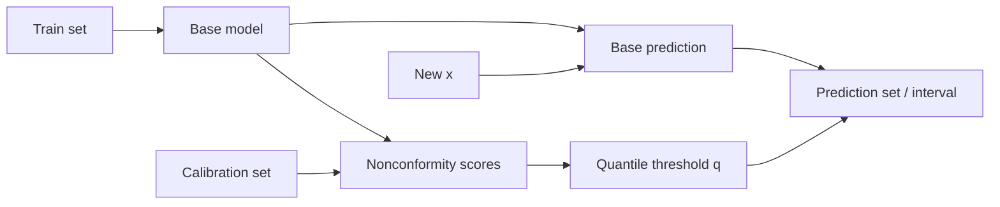

# 2026-09-19 16:00 — Interview Study Packages

README ve yakın `daily/2026-09-19/15-00.md` kontrol edildi; speculative decoding ve indirect prompt injection tekrar edilmedi. Repo aramasında Linux PSI ve OpenTelemetry Profiles'in de daha önce birden fazla kez işlendiği görüldü. Bu tur Frontend/Mobile + ML inference ile ML/AI/MLOps eksenine döndü.

## Paket 1 — Mid → Principal Frontend/Mobile / ML Systems: WebNN, On-Device Inference & Hardware Abstraction
**Süre:** 20–30 dk

### Konu anlatımı
Web Neural Network API (WebNN), web uygulamalarına neural-network inference için düşük seviyeli bir graph API sunmayı hedefler. 4 Eylül 2026 tarihli W3C Candidate Recommendation Draft; CPU/GPU/NPU gibi platform hızlandırıcılarının ayrıntılarını doğrudan uygulamaya sızdırmak yerine graph oluşturma, tensor/buffer yönetimi ve device-selection soyutlaması sağlar. Amaç yeni bir model formatı yaratmak değil, inference graph'ını mevcut platform ML backend'lerine taşınabilir biçimde ifade etmektir.

On-device inference'ın temel ekonomisi şudur: server round-trip ve cloud inference maliyeti azalabilir; privacy ve offline deneyim iyileşebilir. Karşılığında model download boyutu, cihaz heterojenliği, memory pressure, thermal throttling, battery ve backend/operator coverage ürünün parçası olur.

### Mental model

**Invariant:** API portability sağlar; aynı graph'ın her cihazda aynı latency, power veya operator implementation kalitesini vermesini garanti etmez.

### İçeride ne oluyor?
- Graph build aşaması operator'ları ve tensor shape/type ilişkilerini tanımlar; execution backend bunları platform primitive'lerine map eder.
- `MLTensor` gibi buffer-sharing mekanizmaları gereksiz kopyaları azaltmayı hedefler; copy sayısı özellikle camera/audio gibi pipeline'larda latency ve power'ı belirler.
- Device selection yalnız peak TOPS seçimi değildir: transfer overhead, memory capacity, power/thermal budget ve operator support hesaba katılır.
- W3C 4 Eylül 2026 draft'ı transformer desteğini genişleten operator'lar, `MLTensor` ve abstract device selection gibi son dönem değişiklikleri içerir.
- Candidate Recommendation hâlâ work-in-progress'tir; feature detection ve fallback production tasarımının zorunlu parçasıdır.

### Yüksek getirili mülakat soruları
1. WebNN ile WebGPU'nun abstraction seviyesi nasıl farklıdır?
2. Neden on-device inference otomatik olarak daha hızlı değildir?
3. Tensor copy sayısı neden kritik olabilir?
4. Browser/device heterojenliğinde fallback zincirini nasıl tasarlarsın?
5. Senior: model download, cache ve version rollout'u nasıl yönetirsin?
6. Staff: CPU/GPU/NPU routing için hangi benchmark matrisini kurarsın?
7. Principal: cloud ve on-device inference arasında privacy, cost, quality ve operability kararını nasıl standardize edersin?

### Seviyeye göre cevap derinliği
- **Mid:** graph, tensor, backend ve fallback kavramlarını açıklar.
- **Senior:** memory copy, warmup, model caching, thermal ve compatibility failure'larını tartışır.
- **Staff:** capability detection, device-tier benchmark ve rollout policy tasarlar.
- **Principal:** client-fleet heterojenliği, privacy, cloud spend ve ürün SLO'sunu tek mimari karara bağlar.

### Kısa alıştırma
Bir image classifier için `cloud`, `WebNN-NPU`, `WebNN-GPU`, `WASM-CPU` yollarını tabloya koy. Her yol için cold start, steady-state latency, network dependency, privacy, battery ve observability puanı ver; routing policy yaz.

### Proje fikri
`webnn-inference-lab`: küçük bir vision/text modelini WebNN ile çalıştır; fallback olarak WASM veya server inference ekle. Model load, graph compile, first inference, steady-state p50/p95, memory ve battery proxy metriklerini cihaz sınıfına göre kaydet.

### Failure modes / trade-off / production bağlantısı
Unsupported operator, dynamic-shape mismatch, model download cache miss, memory pressure, backend compilation spike, thermal throttling, browser implementation farkı ve silent fallback latency regression tipiktir. Production'da capability/backend distribution, model-load failure, compile latency, inference p50/p95, fallback rate, crash/OOM ve model-version adoption izlenmelidir.

### Kaynaklar
- W3C Web Neural Network API — Candidate Recommendation Draft, 4 Sep 2026: https://www.w3.org/TR/webnn/
- W3C WebNN publication history: https://www.w3.org/standards/history/webnn/
- Web Platform Tests — WebNN: https://github.com/web-platform-tests/wpt/tree/master/webnn

---

## Paket 2 — Junior → Staff ML/AI / MLOps: Conformal Prediction, Coverage Guarantees & Distribution Shift
**Süre:** 20–30 dk

### Konu anlatımı
Klasik model çoğu zaman tek bir tahmin verir; conformal prediction ise mevcut modelin hata/nonconformity skorlarını calibration verisi üzerinde sıralayıp prediction set veya interval üretir. Split conformal'ın çekici tarafı model-agnostic olmasıdır: uygun exchangeability varsayımı altında finite-sample **marginal coverage** hedefi verir. Örneğin hedef `1-α = 0.9` ise uzun vadede test örneklerinin yaklaşık %90'ında gerçek sonucu kapsayan set/interval amaçlanır.

Bu garanti conditional accuracy değildir. Belirli bir alt grupta coverage çok düşükken başka grupta yüksek olabilir ve toplamda %90 görülebilir. Ayrıca production distribution shift exchangeability varsayımını bozabilir. Bu yüzden conformal prediction belirsizliği “çözmez”; point prediction'ın yanına coverage-efficiency sözleşmesi koyar.

### Mental model

**Invariant:** Coverage garantisinin anlamı varsayımlara bağlıdır; marginal coverage'ı her kullanıcı/segment için conditional guarantee gibi sunma.

### İçeride ne oluyor?
- Regression örneğinde score `|y - ŷ|` olabilir; calibration quantile `q` ile `[ŷ-q, ŷ+q]` interval'i üretilir.
- Classification'da score seçimine göre label set oluşturulur; daha yüksek belirsizlik daha büyük set olarak görünür.
- Calibration set train set'ten ayrılmalıdır; aynı veriyi uygunsuz biçimde yeniden kullanmak finite-sample argümanını bozabilir.
- Coverage tek KPI değildir: interval width / set size efficiency'yi ölçer.
- Exchangeability ihlalinde temporal drift, geography/device mix veya feedback loop coverage'ı düşürebilir; rolling/weighted calibration gibi yöntemler ancak yeni varsayım ve trade-off'larla kullanılmalıdır.

### Yüksek getirili mülakat soruları
1. Calibration ile conformal prediction arasındaki fark nedir?
2. %90 marginal coverage tam olarak neyi garanti eder, neyi etmez?
3. Calibration set neden ayrı tutulur?
4. Prediction interval çok genişse sistem doğru mudur, faydalı mıdır?
5. Senior: distribution shift'i coverage telemetry'sinde nasıl yakalarsın?
6. Staff: segment-level undercoverage ile sample-size noise'u nasıl ayırırsın?
7. Staff: risk-sensitive üründe abstention/escalation policy'yi conformal set size ile nasıl bağlarsın?

### Seviyeye göre cevap derinliği
- **Junior:** point prediction ile interval/set farkını ve calibration fikrini açıklar.
- **Mid:** nonconformity score, quantile ve marginal coverage'ı kurar.
- **Senior:** exchangeability, shift, conditional undercoverage ve efficiency trade-off'unu tartışır.
- **Staff:** monitoring, recalibration cadence, segmentation ve downstream decision policy tasarlar.

### Kısa alıştırma
20 calibration residual'ı üret ve `α=0.1` için split-conformal quantile hesapla. Sonra test verisinin residual scale'ini 2x büyüt; empirical coverage ve interval width değişimini gözlemle. Hangi varsayımın kırıldığını yaz.

### Proje fikri
`conformal-monitor`: herhangi bir regression modelini wrapper ile prediction interval'e çevir. Global ve segment bazında empirical coverage, mean interval width, drift ve abstention oranını dashboard'a çıkar; calibration-window değişimini backtest et.

### Failure modes / trade-off / production bağlantısı
Train/calibration leakage, küçük calibration sample, non-exchangeable temporal data, segment undercoverage, aşırı geniş interval, delayed ground truth ve yanlış “%90 confidence” iletişimi tipiktir. Production'da realized coverage ancak label geldiğinde ölçülebilir; bu nedenle label-delay-aware dashboard, segment minimum sample ve recalibration/rollback policy gerekir.

### Kaynaklar
- Barber, Candès, Ramdas, Tibshirani — Conformal Prediction Beyond Exchangeability: https://arxiv.org/abs/2202.13415
- Zhou et al., 28 Mar 2026 — Conformal Prediction Assessment / conditional coverage evaluation: https://arxiv.org/abs/2603.27189
