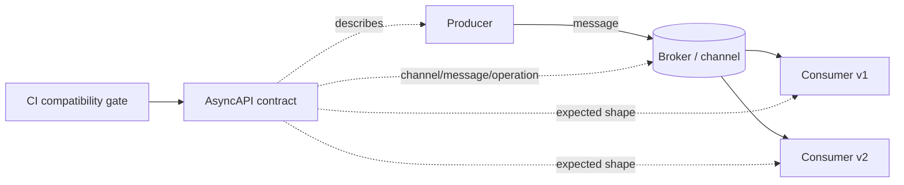
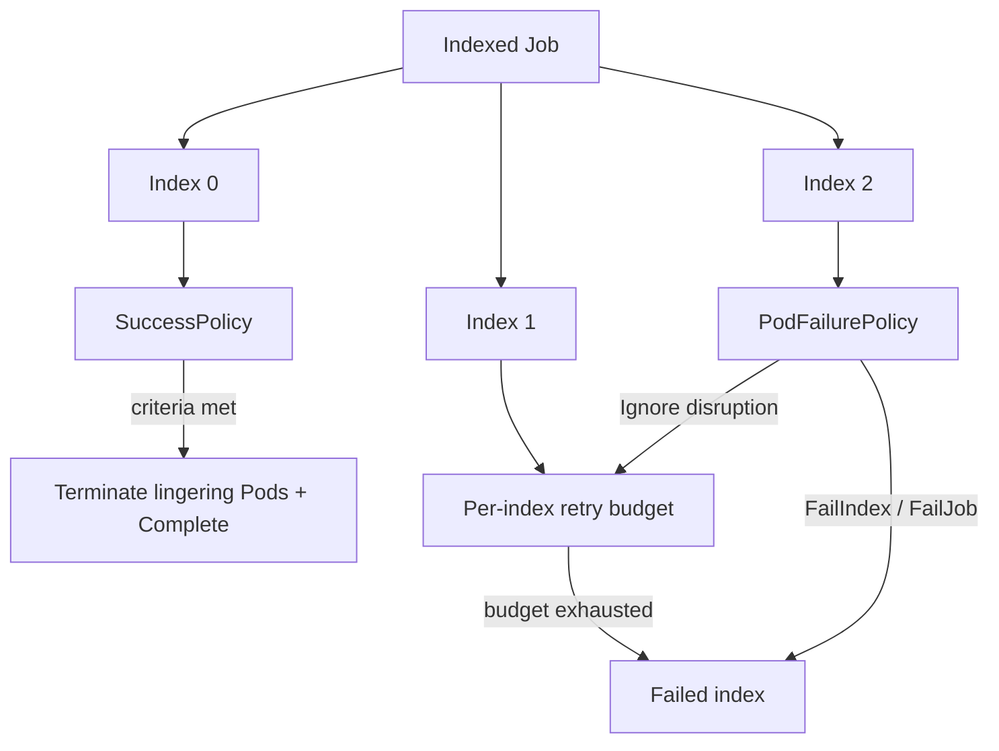

# 2026-09-19 17:00 — Interview Study Packages

README ve yakın `daily/2026-09-19/16-00.md` kontrol edildi; WebNN ve conformal prediction tekrar edilmedi. Repo aramasında OpenTelemetry database semantic conventions'ın daha önce birkaç kez işlendiği görüldüğü için elendi. Bu tur event-driven system design ile Cloud/SRE batch orchestration eksenine döndü.

## Paket 1 — Mid → Principal Distributed Systems / System Design: AsyncAPI 3.1, Event Contracts & Evolution
**Süre:** 20–30 dk

### Konu anlatımı
Event-driven sistemlerde producer ile consumer aynı anda deploy edilmez. Bu yüzden event contract yalnız payload JSON'u değildir: channel/address, message schema, operation yönü, protocol binding, security ve compatibility policy birlikte bir dağıtık sözleşme oluşturur. AsyncAPI bu sözleşmeyi makinece okunabilir hale getirir. 31 Ocak 2026'da yayımlanan AsyncAPI 3.1.0, 3.0'a göre breaking olmayan minor sürümdür ve ROS 2 protocol binding desteği ekler.

Contract-first yaklaşımın değeri dokümantasyondan fazladır: CI schema validation, generated docs/code, ownership discovery ve breaking-change gate üretilebilir. Ancak spec dosyasının varlığı runtime compatibility garantisi değildir; schema registry kuralları, rollout sırası ve consumer davranışı ayrıca tasarlanmalıdır.

### Mental model

**Invariant:** Event schema değişikliği, bağımsız deploy edilen eski consumer'ların okuyabildiği veri kümesini daraltmamalıdır; aksi halde rollout sırası veya versioning gerekir.

### İçeride ne oluyor?
- AsyncAPI 3.x'te `channels` iletişim adreslerini ve taşınan message'ları; `operations` ise send/receive davranışını ayrı modeller.
- Protocol bindings Kafka, MQTT, AMQP veya ROS 2 gibi taşıma ayrıntılarını core contract'tan ayırır.
- Schema evolution'da additive optional field çoğu zaman daha güvenlidir; required field eklemek veya semantic meaning değiştirmek breaking olabilir.
- Event envelope için CloudEvents gibi standartlar `id`, `source`, `type`, `specversion` gibi ortak metadata sağlayabilir; business payload schema'sının yerine geçmez.
- Consumer-driven compatibility testi yalnız syntax değil semantic varsayımları da yakalamalıdır: enum genişlemesi, ordering, duplicate delivery ve null/default davranışı.

### Yüksek getirili mülakat soruları
1. Event contract ile payload schema arasındaki fark nedir?
2. AsyncAPI ile OpenAPI'nin problem alanları nasıl ayrılır?
3. Optional field eklemek neden genellikle daha güvenlidir ama yine de tamamen risksiz değildir?
4. At-least-once delivery altında contract tasarımı idempotency'yi nasıl etkiler?
5. Senior: producer ve 20 consumer bağımsız deploy oluyorsa breaking change'i nasıl rollout edersin?
6. Staff: schema registry, AsyncAPI ve CI ownership modelini nasıl bağlarsın?
7. Principal: yüzlerce event type için version sprawl ile compatibility discipline arasında hangi governance modelini kurarsın?

### Seviyeye göre cevap derinliği
- **Mid:** channel, message, operation ve schema ayrımını açıklar; backward compatibility örneği verir.
- **Senior:** rollout sırası, replay, duplicate delivery ve semantic compatibility failure'larını tartışır.
- **Staff:** registry, CI gate, ownership ve deprecation workflow tasarlar.
- **Principal:** organizasyon çapında event taxonomy, version policy, governance maliyeti ve platform standardını ürün hızıyla dengeler.

### Kısa alıştırma
`OrderCreated` event'inin v1 şemasında `orderId`, `currency`, `total` olsun. `discounts`, yeni payment state ve çoklu para birimi ihtiyacını destekleyecek v2 tasarla. Hangi değişikliklerin eski consumer'ı kırabileceğini işaretle ve rollout sırası yaz.

### Proje fikri
`event-contract-lab`: iki producer ve üç consumer içeren küçük Kafka/NATS uygulaması kur. AsyncAPI 3.1 dokümanı, JSON Schema, CI compatibility check ve generated docs ekle. Eski consumer açıkken additive ve breaking değişiklikleri deneyerek replay testleri yaz.

### Failure modes / trade-off / production bağlantısı
Schema'yı yalnız dokümantasyon olarak tutmak, semantic breaking change'i syntax-compatible sanmak, consumer ownership bilmemek, enum genişlemesini hesaba katmamak, event versionlarını sonsuza kadar yaşatmak ve PII'yi event'e geri döndürülemez biçimde yaymak tipik failure mode'lardır. Production'da schema/version dağılımı, deserialize error, unknown-field/enum oranı, dead-letter hacmi, consumer lag ve deprecated-version trafiği izlenmelidir.

### Kaynaklar
- AsyncAPI 3.1.0 release notes, 31 Jan 2026: https://www.asyncapi.com/blog/release-notes-3.1.0
- AsyncAPI Initiative: https://www.asyncapi.com/
- CloudEvents: https://cloudevents.io/

---

## Paket 2 — Junior → Staff Cloud / DevOps / SRE: Kubernetes Indexed Jobs, SuccessPolicy & Failure Budgets
**Süre:** 20–30 dk

### Konu anlatımı
Kubernetes Job yalnız “Pod bitene kadar retry et” değildir. Indexed Jobs büyük batch işi deterministik index'lere bölebilir; modern Job API'si başarının ve başarısızlığın ne zaman ilan edileceğini ayrı politikalara dönüştürür. `successPolicy` ve `backoffLimitPerIndex` Kubernetes v1.33'te stable/GA oldu; `podFailurePolicy` ise v1.31'den beri stable'dır.

Bu model ML evaluation, simulation, test sharding ve embarrassingly-parallel data processing için önemlidir. Her shard'ın başarı zorunluluğu aynı olmayabilir; bazı exit code'lar retry ile düzelmez; node disruption ise uygulama bug'ı değildir. SRE açısından retry bir correctness özelliği kadar capacity ve cost bütçesidir.

### Mental model

**Invariant:** Retry budget transient failure içindir; deterministic bug'ı tekrar çalıştırmak reliability değil, kaynak tüketimidir.

### İçeride ne oluyor?
- `completionMode: Indexed` her Pod'a bir completion index verir ve shard kimliğini stabil hale getirir.
- `backoffLimitPerIndex` retry bütçesini global Job yerine index başına uygular; bir poison shard diğer shard'ların bütçesini tüketmez.
- `maxFailedIndexes` kabul edilebilir toplam shard failure sınırı koyar.
- `podFailurePolicy` exit code veya Pod condition'a göre `Ignore`, `Count`, `FailIndex`, `FailJob` gibi aksiyonlar seçebilir; policy için `restartPolicy: Never` gerekir.
- `successPolicy` belirli index'ler veya belirli sayıda başarılı index üzerinden erken başarı tanımlayabilir. Başarı kriteri sağlandığında controller kalan Pod'ları sonlandırır.
- Terminating/failure policy ile success policy çakışırsa termination semantics dikkatle okunmalıdır; “yeterince başarılı” ile “kritik hata oluştu” aynı şey değildir.

### Yüksek getirili mülakat soruları
1. Job ile Deployment'ın retry/lifecycle modeli nasıl farklıdır?
2. Global `backoffLimit` neden heterojen shard'larda sorun çıkarabilir?
3. Hangi hatalar `Ignore`, `Count`, `FailIndex`, `FailJob` olmalı?
4. Erken başarı kriteri ne zaman correctness'i bozar?
5. Senior: spot/preemptible node'larda batch maliyetini nasıl düşürürsün?
6. Staff: 100k shard'lık workload için retry storm ve API-server pressure'ı nasıl sınırlandırırsın?
7. Staff: batch SLO'sunda “%99 shard başarı” ile “tüm kritik shard'lar başarı” arasındaki farkı nasıl modelllersin?

### Seviyeye göre cevap derinliği
- **Junior:** Job/Pod ayrımını, completion ve retry fikrini açıklar.
- **Mid:** indexed shard, per-index backoff ve failure policy kullanır.
- **Senior:** deterministic/transient/disruption sınıflandırması, cost ve deadline trade-off'unu kurar.
- **Staff:** workload-level success semantics, capacity isolation, observability ve controller-scale etkilerini birlikte tasarlar.

### Kısa alıştırma
20 index'li bir test Job'u tasarla. Exit `42` deterministic test/config hatası, `137` memory pressure, `DisruptionTarget` ise node disruption olsun. Her biri için policy aksiyonu, retry bütçesi ve Job-level success kriteri seç; nedenini yaz.

### Proje fikri
`indexed-job-lab`: 30 shard'lı Kubernetes Job oluştur. Bazı index'lerde deterministic failure, bazılarında transient failure simüle et. `backoffLimitPerIndex`, `maxFailedIndexes`, `podFailurePolicy` ve `successPolicy` kombinasyonlarını karşılaştır; total Pod starts, wall-clock completion ve wasted CPU-seconds ölç.

### Failure modes / trade-off / production bağlantısı
Her hatayı retry etmek, exit-code sözleşmesini belgesiz bırakmak, disruption'ı app failure saymak, success policy ile eksik sonuçları sessizce kabul etmek, aşırı parallelism ile downstream'i boğmak ve completed Job/Pod cleanup'ını unutmamak tipik failure mode'lardır. Production'da completed/failed index sayısı, retry/index, reason/exit-code dağılımı, queue-to-start latency, active Pod sayısı, CPU/GPU waste, deadline miss ve result completeness izlenmelidir.

### Kaynaklar
- Kubernetes Jobs documentation: https://kubernetes.io/docs/concepts/workloads/controllers/job/
- Kubernetes 1.33 — Job SuccessPolicy GA, 15 May 2025: https://kubernetes.io/blog/2025/05/15/kubernetes-1-33-jobs-success-policy-goes-ga/
- Kubernetes 1.33 — Backoff Limit Per Index GA, 13 May 2025: https://kubernetes.io/blog/2025/05/13/kubernetes-1-33-jobs-backoff-limit-per-index-goes-ga/
- Kubernetes Pod Failure Policy: https://kubernetes.io/docs/tasks/job/pod-failure-policy/
