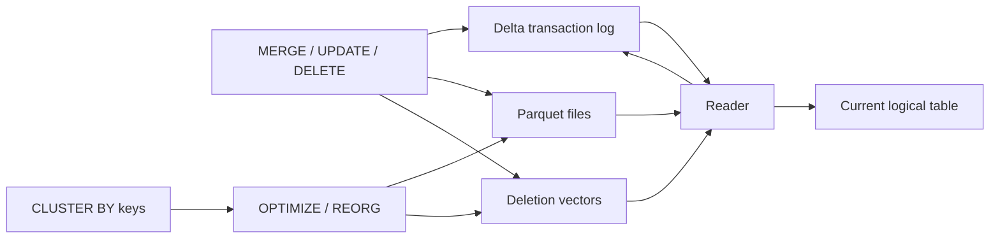
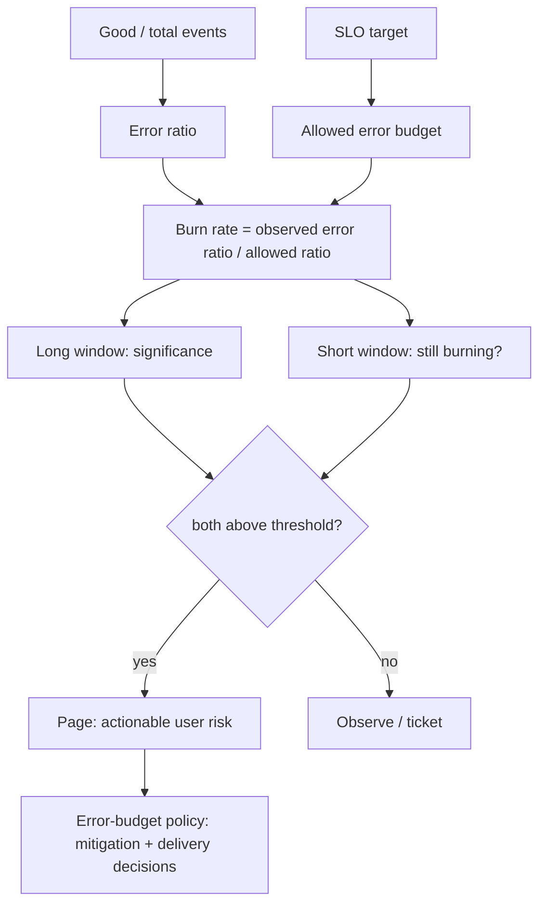

# 2026-09-19 18:00 — Interview Study Packages

README ve yakın `daily/2026-09-19/17-00.md` kontrol edildi; AsyncAPI event contracts ve Kubernetes Indexed Jobs tekrar edilmedi. Repo aramasında WebTransport ve PostgreSQL skip scan'in daha önce işlendiği görüldüğü için elendi. Bu tur Data Engineering/Lakehouse ile SRE/Leadership eksenine döndü.

## Paket 1 — Mid → Principal Data Engineering / Databases: Delta Lake Deletion Vectors, Liquid Clustering & Table-Feature Economics
**Süre:** 20–30 dk

### Konu anlatımı
Lakehouse tablolarında satır silmek klasik immutable Parquet dünyasında pahalıdır: tek satır için bütün dosyayı yeniden yazmak gerekebilir. Delta Lake **deletion vectors (DV)** ile silinen satırları ayrı bir bitmap-benzeri yapı üzerinden mantıksal olarak işaretleyebilir; reader en güncel table state'i oluştururken veri dosyası ile DV'yi birlikte uygular. Fiziksel purge daha sonra file rewrite ve VACUUM ile gerçekleşir. Bu, write amplification'ı azaltırken read-path ve compatibility maliyeti ekler.

**Liquid clustering** ise statik Hive partitioning/ZORDER kararlarının bakım yükünü azaltmayı hedefler. Clustering key zamanla değişebilir; sonraki `OPTIMIZE` işlemleri yeni layout'a incremental yaklaşır. Delta 3.3+ `OPTIMIZE FULL` ile tüm kayıtların güncel clustering kolonlarına göre yeniden düzenlenmesini sağlayabilir. Kritik nokta: storage layout bir correctness özelliği değil, workload'a bağlı performans optimizasyonudur.

### Mental model

**Invariant:** Transaction log hangi data-file + row-mask kombinasyonunun geçerli snapshot olduğunu belirler; physical file layout yalnız bu logical state'i daha ucuz okumaya/yazmaya çalışır.

### İçeride ne oluyor?
- DV açıkken bazı `DELETE`/`UPDATE`/`MERGE` işlemleri tüm Parquet dosyasını hemen rewrite etmek yerine row-level removal bilgisini saklar.
- DV table feature'ı protocol/feature compatibility gerektirir; eski client'lar tabloyu okuyamayabilir veya yazamayabilir.
- `REORG TABLE ... APPLY (PURGE)` soft-deleted satırları içeren dosyaları rewrite eder; eski dosyaların storage'dan gerçekten silinmesi retention sonrası `VACUUM` gerektirir.
- Liquid clustering Delta Lake 3.1+ özelliğidir; partitioning ve ZORDER ile aynı tabloda birlikte kullanılmaz.
- Clustering key değişikliği geçmiş dosyaları otomatik olarak rewrite etmez; incremental optimization maliyet kontrollüdür ama heterogeneous layout dönemine yol açabilir.
- Layout seçimi query predicates, cardinality, skew, ingest hızı ve maintenance bütçesine göre yapılmalıdır.

### Yüksek getirili mülakat soruları
1. Immutable columnar file üzerinde tek satır silmenin temel maliyeti nedir?
2. Deletion vector write amplification'ı nasıl azaltır; read amplification'ı nasıl artırabilir?
3. Soft delete ile physical purge arasındaki fark nedir?
4. Partitioning, ZORDER ve liquid clustering hangi problem sınıflarını çözer?
5. Senior: yoğun MERGE workload'unda DV büyümesi ve file fragmentation'ı nasıl gözlemlersin?
6. Staff: clustering key değişikliğini petabyte tabloda nasıl rollout edersin?
7. Principal: table feature upgrade'i Spark/Flink/Trino/BI client filosunda nasıl governance edersin?

### Seviyeye göre cevap derinliği
- **Mid:** transaction log, Parquet immutability, DV ve compaction ilişkisini açıklar.
- **Senior:** read/write amplification, file size, purge, retention ve query pruning trade-off'larını ölçer.
- **Staff:** heterogeneous engine compatibility, maintenance scheduling ve workload-aware clustering politikası tasarlar.
- **Principal:** protocol upgrade, rollback sınırları, interoperability ve platform standardını toplam compute/storage maliyetiyle yönetir.

### Kısa alıştırma
10 TB'lık `events` tablosunda günlük verinin %3'ü GDPR/quality nedeniyle siliniyor; sorgular çoğunlukla `tenant_id` ve `event_time` filtreli. DV açık/kapalı iki tasarım çıkar. Rewrite bytes, scan bytes, purge gecikmesi ve client compatibility metriklerini karşılaştır; clustering key seçimini gerekçelendir.

### Proje fikri
`delta-layout-lab`: sentetik skew'lu bir Delta tablosu oluştur. Aynı DELETE/MERGE workload'unu DV açık ve kapalı çalıştır; commit süresi, rewritten bytes, file count ve scan latency ölç. Sonra liquid clustering key'i değiştirip incremental `OPTIMIZE` ile full reclustering maliyetini karşılaştır.

### Failure modes / trade-off / production bağlantısı
DV'yi “bedava delete” sanmak, purge/VACUUM politikasını unutmak, feature upgrade öncesi tüm reader/writer client'ları envanterlememek, clustering kolonlarını yalnız cardinality'ye göre seçmek, küçük dosya üretimini izlememek ve sürekli full recluster yapmak tipik failure mode'lardır. Production'da file count/size distribution, DV yoğunluğu, rewritten bytes, OPTIMIZE süresi, scan bytes/query, pruning oranı, VACUUM lag ve incompatible-client error'ları izlenmelidir.

### Kaynaklar
- Delta Lake — Deletion vectors: https://docs.delta.io/delta-deletion-vectors/
- Delta Lake — Liquid clustering: https://docs.delta.io/delta-clustering/
- Delta Lake — Feature compatibility: https://docs.delta.io/versioning/
- Delta Lake — Table utility/VACUUM: https://docs.delta.io/delta-utility/

---

## Paket 2 — Senior → CTO Cloud / SRE / Leadership: Multiwindow Multi-Burn-Rate SLO Alerting & Reliability Governance
**Süre:** 20–30 dk

### Konu anlatımı
Bir SLO yalnız dashboard hedefi değildir; **error budget**, ürün hızını reliability riskiyle bağlayan ekonomik kontroldür. 99.9% availability hedefinde error budget %0.1'dir. **Burn rate**, bu bütçenin izin verilen hıza göre kaç kat hızlı tüketildiğini söyler: burn=1 bütçeyi tam SLO penceresinde tüketir; burn=10 yaklaşık onda bir sürede tüketir.

Tek kısa pencere hızlı ama gürültülü; tek uzun pencere hassas ama geç reset olur. Google SRE yaklaşımındaki **multiwindow, multi-burn-rate** alert, aynı eşik için uzun pencere ile anlamlı bütçe tüketimini, kısa pencere ile problemin hâlâ aktif olduğunu birlikte doğrular. 30 günlük 99.9% SLO için başlangıç örneği: 14.4x burn'ü 1h + 5m pencerelerinde birlikte görmek yaklaşık %2 bütçe tüketimine karşı page; 6x burn'ü 6h + 30m pencerelerinde görmek yaklaşık %5 tüketim için ikinci page katmanıdır.

### Mental model

**Invariant:** Page, altyapı metriği kötü olduğu için değil, kullanıcıya verilen reliability sözleşmesi tehlikede ve insan aksiyonu gerektiği için çalmalıdır.

### İçeride ne oluyor?
- Availability için allowed error ratio `1 - SLO`; 99.9% için `0.001`.
- Burn rate yaklaşık `observed_error_ratio / allowed_error_ratio` olarak düşünülebilir.
- 14.4x eşik ve 1 saatlik pencere, 30 günlük budget'ın yaklaşık %2'sinin tüketildiği büyüklüğü hedefler; kısa 5m pencere olay bittiyse page'in hızlı kapanmasına yardım eder.
- İkinci 6x / 6h + 30m katmanı daha yavaş ama kalıcı incident'ları yakalar.
- Düşük trafikte tek hata aşırı burn üretebilir; synthetic traffic, related-service aggregation veya ürün/SLO tasarımı yeniden değerlendirilmelidir.
- SLO alert'i root cause söylemez; page sonrası deploy, dependency, saturation ve resource telemetry ile diagnosis gerekir.

### Yüksek getirili mülakat soruları
1. SLI, SLO, SLA ve error budget arasındaki fark nedir?
2. Burn rate=10 ne anlama gelir?
3. Neden yalnız `error_rate > threshold for 10m` kuralı yeterli değildir?
4. Multiwindow neden precision ve reset-time arasında iyi denge kurar?
5. Senior: low-traffic serviste false page'i nasıl azaltırsın?
6. Staff: shared dependency yüzünden 20 servisin aynı anda page etmesini nasıl engellersin?
7. EM/CTO: error budget tükendiğinde feature velocity, launch ve reliability yatırımını hangi politika ile yönetirsin?

### Seviyeye göre cevap derinliği
- **Senior:** user-centric SLI seçer, budget/burn hesabını yapar ve page/ticket ayrımını açıklar.
- **Staff:** multiwindow kuralları, dependency correlation, alert ownership ve incident routing tasarlar.
- **Principal/EM:** error-budget policy'yi release governance, capacity ve team incentives ile bağlar.
- **CTO:** reliability target'ını müşteri beklentisi, gelir/ceza riski, engineering cost ve ürün hızına göre müzakere eder; 99.999%'ı refleks hedef olarak seçmez.

### Kısa alıştırma
30 günlük 99.9% SLO ve 10M request/month servisi için allowed failure budget'ı hesapla. %5 error rate 20 dakika sürerse yaklaşık burn rate'i bul. Bunun 1h/5m fast-burn page'ini neden tetiklemesi gerektiğini anlat; aynı hesabı saatte yalnız 10 request alan servis için eleştir.

### Proje fikri
`slo-burn-lab`: Prometheus recording rules ile 5m, 30m, 1h, 6h error-ratio pencereleri üret. 14.4x ve 6x multiwindow alert'leri kur. Traffic replay ile kısa spike, uzun düşük-seviye hata ve low-traffic senaryolarında detection/reset süresini ve page sayısını ölç.

### Failure modes / trade-off / production bağlantısı
CPU > %80 gibi semptomsal metrikleri doğrudan page'e çevirmek, SLO'yu kullanıcı deneyiminden kopuk tanımlamak, düşük trafik istatistiğini görmezden gelmek, her burn katmanını ayrı page ederek alert storm yaratmak, dependency correlation yapmamak ve error budget'ı yalnız raporlayıp delivery kararına bağlamamak tipik failure mode'lardır. Production'da budget remaining, burn-rate katmanları, page precision, MTTA/MTTR, false-positive oranı, deploy correlation ve incident başına budget spend izlenmelidir.

### Kaynaklar
- Google SRE Workbook — Alerting on SLOs: https://sre.google/workbook/alerting-on-slos/
- Google SRE Workbook — Implementing SLOs: https://sre.google/workbook/implementing-slos/
- Google SRE Workbook — Error Budget Policy: https://sre.google/workbook/error-budget-policy/
