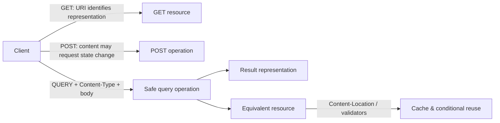
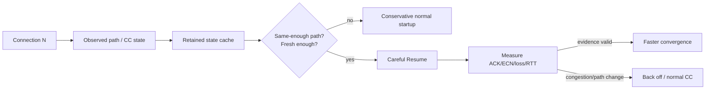

# 2026-09-19 19:00 — Interview Study Packages

README ve yakın `daily/2026-09-19/18-00.md` kontrol edildi; Delta Lake deletion vectors/liquid clustering ile multiwindow multi-burn-rate SLO alerting tekrar edilmedi. Repo aramasında PostgreSQL 18 OAuth'ın daha önce işlendiği görüldüğü için elendi. Bu tur Backend/HTTP API Design ile Networking/Distributed Systems eksenine döndü.

## Paket 1 — Junior → Staff Backend / API Design: HTTP QUERY Method, Safe Request Bodies & Cache Semantics
**Süre:** 20–30 dk

### Konu anlatımı
Haziran 2026'da yayımlanan RFC 10008, HTTP'ye `QUERY` metodunu tanımlar. Problem şudur: bazı salt-okuma sorguları GET query string'ine sığmayacak kadar büyük veya yapısaldır; POST body taşıyabilir ama POST semantiği safe/idempotent değildir. QUERY, request body içinde sorgu representation'ı taşırken hedef resource açısından **safe** ve **idempotent** semantik verir. Bu nedenle retry, intermediary davranışı ve API kontratı açısından “POST ama aslında read” belirsizliğini azaltır.

QUERY'nin body semantiği `Content-Type` ile belirlenir. RFC, eksik Content-Type'ın 4xx ile reddedilmesini; desteklenmeyen media type için 415'i, semantik olarak işlenemeyen içerik için 422'yi tarif eder. Sunucu `Accept-Query` ile desteklediği query media type'larını ilan edebilir. Sonuç ayrıca bir **equivalent resource** ile ilişkilendirilebilir; `Content-Location` ve conditional request mekanizmaları query sonucunun yeniden kullanımına yardım eder.

### Mental model

**Invariant:** `safe` “server hiç yan etki yapamaz” demek değildir; client hedef resource state'inde değişiklik talep etmez. `idempotent` ise aynı isteğin tekrarlanmasının intended effect'ini değiştirmemesidir.

### İçeride ne oluyor?
- GET, URI ile tanımlanan representation'ı ister; QUERY hedef resource scope'unda body ile tanımlanan sorguyu çalıştırır.
- QUERY safe ve idempotent olduğundan connection failure sonrası otomatik retry semantik olarak mümkündür; fakat maliyetli sorgular yine resource exhaustion yaratabilir.
- `Content-Type` query dilinin/representation'ın kontratıdır; content sniffing ile yanlış veya eksik type'ı sessizce düzeltmek doğru değildir.
- `OPTIONS` + `Allow` ile QUERY desteği keşfedilebilir; destek yoksa 405 beklenebilir.
- Cache anahtarı yalnız URI olamaz: query body ve ilgili representation metadata equivalent resource kimliğine dahildir.
- URI'ye hassas/çok büyük filtre koymamak log exposure ve uzun-URI sınırlarını azaltabilir; body ise otomatik olarak gizli değildir, application logging politikası yine gerekir.

### Yüksek getirili mülakat soruları
1. HTTP'de safe ve idempotent arasındaki fark nedir?
2. Büyük read-only filtre için neden POST yerine QUERY tercih edilebilir?
3. QUERY body varken cache key nasıl düşünülmelidir?
4. 400, 405, 415, 422 ve 406 hangi failure sınıflarını ayırır?
5. Senior: proxy/CDN QUERY metodunu tanımıyorsa migration/fallback tasarımın ne olur?
6. Staff: şirket çapında QUERY adoption'ında SDK, gateway, WAF, observability ve cache compatibility'yi nasıl rollout edersin?

### Seviyeye göre cevap derinliği
- **Junior:** GET/POST/QUERY, safe/idempotent ve Content-Type farklarını doğru söyler.
- **Mid:** status code, retry, discovery ve content negotiation davranışını tasarlar.
- **Senior:** intermediary compatibility, caching, abuse controls ve telemetry risklerini değerlendirir.
- **Staff:** API governance, progressive rollout, fallback ve platform-level cache semantics standardı kurar.

### Kısa alıştırma
100 alanlı analitik arama API'si için üç kontrat tasarla: GET query string, POST `/search`, QUERY `/records`. URI length, retry, cache, logs, WAF/gateway desteği ve backwards compatibility açısından tablo halinde karşılaştır.

### Proje fikri
`http-query-lab`: QUERY destekleyen küçük bir API yaz. JSON query body, `Accept-Query`, OPTIONS discovery, ETag/conditional response ve canonical body hash tabanlı cache katmanı ekle. Aynı sorguyu farklı JSON key sıralarıyla gönderip canonicalization olmadan cache fragmentation'ı ölç.

### Failure modes / trade-off / production bağlantısı
QUERY'yi “GET with body” sanmak, safe olduğu için limitsiz CPU harcamasına izin vermek, body'yi cache key'e katmamak, proxy/WAF method allowlist'ini kontrol etmemek, query body'yi logs/traces içine ham basmak ve client fallback'ini tasarlamamak tipik hatalardır. Production'da method support errors, 405/415/422 oranı, query cost, cache hit ratio, retry count, request-body size ve gateway rejection izlenmelidir.

### Kaynaklar
- RFC 10008 — The HTTP QUERY Method: https://www.rfc-editor.org/rfc/rfc10008.html
- RFC 9110 — HTTP Semantics: https://www.rfc-editor.org/rfc/rfc9110.html

---

## Paket 2 — Mid → Principal Networking / Distributed Systems: Careful Resume, Retained Congestion State & Path Validity
**Süre:** 20–30 dk

### Konu anlatımı
Yeni bir transport connection klasik olarak path kapasitesi hakkında az bilgiyle başlar ve congestion control kapasiteyi kademeli keşfeder. Bu güvenlidir ama sık açılan bağlantılarda veya yüksek bandwidth-delay-product yollarda startup süresi pahalı olabilir. Mayıs 2026 tarihli RFC 9959 **Careful Resume** yaklaşımıyla aynı endpoint çifti arasındaki önceki bağlantıdan öğrenilmiş congestion-control parametrelerinin sonraki bağlantıda dikkatli biçimde yeniden kullanılmasını standartlaştırır.

Temel fikir “eski cwnd'yi körlemesine kopyala” değildir. Retained state yalnız path'in yeterince aynı olduğuna dair koşullar altında başlangıcı hızlandıran bir **hint**'tir. Ağ koşulları değişebilir: routing, access network, queue, radio, VPN/NAT veya competing traffic farklılaşabilir. Bu yüzden sender retained state'i doğrulamalı ve congestion sinyallerine hızla geri çekilmelidir.

### Mental model

**Invariant:** Retained congestion state bir kapasite garantisi değil, hızla iptal edilebilir geçmiş gözlemdir; fairness ve congestion safety her zaman startup hızından önce gelir.

### İçeride ne oluyor?
- Önceki connection'dan path karakteristiği ve CC state'i saklanabilir; sonraki connection bunları kontrollü startup için kullanabilir.
- State'in yaşı önemlidir: network capacity ve competing load zamanla değişir.
- Endpoint eşitliği path eşitliği anlamına gelmez; multipath, mobility, VPN ve load-balancer routing validity'yi bozabilir.
- Resume sonrası ACK/loss/ECN/RTT sinyalleri geçmiş varsayımın doğrulanması için kullanılır.
- Aşırı agresif retained state queue build-up, loss ve diğer flow'lara unfairness yaratabilir; conservative bounds ve fallback gerekir.
- Kazanç workload'a bağlıdır: kısa transferler startup latency'den çok etkilenirken uzun flow zaten normal CC ile kapasiteye yaklaşır.

### Yüksek getirili mülakat soruları
1. Congestion-control startup neden vardır; neden doğrudan line rate ile başlanmaz?
2. Retained state hangi durumda faydalı, hangi durumda tehlikelidir?
3. “Aynı server” neden “aynı network path” demek değildir?
4. RTT/loss/ECN değişimi resume kararını nasıl etkiler?
5. Senior: mobile client Wi-Fi'dan 5G'ye geçtiğinde retained state'i nasıl invalidate edersin?
6. Staff/Principal: shared retained-state cache'in privacy, tenant isolation ve fairness risklerini nasıl sınırlandırırsın?

### Seviyeye göre cevap derinliği
- **Mid:** cwnd/startup, RTT, loss ve retained-state fikrini açıklar.
- **Senior:** path-change detection, stale state, fallback ve measurement tasarlar.
- **Staff:** transport pool, connection reuse, load balancing ve per-path state keying ilişkisini kurar.
- **Principal:** fleet-wide latency kazanımını fairness, privacy, congestion externality ve operational complexity ile birlikte değerlendirir.

### Kısa alıştırma
100 ms RTT ve yüksek kapasiteli bir path'te 2 MB response taşıyan kısa bağlantı düşün. Normal conservative startup ile retained-state resume yaklaşımının ilk birkaç RTT'sini kavramsal çiz. Sonra route değişip bottleneck kapasitesi 10x düştüğünde hangi sinyallerin hızlı fallback tetiklemesi gerektiğini yaz.

### Proje fikri
`cc-resume-simulator`: basit RTT-round simulator yaz. Normal startup ile retained-state başlangıcını; stable path, 10x capacity drop ve RTT jump senaryolarında completion time, queue, loss ve fairness üzerinden karşılaştır. State TTL ve confidence parametrelerini değiştir.

### Failure modes / trade-off / production bağlantısı
Retained state'i kalıcı truth sanmak, cache key'i yalnız destination IP yapmak, mobility/VPN değişimini kaçırmak, TTL koymamak, yalnız median latency kazanımına bakıp loss/queue/fairness'i ölçmemek ve fallback'i yavaş yapmak tipik hatalardır. Production'da resumed-connection oranı, retained-state age, RTT delta, ECN/loss, startup throughput, retransmission, completion-time p95/p99 ve fallback rate izlenmelidir.

### Kaynaklar
- RFC 9959 — Careful Resume: https://www.rfc-editor.org/rfc/rfc9959.html
- RFC 5681 — TCP Congestion Control: https://www.rfc-editor.org/rfc/rfc5681.html
- RFC 9002 — QUIC Loss Detection and Congestion Control: https://www.rfc-editor.org/rfc/rfc9002.html
