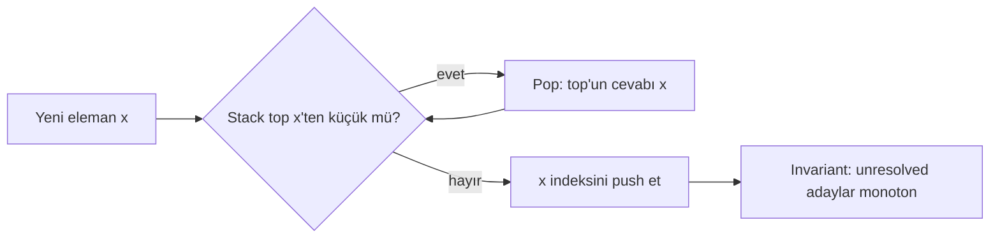
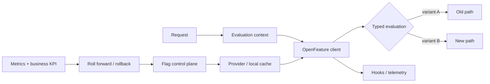

# 2026-09-19 20:00 — Interview Study Packages

README ve yakın `daily/2026-09-19/19-00.md` kontrol edildi; HTTP QUERY ve Careful Resume tekrar edilmedi. Repo aramasında WebAuthn/passkeys'in daha önce birden fazla kez işlendiği görüldüğü için elendi. Bu tur Algorithms & Data Structures ile Backend/Platform/Product eksenine döndü.

## Paket 1 — Junior → Staff Algorithms & Data Structures: Monotonic Stack, Next-Greater Queries & Amortized Analysis
**Süre:** 20–30 dk

### Konu anlatımı
Monotonic stack, elemanları belirli bir monotonluk invariant'ıyla tutan stack desenidir. En klasik kullanım, bir dizide her elemanın sağındaki ilk daha büyük/daha küçük elemanı bulmaktır. Naif çözüm her elemandan sağa yürür ve `O(n²)` olur. Monotonic stack ise her elemanı en fazla bir kez push edip en fazla bir kez pop ettiği için toplam `O(n)` çalışır.

Örneğin next-greater-element için soldan sağa ilerlerken stack'te henüz cevabı bulunmamış indeksleri azalan değer sırasıyla tutarız. Yeni değer stack tepesinden büyükse, tepedeki indeksin ilk daha büyük sağ komşusunu bulmuş oluruz; pop eder ve aynı testi sürdürürüz. Kritik nokta stack'in yalnız veri yapısı değil, **çözülmemiş adayların sıkıştırılmış frontier'ı** olmasıdır.

Bu desen histogramdaki en büyük dikdörtgen, daily temperatures, stock span, görünürlük problemleri ve bazı range-boundary hesaplarında tekrar eder. Monotonic queue ile karıştırılmamalıdır: queue özellikle kayan pencere minimum/maksimumunda hem önden expire hem arkadan dominance removal yapar.

### Mental model

**Amortized invariant:** Tek bir iterasyonda çok sayıda pop olabilir; fakat bir indeks tüm algoritma boyunca yalnız bir kez push ve bir kez pop edilir. Bu nedenle toplam stack operasyonu `O(n)`'dir.

### İçeride ne oluyor?
- Stack genellikle değeri değil **indeksi** tutar; böylece distance, boundary ve orijinal değer birlikte erişilebilir.
- Increasing/decreasing ve strict/non-strict seçimi duplicate davranışını değiştirir. `>` ile `>=` farkı eşit değerlerin boundary ownership'ini etkiler.
- Sentinel (`0`, `-∞`, `+∞`) eklemek final cleanup'ı sadeleştirebilir; ancak gerçek domain ile çakışmamalıdır.
- Histogram probleminde bir bar pop edildiğinde yeni stack top'u soldaki ilk daha kısa barı, mevcut indeks sağdaki ilk daha kısa sınırı verir.
- `O(n)` kanıtı nested loop'a bakılarak değil aggregate/amortized operation count ile yapılır.

### Yüksek getirili mülakat soruları
1. Next Greater Element'i `O(n)` nasıl çözersin?
2. İç içe `while` olmasına rağmen neden `O(n²)` değildir?
3. Stack'te neden value yerine index tutmak çoğu zaman daha iyidir?
4. Duplicate değerlerde `<` ile `<=` seçimi sonucu nasıl değiştirir?
5. Senior: Largest Rectangle in Histogram'da pop anında width neden `i - stack.top - 1` olur?
6. Staff: Hangi problem sinyalleri monotonic stack'i düşündürür; hangi durumda segment tree veya heap daha uygundur?

### Seviyeye göre cevap derinliği
- **Junior:** LIFO'yu ve next-greater algoritmasını doğru uygular.
- **Mid:** invariant'ı, duplicate politikasını ve amortized `O(n)` kanıtını açıklar.
- **Senior:** histogram/boundary problemlerine deseni transfer eder; sentinel ve off-by-one hatalarını yönetir.
- **Staff:** monotonic stack'i offline/streaming sınırları, memory locality ve alternatif veri yapılarıyla kıyaslar.

### Kısa alıştırma
`[2, 1, 2, 4, 3]` için her elemanın sağındaki ilk daha büyük elemanın indeksini çıkar. Sonra aynı kodu “ilk daha büyük veya eşit” semantiğine çevir ve duplicate davranışını açıklayan iki test ekle.

### Proje fikri
`monotonic-pattern-lab`: next greater/smaller, stock span, daily temperatures ve largest rectangle problemlerini tek repoda çöz. Her çözümde brute-force oracle üretip random küçük inputlarda optimized çözümle property-based karşılaştırma yap; operation counter ile push/pop toplamının lineer kaldığını göster.

### Failure modes / trade-off / production bağlantısı
Strict/non-strict karşılaştırmayı yanlış seçmek, index/value karıştırmak, final stack'i flush etmemek, width hesabında off-by-one yapmak ve nested loop görünce karmaşıklığı yanlışlıkla `O(n²)` ilan etmek tipik hatalardır. Production'da bu desen telemetry zaman serilerinde “bir sonraki threshold crossing”, fiyat/kapasite dizilerinde boundary analizi ve offline batch hesaplarında faydalıdır; fakat dinamik point update + arbitrary range query gerekiyorsa segment tree gibi yapılar daha uygundur.

### Kaynaklar
- CLRS, amortized analysis bölümü: https://mitpress.mit.edu/9780262046305/introduction-to-algorithms/
- MIT OCW 6.006 — Algorithms: https://ocw.mit.edu/courses/6-006-introduction-to-algorithms-fall-2011/

---

## Paket 2 — Mid → CTO Backend / Platform / Product: OpenFeature, Feature-Flag Evaluation & Progressive Delivery Governance
**Süre:** 20–30 dk

### Konu anlatımı
Feature flag yalnız `if (flag)` değildir; production'da **control plane kararı ile request-time data-plane evaluation'ını ayıran** bir dağıtım mekanizmasıdır. OpenFeature bu evaluation katmanı için vendor-neutral API tanımlar. Provider gerçek flag sistemine bağlanır; uygulama typed evaluation API kullanır; evaluation context targeting bilgisini taşır; hooks telemetry, policy veya context enrichment gibi lifecycle davranışlarını ekler.

OpenFeature Specification v0.9.0, 2026 ortasında evaluation/provider bölümlerini stabilize ederken hooks, events ve evaluation context yüzeylerini güçlendirdi. Provider durumları READY/STALE/ERROR/FATAL gibi lifecycle sinyalleri sunar. Bu ayrım önemlidir: flag vendor'ını değiştirmek ile uygulamanın rollout semantiğini değiştirmek aynı karar olmamalıdır.

Feature flag ile deployment ve release ayrılabilir: kod deploy edilir, capability önce internal cohort'a, sonra yüzde bazlı veya attribute tabanlı gruplara açılır. Ancak flag sistemi availability dependency'sine, stale configuration'a, PII sızıntısına ve “flag debt”e dönüşebilir. CTO seviyesinde konu SDK seçmekten çok blast radius, ownership, auditability, experimentation integrity ve cleanup economics'tir.

### Mental model

**Invariant:** Flag evaluation başarısız olduğunda uygulamanın davranışı tesadüfe bırakılmaz; güvenli default, cache/staleness politikası ve rollback semantics önceden tanımlanır.

### İçeride ne oluyor?
- Provider vendor SDK, REST client veya local evaluator olabilir; typed resolution boolean/string/number/structure döndürebilir.
- Evaluation context global → transaction → client → invocation → before-hook precedence ile birleşebilir; targeting key deterministic fractional rollout için kullanılabilir.
- Hooks evaluation öncesi/sonrası telemetry veya policy ekleyebilir; fakat hot path'e blocking network call eklemek tail latency yaratır.
- Provider lifecycle READY/STALE/ERROR/FATAL durumlarıyla health semantics verir; uygulama her durumda ne yapacağını bilmelidir.
- Default value yalnız test convenience değildir; provider unavailable olduğunda ürün ve güvenlik davranışını belirleyen fail-safe karardır.
- Context içine email, device veya account attribute koymak targeting'i kolaylaştırır fakat PII propagation ve vendor-boundary riskini büyütür.

### Yüksek getirili mülakat soruları
1. Feature flag ile config arasındaki sınırı nasıl çizersin?
2. Percentage rollout nasıl deterministic ve sticky yapılır?
3. Flag provider unavailable olduğunda fail-open mı fail-closed mı seçersin?
4. Evaluation context'e hangi verileri koymazsın ve neden?
5. Staff: 50 servisli organizasyonda flag naming, ownership, TTL ve cleanup standardını nasıl kurarsın?
6. Principal/CTO: progressive delivery'yi deployment frequency, incident risk ve experimentation kalitesiyle nasıl bağlarsın?

### Seviyeye göre cevap derinliği
- **Mid:** flag evaluation, targeting, default ve rollout mantığını uygular.
- **Senior:** local cache, stale config, observability, latency ve PII risklerini yönetir.
- **Staff:** ortak SDK/provider abstraction, naming/ownership, kill-switch ve cleanup politikası kurar.
- **Principal:** multi-provider migration, experimentation integrity ve platform blast radius'unu değerlendirir.
- **CTO:** feature velocity ile operational complexity, vendor risk, compliance ve karar kalitesini şirket ekonomisi içinde dengeler.

### Kısa alıştırma
Yeni checkout akışını `%1 → %5 → %25 → %50 → %100` açan rollout tasarla. Targeting key, guardrail metric, rollback threshold, provider outage davranışı ve flag'in hangi tarihte silineceğini yaz. Aynı kullanıcıya sticky assignment sağlamayan tasarımın deney sonucunu nasıl bozacağını açıkla.

### Proje fikri
`progressive-delivery-lab`: OpenFeature SDK ile iki checkout implementation'ı arasında flag kullan. Local provider + remote-provider mock oluştur; deterministic cohorting, stale cache, provider failure, hook tabanlı latency/error telemetry ve automatic rollback simulator ekle. Dashboard'da teknik SLI ile conversion KPI'ını birlikte göster.

### Failure modes / trade-off / production bağlantısı
Her flag'i kalıcı config'e dönüştürmek, owner/expiry koymamak, request başına uzak provider çağrısı yapmak, context'e ham PII taşımak, default'u rastgele seçmek, server/client evaluation farkını hesaba katmamak ve rollback metric'ini önceden belirlememek tipik hatalardır. Production'da flag evaluation latency/error, provider status, stale-config age, variant distribution, guardrail SLI, business KPI ve expired-flag count izlenmelidir. Kill switch'ler ayrıca authorization yerine kullanılmamalıdır.

### Kaynaklar
- OpenFeature Specification v0.9.0 update (2026): https://openfeature.dev/blog/openfeature-mid-2026-update/
- OpenFeature — Flag Evaluation API: https://openfeature.dev/specification/sections/flag-evaluation/
- OpenFeature — Providers: https://openfeature.dev/specification/sections/providers/
- OpenFeature — Evaluation Context: https://openfeature.dev/specification/sections/evaluation-context/
- OpenFeature — Hooks: https://openfeature.dev/specification/sections/hooks/
