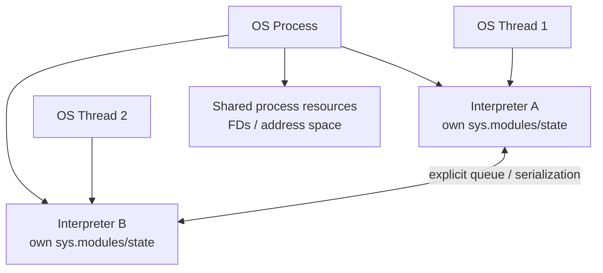
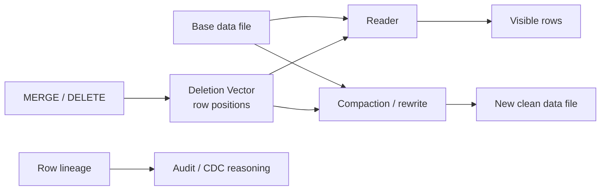

# 2026-09-19 21:00 — Interview Study Packages

README ve yakın `daily/2026-09-19/20-00.md` kontrol edildi. Monotonic Stack ve OpenFeature tekrar edilmedi. Repo aramasında Python subinterpreters/PEP 734 ile Apache Iceberg deletion vectors/row lineage için eşleşme bulunmadı. Bu tur Backend/Runtime ile Data Engineering eksenine döndü.

## Paket 1 — Mid → Principal Backend / Runtime: Python 3.14 Subinterpreters, Isolation & Parallelism
**Süre:** 20–30 dk

### Konu anlatımı
Python 3.14, PEP 734 ile `concurrent.interpreters` API'sini standart kütüphaneye ekledi. Subinterpreter, aynı OS process'i içinde ayrı Python runtime state taşıyan execution context'tir. Her interpreter'ın kendi import state'i, modülleri, sınıfları ve değişkenleri vardır; bu nedenle thread'den daha güçlü isolation, process'ten ise farklı failure/resource sınırları sunar.

Önemli ayrım: interpreter tek başına concurrency sağlamaz. Parallel execution için interpreter'lar thread'lerle birleştirilir; `InterpreterPoolExecutor` bu modeli familiar executor API'siyle sunar. Klasik GIL-enabled CPython'da interpreter başına GIL yaklaşımı CPU-bound Python işlerini aynı process içinde paralelleştirebilir. Bu, free-threaded CPython ile aynı model değildir: free-threaded build ortak runtime içindeki thread'lerin GIL olmadan paralel çalışmasını hedefler; subinterpreter modeli ise isolation'ı merkeze alır.

### Mental model

**Invariant:** Python object state'inin interpreter'lar arasında implicit shared-memory varmış gibi davranacağını varsayma; iletişimi explicit contract olarak tasarla.

### İçeride ne oluyor?
- Interpreter state, thread state'ten ayrıdır; bir interpreter bir veya daha fazla thread state ile ilişkilendirilebilir.
- Interpreter'lar çoğu Python-level mutable object'i paylaşmaz; communication queue/serialization veya desteklenen shareable mekanizmalar üzerinden explicit yapılır.
- Aynı process içinde oldukları için file descriptor, process memory ve bazı low-level process-global kaynaklar tam process isolation sağlamaz.
- C extension uyumluluğu kritik failure surface'tir; tüm PyPI paketleri multiple interpreters için hazır değildir.
- Process pool'a göre startup/data-transfer maliyeti avantajlı olabilir; fakat crash containment ve resource accounting daha zayıf olabilir.

### Yüksek getirili mülakat soruları
1. Thread, subinterpreter ve process isolation sınırlarını karşılaştır.
2. Subinterpreter neden otomatik olarak concurrency demek değildir?
3. CPU-bound workload için `InterpreterPoolExecutor` ne zaman process pool'a alternatif olur?
4. Mutable object sharing neden bilinçli olarak sınırlıdır?
5. Senior: C extension uyumluluğunu rollout öncesi nasıl test edersin?
6. Principal: multi-tenant plugin/runtime platformunda subinterpreter'ı security sandbox olarak kullanır mısın? Neden?

### Seviyeye göre cevap derinliği
- **Mid:** interpreter/thread/process farkını ve explicit communication gereğini açıklar.
- **Senior:** serialization, extension compatibility, memory ve failure-mode trade-off'larını tartışır.
- **Staff:** worker topology, backpressure, observability ve migration benchmark'ı tasarlar.
- **Principal:** runtime seçimini isolation, security, operability ve fleet economics ile değerlendirir; subinterpreter'ın güvenlik sandbox'ı olmadığını vurgular.

### Kısa alıştırma
Aynı CPU-bound fonksiyonu `ThreadPoolExecutor`, `InterpreterPoolExecutor` ve `ProcessPoolExecutor` ile benchmark eden küçük harness tasarla. Wall-clock, RSS, startup, task payload serialization ve failure davranışını ayrı ölç.

### Proje fikri
`py-parallelism-lab`: CPU-bound JSON/regex/image-metadata benzeri saf-Python görevlerini üç executor modeliyle çalıştır; warm/cold latency, throughput, memory/task ve cancellation sonuçlarını raporla. Bir uyumsuz C extension senaryosunu test matrisi olarak ekle.

### Failure modes / trade-off / production bağlantısı
Subinterpreter'ı process-level security boundary sanmak, global native state kullanan extension'ları kontrol etmemek, büyük payload'ları sürekli serialize etmek, shared FD/process-global state etkilerini unutmak ve yalnız microbenchmark'a bakmak tipik hatalardır. Production'da queue depth, task latency, interpreter init time, worker failure, memory/interpreter, serialization bytes ve fallback-to-process oranı izlenmelidir.

### Kaynaklar
- PEP 734 — Multiple Interpreters in the Stdlib: https://peps.python.org/pep-0734/
- Python 3.14 `concurrent.interpreters`: https://docs.python.org/3.14/library/concurrent.interpreters.html
- CPython thread state / GIL docs: https://docs.python.org/3.14/c-api/threads.html
- Free-threading HOWTO: https://docs.python.org/3.14/howto/free-threading-python.html

---

## Paket 2 — Mid → Principal Data Engineering / Lakehouse: Apache Iceberg V3 Deletion Vectors, Row Lineage & Mutation Economics
**Süre:** 20–30 dk

### Konu anlatımı
Iceberg V3, row-level mutation ve lineage için önemli format primitives getirir. Deletion vector (DV), silinen row position'larını ayrı metadata/blob yapısında temsil ederek her DELETE/MERGE işleminde büyük data file'ı hemen yeniden yazma zorunluluğunu azaltabilir. Row lineage ise satırların yaşam döngüsünü takip etmeyi kolaylaştıran reserved lineage alanları sağlar. Bunlar birlikte write amplification, compaction ve audit/change-processing tasarımını etkiler.

DV'nin ana ekonomik fikri **rewrite now yerine logical delete now, physical cleanup later** yaklaşımıdır. Bu ücretsiz değildir: reader'ın base data ile delete bilgisini birleştirmesi gerekir; DV sayısı/yoğunluğu büyüdükçe read amplification ve maintenance ihtiyacı artabilir. Iceberg 1.11.0, Mayıs 2026 itibarıyla güncel Java release hattıdır; 1.10.2 de DV merge/commit ve row-ID assignment gibi V3 correctness düzeltmeleri içerir. Bu yüzden format-version desteği ile engine/client implementation desteğini ayrı kontrol etmek gerekir.

### Mental model

**Invariant:** Logical table state yalnız data files değildir; snapshot + manifests + delete metadata + lineage birlikte okunur.

### İçeride ne oluyor?
- DV, position-based delete bilgisini compact biçimde taşıyabilir; commit path concurrent mutation correctness'ini korumalıdır.
- Row lineage, row identity/lifecycle bilgisinin mutation boyunca korunmasına yardım eder; engine'in V3 semantics'i gerçekten desteklemesi gerekir.
- Logical deletes write amplification'ı düşürebilir ama reader CPU/I/O maliyeti ve metadata complexity ekler.
- Compaction DV'leri materialize ederek temiz data files üretebilir; agresif compaction write cost, gecikmiş compaction read cost yaratır.
- Format upgrade tek yönlü operational karar olabilir; mixed-engine fleet'te capability matrix çıkarılmadan upgrade risklidir.

### Yüksek getirili mülakat soruları
1. Deletion vector neden copy-on-write DELETE'den ucuz olabilir?
2. DV hangi durumda read amplification yaratır?
3. Row lineage ile CDC aynı şey midir?
4. Snapshot isolation altında concurrent DELETE/MERGE correctness'ini nasıl düşünürsün?
5. Staff: DV compaction threshold'unu hangi metriklerle seçersin?
6. Principal: mixed Spark/Flink/PyIceberg/Go fleet'inde V3 upgrade'i nasıl govern edersin?

### Seviyeye göre cevap derinliği
- **Mid:** base file + delete metadata okuma modelini ve copy-on-write farkını açıklar.
- **Senior:** write/read amplification, compaction, snapshot ve concurrent commit risklerini tartışır.
- **Staff:** maintenance policy, engine compatibility matrix ve observability tasarlar.
- **Principal:** format upgrade'i data governance, rollback difficulty, cost ve multi-engine platform strategy ile bağlar.

### Kısa alıştırma
1 TB'lık tabloda günlük %0.2 row DELETE ve %1 MERGE olduğunu varsay. Copy-on-write ile DV yaklaşımı için hangi ölçümleri toplaman gerektiğini yaz: rewritten bytes, DV cardinality, scan overhead, compaction bytes, query p95 ve storage churn. Eşik tabanlı compaction policy öner.

### Proje fikri
`iceberg-v3-mutation-lab`: küçük bir V3 tablo oluştur; append → delete → merge → scan → compaction akışını çalıştır. Her snapshot'ta data/delete file sayısı, bytes rewritten, visible-row count ve query latency kaydet; engine compatibility matrisini README'ye ekle.

### Failure modes / trade-off / production bağlantısı
DV'yi bedava delete sanmak, stale reader kullanmak, format-version ile engine feature support'u eşitlemek, orphan/cleanup correctness'ini ihmal etmek, DV yoğunluğunu izlememek ve compaction'ı sabit takvimle körlemesine çalıştırmak tipik hatalardır. Production'da DV cardinality/data-file, delete density, scan overhead, compaction backlog, snapshot age, commit conflicts, orphan files ve engine/version dağılımı izlenmelidir.

### Kaynaklar
- Apache Iceberg releases: https://iceberg.apache.org/releases/
- Apache Iceberg 1.11.0 release (2026-05-19): https://iceberg.apache.org/blog/apache-iceberg-1-11-0-release/
- Iceberg Go 0.6.0 — V3 DV/row-lineage support: https://iceberg.apache.org/blog/apache-iceberg-go-0.6.0-release/
- Iceberg table specification: https://iceberg.apache.org/spec/
