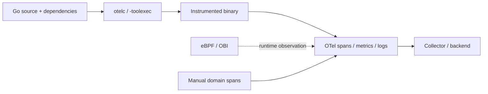
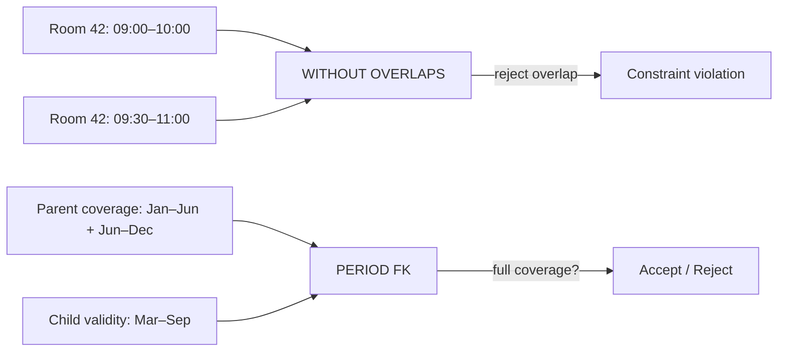

# 2026-09-19 22:00 — Interview Study Packages

README ve yakın `daily/2026-09-19/21-00.md` kontrol edildi. Python subinterpreters ve Iceberg V3 tekrar edilmedi. Repo aramasında Kubernetes DRA'nın zaten birkaç canonical/daily notta işlendiği görüldüğü için elendi. Bu tur Backend/Observability ile Databases eksenine döndü.

## Paket 1 — Mid → Principal Backend / Observability: OpenTelemetry Go Compile-Time Instrumentation & Zero-Code Boundaries
**Süre:** 20–30 dk

### Konu anlatımı
Go'da observability için klasik seçenek manual instrumentation'dır: uygulama OpenTelemetry API/SDK ile span, metric ve context üretir. Zero-code yaklaşımı ise kaynak koduna telemetry çağrıları eklemeden yaygın framework/library sınırlarından sinyal çıkarmayı hedefler. 2026 itibarıyla Go tarafında önemli bir seçenek **compile-time instrumentation**: `otelc`, normal `go build` akışını Go toolchain'in `-toolexec` mekanizması üzerinden sarar, eşleşen package/function'lara build sırasında hook ekler ve telemetry kodunu binary'ye bağlar. OpenTelemetry dokümantasyonu bu hattı v1.0.0 itibarıyla stable ve production-ready olarak tanımlar.

Bunu eBPF/OBI ile karıştırma. Compile-time yaklaşım build pipeline'a dokunur ama runtime'da privileged attach/agent gerektirmez; eBPF yaklaşımı ise binary/source değişmeden kernel/user-space observation points üzerinden protokol ve library davranışını gözleyebilir. Manual instrumentation ise business semantic'leri, domain event'leri ve özel span sınırlarını en iyi ifade eden yöntemdir. Production tasarımı çoğu zaman **auto coverage + selective manual semantics** hibritidir.

### Mental model

**Invariant:** “Zero-code” = “zero operational cost” veya “complete observability” değildir. Otomatik coverage ile business semantics farklı problemlerdir.

### İçeride ne oluyor?
- `otelc`, Go compiler çağrılarını `-toolexec` ile intercept eder; instrumentation rules belirli package/function'lara hook enjekte eder.
- Instrumentation binary'ye build sırasında girdiği için runtime attach adımı gerekmez; fakat build reproducibility, toolchain pinning ve supply-chain provenance artık observability tasarımının parçasıdır.
- Supported-library matrisi sınırlıdır; dependency upgrade'i instrumentation coverage'ını değiştirebilir.
- HTTP/gRPC gibi sınırlar context propagation için yüksek değer taşır; fakat business kararları yalnız protocol observation ile çıkarılamaz.
- Auto SDK/eBPF ve manual spans birlikte kullanıldığında trace-parenting/context continuity test edilmelidir.

### Yüksek getirili mülakat soruları
1. Manual, compile-time ve eBPF instrumentation'ı hangi eksenlerde karşılaştırırsın?
2. Compile-time instrumentation neden runtime agent gerektirmez?
3. Zero-code yaklaşımı neden business-level observability'nin yerine geçmez?
4. Senior: instrumentation upgrade'inin latency/CPU etkisini nasıl canary edersin?
5. Staff: yüzlerce Go servisinde coverage drift'ini nasıl govern edersin?
6. Principal: observability toolchain'ini software supply chain ve SLO ekonomisiyle nasıl bağlarsın?

### Seviyeye göre cevap derinliği
- **Mid:** span/context propagation ve üç instrumentation modelinin temel farkını açıklar.
- **Senior:** overhead, unsupported library, cardinality ve trace continuity failure mode'larını tartışır.
- **Staff:** fleet rollout, version pinning, golden signals ve coverage SLO'su tasarlar.
- **Principal:** vendor neutrality, build provenance, telemetry cost, privacy ve platform ownership kararlarını birlikte değerlendirir.

### Kısa alıştırma
Basit `net/http` + gRPC Go servisi için üç deney tasarla: manual OTel, compile-time `otelc`, eBPF/OBI. Her deneyde source diff, build süresi, CPU/RSS, p95 latency, span coverage ve trace-parent continuity ölç.

### Proje fikri
`go-otel-instrumentation-lab`: aynı servisi üç instrumentation yöntemiyle paketle; load test altında overhead/coverage matrisi çıkar. Dependency version değiştirerek supported-library drift testi ekle ve CI'da trace-shape contract doğrulaması yap.

### Failure modes / trade-off / production bağlantısı
Instrumentation'ın “şeffaf” olduğunu varsaymak, unsupported dependency'yi fark etmemek, high-cardinality attribute üretmek, PII sızdırmak, sampling'i yalnız maliyet sonrası düşünmek, toolchain'i pinlememek ve auto/manual span'larda duplicate telemetry üretmek tipik hatalardır. Production'da telemetry dropped spans, exporter queue, CPU/RSS delta, p95/p99 latency delta, spans/request, cardinality, sampling rate ve instrumentation version dağılımı izlenmelidir.

### Kaynaklar
- OpenTelemetry Go compile-time instrumentation: https://opentelemetry.io/docs/zero-code/go/compile-time/
- Go zero-code instrumentation: https://opentelemetry.io/docs/zero-code/go/
- Go Auto SDK: https://opentelemetry.io/docs/zero-code/go/autosdk/
- Go manual instrumentation: https://opentelemetry.io/docs/languages/go/instrumentation/

---

## Paket 2 — Junior → Staff Databases / Data Modeling: PostgreSQL 18 Temporal Constraints, WITHOUT OVERLAPS & PERIOD Foreign Keys
**Süre:** 20–30 dk

### Konu anlatımı
Klasik relational constraint'ler çoğunlukla anlık değerleri korur: `UNIQUE(customer_id)` aynı değerin ikinci kez gelmesini engeller; foreign key ise referans verilen row'un varlığını kontrol eder. Zaman boyutlu modellerde invariant farklıdır: aynı kaynak için geçerlilik aralıkları çakışmamalı ve child kaydın geçerli olduğu **tüm dönem** parent tarafından kapsanmalıdır.

PostgreSQL 18 bu problemi first-class temporal constraints ile ifade eder. `PRIMARY KEY`/`UNIQUE` tarafında son range/multirange kolonuna `WITHOUT OVERLAPS`, foreign key tarafında `PERIOD` eklenebilir. Örneğin `UNIQUE (room_id, valid_at WITHOUT OVERLAPS)` aynı oda için çakışan geçerlilik aralıklarını reddeder. Dokümantasyona göre bu semantics pratikte GiST tabanlı exclusion davranışına karşılık gelir. `PERIOD` foreign key ise tek bir parent row eşleşmesi yerine, aynı non-period key'e sahip parent row'ların birleşik zaman aralığının child dönemini tamamen kapsamasını ister.

### Mental model

**Invariant:** Temporal integrity yalnız “row var mı?” değildir; **key + time coverage** birlikte doğrulanır.

### İçeride ne oluyor?
- `WITHOUT OVERLAPS` son kolonun range/multirange olmasını ister; empty range kabul edilmez.
- Temporal unique constraint, equality kolonları + overlap (`&&`) mantığıyla GiST-backed exclusion semantics kullanır.
- Scalar equality tipleri için pratikte `btree_gist` gerekebilir.
- `PERIOD` FK'de referans verilen key de temporal primary/unique key olmalıdır; child dönemi parent dönemlerinin birleşimi tarafından tamamen kapsanmalıdır.
- Constraint'i uygulama kodunda `SELECT` + `INSERT` ile taklit etmek concurrency race üretir; database constraint invariant'ı transaction boundary'de merkezileştirir.

### Yüksek getirili mülakat soruları
1. `UNIQUE` ile `WITHOUT OVERLAPS` arasındaki semantic fark nedir?
2. Range boundary seçimi (`[start,end)` gibi) neden önemlidir?
3. Neden uygulamada “önce overlap SELECT et, sonra INSERT et” güvenli değildir?
4. Senior: GiST index'in write/read maliyetini nasıl değerlendirirsin?
5. Staff: temporal constraint migration'ını mevcut kirli data üzerinde nasıl rollout edersin?
6. Staff: bitemporal (valid-time + transaction-time) model için bu özellik tek başına yeterli midir?

### Seviyeye göre cevap derinliği
- **Junior:** range ve overlap kavramını örnekle açıklar.
- **Mid:** constraint syntax, half-open interval ve concurrency nedenlerini anlatır.
- **Senior:** GiST, locking/contention, migration ve query-plan trade-off'larını tartışır.
- **Staff:** temporal invariant'ı domain model, CDC, audit, partitioning ve rollout stratejisiyle bağlar.

### Kısa alıştırma
`room_booking(room_id, valid_at tstzrange)` tablosunda çakışmayı engelleyen temporal unique constraint tasarla. `[)` boundary kullan; bitişi 10:00 olan rezervasyon ile 10:00'da başlayan rezervasyonun kabul edilmesini test et. Ardından booking döneminin room-availability dönemince tamamen kapsanmasını `PERIOD` FK ile modelle.

### Proje fikri
`postgres-temporal-integrity-lab`: fiyatlandırma veya oda rezervasyonu domain'i kur. Application-side overlap check ile database temporal constraint'i concurrent workers altında karşılaştır; anomaly sayısı, lock wait, insert throughput ve index boyutunu raporla.

### Failure modes / trade-off / production bağlantısı
Inclusive boundary'leri yanlış seçmek, timezone normalization yapmamak, empty/open-ended range semantics'ini tanımlamamak, dirty data temizlemeden constraint eklemek, GiST write cost'unu ölçmemek ve bitemporal ihtiyacı yalnız valid-time constraint ile çözdüğünü sanmak tipik hatalardır. Production'da constraint violation rate, GiST index size/bloat, lock wait, write latency, invalid-range ingestion ve migration reject set'i izlenmelidir.

### Kaynaklar
- PostgreSQL 18 release notes: https://www.postgresql.org/docs/18/release-18.html
- PostgreSQL 18 CREATE TABLE / temporal constraints: https://www.postgresql.org/docs/18/sql-createtable.html
- PostgreSQL temporal constraints feature matrix: https://www.postgresql.org/about/featurematrix/detail/temporal-constraints/
- PostgreSQL versioning policy (18.6 current minor as of 2026-09-19): https://www.postgresql.org/support/versioning/
