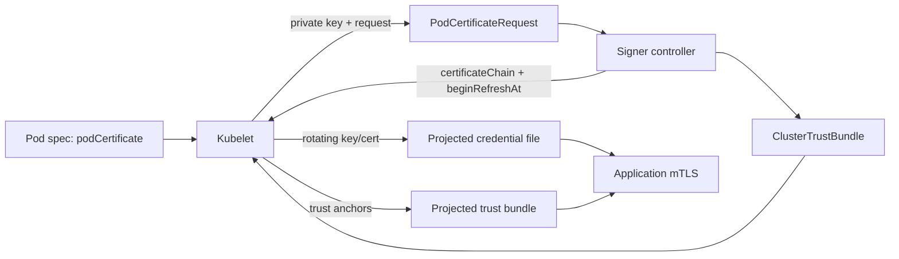
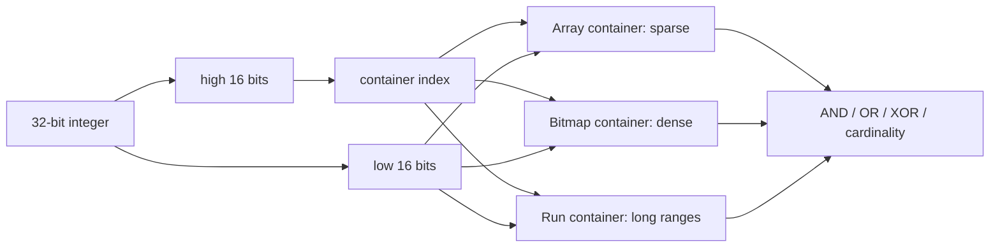

# 2026-09-20 00:00 — Interview Study Packages

README ve yakın `daily/2026-09-19/22-00.md` kontrol edildi. 23:00 turu GitHub'a yazılamadığı için o turdaki Aho-Corasick ve Kubernetes Node Lifecycle Conditions konuları da tekrar edilmedi. Repo aramasında Pod Certificates / ClusterTrustBundles ve Roaring Bitmap için eşleşme bulunmadı. Bu tur Cybersecurity/Cloud ile Algorithms/Data Structures eksenine döndü.

## Paket 1 — Mid → CTO Cybersecurity / Cloud: Kubernetes v1.37 Pod Certificates, ClusterTrustBundles & Workload Identity
**Süre:** 20–30 dk

### Konu anlatımı
Kubernetes workload identity çoğu ekipte ServiceAccount JWT ile başlar. JWT bir bearer credential'dır: token'ı ele geçiren taraf, geçerlilik sınırları içinde token sahibini taklit edebilir. Kubernetes v1.37'de GA olan **Pod Certificates** ve **ClusterTrustBundles**, X.509 tabanlı proof-of-possession kimliğini Kubernetes'in native projected-volume yaşam döngüsüne taşır.

Akışta kubelet Pod spec içindeki `podCertificate` kaynağını görür, private key üretir ve seçilen `signerName` için `PodCertificateRequest` oluşturur. Signer controller isteği değerlendirip certificate chain ve `beginRefreshAt` bilgisini yazar. Kubelet credential'ı Pod filesystem'ine projekte eder ve zamanı geldiğinde yeniler. Trust tarafında kubelet signer/selector ile eşleşen `ClusterTrustBundle` nesnelerindeki trust anchor'ları birleştirip workload'a projekte eder.

Bu özellik **CA değildir**: Kubernetes v1.37 core, genel amaçlı Pod Certificate signer sağlamaz; signer controller ve onun policy'si ayrı trust boundary'dir. Uygulama da dosyanın değiştiğini fark edip yeni credential/trust bundle'ı reload etmelidir.

### Mental model

**Invariant:** certificate delivery, signer authorization, peer identity policy ve application reload dört ayrı problemdir. “mTLS var” demek doğru workload'un yetkili olduğu anlamına gelmez.

### İçeride ne oluyor?
- Private key kubelet tarafından üretilir; issuance PodCertificateRequest üzerinden signer'a gider.
- `beginRefreshAt` signer'ın kubelet'e yenilemeye ne zaman başlaması gerektiğini bildirmesini sağlar.
- Credential bundle tek dosyada tutulursa key/cert rotation sırasında tutarlı snapshot okumak kolaylaşır; ayrı dosyalarda mid-rotation race tasarlanmalıdır.
- ClusterTrustBundle cluster-scoped trust-anchor dağıtımıdır; trust bundle gizli veri olarak düşünülmemelidir, fakat onu değiştirme yetkisi kritik güvenlik sınırıdır.
- NodeRestriction, bir node'un başka node'daki Pod adına credential istemesini sınırlayan savunmanın parçasıdır.
- Kısa ömürlü credential replay penceresini azaltır ama signer compromise, kötü authorization veya stale reload problemini çözmez.

### Yüksek getirili mülakat soruları
1. Bearer JWT ile proof-of-possession X.509 credential arasındaki tehdit modeli farkı nedir?
2. Pod Certificates neden “Kubernetes artık CA sağlıyor” anlamına gelmez?
3. Certificate rotation application tarafında hangi failure mode'ları doğurur?
4. Senior: signer controller compromise olursa blast radius'u nasıl sınırlandırırsın?
5. Staff: multi-cluster trust domain, trust-bundle rollout ve revocation stratejisini nasıl tasarlarsın?
6. Principal/CTO: service mesh kimliği, cloud workload identity ve native Pod Certificates arasında build-vs-buy kararını hangi risk/maliyet eksenlerinde verirsin?

### Seviyeye göre cevap derinliği
- **Mid:** JWT, X.509, mTLS, signer ve trust anchor rollerini ayırır.
- **Senior:** rotation, file reload, signer authorization, node compromise ve expiry failure mode'larını tartışır.
- **Staff:** multi-cluster trust, policy enforcement, staged CA rotation, observability ve migration tasarlar.
- **Principal/CTO:** identity platform ownership, compliance, key custody, incident response ve vendor/operational cost'u birlikte değerlendirir.

### Kısa alıştırma
Bir client/server Pod çifti için 24 saatten kısa ömürlü certificate varsay. Normal rotation, signer outage ve trust-bundle rollover senaryolarında bağlantının ne zaman kurulması/kesilmesi gerektiğini state machine olarak çiz. Eski ve yeni CA'nın birlikte tutulduğu overlap penceresini ayrıca göster.

### Proje fikri
`pod-cert-rotation-lab`: Kind üzerinde test signer ile iki servis kur. mTLS bağlantısını sürdürürken certificate ve trust-bundle rotation yap; application reload davranışını inotify/polling ile karşılaştır. Expiry, signer outage ve stale bundle fault injection ekle.

### Failure modes / trade-off / production bağlantısı
Credential dosyasını yalnız startup'ta okumak, signer'ı aşırı yetkilendirmek, SAN/identity policy'yi doğrulamamak, CA rollover'ı overlap olmadan yapmak, clock skew'i göz ardı etmek ve “encrypted channel = authorized caller” varsaymak tipik hatalardır. Production'da issuance latency/error, certificate age/expiry horizon, reload success, TLS handshake failure, signer queue depth ve trust-bundle version dağılımı izlenmelidir.

### Kaynaklar
- Kubernetes v1.37 Pod Certificates & Cluster Trust Bundles (2026-08-28): https://kubernetes.io/blog/2026/08/28/kubernetes-v1-37-pod-certificates-and-cluster-trust-bundles/
- Kubernetes v1.37 release notes: https://kubernetes.io/blog/2026/08/26/kubernetes-v1-37-release/
- Certificates API: https://kubernetes.io/docs/reference/kubernetes-api/certificates/
- ClusterTrustBundle API: https://kubernetes.io/docs/reference/kubernetes-api/certificates/cluster-trust-bundle-v1/

---

## Paket 2 — Junior → Staff Algorithms & Data Structures / Databases: Roaring Bitmaps, Cardinality & Set-Operation Economics
**Süre:** 20–30 dk

### Konu anlatımı
Bir integer set'i `HashSet` ile saklamak üyelik için pratiktir; klasik bitset ise universe yeterince sıkıysa çok kompakt ve SIMD-friendly set işlemleri verir. Problem sparse ve dense bölgelerin aynı veri içinde bulunmasıdır. **Roaring Bitmap**, 32-bit integer alanını yüksek bitlere göre container'lara böler; düşük bitleri ise cardinality/density'ye uygun temsille saklar. Yaygın container tipleri array, bitmap ve run container'dır.

Mental model: `value = high16 | low16`. High 16 bit hangi container'a gideceğini, low 16 bit container içindeki değeri belirler. Sparse container sorted array olarak ucuz olabilir; yoğun container 65,536-bit bitmap'e dönüşür; uzun ardışık aralıklar run representation'dan yararlanabilir. Böylece tek bir global compression stratejisi yerine lokal yoğunluğa göre temsil seçilir.

### Mental model

**Invariant:** compression oranı tek hedef değildir; set-operation throughput, branch/cache davranışı ve representation-conversion maliyeti birlikte değerlendirilir.

### İçeride ne oluyor?
- Container partitioning, operasyonu yalnız ortak high-key container çiftlerine indirger.
- Array-array intersection iki sıralı liste sezgisiyle; bitmap-bitmap AND ise word/SIMD seviyesinde çok hızlı yapılabilir.
- Cardinality threshold geçildiğinde array→bitmap dönüşümü lookup/operation hızını artırabilir fakat sabit bitmap memory maliyeti getirir.
- Run container ardışık değerlerde güçlüdür; rastgele sparse data'da ek metadata faydasız olabilir.
- `AND cardinality` sonucunu materialize etmeden saymak, yalnız count isteyen query engine için allocation ve memory bandwidth tasarrufu sağlar.

### Yüksek getirili mülakat soruları
1. Bitset, sorted array ve hash set hangi density rejimlerinde avantajlıdır?
2. Roaring neden integer'ın high/low bitlerini ayırır?
3. Array-array ve bitmap-bitmap intersection nasıl farklı uygulanır?
4. Senior: container conversion threshold'u workload'a göre nasıl benchmark edersin?
5. Staff: bitmap index'i high-cardinality filtreler, segment pruning ve distributed aggregation ile nasıl bağlarsın?
6. Staff: serialization compatibility ve cross-language canonical format neden production concern'dür?

### Seviyeye göre cevap derinliği
- **Junior:** bitset ve sparse set farkını, AND/OR set operasyonlarını açıklar.
- **Mid:** container partitioning, cardinality ve array/bitmap trade-off'unu anlatır.
- **Senior:** cache locality, SIMD, allocation, run compression ve workload benchmark'ını tartışır.
- **Staff:** index lifecycle, serialization, distributed merge, query planner ve storage/CPU ekonomisini birlikte tasarlar.

### Kısa alıştırma
A={1,2,3,65537,65538} ve B={2,3,4,65538,131072} için high16 container'larını elle ayır; A∩B ve A∪B işlemlerinin hangi container çiftlerine dokunduğunu göster. Ardından 0..65535 aralığında %1 ve %90 density için array ile 8 KiB bitmap memory sezgisini karşılaştır.

### Proje fikri
`bitmap-index-lab`: 10 milyon integer üzerinde HashSet, sorted array, plain bitset ve Roaring implementasyonunu membership, AND, OR, cardinality, serialized bytes ve RSS açısından karşılaştır. Uniform-random, clustered ve long-run olmak üzere üç distribution kullan.

### Failure modes / trade-off / production bağlantısı
Sadece compression ratio ölçmek, input distribution'ı temsil etmeyen benchmark kullanmak, conversion churn üretmek, immutable/mutable API farkını kaçırmak, serialization version'ını pinlememek ve result materialization maliyetini query cost modeline katmamak tipik hatalardır. Production'da search/analytics bitmap index'leri, segment metadata, access-control set'leri ve large-scale filtering'de görülür; bytes/cardinality, container mix, operation latency, allocation rate ve merge cost izlenmelidir.

### Kaynaklar
- Lemire et al., Roaring Bitmaps: Implementation of an Optimized Software Library: https://doi.org/10.1002/spe.2560
- Preprint: https://arxiv.org/abs/1709.07821
- Lemire et al., Consistently faster and smaller compressed bitmaps with Roaring: https://doi.org/10.1002/spe.2402
- Roaring Bitmap project: https://roaringbitmap.org/
