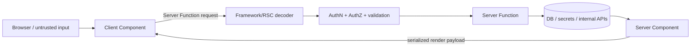
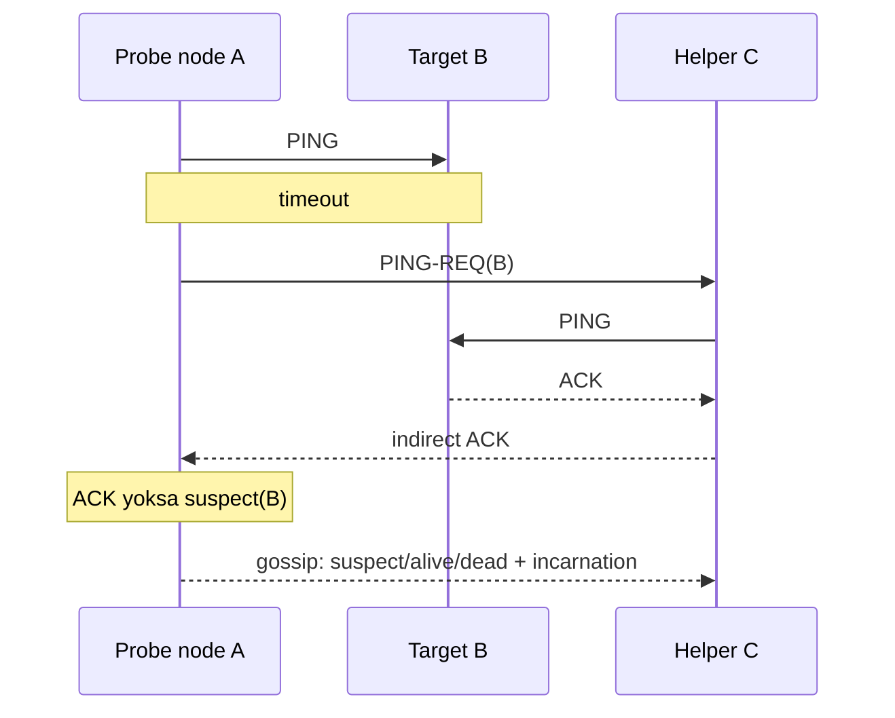

# 2026-09-20 01:00 — Interview Study Packages

README ve yakın `daily/2026-09-20/00-00.md` kontrol edildi. Pod Certificates / ClusterTrustBundles ve Roaring Bitmap tekrar edilmedi. Repo aramasında SWIM failure detection için doğrudan paket bulunmadı; React Server Components için de doğrudan canonical paket bulunmadı. Bu tur Frontend/Security ile Distributed Systems eksenine döndü.

## Paket 1 — Mid → Principal Frontend / Cybersecurity: React Server Components, Trust Boundaries & Patch Discipline
**Süre:** 20–30 dk

### Konu anlatımı
React Server Components (RSC), bazı component'leri browser bundle'ına göndermek yerine build sırasında veya request başına server ortamında çalıştırır. Server Component doğrudan data layer'a erişebilir ve Client Component'e render edilebilir veri/JSX aktarabilir; interaktivite gerektiğinde sınır `"use client"` ile çizilir. `"use server"` ise Server Component etiketi değil, client tarafından çağrılabilen **Server Function** sınırıdır.

Bu mimari performans kadar güvenlik sınırı da yaratır. Client→Server Function çağrısı normal bir remote invocation gibi ele alınmalıdır: payload güvenilmezdir; authentication/authorization, input validation, rate/resource limits ve secret isolation gerekir. 3 Aralık 2025'te React ekibi RSC payload decoding yolunda unauthenticated RCE (CVE-2025-55182, CVSS 10.0) açıkladı. Ardından DoS/source-exposure sorunları ve 26 Ocak 2026'da ek DoS düzeltmesi yayımlandı; React ekibi etkilenen RSC paketleri için 19.0.4, 19.1.5 veya 19.2.4 gibi tamamlanmış patch line'larına yükseltmeyi istedi.

### Mental model

**Invariant:** server'da çalışmak kodu otomatik olarak güvenli yapmaz; RSC transport/decoder ve Server Function endpoint'i internet-facing attack surface olabilir.

### İçeride ne oluyor?
- Server Components browser'a component implementation olarak gönderilmez; server/build ortamında render edilir ve client tree ile compose edilir.
- Client Components state/effect/browser API'lerini kullanabilir; server/client boundary bundle boyutu, serialization ve secret exposure açısından tasarım kararıdır.
- Server Functions client'ın server'daki async fonksiyonu çağırmasını sağlar; bu nedenle her çağrı authorization gerektiren RPC gibi düşünülmelidir.
- Framework/bundler'ın RSC implementation API'leri React 19.x içinde framework yazarları açısından semver-stable değildir; React dokümanı version pinning önerir.
- Security patch yalnız `react` paketine bakılarak yönetilmemeli; `react-server-dom-*`, framework ve bundler dependency graph'i SBOM/dependency scanner ile doğrulanmalıdır.

### Yüksek getirili mülakat soruları
1. RSC ile SSR aynı şey midir? Execution ve hydration sınırlarını ayır.
2. `"use client"` ve `"use server"` neyi ifade eder?
3. Server Function neden sıradan local function gibi güvenilmemelidir?
4. Senior: RSC boundary'de secret/source exposure'ı nasıl engellersin?
5. Staff: framework patch'ini canary, SBOM ve rollback ile nasıl yönetirsin?
6. Principal: RSC benimsemesini latency/bundle kazanımı, framework coupling ve security patch velocity açısından nasıl değerlendirirsin?

### Seviyeye göre cevap derinliği
- **Mid:** Server/Client Component ve Server Function rollerini doğru ayırır.
- **Senior:** serialization, authorization, caching, secret boundary ve patch failure mode'larını tartışır.
- **Staff:** dependency graph, canary rollout, observability ve framework ownership modelini tasarlar.
- **Principal:** platform standardı, blast radius, vendor/framework coupling ve security response SLO'sunu ürün ekonomisine bağlar.

### Kısa alıştırma
Bir `updateInvoice(id, amount)` Server Function tasarla. Browser'dan gelen `id`, `amount` ve session bilgisinin hangi aşamalarda doğrulanacağını; tenant authorization, idempotency ve audit log noktalarını çiz. Sonra RSC decoder'da kritik CVE çıktığında 60 dakikalık incident/patch planı yaz.

### Proje fikri
`rsc-boundary-lab`: public catalog Server Component + authenticated mutation Server Function + küçük Client Component kur. Authorization testleri, malformed payload fuzz testleri, dependency inventory ve canary patch pipeline ekle. Client JS bytes, TTFB ve server CPU'yu klasik client-fetch yaklaşımıyla karşılaştır.

### Failure modes / trade-off / production bağlantısı
`"use server"` fonksiyonunu trusted internal call sanmak, yalnız UI'da authorization yapmak, secret'ı serializable props'a taşımak, framework transitives'ini patch dışında bırakmak ve server/client boundary'yi ölçmeden her yere RSC uygulamak tipik hatalardır. Production'da RSC request/error rate, decoder failures, Server Function latency, authz denials, client JS bytes, cache hit rate, dependency vulnerability age ve patch rollout duration izlenmelidir.

### Kaynaklar
- React — Server Components: https://react.dev/reference/rsc/server-components
- React — Server Functions: https://react.dev/reference/rsc/server-functions
- React Security Advisory, 3 Aralık 2025: https://react.dev/blog/2025/12/03/critical-security-vulnerability-in-react-server-components
- React follow-up, güncelleme 26 Ocak 2026: https://react.dev/blog/2025/12/11/denial-of-service-and-source-code-exposure-in-react-server-components

---

## Paket 2 — Junior → Staff Distributed Systems: SWIM Failure Detection, Gossip Membership & Suspicion
**Süre:** 20–30 dk

### Konu anlatımı
Dağıtık sistemde “node öldü” bilgisi doğrudan gözlenmez; yalnız timeout ve mesaj davranışı gözlenir. All-to-all heartbeat, node sayısı büyüdükçe ağ/CPU yükünü kötü ölçekleyebilir. **SWIM**, failure detection ile membership update dissemination'ı ayırır: her periyotta rastgele bir peer doğrudan `PING` edilir; cevap gelmezse birkaç başka peer üzerinden `PING-REQ` ile indirect probe yapılır. Hâlâ cevap yoksa node hemen kesin dead ilan edilmek yerine **suspect** durumuna alınabilir. Membership değişiklikleri probe trafiğine piggyback edilerek epidemic/gossip biçiminde yayılır.

Orijinal SWIM çalışmasının temel fikri, member başına beklenen probe/message yükünü cluster boyutundan bağımsız tutarken hızlı detection ve eventual membership convergence sağlamaktır. Fakat failure detector consensus değildir: partition, packet loss veya CPU starvation yaşayan sağlıklı node yanlış şüpheli görünebilir.

### Mental model

**Invariant:** failure detection olasılıksal bir gözlemdir; “suspect/dead membership state” tek başına distributed lock veya linearizable ownership kanıtı değildir.

### İçeride ne oluyor?
- Randomized direct probe hotspot ve O(n²) heartbeat yükünü azaltır.
- Indirect probes, A↔B yoluna özgü packet loss/partition ihtimalini farklı yollarla sınar.
- Suspicion window false positive ile detection latency arasında ayarlanabilir trade-off'tur.
- Incarnation number, bir node'un eski `suspect/dead` bilgisini daha yeni `alive` bilgisiyle refute etmesine yardım eder.
- Piggyback gossip hızlı yayılım sağlar; periodic full-state push/pull gibi anti-entropy mekanizmaları implementation'a göre convergence'ı güçlendirebilir.
- HashiCorp memberlist SWIM tabanlıdır ve Lifeguard uzantılarıyla CPU starvation/network delay altında local-health awareness ekler; kendi güvenlik dokümanı bunun BFT veya consensus olmadığını açıkça belirtir.

### Yüksek getirili mülakat soruları
1. Heartbeat ile failure detector arasındaki temel belirsizlik nedir?
2. SWIM neden direct ve indirect probe kullanır?
3. Suspicion neden hemen `dead` ilan etmekten iyidir?
4. Senior: probe interval, timeout ve suspicion süresini nasıl tune edersin?
5. Staff: membership state'i shard ownership/leader election için doğrudan kullanmanın riski nedir?
6. Staff: CPU-starved node'ların false positive üretmesini nasıl gözlemler ve azaltırsın?

### Seviyeye göre cevap derinliği
- **Junior:** timeout'un failure kanıtı olmadığını ve gossip fikrini açıklar.
- **Mid:** direct/indirect probe, suspicion ve incarnation mekanizmasını anlatır.
- **Senior:** false-positive/detection-latency trade-off'u, partition ve backpressure'ı tartışır.
- **Staff:** membership'i consensus/fencing'den ayırır; security, multi-region topology, rollout ve observability tasarlar.

### Kısa alıştırma
5 node için bir probe turu çiz. A→B direct ping kaybolsun ama C→B çalışsın; sonra B gerçekten çöksün. Her durumda hangi mesajların gittiğini ve ne zaman suspect/dead transition'ı olacağını yaz. Timeout'u yarıya indirmenin false-positive ve detection latency etkisini tartış.

### Proje fikri
`swim-lab`: 20 process'lik küçük membership simulator kur. Random packet loss, asymmetric partition, CPU pause ve node crash fault injection ekle. All-to-all heartbeat ile SWIM benzeri probe yaklaşımını messages/sec, detection latency, false positives ve convergence time açısından karşılaştır.

### Failure modes / trade-off / production bağlantısı
Timeout'u “kesin ölüm” sanmak, suspicion süresini RTT dağılımından bağımsız seçmek, incarnation/refutation'ı yanlış uygulamak, membership'i fencing token yerine kullanmak ve gossip kanalını güvenilir/authenticated varsaymak tipik hatalardır. Production'da probe RTT/timeout, indirect-probe oranı, suspicion duration, refutation count, false-positive estimate, gossip queue/backlog, convergence time ve local CPU/event-loop delay izlenmelidir.

### Kaynaklar
- Das, Gupta, Motivala — SWIM (DSN 2002): https://doi.org/10.1109/DSN.2002.1028914
- Cornell paper PDF: https://www.cs.cornell.edu/projects/Quicksilver/public_pdfs/SWIM.pdf
- HashiCorp memberlist: https://github.com/hashicorp/memberlist
- memberlist security model: https://github.com/hashicorp/memberlist/blob/master/SECURITY.md