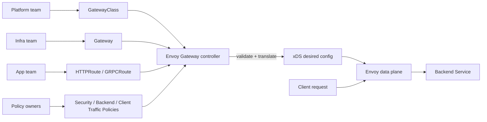
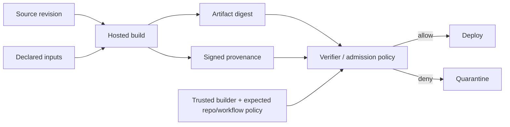

# 2026-09-20 02:00 — Interview Study Packages

README ve yakın `daily/2026-09-20/01-00.md` kontrol edildi. React Server Components ile SWIM tekrar edilmedi. Repo aramasında WASI 0.3'ün daha önce birkaç kez işlendiği görüldüğü için elendi. Bu tur Cloud/System Design ile Cybersecurity/DevSecOps eksenine döndü.

## Paket 1 — Mid → Principal Cloud / System Design: Envoy Gateway, Gateway API Policy Attachment & Control/Data Plane Boundaries
**Süre:** 20–30 dk

### Konu anlatımı
Kubernetes ingress tasarımında yalnız “hangi host hangi Service'e gider?” sorusu yetmez. Modern edge platformu routing, TLS, authentication, rate limit, retries/timeouts, traffic shaping ve observability gibi politikaları farklı ekiplerin güvenli biçimde yönetebilmesini ister. **Gateway API** bu rolleri `GatewayClass`, `Gateway`, `HTTPRoute`/`GRPCRoute` gibi kaynaklarla ayırır; **Envoy Gateway** bu declarative kaynakları izleyip Envoy data plane için xDS konfigürasyonuna çeviren bir control plane sağlar.

Kritik mental ayrım şudur: Kubernetes API'deki desired state doğrudan request path değildir. Controller kaynakları reconcile eder, policy attachment ve reference'ları doğrular, sonra xDS snapshot/config üretir; Envoy proxy ise request başına hot path'te routing/policy uygular. Bu ayrım availability ve failure-domain tasarımını belirler: controller kısa süre unavailable olsa bile mevcut Envoy konfigürasyonu trafik taşımaya devam edebilir; fakat yeni route/policy değişiklikleri converge etmez.

Envoy Gateway v1.6 hattındaki değişiklikler bu modelin production ayrıntılarını gösterir: upstream TLS için SNI/SAN davranışı sıkılaştırıldı, OIDC refresh-token davranışı değişti, status/update coalescing performans iyileştirmeleri geldi. v1.6.7 ayrıca büyük workload'larda Gateway API translation süresini azaltan preprocessed resource map yaklaşımını ve güvenlik dependency güncellemelerini içeriyor.

### Mental model

**Invariant:** control plane “konfigürasyonun ne olması gerektiğini” hesaplar; data plane “mevcut kabul edilmiş konfigürasyonla request'i işler”. Status condition ise trafik başarısının kendisi değil, controller'ın resource değerlendirmesidir.

### İçeride ne oluyor?
- `GatewayClass` implementation/ownership sınırını, `Gateway` listener ve infra sınırını, `HTTPRoute`/`GRPCRoute` uygulama routing intent'ini ifade eder.
- Policy attachment'ta target/reference scope önemlidir: aynı route'a birden fazla policy uygulanırsa precedence, merge ve conflict semantiği açık olmalıdır.
- Controller reconciliation idempotent olmalı; resource event fırtınalarında debounce/coalescing API-server write amplification ve translation CPU'sunu azaltabilir.
- xDS config push atomicity/versioning önemlidir. Partially invalid resource tüm sağlıklı route'ları bozmak yerine status üzerinden ayrıştırılmalıdır.
- TLS'te downstream termination ile upstream TLS farklı trust boundary'lerdir; SNI ve SAN validation yanlış eşleşirse bağlantı güvenli görünürken yanlış identity varsayımı yapılabilir.
- Extension/patch mekanizmaları güçlüdür fakat blast radius büyütür; custom Lua/filters veya düşük seviyeli xDS patch'leri platform-level code execution/configuration riskidir.

### Yüksek getirili mülakat soruları
1. Gateway API neden klasik Ingress'ten daha fazla role/ownership modeli sunar?
2. Control plane ile data plane arasındaki availability bağı nedir?
3. `Accepted=True` olan bir HTTPRoute neden yine de production'da 5xx üretebilir?
4. Senior: aynı Gateway'e yüzlerce route update olduğunda reconciliation storm'u nasıl azaltırsın?
5. Staff: policy precedence ve cross-namespace reference governance'ını nasıl tasarlarsın?
6. Principal: tek shared gateway mi, team/tenant başına gateway mi? Blast radius, cost, isolation ve operational load açısından tartış.

### Seviyeye göre cevap derinliği
- **Mid:** GatewayClass/Gateway/Route rollerini ve controller→xDS→proxy akışını doğru anlatır.
- **Senior:** status, stale config, TLS identity, rollout ve reconciliation failure mode'larını tartışır.
- **Staff:** multi-tenant policy ownership, namespace/reference güvenliği, config validation ve canary gateway tasarlar.
- **Principal:** shared-vs-dedicated topology, platform API ergonomisi, upgrade strategy, cost ve regional blast radius'u birlikte yönetir.

### Kısa alıştırma
İki takımın aynı Gateway'i kullandığı bir tasarım çiz. Takım A `/api`, Takım B `/checkout` route'una sahip olsun. Global authentication, takım bazlı timeout ve yalnız platform ekibinin değiştirebildiği upstream TLS policy'si tanımla. Çakışan iki timeout policy geldiğinde deterministic davranışı yaz.

### Proje fikri
`gateway-policy-lab`: kind/k3d üzerinde Envoy Gateway kur. HTTPRoute, GRPCRoute, retry/timeout, rate-limit ve upstream TLS senaryoları ekle. Controller'ı geçici durdurup mevcut trafik ile yeni config convergence'ını ayrı ölç. Invalid BackendRef, expired certificate ve route storm fault injection ekle; config convergence p95, xDS rejection, 4xx/5xx ve controller CPU metriklerini çıkar.

### Failure modes / trade-off / production bağlantısı
Control plane'i request path sanmak, status'u end-to-end health yerine kullanmak, cross-namespace reference'ları sınırsız bırakmak, low-level extension'ları tenant'lara açmak, upstream TLS SAN/SNI kontrolünü gevşetmek ve CRD/controller upgrade sırasını önemsememek tipik hatalardır. Production'da reconcile latency, resource rejection reason, xDS push/reject, config version skew, proxy 4xx/5xx, upstream TLS failures, route cardinality ve controller API-server write rate izlenmelidir.

### Kaynaklar
- Envoy Gateway v1.6 announcement: https://gateway.envoyproxy.io/news/releases/v1.6/
- Envoy Gateway v1.6.7 release notes: https://gateway.envoyproxy.io/news/releases/notes/v1.6.7/
- Kubernetes Gateway API: https://gateway-api.sigs.k8s.io/
- Envoy xDS API: https://www.envoyproxy.io/docs/envoy/latest/api-docs/xds_protocol

---

## Paket 2 — Junior → CTO Cybersecurity / DevSecOps: SLSA v1.2 Provenance, Build Trust & Artifact Admission
**Süre:** 20–30 dk

### Konu anlatımı
Bir container image'ın SHA-256 digest'ini bilmek “bu byte'lar değişmedi” sorusunu cevaplar; **bu artifact'ı kim, hangi source revision'dan, hangi build platformunda ve hangi süreçle üretti?** sorusunu cevaplamaz. Software supply-chain güvenliğinde **provenance**, artifact ile build süreci arasında doğrulanabilir bağ kurar.

SLSA'nın güncel onaylı v1.2 spesifikasyonu birden fazla track kullanır. Build Track'te L1 provenance'ın varlığını; L2 hosted build platformunun provenance'ı üretip authenticate/sign etmesini; L3 ise build'lerin birbirini etkileyemediği ve provenance signing secret'larının user-defined build step'lerden izole edildiği hardened build platformunu hedefler. v1.2 ayrıca Source Track'i yeniden kapsama alır. Buradaki önemli mülakat noktası “SLSA seviyesi = yazılım güvenlidir” dememektir: SLSA artifact'ın beklenen source/build zincirinden geldiğine dair supply-chain integrity güvencesini yükseltir; kaynak kodundaki mantık açığını veya kötü niyetli ama yetkili source change'i tek başına çözmez.

### Mental model

**Invariant:** imza yalnız provenance belgesinin authenticity/integrity'sini güçlendirir; verifier ayrıca artifact digest'i, builder identity'yi, source/workflow beklentisini ve policy'yi kontrol etmelidir.

### İçeride ne oluyor?
- Provenance artifact'ı cryptographic digest ile tanımlar; builder, build process ve top-level input'ları kaydeder.
- Build L1'de provenance eksik/unsigned olabilir; ana kazanım traceability ve mistake prevention'dır.
- Build L2'de hosted platform provenance'ı üretip authenticate eder; consumer authenticity doğrular.
- Build L3'te cross-build influence, signing-key exposure ve persistent/cache poisoning gibi build-platform saldırı yüzeyleri için daha güçlü isolation beklenir.
- Verification deployment öncesi admission noktasında yapılmazsa provenance yalnız arşiv metadata'sına dönüşebilir. Policy, hangi builder/repo/ref/workflow kombinasyonlarının kabul edildiğini açıkça tanımlamalıdır.
- SBOM ve provenance farklı soruları cevaplar: SBOM “içinde ne var?”, provenance “nasıl/nereden üretildi?”; ikisi birbirinin yerine geçmez.
- Signing key veya identity trust root'tur. Keyless/short-lived identity kullanılsa bile issuer, subject, workflow identity ve transparency/audit politikasının doğrulanması gerekir.

### Yüksek getirili mülakat soruları
1. Artifact hash ile provenance arasındaki fark nedir?
2. SBOM ile SLSA provenance neden aynı şey değildir?
3. Build L1/L2/L3'ün güvenlik farkını birer cümleyle açıkla.
4. Senior: saldırgan CI job'ını değiştirebiliyorsa provenance hangi koşulda hâlâ anlamlıdır?
5. Staff: admission policy'de yalnız “signature valid” kontrolü neden yetersizdir?
6. Principal/CTO: tüm reposu bir anda L3'e taşımak yerine risk-temelli adoption roadmap'ini nasıl kurarsın?

### Seviyeye göre cevap derinliği
- **Junior:** hash, signature, provenance ve SBOM kavramlarını ayırır.
- **Mid:** artifact→provenance→verification zincirini ve L1/L2/L3 farkını açıklar.
- **Senior:** builder identity, signing trust, cache poisoning, compromised workflow ve admission failure mode'larını tartışır.
- **Staff:** merkezi builder, policy-as-code, exception process, rollout ve audit evidence tasarlar.
- **Principal/CTO:** crown-jewel artifact'lar için assurance hedefi, developer friction, platform maliyeti, compliance ve incident containment arasında yatırım kararı verir.

### Kısa alıştırma
Bir ödeme servisi container'ı için admission policy yazılı olarak tanımla: artifact digest provenance ile eşleşmeli; builder yalnız onaylı hosted builder olmalı; source repo belirli org altında olmalı; release tag protected source revision'a bağlanmalı. Sonra provenance yok, signature geçersiz veya builder beklenmeyen olduğunda fail-open/fail-closed kararını ortam bazında tartış.

### Proje fikri
`provenance-gate`: küçük bir CI pipeline artifact üretip provenance oluştursun. Deployment öncesi verifier digest + builder + repo/ref policy kontrol etsin. Üç saldırı simüle et: registry'de artifact swap, farklı fork'tan build, self-hosted/untrusted builder. Policy decision, verification latency, denied reason ve exception age metriklerini kaydet.

### Failure modes / trade-off / production bağlantısı
“Signed = trusted” demek, signer identity'yi doğrulamamak, provenance digest'i artifact digest'iyle bağlamamak, self-hosted runner'ı hosted/hardened builder ile eşdeğer saymak, SBOM'u provenance yerine kullanmak, emergency bypass'ı süresiz bırakmak ve developer workflow'u ölçmeden sert enforcement açmak tipik hatalardır. Production'da provenance coverage, verification success/failure reason, unknown builder count, unsigned artifact rate, policy exception age, builder version ve release-to-admission latency izlenmelidir.

### Kaynaklar
- SLSA v1.2 specification (Approved): https://slsa.dev/spec/v1.2/
- SLSA v1.2 Build Track basics: https://slsa.dev/spec/v1.2/build-track-basics
- SLSA v1.2 Tracks: https://slsa.dev/spec/v1.2/tracks
- SLSA provenance: https://slsa.dev/spec/v1.2/provenance
