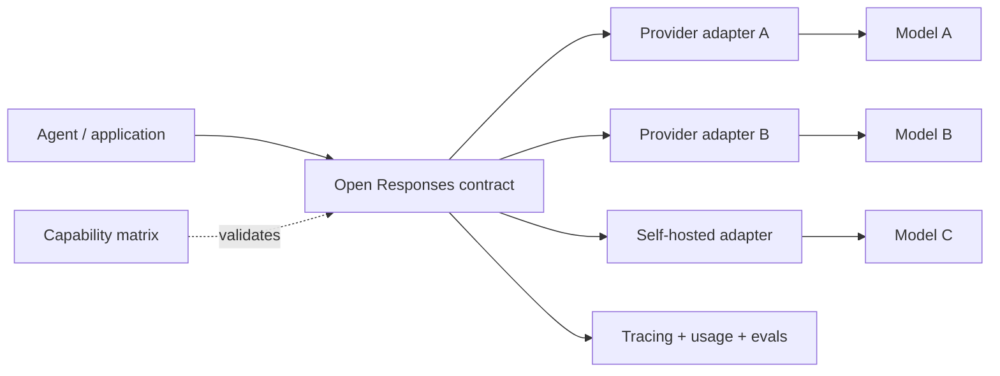
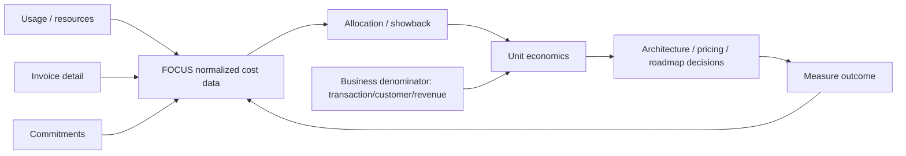

# 2026-09-20 03:00 — Interview Study Packages

README ve yakın `daily/2026-09-20/02-00.md` kontrol edildi. Envoy Gateway/Gateway API ile SLSA v1.2 tekrar edilmedi. Repo aramasında MCP stateless core, Dotted Version Vectors, Python t-strings, PostgreSQL generated columns/UUIDv7, Kubernetes in-place resize, OpenTelemetry Profiles ve Android adaptive layouts gibi adayların daha önce işlendiği görüldüğü için elendi. Bu tur ML/AI/LLM platformu ile Leadership/Product/Business eksenine döndü.

## Paket 1 — Mid → Principal ML/AI/LLM / Backend: Open Responses, Provider Interoperability & Agent API Boundaries
**Süre:** 20–30 dk

### Konu anlatımı
LLM uygulamalarında en pahalı lock-in çoğu zaman model adından değil, **request/response state machine ve tool-call protokolünden** gelir. Bir uygulama yalnız `prompt -> text` yapıyorsa provider değiştirmek nispeten kolaydır; fakat reasoning items, tool calls, multimodal input, streaming events, usage accounting ve error semantics devreye girdiğinde adapter yüzeyi büyür.

OpenAI 15 Ocak 2026'da **Open Responses**'ı, kendi Responses API'sini temel alan açık kaynaklı ve çok sağlayıcılı LLM arayüzleri için interoperable bir spesifikasyon olarak duyurdu. Mülakat açısından önemli nokta “tek API her sağlayıcıyı tamamen eşitler” demek değildir. Ortak wire contract taşınabilirliği artırır; model capability, tool semantics, latency, safety/refusal, token accounting ve provider-specific extension farkları yine kalır.

Mental model: **portable envelope, non-portable capability**. Uygulama ortak request/response item modeline konuşur; provider adapter bunu hedef backend'e çevirir. Capability negotiation ve conformance testleri yoksa sözde taşınabilirlik runtime sürprizine dönüşür.

### Mental model

**Invariant:** ortak schema syntactic interoperability sağlar; semantic equivalence garanti etmez.

### İçeride ne oluyor?
- Contract katmanı input/output item'larını, tool invocation'ı, streaming event'lerini ve error envelope'larını normalize etmeye çalışır.
- Provider adapter yalnız field rename değildir; unsupported capability, parameter mapping, stop/refusal semantics ve usage metering gibi farkları yönetir.
- Streaming'de event ordering ve partial output semantics önemlidir. Consumer idempotent/defensive olmalı; bağlantı koptuğunda “hangi item tamamlandı?” sorusuna cevap verebilmelidir.
- Tool call boundary güvenlik sınırıdır. Modelin ürettiği argüman schema-valid olsa bile authorization, side-effect policy ve idempotency uygulama tarafında kalır.
- Common denominator'a aşırı kapanmak güçlü provider özelliklerini kaybettirebilir. Extension alanları taşınabilirlik ile innovation arasında escape hatch sağlar; fakat lock-in'i geri getirebilir.
- Evals provider değişiminin gerçek compatibility testidir: aynı contract'ın parse edilmesi yeterli değildir; task success, tool-call accuracy, latency, refusal ve cost regression ölçülmelidir.

### Yüksek getirili mülakat soruları
1. Bir LLM API'sinde “interoperability” tam olarak hangi katmanda sağlanabilir?
2. JSON schema aynıysa iki model neden semantik olarak interchangeable değildir?
3. Tool-call adapter'ında authorization neden model/provider katmanına bırakılamaz?
4. Senior: streaming sırasında bağlantı koparsa duplicate side effect'i nasıl engellersin?
5. Staff: provider capability matrix ve conformance suite'i nasıl tasarlarsın?
6. Principal: portability için lowest-common-denominator API mı, provider extensions mı? Ürün hızı, reliability ve bargaining power açısından tartış.

### Seviyeye göre cevap derinliği
- **Mid:** request/response, tool call, streaming ve adapter kavramlarını ayırır.
- **Senior:** retries, partial streams, idempotency, auth, observability ve semantic drift failure mode'larını tartışır.
- **Staff:** capability negotiation, conformance/eval suite, extension governance ve multi-provider rollout tasarlar.
- **Principal:** portability yatırımını vendor concentration risk, engineering cost, product differentiation, latency ve commercial leverage ile birlikte değerlendirir.

### Kısa alıştırma
Üç capability tanımla: text generation, strict tool calling ve image input. İki provider için `supported / emulated / unsupported` matrisi çıkar. Ardından uygulamanın strict tool calling zorunluluğu varsa routing policy ve fallback davranışını yaz.

### Proje fikri
`open-responses-router`: ortak request contract alan küçük gateway. İki backend adapter'ı, capability registry, per-provider timeout/retry budget, tool-call idempotency key ve shadow-eval modu ekle. Provider değişiminde task success, schema-valid tool args, p95 latency, cost/request ve fallback rate karşılaştır.

### Failure modes / trade-off / production bağlantısı
“API uyumlu = model eşdeğer” varsaymak, unsupported feature'ı sessizce drop etmek, streaming reconnect'te tool'u iki kez çalıştırmak, usage alanlarını provider'lar arasında aynı sanmak, refusal/error ayrımını kaybetmek ve provider-specific extension'ları kontrolsüz yaymak tipik hatalardır. Production'da capability mismatch, adapter error, fallback rate, tool duplicate suppression, task/eval success, p95 latency, token/usage reconciliation ve provider-specific extension adoption izlenmelidir.

### Kaynaklar
- OpenAI API changelog — Open Responses announcement, 15 Ocak 2026: https://developers.openai.com/api/docs/changelog
- OpenAI — New tools for building agents / Responses API direction: https://openai.com/index/new-tools-for-building-agents/
- OpenAI — New tools and features in the Responses API: https://openai.com/index/new-tools-and-features-in-the-responses-api/

---

## Paket 2 — Senior → CTO Leadership / Product / Business / FinOps: FOCUS 1.4, Invoice Reconciliation & Technology Unit Economics
**Süre:** 20–30 dk

### Konu anlatımı
CTO düzeyinde “cloud faturası geçen ay %18 arttı” tek başına karar verilebilir bir sinyal değildir. Harcama artarken transaction, active customer veya revenue daha hızlı büyüyorsa unit economics iyileşiyor olabilir. Tersine toplam spend sabitken iş hacmi düşüyorsa teknoloji verimliliği kötüleşebilir. Bu nedenle maliyet verisini **business value denominator** ile bağlamak gerekir.

FinOps Foundation'ın güncel tanımı Mart 2026 itibarıyla FinOps'u yalnız cloud cost optimization değil, teknoloji iş değerini maksimize eden ve engineering-finance-business işbirliğiyle finansal accountability oluşturan operasyonel framework/kültürel pratik olarak tanımlıyor. FOCUS ise farklı teknoloji sağlayıcılarının billing verisini ortak schema ve terminolojiye taşır.

FOCUS Steering Committee **1.4'ü 4 Haziran 2026'da ratify etti**. 1.4'ün önemli adımı Invoice Detail ve Billing Period dataset'leriyle usage/cost kayıtlarını invoice reconciliation'a bağlaması; commitment detayları ve eligibility alanlarıyla da “indirim vardı mı?” yerine “hangi harcama gerçekten commitment ile cover edilebilirdi?” sorusunu daha tutarlı cevaplamasıdır. FOCUS 1.4 zero incompatible changes hedefiyle yayımlandı. Sonraki 1.5 için AI model identity, input/output token consumption ve Price Sheet dataset'i aktif çalışma alanları olarak duyuruldu; bunlar 1.4 özelliği değil, roadmap'tir.

### Mental model

**Invariant:** normalized cost data karar değildir. İş değeri denominator'ı, allocation policy ve ownership olmadan “cost per unit” yanıltıcı olabilir.

### İçeride ne oluyor?
- Invoice reconciliation “internal usage total neden vendor invoice ile eşleşmiyor?” problemini credits, corrections, billing periods ve invoice-level detaylarla çözmeye çalışır.
- Allocation shared platform cost'larını ürün/takım/customer'a dağıtır. Allocation key yanlışsa unit metric matematiksel olarak doğru ama yönetsel olarak yanlış olabilir.
- Commitment coverage ile utilization farklı sorulardır: satın alınan commitment ne kadar kullanıldı ve eligible spend'in ne kadarı commitment tarafından cover edildi?
- Unit metric denominator ürünün value driver'ına yakın seçilmelidir: `cost / request` teknik optimizasyon için iyi olabilir; `cost / successful checkout` veya `cost / active customer` iş kararı için daha anlamlı olabilir.
- Fully loaded cost'a geçerken observability, security, shared platform, SaaS ve bazen labor gibi maliyetler dahil edilir; Crawl aşamasında direct variable cost ile başlamak daha uygulanabilir olabilir.
- Metric Goodhart etkisine açıktır. `cost/request` düşürmek için gereksiz request üretmek veya quality'yi azaltmak mümkün olduğundan quality/SLO/revenue guardrail'leri gerekir.

### Yüksek getirili mülakat soruları
1. Showback, chargeback ve unit economics arasındaki fark nedir?
2. Toplam cloud spend artarken neden teknoloji verimliliği yine de iyileşmiş olabilir?
3. Commitment utilization ile coverage neden farklı KPI'lardır?
4. Senior: shared Kubernetes platform cost'unu ürünlere nasıl allocate edersin?
5. Staff: cost-per-transaction metriğini SLO ve product quality ile nasıl guardrail edersin?
6. CTO: %20 infra tasarrufu için roadmap'i yavaşlatmak ne zaman kötü bir iş kararıdır? Margin, growth, risk ve opportunity cost ile tartış.

### Seviyeye göre cevap derinliği
- **Senior:** cost allocation, shared cost, commitment ve temel unit metric'i doğru kurar.
- **Staff:** data quality, allocation governance, SLO guardrail, platform charge model ve architecture trade-off'larını bağlar.
- **Principal/EM:** ürün/takım bazında ownership, exception process, forecasting ve optimization portfolio tasarlar.
- **CTO:** teknoloji spend'ini margin, revenue growth, risk, pricing, build-vs-buy ve capital allocation ile birlikte yönetir; “minimum cost” yerine “maksimum business value” hedefler.

### Kısa alıştırma
Aylık teknoloji maliyeti 400k → 460k, başarılı transaction 8M → 11.5M olsun. Direct `cost/successful transaction` değişimini hesapla. Sonra 60k shared observability/security maliyetini transaction hacmine göre allocate etmek ile eşit takım paylaştırmak arasındaki davranışsal teşvik farkını tartış.

### Proje fikri
`focus-unit-economics-lab`: FOCUS-benzeri Cost and Usage + Invoice Detail + business KPI tablolarından küçük warehouse kur. Ürün bazında allocated cost, invoice reconciliation delta, commitment coverage ve `cost/successful_transaction` dashboard'u üret. Data freshness ve allocation version'ını metric metadata'sında göster; eski allocation rule ile yeni rule arasında backfill karşılaştırması yap.

### Failure modes / trade-off / production bağlantısı
Cost'u value sanmak, yalnız total spend optimize etmek, shared cost'u keyfi bölmek, invoice ile usage ledger'ı reconcile etmemek, commitment utilization'ı coverage sanmak, denominator tanımını sessizce değiştirmek ve unit metric'i SLO/quality guardrail olmadan hedefe çevirmek tipik hatalardır. Production'da invoice reconciliation delta, unallocated cost %, commitment coverage/utilization, cost per business unit, denominator freshness, allocation-rule version, SLO ve gross/contribution margin birlikte izlenmelidir.

### Kaynaklar
- FOCUS — What is FOCUS? (1.4 latest, ratified 4 Haziran 2026): https://focus.finops.org/what-is-focus/
- FinOps Foundation — Introducing FOCUS 1.4, 10 Haziran 2026: https://www.finops.org/insights/introducing-focus-1-4/
- FinOps Foundation — What is FinOps? (updated March 2026): https://www.finops.org/introduction/what-is-finops/
- FinOps Framework — Unit Economics capability: https://www.finops.org/framework/capabilities/unit-economics/
