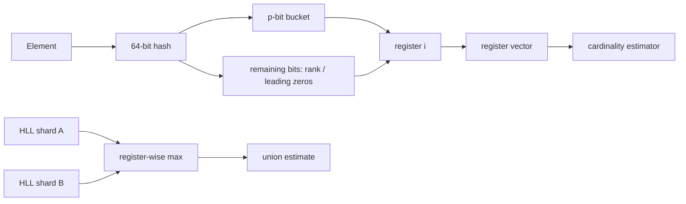
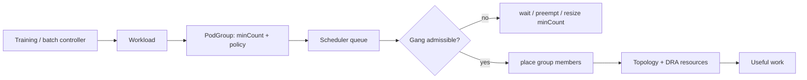

# 2026-09-20 04:00 — Interview Study Packages

README ve yakın `daily/2026-09-20/03-00.md` kontrol edildi. Open Responses ve FOCUS 1.4 tekrar edilmedi. Repo aramasında Kubernetes Pod-Level Resource Managers ile OpenTelemetry Kubernetes Attributes Processor'ın da daha önce işlendiği görüldü. Bu tur Algorithms/Data Structures ile Cloud/System Design eksenine döndü.

## Paket 1 — Junior → Staff Algorithms & Data Structures / Data Engineering: HyperLogLog, Approximate Cardinality & Mergeable Sketches
**Süre:** 20–30 dk

### Konu anlatımı
`COUNT(DISTINCT user_id)` kesin sonuç verir ama yüz milyonlarca benzersiz değeri saklamak veya shuffle etmek pahalı olabilir. HyperLogLog (HLL), elemanların kendisini tutmak yerine iyi dağılmış bir hash'in bit örüntülerinden kardinalite tahmin eder. Temel sezgi şudur: adil bir bit dizisinde çok uzun bir leading-zero/run görmek nadirdir; çok nadir örüntüler gördüysek muhtemelen çok sayıda farklı eleman gözlemledik.

Tek bir maksimum gözlem çok gürültülüdür. HLL hash alanını `m = 2^p` register'a böler; hash'in ilk `p` biti register seçer, kalan bölümdeki ilk 1'in pozisyonu o register'ın gözlemini günceller. Tahminde register'lardaki üstel büyüklükler harmonic mean benzeri agregasyonla birleştirilir ve küçük/büyük kardinalite düzeltmeleri uygulanabilir.

Mental model: **elemanları değil, nadir hash olaylarının özetini sakla**. Aynı hash fonksiyonu ve aynı precision kullanıldığında iki HLL register-wise `max` ile merge edilebilir; bu özellik map/reduce, stream processing ve multi-region analytics için çok değerlidir.

### Mental model

**Invariant:** HLL membership testi yapmaz ve elemanları geri vermez; yalnız yaklaşık distinct cardinality taşır.

### İçeride ne oluyor?
- `p` büyüdükçe register sayısı ve memory artar, standard error azalır; kaba sezgi hata ~ `1/sqrt(m)` ölçeğindedir.
- Aynı elemanı tekrar eklemek register'ı çoğunlukla değiştirmez; yapı doğal olarak duplicate-tolerant cardinality sketch'tir.
- Merge için hash seed/fonksiyonu ve precision uyumu kritiktir. Uyuşmayan sketch'leri körlemesine merge etmek anlamsız sonuç üretir.
- Sparse representation küçük cardinality'de memory kazandırabilir; cardinality büyüyünce dense register vector'e geçilir.
- HLL set intersection'ı doğrudan vermez. `|A∩B| = |A| + |B| - |A∪B|` ile türetmek özellikle küçük intersection'da hata büyütebilir.
- Adversarial veya düşük kaliteli hash dağılımı estimator varsayımlarını bozar; production'da hash seçimi algoritmanın parçasıdır.

### Yüksek getirili mülakat soruları
1. Exact set yerine HLL ne zaman doğru seçimdir?
2. Leading-zero/rank gözlemi neden cardinality hakkında bilgi taşır?
3. Precision artırınca memory ve error nasıl değişir?
4. Mid: iki shard'ın HLL'si neden register-wise max ile merge edilebilir?
5. Senior: günlük unique user ile 30 günlük unique user'ı nasıl hesaplar ve saklarsın?
6. Staff: multi-region sketch formatı, hash-version migration ve backfill stratejisini nasıl tasarlarsın?

### Seviyeye göre cevap derinliği
- **Junior:** exact vs approximate ayrımını, hash ve distinct-count problemini açıklar.
- **Mid:** bucket/register/rank modelini ve merge özelliğini anlatır.
- **Senior:** precision/error, sparse-dense representation, intersection error ve distributed aggregation trade-off'larını tartışır.
- **Staff:** versioned sketch contract, hash migration, data quality, privacy, observability ve product accuracy budget'ını yönetir.

### Kısa alıştırma
`p=3` ile 8 register varsay. Sekiz örnek hash'i ilk 3 bit ile bucket'a ayır; kalan bitlerden rank hesaplayıp register'ları güncelle. Ardından ikinci bir register vector ile elementleri tekrar okumadan union üret.

### Proje fikri
`hll-stream-lab`: event stream'de exact `set` ve HLL ile `unique_user/day` hesapla. 1K, 100K ve 10M cardinality simülasyonunda memory, update throughput ve relative error ölç. Shard başına sketch üretip merge et; hash-version metadata'sı ekle.

### Failure modes / trade-off / production bağlantısı
Exact değer gerekiyorken HLL kullanmak, farklı precision/hash seed'lerini merge etmek, estimator sonucunu üyelik kanıtı sanmak, küçük intersection'ı inclusion-exclusion ile aşırı güvenle hesaplamak ve metric tanımını değiştirdiği halde eski sketch'lerle yenileri birleştirmek tipik hatalardır. Production'da sketch version, precision, estimated cardinality, sampled exact-vs-estimate error, merge failures ve sparse→dense dönüşüm oranı izlenebilir.

### Kaynaklar
- Flajolet et al., HyperLogLog: the analysis of a near-optimal cardinality estimation algorithm: https://algo.inria.fr/flajolet/Publications/FlFuGaMe07.pdf
- Redis HyperLogLog resmi dokümantasyonu: https://redis.io/docs/latest/develop/data-types/probabilistic/hyperloglogs/
- Redis PFCOUNT: https://redis.io/docs/latest/commands/pfcount/

---

## Paket 2 — Senior → CTO Cloud / System Design / MLOps: Kubernetes v1.37 Workload-Aware Scheduling, Gang Scheduling & Elastic AI Workloads
**Süre:** 20–30 dk

### Konu anlatımı
Tek Pod odaklı scheduler semantics web servisleri için çoğu zaman yeterlidir; distributed training, MPI ve topology-sensitive batch workload'larda ise bir Pod'u tek başına schedule etmek işe yaramayabilir. Örneğin 64 GPU worker'ın yalnız 20'si başlayabiliyorsa kaynak tüketilir ama job ilerlemez. Gang scheduling bu problemi workload grubunu bir scheduling unit olarak ele alıp gerekli minimum üyelerin birlikte ilerleyebilmesini sağlayarak çözer.

Kubernetes v1.37'de Workload ve PodGroup API'leri ile gang scheduling Beta'ya geçti. PodGroup scheduler queue'da first-class hale geldi; her Pod'u ayrı kuyruğa almak yerine üst seviye grup queue edilir. `minCount` artık mutable olduğundan elastic workload controller'ları minimum gerekli gang boyutunu çalışma koşullarına göre değiştirebilir. Aynı sürüm Workload-Aware Preemption ve PodGroup'lar için shared DRA ResourceClaims'i de Beta'ya taşıyor; CompositePodGroup ise heterojen ve hiyerarşik workload yapıları için yeni Alpha yüzeyidir.

Mental model: **Pod placement değil, useful-work admission**. Scheduler'ın hedefi yalnız boş GPU bulmak değil, workload'un ilerleyebileceği yeterli kaynak setini topology, priority ve disruption politikalarıyla birlikte kabul etmektir.

### Mental model

**Invariant:** gang scheduling deadlock/resource-fragmentation riskini ortadan kaldırmaz; admission policy ve queue fairness hâlâ sistem tasarımının parçasıdır.

### İçeride ne oluyor?
- PodGroup birden çok Pod'un birlikte schedule edilme beklentisini ve minimum üye sayısını ifade eder; queueing unit'in grup olması scheduler churn'ünü azaltabilir.
- `minCount` elasticity sağlar ama controller'ın progress semantics'iyle uyumlu olmalıdır; yanlış küçültme job'un performans veya correctness varsayımlarını bozabilir.
- Workload-Aware Preemption tek Pod priority'si yerine workload düzeyindeki ilerleme ve disruption kararlarını daha anlamlı hale getirir.
- Shared DRA ResourceClaims GPU/accelerator gibi cihaz taleplerini grup semantics'iyle bağlar; cihaz availability ile compute placement aynı admission problemine yaklaşır.
- Topology-aware placement network locality ve collective communication maliyetini etkiler. '64 GPU var' ile 'aynı uygun topology içinde 64 GPU var' aynı şey değildir.
- Queue fairness, starvation, backfilling ve priority inversion kapasite verimliliği ile job latency arasında trade-off yaratır.

### Yüksek getirili mülakat soruları
1. Gang scheduling hangi problemi çözer; normal Pod scheduling neden yetmez?
2. `minCount` ile desired replica count neden aynı kavram değildir?
3. Senior: 64 GPU isteyen job ile sekiz adet 8-GPU job arasında fairness nasıl kurulur?
4. Staff: preemption'ın wasted compute ve checkpoint maliyetini nasıl hesaba katarsın?
5. Principal: topology, DRA ve queue policy'yi tek admission modelinde nasıl birleştirirsin?
6. CTO: pahalı accelerator fleet'inde utilization, researcher wait time ve delivery riskini hangi KPI setiyle dengelersin?

### Seviyeye göre cevap derinliği
- **Senior:** gang scheduling, minCount, topology ve preemption trade-off'larını açıklar.
- **Staff:** queue fairness, starvation, checkpoint-aware preemption, controller integration ve capacity fragmentation tasarlar.
- **Principal:** multi-cluster/fleet admission, accelerator classes, topology, quotas ve SLO'ları ortak platform contract'ına dönüştürür.
- **CTO:** GPU capex/opex, utilization, experiment throughput, time-to-train ve product roadmap etkisini birlikte yönetir.

### Kısa alıştırma
İki rack'te 32'şer GPU bulunan cluster tasarla. Job A `minCount=48`, Job B `minCount=16` istiyor. A'yı bekletmek, B'yi backfill etmek ve A için preemption yapmak seçeneklerini utilization, starvation ve topology açısından karşılaştır.

### Proje fikri
`gang-scheduler-sim`: PodGroup benzeri `minCount`, priority, topology ve duration alanları olan discrete-event simulator yaz. FIFO, backfill ve priority+aging politikalarını karşılaştır; GPU utilization, queue wait p95, preempted GPU-hours ve job completion time ölç.

### Failure modes / trade-off / production bağlantısı
Gang admission olmadan partial allocation ile GPU'ları kilitlemek, dev job'ları sonsuza kadar starvation'a bırakmak, preemption maliyetini sıfır varsaymak, topology'yi yalnız capacity sayısı olarak görmek, mutable `minCount`'u controller correctness'inden bağımsız değiştirmek ve Alpha/Beta API maturity'sini rollout planında yok saymak tipik hatalardır. Production'da queue wait, admission latency, unschedulable reason, gang success rate, preempted GPU-hours, topology fragmentation, accelerator utilization ve checkpoint recovery time izlenmelidir.

### Kaynaklar
- Kubernetes, Advancing Workload-Aware Scheduling, 8 Eylül 2026: https://kubernetes.io/blog/2026/09/08/kubernetes-v1-37-advancing-workload-aware-scheduling/
- Kubernetes v1.37 release announcement, 26 Ağustos 2026: https://kubernetes.io/blog/2026/08/26/kubernetes-v1-37-release/
