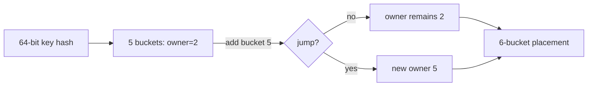
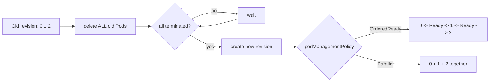

# 2026-09-20 05:00 — Interview Study Packages

README ve yakın `daily/2026-09-20/04-00.md` kontrol edildi. HyperLogLog ve Kubernetes Workload-Aware Scheduling tekrar edilmedi. Repo aramasında Merkle anti-entropy, PostgreSQL skip scan ve Kubernetes rootless node konularının daha önce işlendiği görüldü. Bu tur Distributed Systems/System Design ile Cloud/SRE eksenine döndü.

## Paket 1 — Mid → Principal Distributed Systems / System Design: Jump Consistent Hash, Minimal Churn & Shard Placement
**Süre:** 20–30 dk

### Konu anlatımı
Dağıtık cache, storage veya worker pool'da `hash(key) % N` basittir; fakat `N` değiştiğinde anahtarların büyük kısmının sahibi değişir. Consistent hashing ailesinin hedefi membership değişiminde mümkün olduğunca az key taşırken dengeli placement üretmektir.

Jump Consistent Hash (Lamping & Veach), ring ve virtual-node tablosu tutmadan bir 64-bit key'i `0..N-1` bucket'larından birine deterministik biçimde atar. Temel invariant şudur: bucket sayısı `N`'den `N+1`'e çıktığında bir key ya eski bucket'ında kalır ya da yalnız yeni bucket'a taşınır. Dengeli dağılım altında yaklaşık `1/(N+1)` key yeni bucket'a geçer. Algoritma O(log N) beklenen adım, O(1) ek memory ile çalışır.

Mental model: **bucket sayısı büyürken key'in sahibi her adımda yalnız yeni gelen bucket'a “jump” edebilir**. Algoritma bu jump noktalarını tek tek bütün bucket'ları gezmeden hesaplar.

### Mental model

**Invariant:** Jump Hash membership discovery veya replication protokolü değildir; yalnız aynı key + aynı bucket-count için deterministic placement fonksiyonudur.

### İçeride ne oluyor?
- Modulo hashing'de N değişikliği mapping'i global olarak bozar; Jump Hash büyümede yalnız yeni bucket'a taşınması gereken key'leri remap eder.
- State/table tutmaması lookup hot path'ini cache-friendly yapar ve client-side routing'i kolaylaştırır.
- Büyük sınırlama: bucket'lar ardışık numaralı olmalıdır. Arbitrary node remove/weight/topology semantiği doğrudan modelde yoktur.
- Physical node membership ile logical bucket kimliğini ayırmak gerekir. Bir node ölünce bucket ID'lerini sıkıştırmak büyük churn yaratabilir.
- Replication için yalnız primary placement yetmez; independent salt, ayrı replica mapping veya rendezvous/HRW benzeri ranking gerekir. Correlated placement failure domain riskini artırır.
- Hash fonksiyonu/seed değişimi de membership değişimi kadar ciddi data movement üretebilir; placement contract versionlanmalıdır.

### Yüksek getirili mülakat soruları
1. `hash(key) % N` node eklenince neden kötü davranır?
2. Consistent hashing'de “minimal disruption/churn” ne demektir?
3. Jump Hash ring tabanlı consistent hashing'den hangi state'i kaldırır?
4. Senior: bir node silindiğinde ardışık bucket ID şartını nasıl yönetirsin?
5. Staff: replication, AZ-awareness ve heterogeneous capacity'yi placement katmanına nasıl eklersin?
6. Principal: placement algorithm migration'ını online ve doğrulanabilir nasıl yaparsın?

### Seviyeye göre cevap derinliği
- **Mid:** modulo-vs-consistent placement ve deterministic hashing'i açıklar.
- **Senior:** churn, load balance, logical bucket indirection ve failure-domain sorunlarını tartışır.
- **Staff:** replica placement, membership versioning, dual-read/write migration ve observability tasarlar.
- **Principal:** topology/capacity policy, fleet migration, blast radius ve placement contract governance'ını yönetir.

### Kısa alıştırma
1 milyon random key'i önce 10 sonra 11 bucket'a ata. Modulo ile Jump Hash için taşınan key yüzdesini ölç. Ardından bucket 4'ü fiziksel node mapping'inden çıkarıp logical bucket indirection olmadan ID sıkıştırmanın churn etkisini gözle.

### Proje fikri
`shard-placement-lab`: modulo, ring+vnodes ve Jump Hash'i karşılaştır. 1M key, 10→11→12 bucket için lookup throughput, memory, max/avg load ve moved-key ratio ölç. Logical bucket→physical node mapping ve versioned placement manifest ekle.

### Failure modes / trade-off / production bağlantısı
Bucket ID'lerini node isimleriyle özdeşleştirmek, node removal'da ID'leri yeniden numaralamak, hash seed'ini sessizce değiştirmek, replication'ı aynı placement fonksiyonunun kopyası sanmak ve iki client'ın farklı membership version'ıyla yazmasına izin vermek tipik hatalardır. Production'da placement-version mismatch, moved-key ratio, max/avg load, fallback routing, rebalance bytes ve replica failure-domain diversity izlenebilir.

### Kaynaklar
- Lamping & Veach, *A Fast, Minimal Memory, Consistent Hash Algorithm*: https://arxiv.org/abs/1406.2294
- Paper PDF: https://arxiv.org/pdf/1406.2294

---

## Paket 2 — Senior → CTO Cloud / SRE / Databases: Kubernetes v1.37 StatefulSet Recreate Strategy & Stateful Rollout Safety
**Süre:** 20–30 dk

### Konu anlatımı
StatefulSet'in varsayılan `RollingUpdate` stratejisi availability'yi korumaya çalışır: Pod'lar ters ordinal sırayla tek tek güncellenir ve controller bir sonraki adıma geçmeden yeni Pod'un Ready olmasını bekler. Ancak bazı stateful yazılımlar eski ve yeni binary/protocol/on-disk-format sürümlerinin aynı anda çalışmasını desteklemez. Böyle bir workload için “zero mixed-version overlap” availability'den daha önemli olabilir.

Kubernetes v1.37, Alpha ve varsayılan olarak kapalı `StatefulSetRecreateStrategy` feature gate'i ile `Recreate` update strategy ekledi. Recreate, önce StatefulSet'in **tüm** mevcut Pod'larını siler ve tamamen terminate olmalarını bekler; ancak bundan sonra yeni revision Pod'larını yaratır. Sonraki create davranışı `podManagementPolicy`'ye uyar: `OrderedReady` ise ordinal sırayla, `Parallel` ise birlikte oluşturulur. Sonuç bilinçli downtime'dır ama eski ve yeni revision Pod'larının aynı anda koşmaması invariant'ını sağlar.

Mental model: **RollingUpdate = availability-first overlap kontrollü geçiş; Recreate = compatibility-first stop-the-world cutover**.

### Mental model

**Invariant:** Recreate data migration, quorum safety veya application-level rollback sağlamaz; yalnız old/new Pod revision overlap'ını engeller.

### İçeride ne oluyor?
- StatefulSet sticky identity ve PVC association'ını korur; Pod silinmesi normalde PVC'yi otomatik olarak yok etmez.
- `RollingUpdate` broken rollout'ta readiness nedeniyle ilerlemeyi durdurabilir; Recreate farklı bir compatibility ihtiyacını çözer ama outage'ı tasarımın parçası yapar.
- Recreate deletion her Pod'u birlikte hedefler; create aşamasındaki concurrency `podManagementPolicy` tarafından belirlenir.
- `terminationGracePeriodSeconds`, finalizers, volume detach ve application shutdown süreleri outage süresini doğrudan belirler.
- Database schema/on-disk format migration backward-compatible değilse controller strategy tek başına yeterli değildir; backup/restore, migration checkpoint ve rollback semantics gerekir.
- Alpha feature olduğu için API maturity, feature-gate lifecycle ve downgrade davranışı rollout kararına dahil edilmelidir.

### Yüksek getirili mülakat soruları
1. StatefulSet neden Deployment'tan farklı rollout semantics ister?
2. `RollingUpdate`, `OnDelete` ve `Recreate` hangi problemi farklı çözer?
3. Recreate neden “daha güvenli rollout” ile eş anlamlı değildir?
4. Senior: tüm Pod'lar silindikten sonra yeni revision açılmazsa recovery planın nedir?
5. Staff: incompatible storage-format upgrade için preflight, backup ve rollback akışını nasıl kurarsın?
6. CTO: planned outage ile mixed-version corruption riskini nasıl ekonomik/SLO kararı haline getirirsin?

### Seviyeye göre cevap derinliği
- **Senior:** stable identity/PVC, update strategy ve readiness/termination davranışını açıklar.
- **Staff:** schema/data compatibility, backups, health gates, rollback ve observability tasarlar.
- **Principal:** multi-cluster upgrade waves, feature maturity, operator/controller ownership ve disaster recovery contract'ını kurar.
- **CTO:** downtime budget, data-loss/corruption risk, maintenance communication ve upgrade governance'ını ürün etkisiyle birlikte yönetir.

### Kısa alıştırma
3-replica stateful database için iki upgrade planı yaz: (A) RollingUpdate, (B) Recreate. Yeni sürüm eski on-disk formatı okuyabiliyor ama eski sürüm yeni formatı okuyamıyor. Her plan için preflight, backup, cutover, abort condition ve rollback noktasını belirt.

### Proje fikri
`stateful-rollout-sim`: old/new revision compatibility matrix, termination time, readiness time ve `OrderedReady|Parallel` parametreleriyle rollout simülatörü yaz. Availability, mixed-version overlap, outage duration ve rollback feasibility metriklerini karşılaştır.

### Failure modes / trade-off / production bağlantısı
Recreate'i zero-downtime sanmak, tüm Pod'ları silmeden önce restore'u test etmemek, PVC persistence'ı application-level data compatibility ile karıştırmak, finalizer/volume detach süresini outage hesabına katmamak, `Parallel` create'in quorum/bootstrap etkisini göz ardı etmek ve Alpha feature'ı fleet çapında bir anda açmak tipik hatalardır. Production'da rollout phase, termination latency, volume attach latency, readiness latency, restore RTO/RPO, revision skew ve failed-upgrade count izlenmelidir.

### Kaynaklar
- Kubernetes StatefulSet resmi dokümantasyonu: https://kubernetes.io/docs/concepts/workloads/controllers/statefulset/
- Kubernetes v1.37 release announcement, 26 Ağustos 2026: https://kubernetes.io/blog/2026/08/26/kubernetes-v1-37-release/
- KEP-3541 tracking: https://github.com/kubernetes/enhancements/issues/3541
