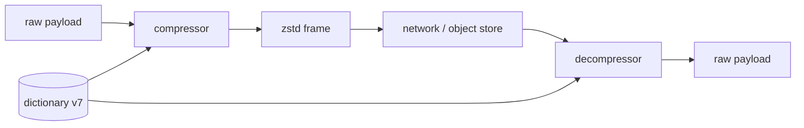
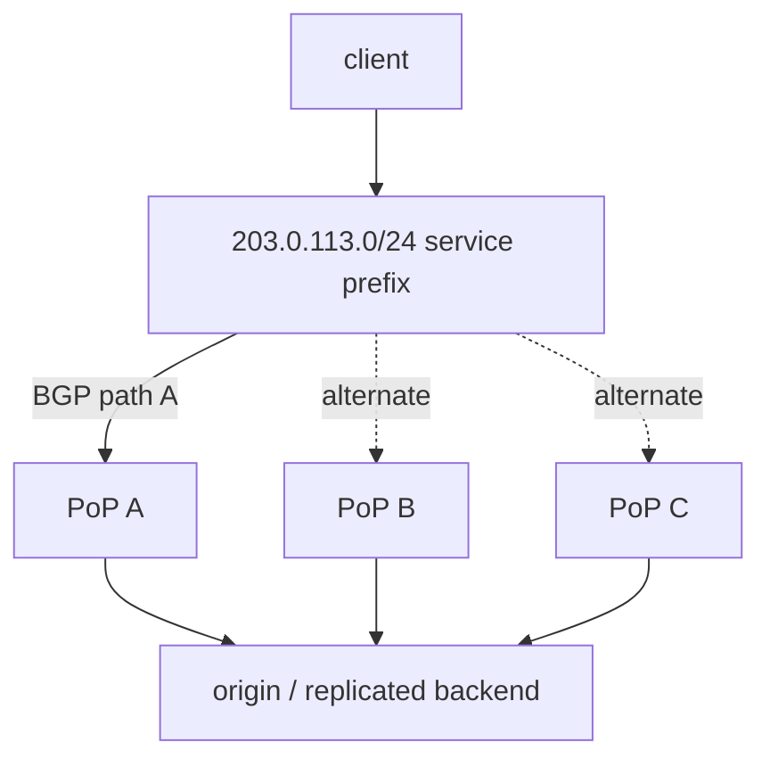

# 2026-09-20 06:00 — Interview Study Packages

README ve yakın `daily/2026-09-20/05-00.md` kontrol edildi. Jump Consistent Hash ve Kubernetes StatefulSet Recreate tekrar edilmedi. Repo aramasında Kafka Share Groups ve OpenTelemetry Weaver'ın daha önce işlendiği görüldü. Bu tur backend/runtime performance ile networking/system design eksenine döndü.

## Paket 1 — Junior → Staff Backend / Performance: Python 3.14 `compression.zstd`, Dictionary Compression & Resource Economics
**Süre:** 20–30 dk

### Konu anlatımı
Python 3.14 ile standart kütüphaneye `compression` paketi ve `compression.zstd` eklendi. Zstandard gerçek zamanlı kullanım için hız/sıkıştırma oranı dengesini hedefleyen lossless bir formattır. Python API'si one-shot `compress/decompress`, incremental compressor/decompressor, `ZstdFile`, dictionary training ve gelişmiş parametreleri sunar.

Mülakat açısından asıl konu API ezberi değil, compression'ın sistem ekonomisidir: daha yüksek compression ratio network/storage byte'ını azaltabilir ama CPU, memory ve latency harcar. Küçük ve benzer payload'larda trained dictionary tekrar eden yapıyı önceden bildiği için ratio ve hızı iyileştirebilir; fakat dictionary ID/version artık wire/storage contract'ının parçasıdır.

### Mental model

**Invariant:** Compression yalnız byte azaltma optimizasyonu değildir; codec/version/dictionary seçimi producer-consumer compatibility contract'ıdır.

### İçeride ne oluyor?
- `compression.zstd` Python 3.14'te eklendi; `ZstdFile`, one-shot ve incremental API'ler sağlar.
- `train_dict(samples, dict_size)` benzer küçük payload'lar için dictionary üretir. Decompress tarafı compression'da kullanılan dictionary ile uyumlu olmalıdır.
- Frame header content size, dictionary ID ve checksum gibi metadata taşıyabilir; checksum corruption detection sağlar ama authentication değildir.
- `window_log` ve long-distance matching ratio-memory trade-off'unu değiştirir. Untrusted input decompress ederken memory limitleri önemlidir.
- `nb_workers` compression'ı paralelleştirebilir; throughput artışı memory tüketimi ve bazen ratio maliyeti getirir.
- Streaming'de `FLUSH_BLOCK` düşük görünür latency sağlayabilir; `FLUSH_FRAME` frame'i bitirir ve sonraki verinin önceki frame'i referanslamasını engeller.

### Yüksek getirili mülakat soruları
1. Compression ne zaman toplam latency'yi düşürür, ne zaman artırır?
2. Streaming compression ile one-shot compression arasındaki fark nedir?
3. Dictionary compression küçük payload'larda neden etkilidir?
4. Senior: dictionary rollout/versioning'i backward-compatible nasıl yaparsın?
5. Staff: CPU budget, egress cost, p99 latency ve storage ratio arasında codec policy'yi nasıl belirlersin?

### Seviyeye göre cevap derinliği
- **Junior:** lossless compression, ratio ve compress/decompress akışını açıklar.
- **Mid:** streaming/frame/dictionary kavramlarını ve CPU↔bytes trade-off'unu açıklar.
- **Senior:** untrusted-input limits, dictionary lifecycle, checksum ve benchmark tasarımını tartışır.
- **Staff:** fleet-wide codec negotiation, observability, migration ve cost/performance policy'si kurar.

### Kısa alıştırma
10 bin benzer JSON event üret. `gzip` ile `compression.zstd` için compressed bytes, compression/decompression throughput ve p95 süreyi ölç. Sonra 1.000 örnekten zstd dictionary eğitip küçük event'lerde sonucu tekrar ölç.

### Proje fikri
`compression-policy-lab`: payload size/type'a göre none/gzip/zstd/zstd+dict seçen küçük gateway. Codec ve dictionary version'ını metadata'da taşı; shadow benchmark ile CPU-ms/MB, ratio, p99 ve egress-byte tasarrufunu raporla.

### Failure modes / trade-off / production bağlantısı
Dictionary'yi versionlamamak, decompress limitlerini sınırsız bırakmak, checksum'u cryptographic integrity sanmak, yalnız ratio ölçüp CPU/p99'u ölçmemek ve zaten sıkıştırılmış JPEG/Parquet gibi veriyi tekrar compress etmek tipik hatalardır. Production'da compressed/uncompressed bytes, ratio, codec CPU time, p95/p99, decompression failures, dictionary miss/version ve memory high-water mark izlenmelidir.

### Kaynaklar
- Python 3.14 `compression.zstd`: https://docs.python.org/3.14/library/compression.zstd.html
- Python `compression` package: https://docs.python.org/3.14/library/compression.html
- PEP 784: https://peps.python.org/pep-0784/
- Zstandard upstream: https://github.com/facebook/zstd

---

## Paket 2 — Mid → CTO Networking / System Design / SRE: BGP Anycast, Route Convergence & Stateless Edge Design
**Süre:** 20–30 dk

### Konu anlatımı
Anycast aynı service IP/prefix'inin birden fazla fiziksel lokasyondan ilan edilmesi ve routing sisteminin istemci trafiğini kendi path-selection kurallarına göre bir lokasyona taşımasıdır. IPv6 mimarisi anycast'i birden fazla interface'e atanmış ve routing ölçüsüne göre “nearest” interface'e teslim edilen adres olarak tanımlar. Global Internet'te pratik dağıtım çoğunlukla BGP ilanlarıyla yapılır.

“Nearest” coğrafi olarak en yakın demek değildir; routing policy ve path seçimine göre en uygun demektir. Bu nedenle anycast bir application load balancer değildir. Route değişince aynı client'ın sonraki bağlantısı başka PoP'a gidebilir; uzun-lived veya stateful session tasarımı bunu hesaba katmalıdır.

### Mental model

**Invariant:** Anycast “tek IP → birden çok site” routing primitive'idir; session replication, application health veya consistency protokolü değildir.

### İçeride ne oluyor?
- Birden çok site aynı service prefix'ini advertise eder; upstream ağlar BGP policy/path selection ile route seçer.
- Site sağlıksız olduğunda prefix withdrawal trafik çekmeyi bırakabilir; fakat convergence anlık değildir ve health signal yanlışsa geniş blast radius doğurabilir.
- RFC 4786 per-packet load balancing'in tek transaction'ın paketlerini farklı anycast node'lara dağıtması halinde servisi bozabileceğini vurgular; flow-stable forwarding önemlidir.
- Stateful edge'de route churn session affinity'yi kırabilir. QUIC connection migration gibi üst-katman özellikleri bazı durumları yumuşatsa da anycast state synchronization sağlamaz.
- Covering prefix ve daha spesifik route tasarımı failure davranışını etkiler. Pessimistic withdrawal ile bozuk siteyi trafik yolundan çıkarmak mümkündür.
- DDoS absorption, DNS, CDN edge ve global ingress yaygın kullanım alanlarıdır; fakat route hijack/leak ayrı bir güvenlik riskidir.

### Yüksek getirili mülakat soruları
1. Anycast ile DNS-based geo routing arasındaki fark nedir?
2. “Nearest PoP” neden coğrafi nearest değildir?
3. Route withdrawal sırasında ne tür transient failure görürsün?
4. Senior: stateful TCP/QUIC servisinde route churn'ü nasıl yönetirsin?
5. Staff: health check → route withdrawal zincirinde false positive blast radius'unu nasıl sınırlarsın?
6. CTO: global anycast edge'i availability, DDoS kapasitesi, transit maliyeti ve operasyon karmaşıklığı açısından nasıl değerlendirirsin?

### Seviyeye göre cevap derinliği
- **Mid:** unicast/anycast farkını ve BGP'nin route seçtiğini açıklar.
- **Senior:** convergence, session state, health withdrawal ve observability'yi tartışır.
- **Staff:** multi-PoP failure domains, route policy, safe automation ve origin fallback tasarlar.
- **Principal/CTO:** provider diversity, DDoS posture, cost, RTO ve global blast-radius governance'ını bağlar.

### Kısa alıştırma
Üç PoP'lu bir servis çiz. PoP B'nin application health'i bozuluyor ama router sağlıklı. Prefix withdrawal kararını hangi sinyallerle ve kaç aşamalı guardrail ile vereceğini yaz; false-positive ve slow-convergence senaryolarını ekle.

### Proje fikri
`anycast-control-plane-sim`: üç PoP, değişen path cost, health state ve withdrawal delay ile discrete-event simülatörü. Client→PoP mapping, convergence time, dropped sessions ve overload transferini ölç.

### Failure modes / trade-off / production bağlantısı
Anycast'i load balancer sanmak, coğrafi yakınlık varsaymak, tek health probe ile route withdraw etmek, state'i yalnız lokal PoP'ta tutmak, withdrawal sonrası kalan PoP kapasitesini hesaplamamak ve route hijack/leak riskini yok saymak tipik hatalardır. Production'da per-PoP traffic, BGP announcements/withdrawals, route changes, RTT distribution, session reset, origin fallback, capacity headroom ve health-signal disagreement izlenmelidir.

### Kaynaklar
- RFC 4786 / BCP 126 — Operation of Anycast Services: https://www.rfc-editor.org/rfc/rfc4786.html
- RFC 4291 — IPv6 Addressing Architecture, Anycast: https://www.rfc-editor.org/rfc/rfc4291.html#section-2.6
- RFC 4271 — BGP-4: https://www.rfc-editor.org/rfc/rfc4271.html
