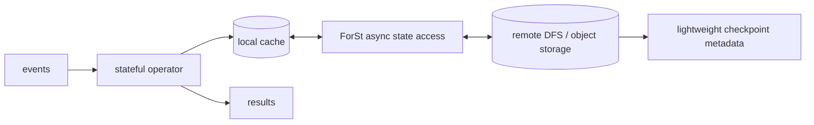
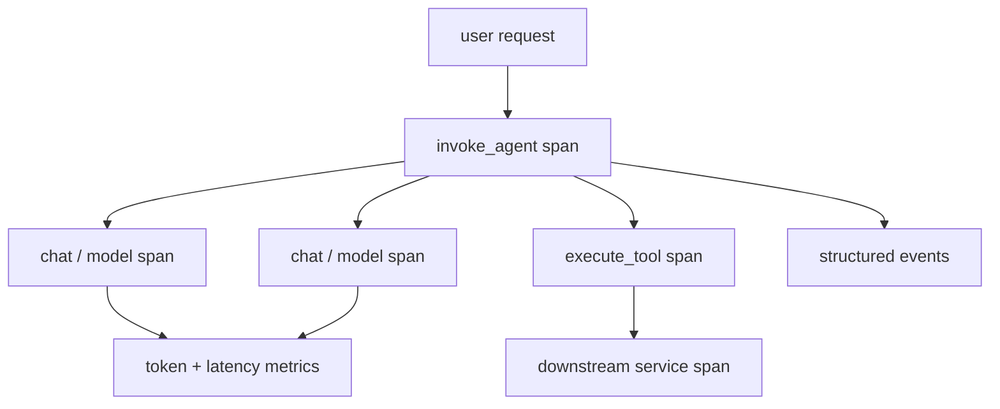

# 2026-09-20 07:00 — Interview Study Packages

README ve yakın `daily/2026-09-20/06-00.md` kontrol edildi. Python Zstandard ve BGP Anycast tekrar edilmedi. Repo aramasında WebTransport/HTTP3'ün daha önce işlendiği görüldü. Bu tur data engineering/stateful streaming ile ML/AI/LLM observability eksenine döndü.

## Paket 1 — Mid → Principal Data Engineering / Distributed Systems: Apache Flink Disaggregated State, ForSt & Async State I/O
**Süre:** 20–30 dk

### Konu anlatımı
Stateful stream processor'ın zor problemi yalnız event'i hesaplamak değildir; terabaytlarca keyed state'i düşük latency ile okumak, checkpoint etmek, failure sonrası geri getirmek ve rescale sırasında taşımaktır. Klasik local-state yaklaşımı compute ile disk/state locality'sini sıkı bağlar. Cloud-native ortamda pod/node değişimi, local disk kapasitesi ve compaction spike'ları bu bağı pahalı hale getirir.

Flink 2.x'in disaggregated state yaklaşımı durable state'i DFS/object-storage benzeri uzak storage'a ayırır; ForSt (“For Streaming”) bunun için tasarlanmış state backend'dir. Uzak I/O latency'sini gizlemek için runtime ve uyumlu operator'lar asynchronous state access ile birden fazla I/O'yu paralel yürütür. Local cache hâlâ önemlidir: disaggregation storage'ı ortadan kaldırmaz, placement ve recovery ekonomisini değiştirir.

### Mental model

**Invariant:** Remote state durability ile hot-path latency aynı şey değildir; disaggregation ancak async I/O, cache ve backpressure birlikte tasarlanırsa faydalıdır.

### İçeride ne oluyor?
- Flink 2.0 disaggregated state management'i local-disk constraints, compaction kaynaklı resource spike, büyük state rescaling ve checkpoint maliyetlerini azaltmak için tanıttı.
- ForSt compute ile state storage'ı ayırır ve remote storage'a paralel multi-I/O yapabilir.
- Async execution, tek remote lookup'ın operator thread'ini tamamen bloke etmesini önler; fakat concurrency limitsiz olursa remote store ve memory queue'ları doygunlaşır.
- Cache hit ratio, working-set dağılımı ve remote latency p99 throughput'u doğrudan etkiler. Küçük/hot state cache'te kalırken cold state remote olabilir.
- Checkpoint/recovery daha hafif olabilir; buna rağmen correctness hâlâ checkpoint barrier, state snapshot ve source/sink delivery semantics ile birlikte değerlendirilmelidir.
- Güncel stable hat 2.3.0'dır (25 Haziran 2026); 2.0 mimari duyurusu bu tasarımın motivasyonunu ve ilk benchmark sonuçlarını açıklar.

### Yüksek getirili mülakat soruları
1. Local RocksDB-benzeri state ile disaggregated state arasındaki temel trade-off nedir?
2. Async state access remote latency'yi nasıl gizler; hangi durumda throughput'u kötüleştirir?
3. Cache hit ratio neden state backend seçiminin merkezindedir?
4. Senior: 100 TB keyed state'li job'u rescale ederken hangi metrikleri ve failure mode'ları izlersin?
5. Staff/Principal: remote state store outage veya throttling sırasında backpressure, admission control ve recovery politikasını nasıl tasarlarsın?

### Seviyeye göre cevap derinliği
- **Mid:** keyed state, checkpoint, local-vs-remote state ve cache kavramlarını açıklar.
- **Senior:** async I/O concurrency, cache, backpressure, recovery ve tail latency'yi bağlar.
- **Staff:** state backend seçimini workload shape, rescale frequency, storage SLA ve cost ile tasarlar.
- **Principal:** multi-tenant state platformunda quotas, blast radius, migration, capacity ve durability governance kurar.

### Kısa alıştırma
1 TB state, %95 cache hit, cache hit 0.2 ms ve remote miss 20 ms p50 varsay. Basit ortalama latency hesabı yap; sonra remote p99=200 ms olduğunda neden yalnız ortalamanın yanıltıcı olduğunu yaz. Async concurrency=32 ve 256 için beklenen queue/backpressure riskini tartış.

### Proje fikri
`state-backend-simulator`: Zipf key dağılımı, ayarlanabilir cache, remote latency/failure ve async concurrency ile local-vs-disaggregated state simülasyonu. Throughput, p50/p99, cache hit, outstanding I/O, recovery ve rescale sürelerini raporla.

### Failure modes / trade-off / production bağlantısı
Remote store'u “sonsuz ve bedava disk” sanmak, concurrency'yi sınırsız artırmak, cache warm-up/recovery storm'u hesaba katmamak, yalnız average latency ölçmek ve checkpoint correctness'i backend latency ile karıştırmak tipik hatalardır. Production'da cache hit/miss, remote read/write latency ve errors, outstanding async requests, backpressure, checkpoint duration/failures, recovery time, state bytes ve storage request cost izlenmelidir.

### Kaynaklar
- Apache Flink 2.0 — Disaggregated State Management / ForSt: https://flink.apache.org/2025/03/24/apache-flink-2.0.0-a-new-era-of-real-time-data-processing/
- Apache Flink Downloads — stable releases: https://flink.apache.org/downloads/

---

## Paket 2 — Mid → CTO ML/AI/LLM / MLOps / Observability: OpenTelemetry GenAI Semantic Conventions, Agent Traces & Privacy Boundaries
**Süre:** 20–30 dk

### Konu anlatımı
Bir agent isteği tek bir LLM çağrısı değildir: agent invocation → model calls → tool executions → retries → downstream services zinciri olabilir. Sadece HTTP latency ve error rate toplamak, “45 saniye neden sürdü?” sorusuna cevap vermez. OpenTelemetry GenAI semantic conventions model, token usage, finish reason ve agent/tool operasyonlarını ortak telemetry vocabulary'siyle ifade etmeyi amaçlar.

En kritik production trade-off'u observability ile veri minimization arasındadır. Model adı, token count ve latency düşük riskli metadata olabilir; prompt, response, tool arguments/results ise PII, secrets, müşteri verisi veya prompt-injection içeriği taşıyabilir. Bu nedenle content capture default bir debugging kolaylığı değil, ayrı bir data-governance kararıdır.

### Mental model

**Invariant:** Trace context nedensellik sağlar; GenAI semantic attributes anlam sağlar. Prompt/response içeriğini kaydetmek ise ayrıca yetkilendirilmesi ve yönetilmesi gereken veri işlemidir.

### İçeride ne oluyor?
- OpenTelemetry semantic conventions ortak attribute/operation isimleri tanımlar; GenAI conventions aktif geliştirme alanıdır.
- Güncel örneklerde `gen_ai.request.model`, input/output token usage ve response finish reasons gibi alanlar model çağrılarını karşılaştırmayı sağlar.
- Agent trace'i parent `invoke_agent`, child model call ve `execute_tool` span'larıyla latency'nin nerede harcandığını gösterebilir.
- Token metrics maliyet proxy'sidir ama fiyat değildir; provider/model fiyatlandırması, cache ve batch semantics ayrıca modellenmelidir.
- Prompt/response/tool content yüksek cardinality ve hassas veri riski yaratır; opt-in capture, redaction, sampling, retention ve access control gerekir.
- Semantic convention sürümü değişebilir; telemetry schema'yı application business contract'ı gibi hard-code etmek migration maliyeti doğurur.

### Yüksek getirili mülakat soruları
1. LLM app için klasik RED metrics neden tek başına yetmez?
2. Trace ile eval arasındaki fark nedir?
3. Token count'u cost metric'e dönüştürürken hangi varsayımlar kırılabilir?
4. Senior: tool-call loop veya retry storm'u trace üzerinde nasıl teşhis edersin?
5. Staff: prompt content capture için sampling/redaction/retention policy nasıl tasarlanır?
6. CTO: observability değerini privacy, compliance, vendor portability ve telemetry cost ile nasıl dengelersin?

### Seviyeye göre cevap derinliği
- **Mid:** span, trace, token metric ve model latency'yi açıklar.
- **Senior:** agent/tool hierarchy, retries, cardinality, redaction ve sampling'i bağlar.
- **Staff:** cross-provider schema, eval correlation, tenancy ve data-governance tasarlar.
- **Principal/CTO:** telemetry retention, privacy risk, cost attribution, vendor portability ve incident governance belirler.

### Kısa alıştırma
Bir agent isteğinin 12 saniye sürdüğünü varsay: model-1 2s, tool A 7s, model-2 2s, kalan orchestration 1s. Span ağacını çiz; tool A iki kez retry edilirse latency ve token/cost dashboard'unda hangi sinyalleri ekleyeceğini yaz. Prompt içeriği olmadan debug edebileceğin alanları ayır.

### Proje fikri
`agent-otel-lab`: iki model çağrısı ve bir HTTP tool içeren küçük agent. OTel trace/metric üret; content capture kapalı/açık iki mod, redaction processor, tenant-safe sampling ve per-model token/latency dashboard ekle.

### Failure modes / trade-off / production bağlantısı
Her prompt'u kaydetmek, secrets/PII redaction'ını sonradan düşünmek, user/session ID gibi yüksek-cardinality alanları metric label yapmak, token count'u doğrudan para sanmak, retry'ları ayrı operation gibi gizlemek ve trace'i model-quality eval yerine kullanmak tipik hatalardır. Production'da model/tool latency p95/p99, retries, finish reasons, token usage, tool errors, trace sampling, dropped telemetry, redaction failures ve telemetry cost izlenmelidir.

### Kaynaklar
- OpenTelemetry Semantic Conventions specification: https://opentelemetry.io/docs/specs/otel/semantic-conventions/
- OpenTelemetry — Inside the LLM Call: GenAI Observability, 14 Mayıs 2026: https://opentelemetry.io/blog/2026/genai-observability/
- OpenTelemetry Semantic Conventions overview: https://opentelemetry.io/docs/concepts/semantic-conventions/
