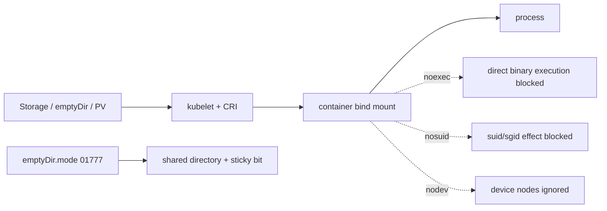
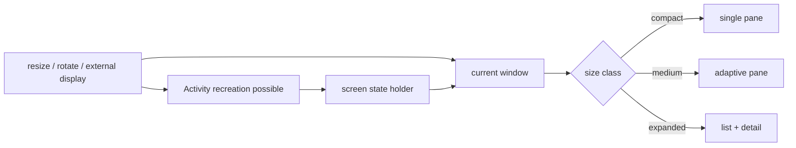

# 2026-09-20 08:00 — Interview Study Packages

README ve yakın `daily/2026-09-20/07-00.md` kontrol edildi. Flink disaggregated state/ForSt ve OpenTelemetry GenAI observability tekrar edilmedi. Repo aramasında PostgreSQL 18 OAuth'ın daha önce işlendiği görüldüğü için elendi. Bu tur Cybersecurity/Cloud ile Frontend/Mobile eksenlerine döndü.

## Paket 1 — Mid → Principal Cybersecurity / Cloud / SRE: Kubernetes v1.37 Bind Mount Hardening & `emptyDir` Permissions
**Süre:** 20–30 dk

### Konu anlatımı
`readOnlyRootFilesystem: true` önemli bir hardening katmanıdır ama Pod içindeki writable volume'ları otomatik olarak güvenli yapmaz. Bir saldırgan writable `/tmp` veya workspace'e payload indirip çalıştırabiliyorsa salt-okunur root filesystem tek başına execution surface'i kapatmaz. Kubernetes v1.37 bu boşluğu iki Alpha özellikle daraltıyor: `VolumeBindMountOptions` ile container bind mount'una `noexec`, `nosuid`, `nodev`; `EmptyDirVolumeMode` ile `emptyDir` oluşturma permission mode'u (`0000`–`01777`).

Bunlar farklı katmanları kontrol eder. PV `mountOptions` storage/filesystem mount katmanındadır; yeni `bindMountOptions` container'a görünen bind mount üzerinde uygulanır. `emptyDir.mode` ise dizinin Unix permission bit'lerini belirler. `01777` sticky bit, ortak `/tmp` benzeri alanda kullanıcıların birbirinin dosyalarını silmesini/rename etmesini sınırlar.

### Mental model

**Invariant:** `noexec` defense-in-depth'tir; code execution'ın tüm biçimlerini veya application-level authorization'ı çözmez.

### İçeride ne oluyor?
- `bindMountOptions` container başına uygulanır; aynı volume farklı container'larda farklı flags ile görülebilir.
- İzinli flags `noexec`, `nodev`, `nosuid`; image volumes desteklenmez ve Linux semantics'idir.
- Runtime CRI `mount_options` desteğini advertise etmelidir. Destek yoksa kubelet Pod'u reject eder; sessiz degrade olmaması güvenlik açısından önemlidir.
- `emptyDir.mode` default `0777`; örneğin `0750` least privilege, `01777` shared `/tmp` sticky-bit semantics sağlar.
- `fsGroup`, `emptyDir.mode` ile etkileşir ve group permissions'ı override edebilir; policy testleri gerçek Pod security context'iyle yapılmalıdır.
- Her iki özellik v1.37'de Alpha ve disabled by default'tur; rollout'ta version skew ve feature-gate matrisi hesaba katılmalıdır.

### Yüksek getirili mülakat soruları
1. `readOnlyRootFilesystem` neden writable volume execution riskini çözmez?
2. `noexec`, `nosuid`, `nodev` hangi tehditleri azaltır?
3. PV `mountOptions` ile `volumeMount.bindMountOptions` farkı nedir?
4. Senior: runtime feature support olmayan node'a Pod düşerse güvenli davranış ne olmalıdır?
5. Staff: cluster-wide admission policy'yi workload istisnaları ve rollout güvenliğiyle nasıl tasarlarsın?
6. Principal: Alpha security feature'ı regulated production fleet'e ne zaman ve hangi kanıtlarla alırsın?

### Seviyeye göre cevap derinliği
- **Mid:** Unix permission, sticky bit ve üç mount flag'i açıklar.
- **Senior:** CRI/runtime capability, fsGroup, version skew ve defense-in-depth sınırlarını bağlar.
- **Staff:** admission policy, node capability discovery, staged rollout ve exception governance tasarlar.
- **Principal:** compliance evidence, fleet risk, feature maturity ve rollback stratejisini yönetir.

### Kısa alıştırma
İki container'ın aynı `emptyDir` `/tmp` alanını paylaştığı Pod tasarla. `01777`, `noexec,nosuid` uygula; container A'nın oluşturduğu dosyanın B tarafından silinemediğini ve volume'daki executable'ın doğrudan çalışmadığını test planıyla göster. `fsGroup` eklenince beklenen değişikliği yaz.

### Proje fikri
`volume-hardening-auditor`: cluster PodSpec'lerini tarayıp writable mounts, missing `noexec/nosuid/nodev`, permissive `emptyDir` ve runtime capability uyumsuzluklarını raporlayan policy/audit aracı. Enforce modundan önce shadow/audit modu ve exception TTL ekle.

### Failure modes / trade-off / production bağlantısı
`noexec`'i sandbox sanmak, runtime capability kontrol etmeden enforce etmek, `fsGroup` etkisini kaçırmak, Alpha gate'i fleet'in yalnız yarısında açmak ve build/ML workload'larının gerçekten executable workspace gereksinimini yok saymak tipik hatalardır. Production'da rejected Pods, unsupported-node sayısı, policy exceptions, security-context drift ve workload breakage izlenmelidir.

### Kaynaklar
- Kubernetes, 16 Eylül 2026 — Hardening Container Storage: https://kubernetes.io/blog/2026/09/16/kubernetes-v1-37-hardening-container-storage/
- Bind mount options task: https://kubernetes.io/docs/tasks/configure-pod-container/configure-bind-mount-options/
- emptyDir permissions task: https://kubernetes.io/docs/tasks/configure-pod-container/configure-emptydir-volume-mode/
- Volumes reference: https://kubernetes.io/docs/concepts/storage/volumes/

---

## Paket 2 — Junior → Staff Frontend / Mobile: Android 16 Desktop Windowing, Resizability & State Preservation
**Süre:** 20–30 dk

### Konu anlatımı
Mobil UI'yi “telefon portrait ekranı” olarak modellemek artık yetersizdir. Android 16 büyük ekranlarda orientation/aspect-ratio/resizability kısıtlarını gevşeterek uygulamaları değişken pencere boyutuna zorlar; Android 16 QPR3 ile desteklenen telefonların external display üzerinde desktop windowing deneyimi GA oldu (3 Mart 2026). Aynı Activity yaşamı boyunca window compact → medium → expanded olabilir; resize/configuration change Activity recreation'a da yol açabilir.

Doğru mental model device type değil **current window size + state ownership**'dir. Layout window size class'a göre adapte olur; kullanıcı verisi UI ağacında rastgele tutulmaz. Ephemeral UI state, screen state ve durable domain state ayrılır.

### Mental model

**Invariant:** Device modeli sabit değildir; pencere boyutu runtime input'tur. State layout ağacının ömrüne bağlanmamalıdır.

### İçeride ne oluyor?
- Android 16 / API 36 hedefleyen uygulamalarda large-screen ortamlarında resizability baseline davranıştır; kullanıcı pencereyi sık sık değiştirebilir.
- Desktop windowing free-form/maximized windows ve multi-app kullanım getirir; external display farklı density/aspect ratio/input özelliklerine sahip olabilir.
- Window size classes device-name branching yerine mevcut window dimensions üzerinden layout kararı verir.
- Configuration change varsayılan olarak Activity recreation yaratabilir; state holder/ViewModel ve gerektiğinde saved state/durable persistence ayrımı gerekir.
- Camera/viewfinder, dialogs, drag/drop, keyboard/mouse ve focus assumptions desktop formunda yeniden test edilmelidir.
- 3 Mart 2026 itibarıyla connected display support Android 16 QPR3 üzerinde desteklenen Pixel/Samsung cihazlarda GA olarak duyuruldu.

### Yüksek getirili mülakat soruları
1. Responsive UI ile adaptive UI farkını nasıl açıklarsın?
2. Neden `isTablet` gibi device checks yerine window size tercih edilir?
3. Activity recreation sırasında hangi state nerede yaşamalı?
4. Senior: resize sırasında network request ve selection state'i nasıl korursun?
5. Staff: telefon/tablet/foldable/external-display test matrisini nasıl küçültüp risk coverage'ını korursun?

### Seviyeye göre cevap derinliği
- **Junior:** configuration change, responsive layout ve state preservation'ı açıklar.
- **Mid:** window size classes, Activity recreation ve state holder ayrımını uygular.
- **Senior:** multi-window, input, camera/media ve performance edge-case'lerini tasarlar.
- **Staff:** adaptive design system, automated test matrix ve cross-team migration standardı kurar.

### Kısa alıştırma
Master-detail ekranını compact'ta tek pane, expanded'da iki pane yap. Bir item seç, pencereyi resize et ve Activity'yi recreate et; selection ve form input'un korunmasını test et. UI-only state ile durable state'i ayrı listele.

### Proje fikri
`adaptive-workbench`: Compose tabanlı mail/task uygulaması. Compact/medium/expanded layouts, list-detail navigation, keyboard shortcuts, drag/drop ve process-death state restoration ekle; screenshot/instrumentation testleriyle window-size matrisi kur.

### Failure modes / trade-off / production bağlantısı
Sabit width/height varsaymak, orientation lock'a güvenmek, tüm state'i composable/local widget state'e koymak, resize sırasında pahalı işi her recomposition'da tekrar yapmak ve mouse/keyboard/focus erişilebilirliğini yok saymak tipik hatalardır. Production'da crash/ANR'ı window mode'a göre segmentle; state-loss, layout overflow ve slow frame metriklerini izle.

### Kaynaklar
- Android Developers, 3 Mart 2026 — Connected displays GA: https://developer.android.com/blog/posts/android-devices-extend-seamlessly-to-connected-displays
- Desktop windowing guide: https://developer.android.com/develop/adaptive-apps/guides/support-desktop-windowing
- Orientation/aspect ratio/resizability: https://developer.android.com/develop/adaptive-apps/guides/app-orientation-aspect-ratio-resizability
