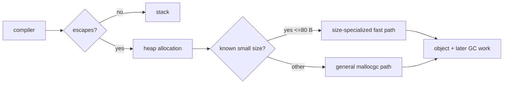
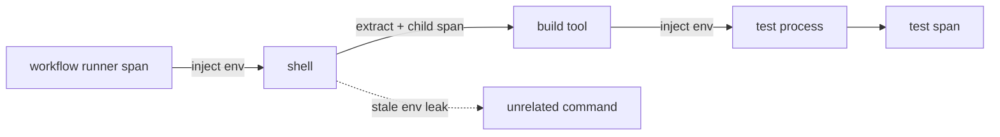

# 2026-09-20 09:00 — Interview Study Packages

README ve yakın `daily/2026-09-20/08-00.md` kontrol edildi. Kubernetes volume hardening ve Android desktop windowing tekrar edilmedi. Bu tur Backend/Performance ile Distributed Systems/SRE/Observability eksenlerine döndü.

## Paket 1 — Junior → Staff Backend / Performance: Go 1.27 Size-Specialized Memory Allocation
**Süre:** 20–30 dk

### Konu anlatımı
Bir allocation'ın maliyeti yalnız “heap'te birkaç byte ayırmak” değildir: compiler escape analysis ile stack/heap kararına katkı verir; heap allocation runtime allocator metadata'sı, size class seçimi, pointer scanning bilgisi ve daha sonra GC yükü yaratır. Go 1.27, 80 byte ve altındaki allocation'lar için size-specialized allocation functions ekleyerek compiler'ın zaten bildiği size ve pointer bilgisini daha doğrudan runtime'a taşır. Go ekibinin 16 Eylül 2026 tarihli ölçümüne göre bu allocation'lar %20–30'a kadar hızlanabilir; allocation-heavy programlarda toplam kazanç yaklaşık %1'e kadar çıkabilir.

Bu optimizasyonun mülakat değeri tek sürüm özelliği değildir: **micro-optimization ile end-to-end impact arasındaki farkı** öğretir. Hot path'te allocator maliyeti %4 ise allocator'ı %25 hızlandırmak bütün programı yaklaşık %1 hızlandırabilir. Amdahl sezgisi burada önemlidir.

### Mental model

**Invariant:** Daha hızlı heap allocation, gereksiz allocation'ı ücretsiz yapmaz; bytes/op ve object lifetime hâlâ GC ekonomisini belirler.

### İçeride ne oluyor?
- Go compiler heap'e kaçan object için runtime allocation call üretir; genel yol size ve pointer bilgisini runtime'a taşır.
- Go 1.27 belirli küçük size/pointer kombinasyonları için specialized functions kullanır; daha az genel-case işi ve compiler optimization fırsatı sağlar.
- Pointer-containing object ile pointer-free object GC scanning açısından aynı değildir.
- Stack allocation çoğu durumda heap allocation'dan daha ucuzdur ve GC pressure yaratmaz; escape analysis hâlâ birinci kaldıraçtır.
- Benchmark'ta ns/op tek başına yetmez: B/op, allocs/op, GC CPU, heap live size ve production p95/p99 birlikte okunmalıdır.
- Optimization workload-dependent'tır; allocator toplam CPU'nun küçük kısmıysa global speedup küçüktür.

### Yüksek getirili mülakat soruları
1. Stack allocation ile heap allocation arasındaki temel fark nedir?
2. Escape analysis neyi belirlemeye çalışır?
3. 80-byte allocation %25 hızlandıysa program neden %25 hızlanmaz?
4. Senior: `allocs/op` aynı kalıp `ns/op` düşerse ne öğrenirsin?
5. Staff: compiler/runtime optimization'ına güvenmek ile object pooling arasında nasıl karar verirsin?

### Seviyeye göre cevap derinliği
- **Junior:** stack/heap ve GC'nin temel rolünü açıklar.
- **Mid:** escape analysis, size class, pointer scanning ve benchmark metriklerini bağlar.
- **Senior:** allocation profile, GC CPU, cache locality ve pooling failure mode'larını tartışır.
- **Staff:** optimization budget, representative benchmark, rollout ve regression governance tasarlar.

### Kısa alıştırma
Üç Go benchmark yaz: küçük pointer-free struct, küçük pointer-containing struct ve 128-byte object. `-benchmem` ile ns/op, B/op ve allocs/op karşılaştır. Sonra bir object'in stack'te kalacağı ve interface/closure üzerinden heap'e kaçacağı iki varyant üret; escape-analysis çıktısını incele.

### Proje fikri
`alloc-lab`: HTTP JSON servisi için baseline, preallocation ve pooling varyantlarını benchmark eden repo. CPU profile, heap profile, allocs/op, GC pause/CPU ve p99 latency raporla; “en hızlı microbenchmark” yerine production-benzeri workload kazananını seç.

### Failure modes / trade-off / production bağlantısı
Pool kullanarak GC'yi azaltırken retention ve complexity artırmak, microbenchmark sonucunu tüm servise genellemek, escape-analysis değişikliklerini ölçmeden tahmin etmek ve yalnız pause time'a bakıp GC CPU'yu kaçırmak tipik hatalardır. Production'da allocation rate, heap live, GC CPU, RSS, request p99 ve throughput birlikte izlenmelidir.

### Kaynaklar
- Go Blog, 16 Eylül 2026 — Size-Specialized Memory Allocation: https://go.dev/blog/size-specialized-allocations
- Go 1.27 release, 19 Ağustos 2026: https://go.dev/blog/go1.27
- Go diagnostics / profiling: https://go.dev/doc/diagnostics

---

## Paket 2 — Mid → Principal Distributed Systems / SRE / Observability: OpenTelemetry Environment-Variable Context Propagation
**Süre:** 20–30 dk

### Konu anlatımı
Trace context genellikle HTTP headers veya message metadata ile taşınır; fakat CI runner → shell → build tool → test process gibi process ağaçlarında böyle bir protocol carrier yoktur. Aynı sorun batch/data jobs ve subprocess-heavy tooling'de görülür. OpenTelemetry Specification, Eylül 2026 itibarıyla environment variables'ı context carrier olarak kullanmak için release-candidate bir mekanizma tanımlıyor. Amaç child process'lerin aynı distributed trace'e katılabilmesidir.

Bu özellik basit bir `TRACEPARENT` env var hack'i değildir. Standardın temel tasarım kararı **carrier lifecycle**'dır: process mevcut context'i env'e inject eder; child bunu extract eder; fakat stale context'in daha sonra ilgisiz process'lere sızmaması gerekir. Baggage ayrıca trust boundary'dir; env process tarafından okunabildiği için secret taşımak özellikle tehlikelidir.

### Mental model

**Invariant:** Context propagation identity/causality taşır; authentication veya authorization sağlamaz.

### İçeride ne oluyor?
- Propagator trace context ve isteğe bağlı baggage'ı carrier'a inject/extract eder.
- Network carrier header olabilir; subprocess boundary'de environment uygun bir carrier olabilir.
- Child process parent context'i extract edip yeni span'ı child olarak başlatır; böylece workflow tek trace graph'ında kalır.
- Environment inheritance implicit ve uzun ömürlü olabilir; stale propagation yanlış trace parentage yaratabilir.
- Baggage transitive data taşır ve cardinality/privacy riski yaratır; secrets için kanal değildir.
- Release-candidate özellik production rollout'unda SDK support matrix, interoperability tests ve schema/version governance gerektirir.

### Yüksek getirili mülakat soruları
1. Trace context ile baggage arasındaki fark nedir?
2. HTTP header yoksa subprocess trace continuity nasıl korunabilir?
3. Environment inheritance hangi stale-context failure mode'unu yaratır?
4. Senior: shell script üçüncü taraf binary başlatıyorsa trust boundary'yi nasıl ele alırsın?
5. Staff/Principal: polyglot CI platformunda propagator rollout ve compatibility contract'ını nasıl yönetirsin?

### Seviyeye göre cevap derinliği
- **Mid:** parent/child span, inject/extract ve carrier kavramlarını açıklar.
- **Senior:** stale context, baggage privacy, process inheritance ve sampling etkilerini tartışır.
- **Staff:** polyglot interoperability, rollout, sanitization ve telemetry cardinality policy tasarlar.
- **Principal:** organization-wide provenance/observability standardını security boundary, cost ve incident response ile bağlar.

### Kısa alıştırma
Parent process → shell → child program zinciri kur. Parent trace context'i env'e inject etsin; child extract edip span açsın. Ardından aynı shell'den ilgisiz komut başlat ve stale context riskini göster. Hangi noktada env'i temizleyeceğini yaz.

### Proje fikri
`process-trace-lab`: CI benzeri orchestrator; Go/Python/shell child process'leri aynı trace'e bağla. Propagation açık/kapalı karşılaştırması, stale-context testleri, baggage allowlist ve redaction ekle.

### Failure modes / trade-off / production bağlantısı
Trace context'i auth token sanmak, baggage'a secret koymak, inherited env'i temizlememek, sampling kararlarının trace continuity üzerindeki etkisini yok saymak ve her process invocation'ı yüksek-cardinality attribute'larla etiketlemek tipik hatalardır. Production'da orphan span oranı, broken parent links, trace completeness, dropped telemetry, baggage size/redaction ve per-workflow span count izlenmelidir.

### Kaynaklar
- OpenTelemetry, 11 Eylül 2026 — Environment variable context propagation: https://opentelemetry.io/blog/2026/environment-variable-context-propagation/
- OpenTelemetry Context Propagation spec: https://opentelemetry.io/docs/specs/otel/context/api-propagators/
- W3C Trace Context: https://www.w3.org/TR/trace-context/
- W3C Baggage: https://www.w3.org/TR/baggage/
