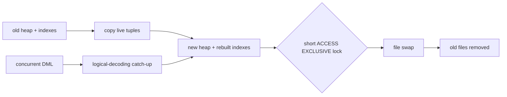
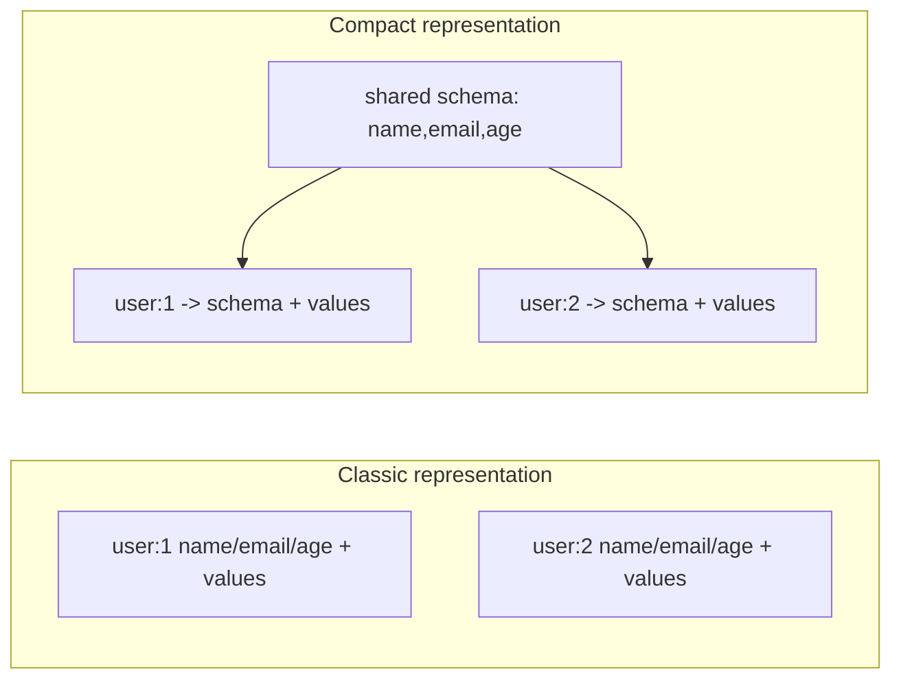

# 2026-09-20 10:00 — Interview Study Packages

README ve yakın `daily/2026-09-20/09-00.md` kontrol edildi. Go 1.27 size-specialized allocation ve OpenTelemetry environment-variable propagation tekrar edilmedi. Repo aramasında Kubernetes Memory QoS ve etcd RangeStream'in daha önce işlendiği görüldüğü için bu tur Databases ile Backend/Data Structures eksenine döndü.

## Paket 1 — Senior → Principal Databases / SRE: PostgreSQL 19 REPACK CONCURRENTLY, Table Rewrite & Lock Economics
**Süre:** 20–30 dk

### Konu anlatımı
PostgreSQL'de MVCC, UPDATE/DELETE sonrası eski tuple sürümlerini hemen fiziksel olarak silmez. Normal `VACUUM` dead tuple alanını tekrar kullanılabilir yapar fakat çoğu durumda dosyayı küçültüp alanı işletim sistemine geri vermez. PostgreSQL 19 beta hattındaki `REPACK`, `VACUUM FULL` ile `CLUSTER` benzeri full-table rewrite işlerini tek komutta birleştiriyor. `REPACK (CONCURRENTLY)` ise uzun rewrite boyunca normal DML'yi açık tutup final relation-file swap için kısa bir `ACCESS EXCLUSIVE` lock hedefliyor.

20 Eylül 2026 itibarıyla önemli production nüansı: PostgreSQL 19 hâlâ beta hattında; resmi beta sayfası Beta 3'ü current beta olarak listeliyor ve beta sürümlerini production için önermiyor. Dolayısıyla bu paket bir **mekanizma ve rollout tasarımı** çalışmasıdır, “hemen production'a geç” önerisi değildir.

### Mental model

**Invariant:** “Concurrent” lock-free demek değildir; uzun rewrite'ı online tutup en riskli exclusivity penceresini sona ve mümkün olduğunca kısa bir swap'a sıkıştırır.

### İçeride ne oluyor?
- Normal `REPACK` table ve index dosyalarını yeniden yazar; dead tuples kopyalanmaz ve fiziksel ordering isteğe bağlı index'e göre kurulabilir.
- Non-concurrent yol işlem boyunca `ACCESS EXCLUSIVE` lock gerektirebilir.
- `CONCURRENTLY`, copy sırasında gerçekleşen DML'yi logical decoding ile yakalar ve swap öncesi yeni dosyaya uygular.
- Final swap yine `ACCESS EXCLUSIVE` lock ister. Yoğun write backlog'u varsa catch-up ve lock-held süre uzayabilir.
- Geçici disk ihtiyacı table + indexes kadar, sort seçilirse yaklaşık ek table-size kadar daha olabilir; concurrent DML ayrıca temporary space yaratır.
- Concurrent mode primary key / index-based replica identity, replication slot kapasitesi ve başka kısıtlar gerektirir; DDL yarışları operasyonu başarısız kılabilir.
- `pg_stat_progress_repack` scan, sort, writing, catch-up, swap ve index rebuild phase'lerini gözlemlenebilir yapar.

### Yüksek getirili mülakat soruları
1. `VACUUM` ile full table rewrite arasındaki fark nedir?
2. `ACCESS EXCLUSIVE` lock neden tehlikelidir?
3. `REPACK CONCURRENTLY` devam eden DML'yi nasıl kaybetmez?
4. Senior: 2 TB hot table için disk headroom'u nasıl hesaplarsın?
5. Staff: catch-up backlog büyürken abort/continue kararını hangi SLO ve metriklerle verirsin?
6. Principal: schema change, replication lag, backup ve maintenance window ile bu operasyonu nasıl koordine edersin?

### Seviyeye göre cevap derinliği
- **Senior:** MVCC dead tuples, rewrite, lock mode ve disk amplification'ı açıklar.
- **Staff:** logical-decoding catch-up, write rate, replication slots, DDL conflict ve rollback planını bağlar.
- **Principal:** fleet-wide eligibility, canary, capacity budget, maintenance policy ve production-readiness gate tasarlar.

### Kısa alıştırma
500 GB heap + 180 GB indexes olan tablo için non-sort minimum temporary disk'i hesapla. Sequential scan + sort yolunda peak'i yaklaşık hesapla. Sonra 20 MB/s concurrent DML'nin 40 dakikalık copy boyunca ne kadar change volume üretebileceğini bul ve final catch-up riskini tartış.

### Proje fikri
`repack-readiness`: PostgreSQL catalog/statistics verilerinden table size, index size, write rate, replica identity, free disk ve replication-slot headroom okuyup `REPACK CONCURRENTLY` için preflight raporu üreten CLI. Beta özelliği gerçek production'a uygulamak yerine disposable PostgreSQL 19 beta ortamında test et.

### Failure modes / trade-off / production bağlantısı
“Concurrent = zero lock” varsayımı, yetersiz disk, write-heavy tabloda sonsuz catch-up, DDL conflict, replication slot/WAL retention büyümesi, ANALYZE sonrası planner etkisini ölçmemek ve beta özelliği production-ready sanmak tipik hatalardır. Production tasarımında free disk, WAL rate, replication lag, lock wait, transaction age, write rate ve `pg_stat_progress_repack` phase/duration izlenmelidir.

### Kaynaklar
- PostgreSQL 19 `REPACK` docs: https://www.postgresql.org/docs/19/sql-repack.html
- PostgreSQL 19 release notes: https://www.postgresql.org/docs/19/release-19.html
- PostgreSQL beta policy/status: https://www.postgresql.org/developer/beta/
- PostgreSQL progress reporting: https://www.postgresql.org/docs/19/progress-reporting.html

---

## Paket 2 — Junior → Staff Backend / Data Structures: Redis 8.10 Compact Hashes, Shared Schemas & Memory Layout
**Süre:** 20–30 dk

### Konu anlatımı
Bir milyon user objesini `name`, `email`, `age` gibi aynı field adlarıyla ayrı Redis Hash'lerinde tuttuğunu düşün. Mantıksal veri yalnız values değildir: her object aynı field-name metadatasını tekrar taşır. Redis 8.10 compact hashes, çok sayıda hash aynı field set'ini paylaşıyorsa field isimlerini ortak bir schema olarak saklayıp key başına esas olarak values + küçük bir schema reference tutmayı amaçlar. Mevcut hash command semantiği değişmez; fark internal encoding'dedir.

Bu konu mülakatta daha genel bir prensibi ölçer: **logical model aynı kalırken physical representation workload shape'e göre değişebilir.** Row-store dictionary encoding, columnar dictionary encoding, string interning ve hidden classes benzer “tekrarlanan metadata'yı paylaş” sezgisini kullanır.

### Mental model

**Invariant:** Compression kazancı schema sharing'den gelir; field set sürekli değişiyorsa representation churn ve conversion maliyeti avantajı azaltabilir.

### İçeride ne oluyor?
- Redis 8.10 compact hash, aynı field isimlerini paylaşan hash'lerde field-name tekrarını azaltan yeni internal encoding'dir.
- `HGET`, `HGETALL`, mevcut field üzerinde `HSET` gibi normal hash semantiği korunur.
- `HIMPORT PREPARE` shared field names'i tanımlar; `HIMPORT SET` her key için values göndererek bulk import ve daha az network/per-command overhead sağlar.
- Normal commands kullanan uygulamalar için automatic conversion seçenekleri vardır; write-path conversion lazy olabilir.
- En iyi adaylar çok sayıda key'in aynı ve çoğunlukla stabil schema'yı paylaşmasıdır. High schema entropy veya sık field ekleme/silme kazancı düşürür.
- Redis 8.10 resmi release dokümanı compact hash dışında Streams reply caps (`MAXCOUNT`, `MAXSIZE`) gibi response-bounding özellikleri de getiriyor; ortak production teması memory'nin yalnız stored bytes değil transient reply bytes ile de tüketilmesidir.

### Yüksek getirili mülakat soruları
1. Logical data model ile physical encoding farkı nedir?
2. Shared schema neden memory azaltabilir?
3. Compact representation hangi workload'da kötü adaydır?
4. Mid: bulk import neden yalnız server CPU değil network overhead'i de azaltabilir?
5. Senior: automatic conversion rollout'unda latency spike ve memory regression'ı nasıl ölçersin?
6. Staff: memory saving, schema flexibility, operational complexity ve rollback arasında nasıl karar verirsin?

### Seviyeye göre cevap derinliği
- **Junior:** Hash, key/field/value ve metadata tekrarını açıklar.
- **Mid:** shared-schema encoding, bulk insertion ve memory/CPU/network trade-off'unu bağlar.
- **Senior:** schema entropy, conversion path, allocator/RSS ve tail-latency benchmark tasarlar.
- **Staff:** fleet-wide eligibility, canary, compatibility, observability ve capacity economics policy'si kurar.

### Kısa alıştırma
1 milyon hash, hash başına 8 field, ortalama field adı 12 byte varsay. Yalnız field-name payload tekrarını kaba olarak hesapla. Sonra 100 farklı schema ailesine dağıldığında neden sharing'in hâlâ güçlü olabileceğini, her key benzersiz schema olduğunda neden zayıfladığını açıkla. Gerçek memory'nin allocator/metadata nedeniyle bu kaba hesaptan farklı olacağını belirt.

### Proje fikri
`redis-layout-lab`: 100 bin object'i üç dağılımla üret: tek schema, 100 schema, random/high-entropy schema. Classic import ile compact/HIMPORT yolunu karşılaştır; used memory, RSS, import throughput, command p95/p99 ve mutation latency raporla.

### Failure modes / trade-off / production bağlantısı
Marketing yüzdesini kendi workload'una taşımak, schema entropy'yi ölçmemek, memory saving uğruna write p99'u bozmak, stored memory ile RSS'i karıştırmak, migration/rollback planı olmadan automatic conversion açmak ve benchmark'ta realistic value sizes kullanmamak tipik hatalardır. Production'da encoding distribution, used_memory/RSS, fragmentation, ops/sec, p99, conversion rate ve schema-family cardinality izlenmelidir.

### Kaynaklar
- Redis 8.10 official docs: https://redis.io/docs/latest/develop/whats-new/8-10/
- Redis Hashes / Compact hashes: https://redis.io/docs/latest/develop/data-types/hashes/
- Redis 8.10 announcement, 14 Eylül 2026: https://redis.io/blog/announcing-redis-810-compact-hash-jsonpath-extensions-performance-improvements-and-more/
