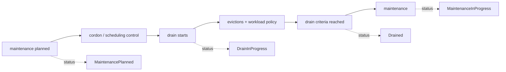
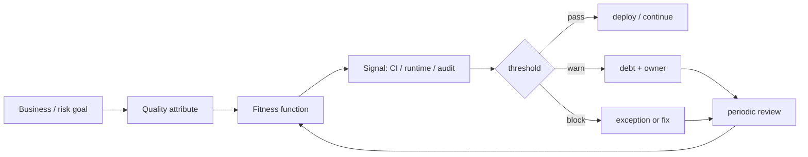

# 2026-09-20 11:00 — Interview Study Packages

README ve yakın `daily/2026-09-20/10-00.md` kontrol edildi. PostgreSQL 19 REPACK CONCURRENTLY ve Redis 8.10 Compact Hashes tekrar edilmedi. Repo aramasında HPA scale-to-zero, Bloom/Cuckoo filters ve long-running agent harnesses'in daha önce işlendiği görüldü. Bu tur Cloud/SRE ile Leadership/Architecture eksenine döndü.

## Paket 1 — Mid → Principal Cloud / SRE: Kubernetes v1.37 Node Lifecycle Conditions, Drain & Maintenance Coordination
**Süre:** 20–30 dk

### Konu anlatımı
Kubernetes'te bir Node'un `Ready=True` olması onun bakım için uygun, drain'in bitmiş veya shutdown'ın planlı olduğu anlamına gelmez. Geçmişte lifecycle state; taint, annotation, provider API, drain controller ve operasyon runbook'larına dağılmış durumdaydı. Kubernetes v1.37, `DrainInProgress`, `Drained`, `MaintenancePlanned`, `MaintenanceInProgress` ve `GracefulNodeShutdownInProgress` olmak üzere beş iyi bilinen Node condition tanımlayarak bu durumu ortak bir status vocabulary'sine taşır.

Kritik ayrım: bu condition'lar **eylem değil durum sinyalidir**. `MaintenancePlanned=True` tek başına scheduling'i durdurmaz; cordon, drain, taint ve workload-specific disruption mekanizmaları yine ayrı çalışır. Bu ayrım control-plane tasarımında command ile observation/status ayrımının güzel bir örneğidir.

### Mental model

**Invariant:** condition gözlemlenebilir state'tir; actuator değildir. Status'u command sanmak unsafe automation üretir.

### İçeride ne oluyor?
- Node condition'lar `Node.status.conditions` üzerinden lifecycle otomasyonlarının ortak dilini oluşturur.
- `DrainInProgress` ve `Drained`, administrator'ın seçtiği drain kriterine göre raporlanır; “Drained” evrensel olarak node üzerinde sıfır Pod demek değildir.
- `MaintenancePlanned` gelecekte beklenen değişimi, `MaintenanceInProgress` aktif bakım penceresini ifade eder.
- `GracefulNodeShutdownInProgress`, shutdown sürecini diğer lifecycle state'lerinden ayırır.
- Scheduling/eviction davranışı için mevcut mekanizmalar (`cordon`, `drain`, taints, PDB ve workload-specific controls) kullanılmaya devam eder.
- Aynı node üzerinde autoscaler, remediation, maintenance ve human operator yarışabilir; condition ortak visibility sağlar fakat ownership/locking problemini tek başına çözmez.

### Yüksek getirili mülakat soruları
1. Node `Ready` ile lifecycle condition neden farklı problemleri çözer?
2. Condition ile command/actuator ayrımı neden önemlidir?
3. `Drained=True` neden “node tamamen boş” şeklinde yorumlanmamalıdır?
4. Senior: PDB yüzünden drain takılırsa maintenance controller ne yapmalı?
5. Staff: autoscaler ile planned-maintenance controller aynı node'u yönetirse race'i nasıl engellersin?
6. Principal: 10 bin node'luk fleet'te maintenance state machine, ownership, timeout ve audit modelini nasıl tasarlarsın?

### Seviyeye göre cevap derinliği
- **Mid:** readiness, cordon, drain, taint ve condition farklarını açıklar.
- **Senior:** PDB, eviction, timeout, stuck drain ve graceful shutdown failure mode'larını bağlar.
- **Staff:** birden çok controller arasında ownership, idempotency, reconciliation ve blast radius tasarlar.
- **Principal:** fleet-level rollout waves, auditability, SLO, emergency override ve provider integration standardı kurar.

### Kısa alıştırma
Bir node maintenance state machine çiz: `Normal → Planned → Cordoned → Draining → Drained → Maintenance → Returning → Normal`. Her transition için precondition, timeout, retry ve rollback/abort davranışını yaz. `Draining` aşamasında PDB'nin 20 dakika blokladığı senaryoyu ekle.

### Proje fikri
`node-maintenance-controller`: test cluster'ında maintenance intent CRD'sini okuyup cordon/drain yapan, lifecycle condition'larını raporlayan ve Prometheus metrics çıkaran küçük controller. Dry-run, idempotent reconcile, per-zone concurrency limit ve stuck-drain alarmı ekle.

### Failure modes / trade-off / production bağlantısı
Condition'ı actuator sanmak, stale condition, iki controller'ın aynı node üzerinde yarışması, PDB nedeniyle sonsuz drain, tüm availability zone'u aynı anda drain etmek ve maintenance sonrası uncordon'u unutmak tipik hatalardır. Production'da state duration, drain latency, eviction failures, unavailable replicas, zone-level concurrent maintenance, stuck conditions ve manual override sayısı izlenmelidir.

### Kaynaklar
- Kubernetes v1.37 Node Lifecycle Conditions, 9 Eylül 2026: https://kubernetes.io/blog/2026/09/09/kubernetes-v1-37-node-lifecycle-conditions/
- kubectl drain reference: https://kubernetes.io/docs/reference/kubectl/generated/kubectl_drain/
- Pod Disruption Budgets: https://kubernetes.io/docs/tasks/run-application/configure-pdb/

---

## Paket 2 — Senior → CTO Leadership / Architecture: Architectural Fitness Functions & Automated Governance
**Süre:** 20–30 dk

### Konu anlatımı
Architecture review board toplantıları yalnız insan hafızasına ve dokümana dayanıyorsa mimari ilkeler deploy hızından daha yavaş güncellenir. Architectural fitness function, önemli bir kalite niteliğini veya mimari constraint'i ölçülebilir ve mümkünse otomatik bir guardrail'e dönüştürür. Amaç “her şeyi gate et” değildir; reliability, security, coupling, cost veya operability gibi gerçekten önemli özelliklerin sistem evrilirken sessizce bozulmasını erken görünür kılmaktır.

Bu yaklaşım evolutionary architecture'ın “guided, incremental change across multiple dimensions” fikrini operasyonelleştirir. İyi fitness function, business outcome veya risk ile bağlantılıdır; threshold'un sahibi, ölçüm penceresi, exception süreci ve sunset/review tarihi vardır.

### Mental model

**Invariant:** metric tek başına governance değildir; metric + threshold + owner + consequence + review loop governance oluşturur.

### İçeride ne oluyor?
- Atomic fitness function tek bir architectural characteristic'i ölçebilir: dependency direction, API compatibility, secret leakage veya latency budget gibi.
- Holistic fitness function birden çok component'in birlikte davranışını ölçer: end-to-end resilience, recovery veya cross-region failover gibi.
- Static checks hızlı ve deterministik olabilir; runtime/SLO checks gerçek davranışı yakalar fakat noisy ve daha pahalıdır.
- Binary pass/fail her risk için doğru değildir. Warning, error budget, progressive enforcement ve exception expiry daha iyi olabilir.
- Guardrail sayısı büyüdükçe developer friction ve cargo-cult compliance riski artar; her function'ın sahibi ve business rationale'ı olmalıdır.
- Architecture fitness functions merkezi standart ile team autonomy arasında executable contract görevi görebilir.

### Yüksek getirili mülakat soruları
1. Unit/integration test ile architectural fitness function farkı nedir?
2. Hangi architectural characteristics otomatik ölçülebilir, hangileri judgment ister?
3. Senior: p99 latency fitness function'ını flaky CI gate'e dönüşmeden nasıl tasarlarsın?
4. Staff: 100 microservice için coupling ve API compatibility guardrail'lerini nasıl ölçeklersin?
5. Principal: merkezi platform standardı ile takım özerkliğini nasıl dengelersin?
6. CTO: hangi guardrail'lerin deploy'u bloklaması gerektiğine business risk üzerinden nasıl karar verirsin?

### Seviyeye göre cevap derinliği
- **Senior:** kalite niteliğini measurable signal ve threshold'a çevirir; false positive/negative'i tartışır.
- **Staff:** portfolio-wide guardrail, exception workflow, ownership ve developer experience tasarlar.
- **Principal:** architectural drift, platform contracts, policy lifecycle ve cross-team migration'ı yönetir.
- **CTO:** guardrail yatırımını reliability, security, compliance, cost ve delivery speed ile ekonomik olarak bağlar.

### Kısa alıştırma
Bir ödeme platformu için beş fitness function yaz: availability, dependency coupling, backward-compatible API, secret leakage ve cloud cost. Her biri için signal, threshold, enforcement (`warn/block/runtime alert`), owner ve exception TTL belirle. Sonra hangi ikisinin CI yerine production telemetry ile ölçülmesi gerektiğini savun.

### Proje fikri
`architecture-guardrails`: örnek polyrepo/monorepo için dependency rule, OpenAPI breaking-change check, IaC policy, p99 performance budget ve cost-delta kontrolünü tek raporda birleştiren CI prototipi. Her kuralın owner, rationale, severity ve expiry metadata'sı olsun.

### Failure modes / trade-off / production bağlantısı
Vanity metric'i gate yapmak, her ihlali deploy blocker yapmak, noisy threshold, exception'ları süresiz bırakmak, ölçülebilir olanı önemli olanla karıştırmak ve guardrail'leri platform kullanıcılarından bağımsız tasarlamak tipik hatalardır. Production'da guardrail failure rate, override/exception sayısı ve yaşı, false-positive oranı, lead-time etkisi, escaped incidents ve architectural debt trend'i izlenmelidir.

### Kaynaklar
- Thoughtworks — Fitness function-driven development: https://www.thoughtworks.com/insights/articles/fitness-function-driven-development
- Building Evolutionary Architectures official site: https://evolutionaryarchitecture.com/
- AWS Architecture Blog — Using Cloud Fitness Functions to Drive Evolutionary Architecture: https://aws.amazon.com/blogs/architecture/using-cloud-fitness-functions-to-drive-evolutionary-architecture/
