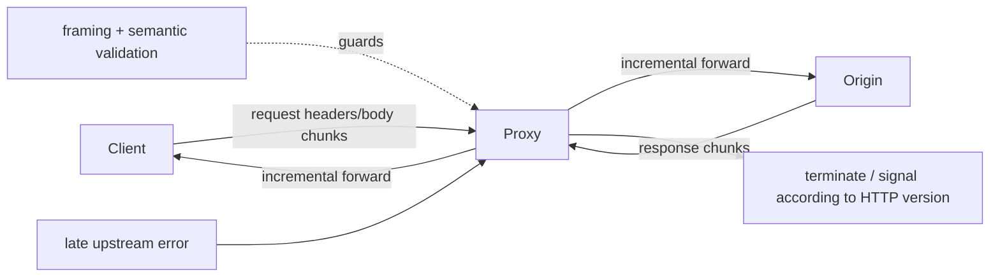
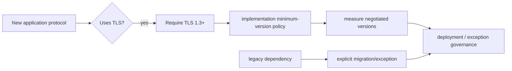

# 2026-09-20 12:00 — Interview Study Packages

README ve yakın `daily/2026-09-20/11-00.md` kontrol edildi. Kubernetes Node Lifecycle Conditions ve Architectural Fitness Functions tekrar edilmedi. Repo aramasında Union-Find/Rollback DSU, Web Locks ve Roaring Bitmaps gibi adayların daha önce işlendiği görüldü. Bu tur networking/backend ile cybersecurity/protocol design eksenine döndü.

## Paket 1 — Mid → Principal Networking / Backend: RFC 10036 Incremental Forwarding of HTTP Messages
**Süre:** 20–30 dk

### Konu anlatımı
Bir reverse proxy veya gateway normalde upstream HTTP mesajının tamamını almak zorunda değildir: header'ları gördükten sonra body byte'larını downstream'e geldikçe aktarabilir. Fakat mesajın güvenli biçimde incremental forward edilip edilemeyeceği framing, message semantics, intermediary transformations ve error handling'e bağlıdır. RFC 10036, Ağustos 2026'da HTTP Working Group tarafından yayımlanan Proposed Standard olarak bu davranış için açık kurallar tanımlar.

Ana mental model şudur: **buffering correctness sağlar diye varsayılmaz; streaming de otomatik olarak güvenli değildir.** Bir intermediary'nin mesajı kısmen forward ettikten sonra sonradan upstream mesajının geçersiz/eksik olduğunu öğrenmesi mümkündür. O noktada downstream'e “hiçbir şey olmadı” diyemez; response/request'in bir kısmı zaten wire'a çıkmıştır. Bu nedenle framing validation, connection termination, retry safety ve application idempotency birlikte düşünülmelidir.

### Mental model

**Invariant:** Bir byte downstream'e forward edildikten sonra o prefix'i geri alamazsın. Retry ve failure semantics bu geri döndürülemezliği hesaba katmalıdır.

### İçeride ne oluyor?
- Intermediary header'ları parse eder, message framing'i belirler ve body'yi parça parça iletebilir; tüm body'yi memory/disk üzerinde materialize etmek zorunda değildir.
- Incremental forwarding time-to-first-byte ve buffering memory'sini azaltabilir; özellikle büyük upload/download ve chained proxy topolojilerinde latency kazandırabilir.
- Geç validation failure veya premature upstream termination durumunda downstream kısmi mesaj görmüş olabilir. Connection/stream reset semantics HTTP/1.1, HTTP/2 ve HTTP/3 transport özelliklerine göre farklı uygulanabilir.
- Retry kararı yalnız transport error'a bakamaz. Non-idempotent bir request'in origin'e ne kadar ulaştığı bilinmiyorsa kör retry duplicate side effect üretebilir.
- Buffering bazı policy'ler için hâlâ gereklidir: tam-body signature doğrulama, malware scan, content transformation veya size-policy gibi kontroller streaming tasarımını değiştirebilir.
- Backpressure korunmazsa hızlı producer + yavaş consumer proxy memory'sini büyütür. Incremental forwarding, bounded buffering ve flow control ile birlikte tasarlanmalıdır.

### Yüksek getirili mülakat soruları
1. Reverse proxy neden tüm request/response body'yi buffer etmek istemez?
2. Streaming ile buffering arasında latency, memory ve correctness trade-off'u nedir?
3. Upstream response'un yarısı downstream'e gittikten sonra upstream connection ölürse ne yaparsın?
4. Senior: POST retry'sinin duplicate side effect üretmesini nasıl önlersin?
5. Staff: proxy chain boyunca backpressure ve bounded buffering'i nasıl tasarlarsın?
6. Principal: security inspection gerektiren endpoint'lerle low-latency streaming endpoint'lerini aynı gateway platformunda nasıl ayırırsın?

### Seviyeye göre cevap derinliği
- **Mid:** streaming, buffering, framing ve backpressure kavramlarını açıklar.
- **Senior:** partial-message failure, idempotency, retries ve HTTP version farklarını bağlar.
- **Staff:** bounded queues, admission control, observability ve policy-specific buffering tasarlar.
- **Principal:** gateway fleet'inde compatibility, rollout, security policy ve blast radius standardı kurar.

### Kısa alıştırma
Bir proxy'nin 2 GB upload'ı origin'e aktardığını düşün. Client 200 MB/s, origin 20 MB/s. Proxy'nin yalnız 16 MB buffer kullanmasına izin veriliyor. Akış kontrolü/backpressure tasarla. Origin 1.4 GB'da bağlantıyı kapatırsa client'a ne göstereceğini ve otomatik retry yapıp yapmayacağını gerekçelendir.

### Proje fikri
`streaming-proxy-lab`: HTTP reverse proxy yaz. `buffer-all` ve `incremental` modlarını karşılaştır; maksimum buffer byte, upstream/downstream throughput, TTFB, total latency ve partial-failure davranışını ölç. Fault injection ile origin'i body'nin %25/%75 noktasında kapat.

### Failure modes / trade-off / production bağlantısı
Unbounded buffering, non-idempotent request'i kör retry etmek, kısmi response'u tam response sanmak, body inspection gereksinimini streaming ile bypass etmek ve slow-consumer backpressure'ını yok saymak tipik hatalardır. Production'da TTFB, buffered bytes, upstream/downstream throughput, reset/abort oranı, partial transfer bytes, retry count ve duplicate-operation sinyalleri izlenmelidir.

### Kaynaklar
- RFC 10036 — Incremental Forwarding of HTTP Messages, Ağustos 2026: https://www.rfc-editor.org/rfc/rfc10036.html
- RFC 9110 — HTTP Semantics: https://www.rfc-editor.org/rfc/rfc9110.html
- RFC 9112 — HTTP/1.1: https://www.rfc-editor.org/rfc/rfc9112.html
- RFC 9113 — HTTP/2: https://www.rfc-editor.org/rfc/rfc9113.html
- RFC 9114 — HTTP/3: https://www.rfc-editor.org/rfc/rfc9114.html

---

## Paket 2 — Mid → CTO Cybersecurity / Protocol Design: RFC 9852, New Protocols Must Require TLS 1.3
**Süre:** 20–30 dk

### Konu anlatımı
TLS sürüm politikası yalnız cipher-suite listesi değildir; protocol design contract'ıdır. Temmuz 2026 tarihli RFC 9852, BCP 195'i güncelleyerek **TLS kullanan yeni protokollerin TLS 1.3'ü zorunlu tutmasını** ister. Gerekçe, TLS 1.3'ün TLS 1.2'ye göre güvenlik ve privacy eksiklerini azaltması, yaygınlaşması ve kapsamlı biçimde analiz edilmiş olmasıdır. Bu kural TLS içindir; RFC açıkça DTLS için aynı zorunluluğu koymaz.

Mülakatta kritik ayrım `support` ile `require` arasındadır. “Server TLS 1.3 destekliyor” demek client'ın downgrade/fallback veya legacy compatibility yüzünden TLS 1.2 kullanmayacağı anlamına gelmez. Yeni bir protocol specification, minimum version contract'ını normatif olarak belirlemeli; implementation, telemetry ve rollout da bunu gerçekten enforce etmelidir.

### Mental model

**Invariant:** “TLS 1.3 capable” ile “TLS 1.3 required” aynı güvenlik özelliği değildir.

### İçeride ne oluyor?
- TLS 1.3 eski handshake seçeneklerini sadeleştirir ve legacy cryptographic surface'i azaltır; yeni protokoller geçmiş uyumluluk yükünü baştan taşımak zorunda değildir.
- Minimum-version policy protocol specification, client/server configuration, load balancer/service mesh ve test matrix boyunca aynı olmalıdır.
- Version intolerance veya legacy middlebox/client dependency migration riskidir; fakat yeni protocol tasarımında varsayılan çözüm minimum standardı düşürmek olmamalıdır.
- TLS version tek başına güvenli deployment demek değildir: certificate validation, hostname verification, key lifecycle, endpoint identity ve application authorization ayrı katmanlardır.
- 0-RTT kullanımı varsa replay riskleri ayrıca modellenmelidir; “TLS 1.3 kullanıyoruz” application operation'larını otomatik olarak replay-safe yapmaz.
- Post-quantum migration ayrı bir algoritma/agility problemidir. RFC 9852 TLS 1.3 tabanını zorunlu kılar; tek başına belirli bir PQ key exchange deployment'ını çözmez.

### Yüksek getirili mülakat soruları
1. `TLS 1.3 supported` ile `TLS 1.3 required` arasındaki fark nedir?
2. Yeni protocol neden legacy TLS compatibility'yi varsayılan olarak taşımamalıdır?
3. TLS 1.3 kullanmak certificate/hostname validation problemini çözer mi?
4. Senior: 0-RTT hangi application operation'larında risklidir?
5. Staff: service mesh + external LB + SDK fleet boyunca minimum TLS version enforcement'ını nasıl doğrularsın?
6. CTO: büyük bir legacy müşteri TLS 1.2 bağımlıysa security baseline, gelir ve migration süresini nasıl yönetirsin?

### Seviyeye göre cevap derinliği
- **Mid:** TLS'in confidentiality/integrity/peer-authentication rolünü ve minimum-version kavramını açıklar.
- **Senior:** downgrade, 0-RTT replay, certificate validation ve deployment boundaries'i tartışır.
- **Staff:** policy-as-code, inventory, telemetry, staged rollout ve exception expiry tasarlar.
- **Principal/CTO:** cryptographic agility, customer migration, compliance, business risk ve deprecation governance'ını bağlar.

### Kısa alıştırma
Yeni bir internal RPC protocol için security profile yaz: minimum TLS version, certificate identity, hostname/SPIFFE benzeri identity check, 0-RTT policy, cipher/config ownership, telemetry ve exception TTL. Sonra fleet'in %2'sinin TLS 1.2 kullandığı migration senaryosunu tasarla.

### Proje fikri
`tls-baseline-auditor`: verilen endpoint listesini tarayıp negotiated TLS version, certificate expiry/identity ve policy compliance raporu üreten küçük araç. CI'da yeni endpoint'lerin minimum TLS 1.3 policy'sini ihlal etmesini engelle; production için yalnız metadata topla, secret/key material kaydetme.

### Failure modes / trade-off / production bağlantısı
TLS 1.3'ü destekleyip minimum version'ı enforce etmemek, LB'de TLS 1.3 iken iç hop'ta legacy TLS kullanıldığını görmemek, certificate validation'ı kapatmak, 0-RTT replay riskini yok saymak, exception'ları süresiz bırakmak ve PQ migration'ı “TLS 1.3 var, tamamdır” diye değerlendirmek tipik hatalardır. Production'da negotiated-version dağılımı, handshake failures, certificate errors/expiry, exception inventory/age ve deprecated client population izlenmelidir.

### Kaynaklar
- RFC 9852 / BCP 195 — New Protocols Using TLS Must Require TLS 1.3, Temmuz 2026: https://www.rfc-editor.org/rfc/rfc9852.html
- RFC 8446 — TLS 1.3: https://www.rfc-editor.org/rfc/rfc8446.html
- RFC 9325 / BCP 195 — Recommendations for Secure Use of TLS and DTLS: https://www.rfc-editor.org/rfc/rfc9325.html
