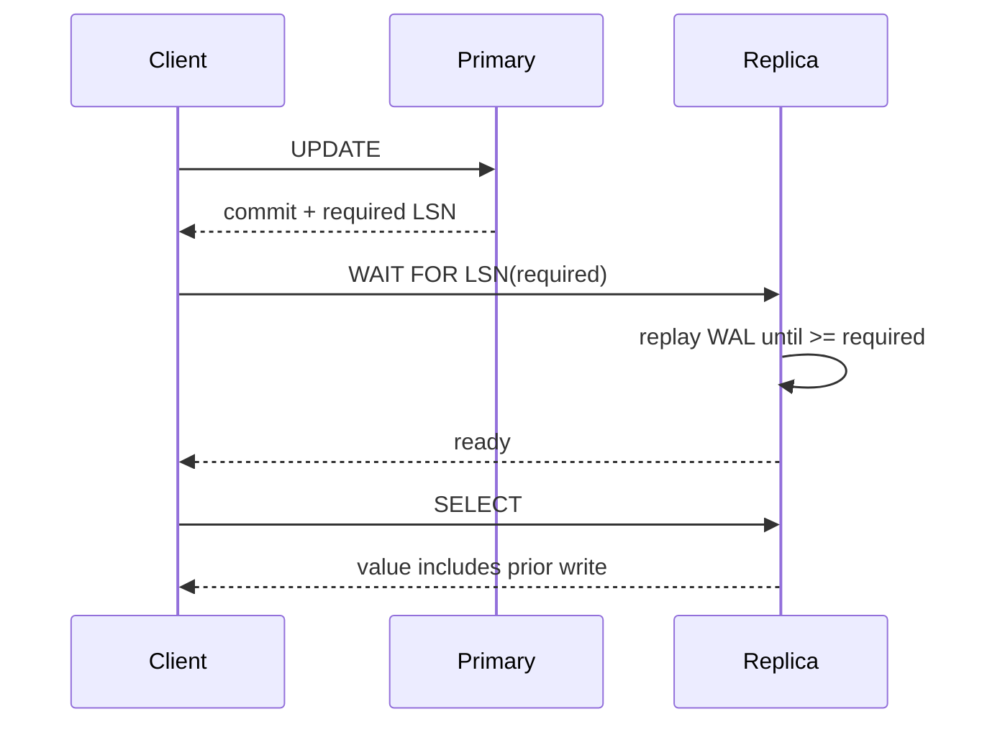
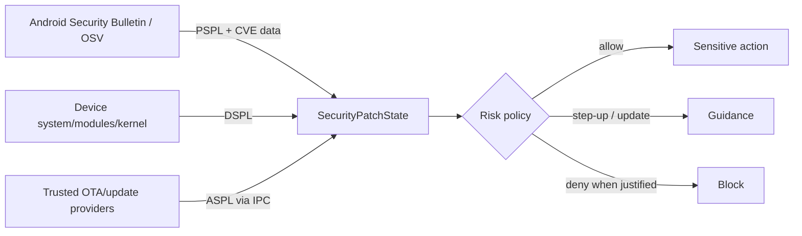

# 2026-09-20 13:00 — Interview Study Packages

README ve yakın `daily/2026-09-20/12-00.md` kontrol edildi. RFC 10036 HTTP incremental forwarding ve RFC 9852 TLS 1.3 baseline tekrar edilmedi. Repo aramasında Python subinterpreters / InterpreterPoolExecutor'ın daha önce işlendiği görülerek adaylardan çıkarıldı. Bu tur databases/distributed systems ile mobile/cybersecurity eksenine döndü.

## Paket 1 — Mid → Principal Databases / Distributed Systems: PostgreSQL 19 `WAIT FOR LSN` ve Read-Your-Writes
**Süre:** 20–30 dk

### Konu anlatımı
Asenkron primary→replica replication düşük write latency ve read scaling sağlar; fakat replica primary'deki son commit'i henüz replay etmemiş olabilir. Kullanıcı bir ayarı kaydedip hemen replica'dan okuduğunda eski değeri görür. PostgreSQL 19'un beta hattındaki `WAIT FOR LSN` komutu, bir session'ın belirli bir WAL Log Sequence Number'a kadar değişiklikler replica'da replay edilene dek beklemesini sağlayarak read-your-writes akışlarını daha açık biçimde kurmayı hedefler.

Mental model: **commit görünürlüğü bir zaman tahmini değil, replication progress token'ıdır.** Write sonrası gerekli LSN'i taşı; replica read öncesinde bu noktaya ulaşmayı bekle. Bu, tüm sistemi synchronous replication'a çevirmekten daha dar kapsamlı bir consistency mekanizmasıdır.

> 20 Eylül 2026 itibarıyla PostgreSQL 19'un güncel resmi sürümü Beta 3'tür; PostgreSQL projesi beta/RC sürümlerini production için önermiyor.

### Mental model

**Invariant:** Replica'nın “sağlıklı” olması, belirli bir write'ı gördüğü anlamına gelmez; gereken progress point'e ulaşmış olması gerekir.

### İçeride ne oluyor?
- WAL değişiklikleri primary'de sıralı LSN konumlarıyla ilerler; replica receive/flush/replay progress'i farklı olabilir.
- Read-your-writes, bir client/session'ın kendi başarılı write'ının sonraki read'de görünmesini ister; global linearizability ile aynı garanti değildir.
- `WAIT FOR LSN`, replica lag'i sabit `sleep(100ms)` ile tahmin etmek yerine explicit progress condition'a çevirir.
- Timeout şarttır: replica durmuşsa sonsuza kadar beklemek request budget'ını tüketir. Timeout sonrası primary fallback, başka replica veya explicit stale-read policy seçilebilir.
- LSN token routing/API contract'ına sızabilir. Load balancer yalnız “en yakın replica” değil, required progress'i sağlayabilen replica seçmelidir.
- Synchronous replication daha geniş durability/commit semantics verir; per-read waiting ise latency maliyetini yalnız consistency isteyen okumalara yükleyebilir.

### Yüksek getirili mülakat soruları
1. Replication lag kullanıcıya hangi anomalileri gösterir?
2. Read-your-writes ile linearizability farkı nedir?
3. Neden `sleep(100ms)` correctness mekanizması değildir?
4. Senior: `WAIT FOR LSN` timeout olduğunda fallback politikan ne olur?
5. Staff: LSN token'ını stateless API gateway ve replica router boyunca nasıl taşırsın?
6. Principal: consistency tier'larını ürün/SLO/cost contract'ına nasıl dönüştürürsün?

### Seviyeye göre cevap derinliği
- **Mid:** primary/replica, WAL, lag ve stale read'i açıklar.
- **Senior:** progress token, timeout, fallback ve p99 latency'yi bağlar.
- **Staff:** topology-aware replica routing, observability ve overload feedback loop tasarlar.
- **Principal:** consistency tier, multi-region latency, durability ve product semantics standardı kurar.

### Kısa alıştırma
Primary İstanbul'da; iki replica'nın replay lag'i p50/p99 olarak 20/400 ms ve 60/180 ms. Request budget 250 ms. Write sonrası read için replica seçimi, wait timeout ve primary fallback politikasını tasarla. `sleep` tabanlı çözümle correctness ve latency farkını açıkla.

### Proje fikri
`ryw-router-lab`: primary + iki PostgreSQL replica üzerinde write response'a progress token ekleyen ve sonraki read'i uygun replica'ya yönlendiren küçük servis. Stale-read, wait duration, fallback count ve end-to-end p99 ölç; artificial replication lag enjekte et.

### Failure modes / trade-off / production bağlantısı
LSN yerine wall-clock kullanmak, timeout koymamak, bütün read'leri gereksiz yere primary'ye göndermek, lagging replica'ya yoğun wait trafiği bindirmek ve read-your-writes'ı global strong consistency sanmak tipik hatalardır. Production'da replay lag, wait duration/timeouts, fallback ratio, stale-read violations, primary read load ve per-replica saturation izlenmelidir.

### Kaynaklar
- PostgreSQL 19 Beta 1 feature highlights (`WAIT FOR LSN`): https://www.postgresql.org/about/news/postgresql-19-beta-1-released-3313/
- PostgreSQL 19 Beta 3 announcement, 13 Ağustos 2026: https://www.postgresql.org/about/news/postgresql-186-1711-1615-1519-1424-and-19-beta-3-released-3365/
- PostgreSQL beta policy: https://www.postgresql.org/developer/beta/

---

## Paket 2 — Junior → Staff Mobile / Cybersecurity: AndroidX Security State, Component-Level Patch Posture
**Süre:** 20–30 dk

### Konu anlatımı
Modern Android cihazlarda tek bir “security patch date” gerçek güvenlik durumunu tam anlatmaz: system image, Mainline system modules ve kernel farklı mekanizmalarla güncellenebilir. AndroidX Security State 1.1.0 ve Security State Provider 1.0.0 Eylül 2026'da stable oldu. Model üç sinyali ayırır: **DSPL** cihazda çalışan patch seviyesi, **PSPL** yayımlanmış patch seviyesi ve **ASPL** cihaz için indirilmeye/kurulmaya hazır patch seviyesi. Ayrıca belirli CVE'lerin giderilip giderilmediğini sorgulayan API'ler vardır.

Mülakat mental modeli: **security posture tek scalar değil, component × installed/published/available matrisi**. Bu veri risk-based authorization'a girdi olabilir; tek başına authentication veya device integrity kanıtı değildir.

### Mental model

**Invariant:** “Patch eski” ile “cihaz exploit edildi” aynı iddia değildir; posture sinyali risk kararının yalnız bir girdisidir.

### İçeride ne oluyor?
- `SecurityPatchState` system, system modules ve kernel için unified posture sağlar; kernel değerlendirmesi LTS version bilgisini de kullanır.
- DSPL local state'tir; PSPL bulletin bilgisidir; ASPL trusted on-device update provider'larından asenkron gelebilir.
- `areCvesPatched()` daha granular policy'lere izin verir; vendor supplemental patch kayıtları da değerlendirmeye katılabilir.
- Provider tarafında package/UID identity doğrulaması ve privileged provider discovery spoofing riskini azaltır.
- Stable client library deadlocked remote provider'lara karşı bounded thread-pool bulkhead kullanır; IPC bağımlılığı uygulamanın sınırsız thread üretmesine dönüşmemelidir.
- Banking/enterprise uygulaması posture'a göre allow, step-up auth, update guidance veya risk-temelli block seçebilir; erişilebilirlik ve false-positive maliyeti ayrıca modellenmelidir.

### Yüksek getirili mülakat soruları
1. Tek bir SPL tarihi neden modern Android security posture için yetersizdir?
2. DSPL, PSPL ve ASPL farkı nedir?
3. Patch posture authentication veya Play Integrity'nin yerine geçer mi?
4. Senior: update provider cevap vermiyorsa sensitive flow'u nasıl yönetirsin?
5. Staff: CVE bazlı blocking policy'de false positive, stale bulletin ve OEM backport sorunlarını nasıl ele alırsın?
6. Staff: MDM fleet'inde posture telemetry'sini privacy-preserving biçimde nasıl toplarsın?

### Seviyeye göre cevap derinliği
- **Junior:** patch level, system/module/kernel ayrımını açıklar.
- **Mid:** DSPL/PSPL/ASPL ve async provider modelini açıklar.
- **Senior:** IPC failure, trusted provider, CVE checks ve UX trade-off'larını bağlar.
- **Staff:** risk policy, rollout, privacy, exception ve fleet governance tasarlar.

### Kısa alıştırma
Bir fintech uygulamasında system DSPL güncel, Mainline modülü bir ay geride fakat ASPL update'in hazır olduğunu söylüyor; kritik NFC CVE'si yalnız bu modülü etkiliyor. Tap-to-pay, bakiye görüntüleme ve profil düzenleme için üç ayrı policy üret; neden tüm uygulamayı bloklamadığını veya blokladığını gerekçelendir.

### Proje fikri
`device-posture-demo`: AndroidX Security State ile component posture'u gösteren demo. Policy engine; `allow`, `warn`, `step-up`, `require-update` kararları versin. Provider timeout/failure simülasyonu ve yalnız aggregate telemetry ekle; ham device identifier veya gereksiz vulnerability history saklama.

### Failure modes / trade-off / production bağlantısı
Tek SPL string'ine güvenmek, patch lag'i compromise kanıtı saymak, provider failure'ı otomatik “unsafe” kabul etmek, OEM backport/supplemental patch bilgisini yok saymak, posture verisini gereksiz kullanıcı takibine dönüştürmek ve update zorlamasıyla kritik erişimi yanlışlıkla kesmek tipik hatalardır. Production'da component posture dağılımı, ASPL availability, provider timeout/error, policy decision dağılımı, update completion ve false-block support sinyalleri izlenmelidir.

### Kaynaklar
- Android Developers Blog — AndroidX Security State stable announcement, 17 Eylül 2026: https://developer.android.com/blog/posts/introducing-the-android-x-security-state-libraries-a-unified-view-of-device-security
- Understand device security state (15 Eylül 2026 güncellemesi): https://developer.android.com/privacy-and-security/understand-device-security-state
- AndroidX Security release notes: https://developer.android.com/jetpack/androidx/releases/security
