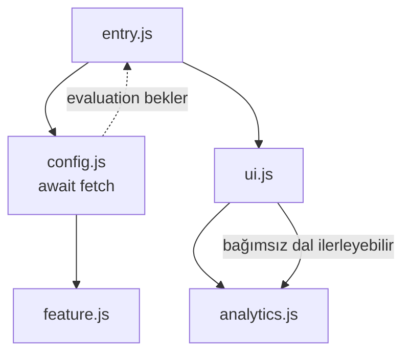
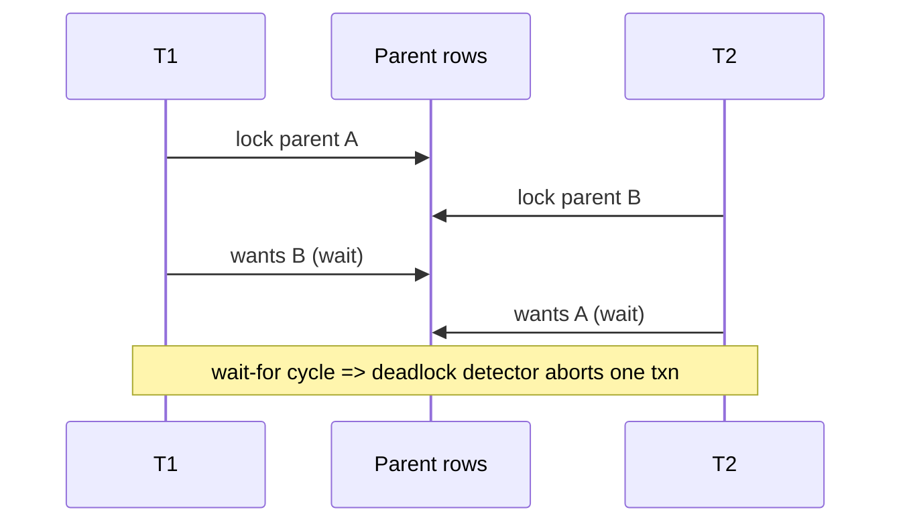

# 2026-09-20 14:00 — Interview Study Packages

README ve yakın `daily/2026-09-20/13-00.md` kontrol edildi. PostgreSQL `WAIT FOR LSN` ve AndroidX Security State tekrar edilmedi. Repo aramasında Kubernetes in-place resize preemption'ın daha önce işlendiği görülerek adaylardan çıkarıldı. Bu tur frontend/runtime semantics ile databases/concurrency eksenine döndü.

## Paket 1 — Junior → Staff Frontend / Runtime: Safari 27, Top-Level Await ve ES Module Evaluation
**Süre:** 20–30 dk

### Konu anlatımı
ES modules yalnız dosya yükleme mekanizması değildir; dependency graph'in instantiate/evaluate yaşam döngüsünü yönetir. Top-level `await` (TLA), bir module evaluation sırasında Promise beklemeye izin verir. Kritik sonuç: awaiting module'ü doğrudan veya dolaylı import eden modüller onun evaluation'ı tamamlanana kadar bekler; dependency graph'in bağımsız sibling dalları ise ilerleyebilir.

Safari 27, 17 Eylül 2026'da yayımlanan WebKit release notes'a göre ECMAScript module loader'ını standart algoritmalara göre native C++ ile yeniden yazdı. Eski loader 2016 WHATWG Loader proposal kökenliydi ve TLA ile module execution ordering/initialization sorunları üretebiliyordu. Yeni loader test262, Web Platform Tests ve ek/fuzz testleriyle doğrulandı.

Mental model: **TLA global event loop'u durdurmaz; dependency graph'te evaluation dependency'si oluşturur.**

### Mental model

**Invariant:** Import promise'ı, module evaluation tamamlanmadan “hazır” kabul edilmemelidir; export binding'leri doğru initialization sırasına tabidir.

### İçeride ne oluyor?
- ESM loader dependency graph'i çözer, modülleri instantiate eder ve specification ordering'e göre evaluate eder.
- TLA bulunan module async evaluation'a geçer; onu bekleyen importer'lar da completion'a bağlanır.
- Aynı module birden fazla kez dynamic import edilse bile evaluation ordering ve initialized export görünürlüğü korunmalıdır.
- TLA başlangıç critical path'ine network I/O koyarsa application startup uzayabilir; correctness kazanımı latency maliyetini yok etmez.
- Circular dependency + async evaluation reasoning'i zorlaştırır; cycles tasarım kokusu olabilir ve test edilmelidir.
- Progressive enhancement ve browser compatibility kontrolü hâlâ gerekir; runtime correctness ile deployment population aynı problem değildir.

### Yüksek getirili mülakat soruları
1. Top-level `await` ile async IIFE arasındaki semantic fark nedir?
2. Bir module `await` edince tüm JavaScript execution durur mu?
3. Importer neden dependency evaluation tamamlanmadan export'a erişmemelidir?
4. Mid: dynamic import aynı awaiting module'ü üç kez isterse hangi invariants korunmalı?
5. Senior: TLA'yı app bootstrap'ta config fetch için kullanmanın latency/failure trade-off'ları nedir?
6. Staff: module graph'te async critical path'i nasıl ölçer ve sınırlandırırsın?

### Seviyeye göre cevap derinliği
- **Junior:** ESM import/export ve Promise/await'i açıklar.
- **Mid:** dependency graph, evaluation ordering ve dynamic import'u bağlar.
- **Senior:** cycles, startup latency, failure propagation ve browser compatibility tartışır.
- **Staff:** module-boundary design, performance budgets, cross-browser conformance tests ve rollout stratejisi kurar.

### Kısa alıştırma
`entry -> {config, ui}`, `config -> auth`, `ui -> analytics` graph'i çiz. `config` 400 ms TLA yapıyor, `analytics` 50 ms sürüyor. Hangi dal ilerleyebilir? `entry` ne zaman tamamlanabilir? Config reject ederse failure propagation'ı yaz.

### Proje fikri
`esm-graph-lab`: TLA, dynamic import ve circular dependency varyantları üreten küçük web app. Chromium/Firefox/Safari'de observable evaluation order'ı logla; startup waterfall ve module critical path'i ölçen test harness ekle.

### Failure modes / trade-off / production bağlantısı
TLA'yı global blocking sanmak, startup path'inde sınırsız network wait yapmak, circular dependencies'i gizlemek, import completion ile fetch completion'ı karıştırmak ve yalnız tek browser'da test etmek tipik hatalardır. Production'da startup p50/p95, module fetch/evaluation duration, rejected module imports, dynamic-import error rate ve browser/version kırılımı izlenmelidir.

### Kaynaklar
- WebKit — Safari 27.0 Features, 17 Eylül 2026: https://webkit.org/blog/18325/webkit-features-for-safari-27-0/
- WebKit — Fixing Top-Level Await in Safari, 2 Eylül 2026: https://webkit.org/blog/18227/fixing-top-level-await-in-safari/
- ECMAScript specification — Modules: https://tc39.es/ecma262/#sec-modules

---

## Paket 2 — Mid → Principal Databases / Concurrency: Foreign Keys, Row Locks, MultiXact ve Deadlock Reasoning
**Süre:** 20–30 dk

### Konu anlatımı
Foreign key yalnız schema-level validation değildir; concurrent transactions altında referential integrity'yi korumak için locking protocol gerektirir. PostgreSQL parent key'in child insert/update sırasında kaybolmamasını garanti etmek için referenced row üzerinde uygun row-level lock kullanır. PostgreSQL'in row lock modları (`FOR KEY SHARE`, `FOR SHARE`, `FOR NO KEY UPDATE`, `FOR UPDATE`) farklı conflict matrislerine sahiptir. Aynı tuple üzerinde birden çok compatible locker olduğunda PostgreSQL bunları MultiXact ile temsil edebilir.

Mental model: **FK correctness = constraint + lock compatibility + transaction ordering.** Deadlock çoğu zaman “çok trafik” değil, aynı kaynakların farklı sırada alınmasıdır.

### Mental model

**Invariant:** Compatible shared/key-share lockers concurrency sağlar; kaynak sırası tersleştiğinde sonraki incompatible lock request wait-for cycle yaratabilir.

### İçeride ne oluyor?
- MVCC plain reads'i row locks'tan büyük ölçüde ayırır; locking reads ve writes farklı semantics taşır.
- `FOR KEY SHARE` referenced key'in delete/key-changing update'ine karşı koruma sağlarken non-key update'lerle daha fazla concurrency sağlayabilir.
- Multiple compatible row lockers tuple metadata'sında tek XID yerine MultiXact referansı gerektirebilir.
- Deadlock detector wait-for graph cycle'ını bulur ve bir transaction'ı abort ederek ilerleme sağlar; uygulama retry-safe olmalıdır.
- FK index'lerinin eksikliği lock hold time ve scanned work'ü büyütebilir; schema/index design concurrency davranışıdır.
- PostgreSQL 19 beta feature matrix'te shared row-level locking'in foreign-key deadlock senaryolarını azaltması özellikle vurgulanıyor; ancak 20 Eylül 2026 itibarıyla 19 hâlâ beta hattındadır ve production baseline olarak ele alınmamalıdır.

### Yüksek getirili mülakat soruları
1. Foreign key check neden lock gerektirir?
2. `FOR KEY SHARE` ile `FOR UPDATE` farkı nedir?
3. MVCC neden deadlock'ları tamamen ortadan kaldırmaz?
4. Senior: iki transaction'ın parent A/B'yi ters sırada işlemesindeki deadlock'u çiz.
5. Staff: MultiXact nedir ve neden yalnız “çok transaction var” demek yeterli değildir?
6. Principal: hot parent keys, FK checks ve retry storm için schema/application mitigation nasıl tasarlanır?

### Seviyeye göre cevap derinliği
- **Mid:** row lock, FK integrity, blocking ve deadlock'u açıklar.
- **Senior:** lock compatibility, acquisition order, deadlock detection ve retry'ı bağlar.
- **Staff:** MultiXact, indexes, hot keys ve transaction scope üzerinden contention azaltır.
- **Principal:** workload shaping, observability, schema evolution ve retry budgets ile concurrency governance kurar.

### Kısa alıştırma
T1 parent A sonra B; T2 parent B sonra A üzerinde child rows ekliyor. Wait-for graph'i çiz. Her transaction parent IDs'yi sorted order'da işlerse ne değişir? Transaction süresi 20 ms'den 500 ms'ye çıkarsa contention olasılığı neden artar?

### Proje fikri
`fk-deadlock-lab`: PostgreSQL'de parent/child schema, eşzamanlı workers ve ters/sorted key order senaryoları. Deadlock count, lock wait p95, transaction latency, retries ve MultiXact-related telemetry'yi karşılaştır.

### Failure modes / trade-off / production bağlantısı
Her deadlock'u isolation-level bug'ı sanmak, retry'ı idempotency olmadan yapmak, transaction içinde network çağrısı tutmak, FK/index tasarımını contention'dan bağımsız görmek ve lock wait yalnız average ile izlemek tipik hatalardır. Production'da deadlocks, lock wait p95/p99, transaction duration, aborted/retried txns, hot keys, long transactions ve MultiXact age/headroom izlenmelidir.

### Kaynaklar
- PostgreSQL — Explicit Locking / Row-Level Locks: https://www.postgresql.org/docs/current/explicit-locking.html#LOCKING-ROWS
- PostgreSQL — Routine Vacuuming / MultiXact wraparound: https://www.postgresql.org/docs/current/routine-vacuuming.html
- PostgreSQL feature matrix — Shared row level locking: https://www.postgresql.org/about/featurematrix/detail/shared-row-level-locking/
- PostgreSQL 19 Beta policy/context: https://www.postgresql.org/developer/beta/
