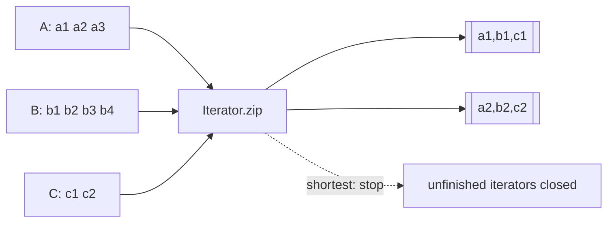

# 2026-09-20 15:00 — Interview Study Packages

README ve yakın `daily/2026-09-20/14-00.md` kontrol edildi. Safari 27 Top-Level Await ve PostgreSQL FK/MultiXact tekrar edilmedi. Repo aramasında `Iterator.zip` / Joint Iteration için önceki paket bulunmadı; Skip List için de doğrudan önceki chapter bulunmadı. Bu tur Frontend/Algorithms ile Algorithms/Backend eksenine döndü.

## Paket 1 — Junior → Staff Frontend / Algorithms: JavaScript `Iterator.zip`, Lazy Joint Iteration & Length Semantics
**Süre:** 20–30 dk

### Konu anlatımı
Birden çok sequence pozisyonel olarak ilişkiliyse klasik çözüm index ile paralel array dolaşmaktır. Bu yaklaşım array dışındaki iterables için zayıftır, intermediate allocation üretebilir ve uzunluk uyuşmazlığının semantiğini kodun içine gizler. TC39 Joint Iteration önerisi Stage 4'e ulaştı ve ECMAScript 2027 specification'a entegre edildi; `Iterator.zip()` array-benzeri tuple'lar, `Iterator.zipKeyed()` ise key'li object'ler üretir. Chrome 153, 8 Eylül 2026 itibarıyla bu API'leri stable kanalda duyurdu.

Mental model: **zip bir materialization değil, birden çok iterator üzerinde senkron `next()` koordinasyonudur.**

### Mental model


### İçeride ne oluyor?
- `Iterator.zip(iterables, options)` outer iterable'dan input iterator'ları toplar; sonuç lazy bir iterator'dır.
- `mode: "shortest"` varsayılandır: ilk input bittiğinde sonuç biter ve diğer input iterator'lar kapatılır.
- `mode: "longest"` tüm input'lar bitene kadar sürer; eksikler `padding` ile veya `undefined` ile doldurulur.
- `mode: "strict"` input uzunlukları eşit değilse `TypeError` üretir; veri-shape invariant'ını executable contract'a dönüştürür.
- `zipKeyed`, positional tuple yerine input object key'lerini koruyan object üretir.
- Lazy yapı memory'yi sınırlayabilir; fakat input iterator'ların side effect'leri ve `return()` cleanup davranışı correctness'in parçasıdır.

### Yüksek getirili mülakat soruları
1. `zip` ile `map((x,i) => ...)` arasındaki abstraction farkı nedir?
2. Lazy iterator neden büyük stream'lerde avantajlıdır?
3. `shortest`, `longest`, `strict` hangi veri sözleşmelerine karşılık gelir?
4. Mid: `shortest` modunda diğer iterator'ların kapatılması neden önemlidir?
5. Senior: iterator side effect üretirse partial consumption ve cleanup nasıl ele alınır?
6. Staff: API boundary'de silent truncation mı strict validation mı seçersin; telemetry'yi nasıl kurarsın?

### Seviyeye göre cevap derinliği
- **Junior:** iterable/iterator, `next()` ve lazy evaluation'ı açıklar.
- **Mid:** üç mode, padding ve cleanup semantics'ini bağlar.
- **Senior:** side effects, error propagation, infinite iterables ve memory/latency trade-off'unu tartışır.
- **Staff:** data-contract seçimi, compatibility rollout ve observability ile silent data loss riskini yönetir.

### Kısa alıştırma
`A=[1,2,3]`, `B=[10,20]`, `C=[100,200,300,400]` için `shortest`, `longest` ve `strict` sonuçlarını elle yaz. `longest` için padding `[0,-1,-2]` kullan. Hangi mod veri kaybını sessizce gizleyebilir?

### Proje fikri
`iterator-zip-lab`: CSV kolon stream'lerini `zip`, `zipKeyed` ve index-based materialization ile birleştir. 10M satırda peak heap, throughput ve first-result latency ölç; mismatched-length ve throwing iterator testleri ekle.

### Failure modes / trade-off / production bağlantısı
`shortest` ile silent truncation, `longest` ile `undefined` değerlerin downstream'e sızması, infinite iterable'ı yanlış modda kullanmak, iterator cleanup'ını unutmak ve browser support'u varsaymak tipik hatalardır. Production'da mismatch count, consumed rows, rejected batches, processing latency ve memory high-water mark izlenmelidir.

### Kaynaklar
- Chrome 153, 8 Eylül 2026: https://developer.chrome.com/blog/new-in-chrome-153
- TC39 Joint Iteration Stage 4 draft: https://tc39.es/proposal-joint-iteration/
- ECMAScript 2027 `Iterator.zip` / `zipKeyed`: https://tc39.es/ecma262/multipage/control-abstraction-objects.html

---

## Paket 2 — Junior → Principal Algorithms / Backend: Skip Lists, Probabilistic Balancing & Ordered Index Economics
**Süre:** 20–30 dk

### Konu anlatımı
Sorted linked list range traversal için iyidir ama search `O(n)` olur. Balanced tree `O(log n)` search/update sağlar; bunun karşılığında rotation ve strict balance invariants taşır. Skip list farklı yol seçer: base sorted list'in üzerinde giderek seyrekleşen forward-pointer seviyeleri kurar. Node level'ı random seçildiği için explicit rotation yerine probabilistic balancing elde edilir. William Pugh'un orijinal çalışması skip list'i balanced tree'lere basit probabilistic alternatif olarak tanımlar; expected search/insert/delete `O(log n)` iken worst case `O(n)` kalır.

Mental model: **express lane'ler ne kadar yukarı çıkarsa o kadar seyrekleşir; search yukarıda büyük sıçrar, hedefi aşmadan aşağı iner.**

### Mental model
```text
L3: HEAD --------------------------> 80
L2: HEAD --------> 20 ------------> 80
L1: HEAD -> 10 -> 20 ----> 50 ----> 80 -> 90
L0: HEAD -> 10 -> 20 ->30->50->60->80->90

search 60: upper levels ile yaklaş → overshoot öncesi aşağı in → 60
```

### İçeride ne oluyor?
- Her node level 0'da vardır; daha yüksek level'a çıkma olasılığı genellikle geometrik dağılımla azalır.
- Search en yüksek seviyeden başlar; `next.key < target` oldukça sağa, aksi halde bir seviye aşağı gider.
- Insert search path'teki predecessor'ları tutar, random level seçer ve ilgili forward pointer'ları splice eder.
- Expected height ve operation cost `O(log n)`; adversarial input order tree'deki gibi deterministic degeneration yaratmaz, fakat random level realizasyonu kötü olabilir.
- Range query hedefin başlangıcını logaritmik beklenen maliyetle bulup level 0'da sequential ilerler: yaklaşık `O(log n + k)` expected.
- Redis'in güncel sorted-set implementation'ı member→node lookup için hash table, ordered/range/rank görünümü için skip-list tabanlı yapı kullanır; tek veri yapısı her access pattern'i optimize etmek zorunda değildir.

### Yüksek getirili mülakat soruları
1. Skip list neden linked list'ten daha hızlı search yapabilir?
2. Neden “balanced” olmasına rağmen rotation gerekmez?
3. Expected `O(log n)` ile worst-case `O(n)` arasındaki fark nedir?
4. Mid: insert sırasında predecessor/update array neden tutulur?
5. Senior: skip list ile B-tree / red-black tree'yi cache locality, concurrency ve range scan açısından karşılaştır.
6. Staff/Principal: point lookup + ordered range için neden hash table + ordered index hibriti seçebilirsin?

### Seviyeye göre cevap derinliği
- **Junior:** sorted list, forward pointer ve random level sezgisini açıklar.
- **Mid:** search/insert/delete ve expected complexity'yi kurar.
- **Senior:** probability parameter, memory overhead, cache locality ve range-query economics tartışır.
- **Staff/Principal:** concurrent access, hybrid indexes, workload shape ve benchmark-driven seçim yapar.

### Kısa alıştırma
16 node için her level'a çıkma olasılığı `p=1/2` olsun. Level 0/1/2/3'te beklenen node sayılarını yaklaşık hesapla. Ardından 37 aramasını dört seviyeli örnek üzerinde elle izle ve kaç pointer hop yaptığını say.

### Proje fikri
`skiplist-index-lab`: skip list, sorted array ve balanced-tree library'sini 1M key üzerinde karşılaştır. Random insert, sorted insert, point lookup ve 100-item range scan workload'larında throughput, p99, bytes/key ve cache-miss proxy ölç.

### Failure modes / trade-off / production bağlantısı
Worst-case'i expected bound gibi anlatmak, RNG/level cap'i kötü seçmek, duplicate ordering semantics'ini tanımlamamak, pointer-heavy layout'un cache maliyetini görmezden gelmek ve concurrency reclamation problemini küçümsemek tipik hatalardır. Production'da operation p95/p99, bytes/key, level distribution, range-scan length, allocator pressure ve lock/contention ölçülmelidir.

### Kaynaklar
- William Pugh — A Skip List Cookbook / University of Maryland: https://drum.lib.umd.edu/items/56c44671-3973-46b6-9e52-f71dc95af178
- William Pugh — Concurrent Maintenance of Skip Lists: https://drum.lib.umd.edu/items/3c796454-0f7b-4fef-806e-c387fdfc88a4
- Redis current sorted-set implementation (`t_zset.c`): https://github.com/redis/redis/blob/unstable/src/t_zset.c
