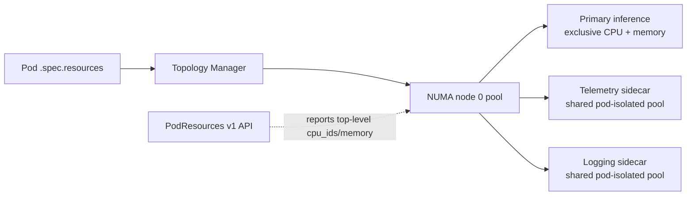

# 2026-09-20 16:00 — Interview Study Packages

README ve yakın `daily/2026-09-20/15-00.md` kontrol edildi. `Iterator.zip` ve Skip Lists tekrar edilmedi. Repo aramasında Kubernetes Pod-Level Resource Managers / NUMA-sidecar modeli ile Scroll Anchoring / `overflow-anchor` için önceki paket bulunmadı. Bu tur Cloud/SRE + MLOps ve Frontend/Web Performance eksenine döndü.

## Paket 1 — Mid → Principal Cloud/SRE/MLOps: Kubernetes v1.37 Pod-Level Resource Managers, NUMA Locality & Sidecar Economics
**Süre:** 20–30 dk

### Konu anlatımı
Latency-sensitive inference, HPC ve packet-processing workload'larında yalnız toplam CPU/memory miktarı değil, bu kaynakların hangi NUMA node'da ve hangi fiziksel CPU'larda bulunduğu da önemlidir. Kubernetes'in CPU Manager, Memory Manager ve Topology Manager bileşenleri bu placement kararlarını verir. Kubernetes v1.37'de `PodLevelResourceManagers` Beta'ya geçti; feature gate Beta olsa da varsayılan olarak kapalıdır. Kubelet resource manager'ları artık yalnız container-level request'lere değil, Pod'un `.spec.resources` bütçesine göre de allocation/NUMA alignment yapabilir.

Temel problem sidecar ekonomisidir: ana inference container'ı exclusive, NUMA-local CPU/memory isterken telemetry/logging sidecar'ına aynı pahalı dedicated core modelini uygulamak kaynak israfıdır. Pod-level pool ile primary container exclusive pay alabilir, yardımcı container'lar ise aynı Pod'a izole shared pool içinde çalışabilir.

Mental model: **Pod resource budget bir NUMA-local zarf; container'lar bu zarfın içinde exclusive veya shared paylar kullanır.**

### Mental model


### İçeride ne oluyor?
- Pod-level resource declaration scheduler/kubelet için Pod'un toplam resource budget'ını ifade eder; container-level semantics tamamen ortadan kalkmaz.
- Topology Manager CPU, memory ve device locality hint'lerini uzlaştırır; yanlış NUMA placement remote-memory latency ve bandwidth maliyeti yaratabilir.
- CPU Manager exclusive CPU isteyen primary workload'a dedicated cores ayırabilirken non-Guaranteed sidecar'lar pod-isolated shared pool'da kalabilir.
- Memory Manager NUMA-local memory placement ile CPU locality'nin boşa gitmesini önlemeye çalışır.
- v1.37 PodResources gRPC API top-level `cpu_ids` ve `memory` alanlarıyla Pod-level exclusive assignment'ları gözlemlenebilir hale getirir; tooling container değerlerini toplayıp double-count etmemelidir.
- Feature Beta fakat disabled-by-default olduğu için rollout capability detection ve node-pool bazlı canary gerektirir.

### Yüksek getirili mülakat soruları
1. NUMA nedir; remote memory access neden tail latency'yi etkiler?
2. CPU Manager, Memory Manager ve Topology Manager'ın rolleri nasıl ayrılır?
3. Pod-level resource budget sidecar israfını nasıl azaltabilir?
4. Senior: GPU inference Pod'unda main container + telemetry sidecar için resource modelini nasıl kurarsın?
5. Staff: mixed-version node pool'da Beta feature rollout ve observability'yi nasıl tasarlarsın?
6. Principal: throughput, p99, fragmentation ve cluster utilization arasında hangi benchmark ile karar verirsin?

### Seviyeye göre cevap derinliği
- **Mid:** requests/limits, NUMA, CPU pinning ve locality'yi açıklar.
- **Senior:** topology policy, sidecar placement, Guaranteed/non-Guaranteed davranışını ve p99 etkisini bağlar.
- **Staff:** heterogeneous nodes, feature-gate rollout, fragmentation ve capacity planning yapar.
- **Principal:** inference/HPC fleet'inde utilization, isolation, cost ve SLO için platform policy tasarlar.

### Kısa alıştırma
İki NUMA node'lu host düşün: her node 16 CPU ve 64 GiB. Inference Pod'u toplam 10 CPU/32 GiB istiyor; main container 8 exclusive CPU, iki sidecar toplam 2 CPU kullanıyor. (a) Her container'a integer exclusive core ayıran model ile (b) Pod-level pool modelini çiz. Remote NUMA memory erişimi p99'u %15 artırıyorsa hangi placement invariant'ını koyarsın?

### Proje fikri
`numa-pod-lab`: iki NUMA node'lu bare-metal/VM ortamında latency-sensitive worker + telemetry sidecar çalıştır. Pod-level managers açık/kapalı senaryolarda CPU IDs, NUMA locality, p50/p99, throughput ve reserved-but-idle CPU ölç.

### Failure modes / trade-off / production bağlantısı
Feature gate'i tüm fleet'te tek seferde açmak, PodResources verisini container toplamıyla double-count etmek, NUMA locality uğruna cluster fragmentation'ı büyütmek, sidecar CPU starvation yaratmak ve benchmark yerine teorik topology'ye güvenmek tipik hatalardır. Production'da p95/p99, CPU throttling, NUMA-local/remote memory, exclusive CPU utilization, pending Pods, fragmentation, eviction/OOM ve PodResources assignment'ları izlenmelidir.

### Kaynaklar
- Kubernetes, 15 Eylül 2026 — Pod-Level Resource Managers Beta: https://kubernetes.io/blog/2026/09/15/kubernetes-v1-37-pod-level-resource-managers-beta/
- Kubernetes v1.37 release overview: https://kubernetes.io/blog/2026/08/26/kubernetes-v1-37-release/

---

## Paket 2 — Junior → Staff Frontend/Web Performance: Scroll Anchoring, Dynamic Layout Stability & `overflow-anchor`
**Süre:** 20–30 dk

### Konu anlatımı
Infinite feed, lazy image, reklam ve yorum gibi içerikler viewport'un üstünde sonradan yer kapladığında normal layout akışı kullanıcının okuduğu içeriği aşağı iter. Scroll anchoring tarayıcının scroll container içinde bir anchor node seçip layout değişikliğinin bu node'u ne kadar oynattığını ölçmesi ve scroll offset'i ters yönde ayarlaması fikridir. Safari 27.0, 17 Eylül 2026'da Scroll Anchoring desteğini ekledi; `overflow-anchor` Eylül 2026 itibarıyla güncel tarayıcılarda Baseline 2026 olarak listeleniyor.

Mental model: **DOM büyür; kullanıcıyı DOM koordinatına değil, gördüğü içeriğe sabitle.**

### Mental model
```text
Önce                         Lazy image yüklenir
+------------------+         +------------------+
| üst içerik       |         | +300px yeni alan |
|------------------|         | üst içerik       |
| [ANCHOR] makale  |   =>    |------------------|
| kullanıcının     |         | [ANCHOR] makale  |
| okuduğu satır    |         | aynı ekranda     |
+------------------+         +------------------+
 scrollY = y                 scrollY = y + 300

anchor hareketi +300px → scroll offset compensation +300px
```

### İçeride ne oluyor?
- Browser scroll container descendant'ları arasından uygun anchor candidate seçer; amaç görünür referansın viewport'a göre yerini korumaktır.
- Anchor node layout shift ile hareket ederse browser scroll position'a compensation uygular.
- `overflow-anchor: auto` varsayılandır; `none` belirli subtree'yi anchor seçiminden çıkarır.
- Opt-out bir ancestor'a uygulandıysa descendant üzerinde `auto` ile yeniden opt-in yapılamaz; boundary tasarımı önemlidir.
- Bazı layout/style değişiklikleri suppression trigger olabilir; scroll anchoring her DOM mutation'da zorla uygulanmaz.
- Scroll snap ile birlikte anchoring yalnız yeniden snap'in izin verdiği adjustment'larla sınırlıdır.
- Anchoring layout shift'in nedenini ortadan kaldırmaz: image dimensions/aspect-ratio ayırmak ve stable skeleton kullanmak hâlâ temel performans pratiğidir.

### Yüksek getirili mülakat soruları
1. Scroll anchoring hangi UX problemini çözer?
2. `overflow-anchor: none` ne zaman gerekir?
3. Scroll anchoring CLS'nin yerine geçer mi?
4. Mid: anchor candidate ve scroll compensation mental modelini açıkla.
5. Senior: infinite feed + prepend pagination'da native anchoring ile manual scroll restoration nasıl çatışabilir?
6. Staff: cross-browser rollout'ta layout stability SLO'su ve regression test'i nasıl tasarlanır?

### Seviyeye göre cevap derinliği
- **Junior:** layout shift, scroll container ve `overflow-anchor` davranışını açıklar.
- **Mid:** anchor selection, compensation ve opt-out boundary'lerini tartışır.
- **Senior:** suppression, scroll snap, programmatic scrolling ve virtualized list etkileşimini analiz eder.
- **Staff:** browser compatibility, performance telemetry, accessibility ve progressive enhancement policy kurar.

### Kısa alıştırma
Kullanıcı `scrollY=1200` konumundayken viewport üstündeki lazy image 280px büyüyor. Anchor node layout'ta +280px hareket ederse ideal compensated `scrollY` kaç olur? Ardından chat uygulamasında eski mesajlar prepend edilirken neden hem framework'ün manual compensation'ı hem browser anchoring'i aynı anda kullanmanın double-adjustment yaratabileceğini açıkla.

### Proje fikri
`scroll-anchor-lab`: lazy images, prepend chat, ads ve virtualized list içeren sayfa kur. Native anchoring açık/kapalı ve manual restoration varyantlarında visual jump, CLS, scroll offset delta ve interaction latency ölç; Playwright regression test'i ekle.

### Failure modes / trade-off / production bağlantısı
Tüm sayfaya refleks olarak `overflow-anchor:none` vermek, anchoring'i CLS çözümü sanmak, image dimensions ayırmamak, virtualized list'in kendi compensation algoritmasıyla browser compensation'ı çakıştırmak ve programmatic navigation/scroll restore davranışını test etmemek tipik hatalardır. Production'da CLS, unexpected scroll delta, scroll restoration failures, browser/version segmentleri ve user-reported jump telemetry izlenmelidir.

### Kaynaklar
- WebKit, 17 Eylül 2026 — Safari 27.0 / Scroll Anchoring: https://webkit.org/blog/18325/webkit-features-for-safari-27-0/
- MDN — `overflow-anchor` / Baseline 2026: https://developer.mozilla.org/en-US/docs/Web/CSS/Reference/Properties/overflow-anchor
- MDN — Scroll anchoring overview: https://developer.mozilla.org/en-US/docs/Web/CSS/Guides/Scroll_anchoring/Overview
