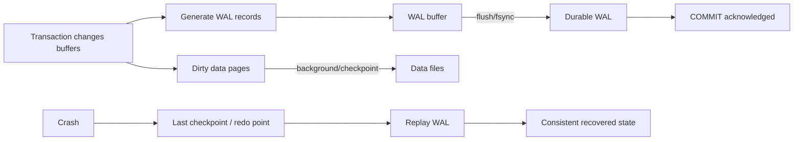
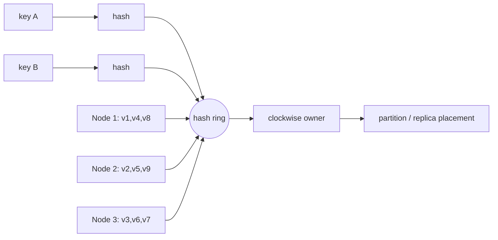

# 2026-09-20 23:00 — Interview Study Packages

README ve yakın `daily/2026-09-20/22-00.md` kontrol edildi. Linux scheduling ve heap allocator konuları tekrar edilmedi. Repo aramasında PostgreSQL WAL/checkpoint/crash-recovery ile consistent hashing/virtual-node temelleri için doğrudan paket bulunmadı.

## Paket 1 — Mid → Principal Databases/SRE: PostgreSQL WAL, Checkpoints, Crash Recovery & Durability
**Süre:** 20–30 dk

### Konu anlatımı
Write-Ahead Logging'in temel kuralı basittir: bir data page'in değişikliği kalıcı data dosyasına güvenle yazılmadan önce, değişikliği yeniden oluşturacak WAL kaydı durable storage'a ulaşmalıdır. Böylece commit sırasında her dirty heap/index page'ini flush etmek gerekmez; crash sonrasında WAL replay ile disk page'leri ileri taşınabilir.

Checkpoint, recovery başlangıç sınırını ilerletir: dirty data pages kontrollü biçimde flush edilir ve checkpoint bilgisi WAL'a kaydedilir. Daha sık checkpoint daha kısa recovery hedefleyebilir fakat write I/O, full-page-image/WAL hacmi ve latency pressure yaratabilir. Daha seyrek checkpoint recovery/WAL retention maliyetini büyütür.

`synchronous_commit` durability acknowledgement sınırıdır. `on` yerel WAL flush'ını bekler; synchronous standby yapılandırıldığında `remote_write`/`remote_apply` farklı remote durability/visibility noktalarını ifade eder. `off` transaction consistency'yi bozmak yerine crash penceresinde son başarılı görünen transaction'ların kaybedilebilmesini kabul eder; `fsync=off` ile aynı risk sınıfı değildir.

### İçeride ne oluyor?
- Buffer cache'teki dirty page ile durable WAL aynı şey değildir; WAL ordering recovery garantisinin çekirdeğidir.
- Commit path çoğunlukla WAL durability bekler; data page'in kendisi daha sonra yazılabilir.
- Group commit birden çok transaction'ın WAL flush maliyetini paylaşabilir.
- Checkpoint dirty pages'i kalıcı data files'a taşır ve crash recovery'nin yeniden oynayacağı WAL aralığını sınırlar.
- Full-page writes, checkpoint sonrası ilk page değişikliklerinde torn-page riskine karşı WAL hacmini artırabilir.
- Replication LSN'leri `write`, `flush`, `replay` aşamalarını ayırır; aynı 'replicated' kelimesi farklı durability/visibility garantileri saklayabilir.

### Yüksek getirili mülakat soruları
1. WAL neden data page'den önce durable olmalıdır?
2. Commit olduğunda ilgili table page mutlaka disk'e yazılmış mıdır?
3. Checkpoint neyi garanti eder ve çok sık checkpoint'in maliyeti nedir?
4. Group commit neden throughput'u artırabilir?
5. `synchronous_commit=off` ile `fsync=off` neden aynı değildir?
6. Senior: WAL write/flush/replay LSN farkları replication lag teşhisini nasıl değiştirir?
7. Staff: p99 commit latency yükselirken CPU düşükse hangi WAL/storage sinyallerini incelersin?
8. Principal: RPO/RTO, synchronous replication, checkpoint ve storage economics birlikte nasıl tasarlanır?

### Seviyeye göre cevap derinliği
- **Mid:** WAL-before-data, commit durability, checkpoint ve crash replay.
- **Senior:** group commit, full-page writes, LSN, archive/PITR ve synchronous commit modes.
- **Staff:** checkpoint pressure, replication durability, recovery drills ve storage telemetry.
- **Principal:** RPO/RTO, cross-region latency, durability tiers, cost ve failure-domain governance.

### Kısa alıştırma
Üç transaction aynı 8 KiB page'i değiştiriyor. WAL flush 2 ms, data-page write 5 ms olsun. Her commit'te data page'i yazmak ile WAL group commit yaklaşımını timeline üzerinde karşılaştır; crash'in üç farklı noktada olması halinde recovery'nin ne yapacağını açıkla.

### Proje fikri
`wal-recovery-lab`: disposable PostgreSQL instance'ında write-heavy workload üret; checkpoint/WAL istatistikleri ile p95/p99 commit latency'yi ölç. Kontrollü crash/restart sonrası recovery süresini kaydet; yalnız test ortamında `synchronous_commit` varyantlarını karşılaştır.

### Failure modes / trade-off / production bağlantısı
WAL'ı replication ile eşitlemek, checkpoint'i 'backup' sanmak, `fsync=off` ile async commit'i aynı riskte görmek ve replica'nın `write` noktasını `replay` sanmak tehlikelidir. Production'da WAL bytes/sec, WAL flush latency, checkpoint write/sync time, buffers written, archive lag, replication write/flush/replay lag ve recovery drill sonuçları birlikte izlenmelidir.

### Kaynaklar
- PostgreSQL 18 — WAL Reliability: https://www.postgresql.org/docs/18/wal.html
- PostgreSQL 18 — WAL Configuration: https://www.postgresql.org/docs/18/wal-configuration.html
- PostgreSQL 18 — Runtime WAL Settings: https://www.postgresql.org/docs/18/runtime-config-wal.html
- PostgreSQL 18 — Monitoring Database Activity / WAL statistics: https://www.postgresql.org/docs/18/monitoring-stats.html

---

## Paket 2 — Junior → Staff Distributed Systems/System Design: Consistent Hashing, Virtual Nodes & Rebalancing
**Süre:** 20–30 dk

### Konu anlatımı
Naif `hash(key) % N` partitioning'de `N` değişince çok sayıda key'in owner'ı değişir. Consistent hashing, node ve key'leri sabit bir hash uzayına yerleştirerek membership değişikliğinin etkisini lokalize etmeyi hedefler. Karger ve arkadaşlarının 1997 çalışmasının ana fikri, hash fonksiyonunun range/population değiştiğinde mapping'i minimum düzeyde bozmasıdır.

Ring mental modelinde key clockwise ilk node'a atanır. Tek token/node yaklaşımı rastgele büyük aralıklar ve load skew yaratabilir. Virtual nodes (vnodes), fiziksel node'u ring üzerinde çok sayıda token ile temsil ederek range dağılımını daha ince parçalara böler. Bu aynı zamanda farklı kapasitedeki makinelerin farklı token ağırlıkları alabilmesine yardımcı olur.

### İçeride ne oluyor?
- Key ve token aynı hash space'e map edilir; sorted token lookup successor owner'ı bulur.
- Node join yalnız etkilenen token ranges'in ownership'ini değiştirir; tüm keyspace yeniden modulo edilmez.
- Vnodes load variance'ı azaltır ve failure/rebalance işini daha fazla fiziksel node'a yayabilir.
- Çok fazla vnode metadata, routing table, movement planning ve operational complexity'yi büyütür.
- Consistent hashing tek başına hot-key problemini çözmez: tek bir aşırı popüler key hâlâ tek partition/replica setini doyurabilir.
- Replication factor ve failure-domain-aware placement ring ownership'ten ayrı ama ilişkili kararlardır.

### Yüksek getirili mülakat soruları
1. `hash(key) % N` node eklenince neden pahalıdır?
2. Consistent hashing hangi remapping problemini çözer?
3. Virtual node neden kullanılır?
4. Vnode sayısını sonsuza çıkarmak neden bedava değildir?
5. Consistent hashing hot key'i çözer mi?
6. Senior: heterogeneous node capacities nasıl temsil edilir?
7. Staff: node failure sonrası rebalancing'in network/disk blast radius'unu nasıl sınırlarsın?
8. Staff: replication placement'ta rack/AZ failure domain'i ring'e nasıl eklersin?

### Seviyeye göre cevap derinliği
- **Junior:** modulo hashing problemi, ring ve clockwise ownership.
- **Mid:** join/leave remapping, vnode ve lookup yapısı.
- **Senior:** weighted capacity, replication, skew, hot keys ve rebalance throttling.
- **Staff:** topology-aware placement, fleet expansion, failure blast radius ve migration observability.

### Kısa alıştırma
0–99 ring üzerinde A=10, B=40, C=75 token'larını çiz; key hash'leri 5, 20, 50, 90 için owner bul. Sonra D=60 ekle ve hangi key ranges'in taşındığını göster. Aynı senaryoyu `%3 -> %4` ile karşılaştır.

### Proje fikri
`hash-ring-lab`: weighted vnodes destekleyen küçük bir partitioner yaz. 1 milyon synthetic key'i 5/10/20 node'a dağıt; node join/leave sonrası moved-key ratio, max/mean load ve rebalance bytes ölç. Zipfian request dağılımı ekleyerek balanced key count ile balanced request load'un aynı olmadığını göster.

### Failure modes / trade-off / production bağlantısı
Key-count balance'ı request/byte balance sanmak, vnode metadata maliyetini yok saymak, rebalance'i limitsiz başlatmak ve rack/AZ failure domain'lerini hesaba katmamak tipik hatalardır. Production'da partition bytes, request QPS, p99, hottest-key share, movement bytes/sec, repair backlog ve node/rack/AZ skew birlikte izlenmelidir.

### Kaynaklar
- Karger et al. — Consistent Hashing and Random Trees, STOC 1997: https://doi.org/10.1145/258533.258660
- MIT publication record: https://people.csail.mit.edu/karger/papers.html
- DeCandia et al. — Dynamo: Amazon's Highly Available Key-value Store, SOSP 2007: https://www.allthingsdistributed.com/files/amazon-dynamo-sosp2007.pdf
