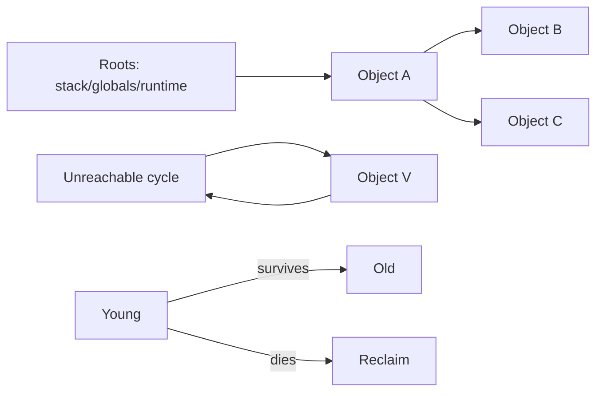
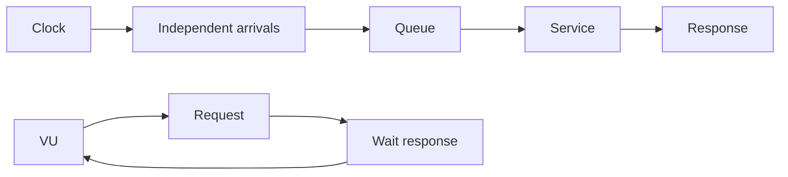

# 2026-09-21 00:00 — Interview Study Packages

README ve yakın `daily/2026-09-20/23-00.md` kontrol edildi. PostgreSQL WAL/checkpoint ile consistent hashing tekrar edilmedi. Repo aramasında garbage collection temelleri ve load testing / coordinated omission için canonical paket bulunmadı.

## Paket 1 — Junior → Staff Foundations/Runtime: Garbage Collection, Reachability, Generations & Heap Economics
**Süre:** 20–30 dk

### Konu anlatımı
Garbage collector'ın temel sorusu “hangi bellek dolu?” değil, “hangi object artık program tarafından erişilebilir değil?” sorusudur. Tracing GC root set'ten başlayıp object graph'ını dolaşır; erişilemeyen nesneler reclaim adayıdır. Reference counting gelen referansları sayar; sıfıra inince hızlı reclaim sağlayabilir fakat cycle'lar ek mekanizma gerektirir.

Generational yaklaşım kısa ömürlü object'lerin yaygın olduğu sezgisinden yararlanır. Young collection daha sık, old collection daha seyrek yapılabilir. Compacting fragmentation'ı azaltabilir fakat relocation maliyeti doğurur. Concurrent/incremental collection pause süresini azaltmaya çalışırken barrier, CPU ve implementation complexity maliyeti getirir.

Production tuning hedefi yalnız “minimum GC pause” değildir: allocation rate, live heap, RSS/headroom, GC CPU ve p99 latency birlikte optimize edilir. Güncel örnekler bunun workload-sensitive olduğunu gösterir: Python 3.14.0–3.14.4'teki incremental GC, production memory-pressure raporları sonrası 3.14.5'te önceki generational tasarıma döndü. Go 1.26 ise Green Tea GC'yi varsayılan yaptı ve GC-heavy gerçek workload'larda overhead azalması hedefliyor.

### İçeride ne oluyor?
- Tracing collector root set'ten reachability yürür; mark/sweep/compact/copy implementation'a göre değişir.
- Reference counting hızlı reclaim sağlayabilir; cycle detection ayrı problemdir.
- Generational GC young-object mortality'den yararlanır; cross-generation pointer'lar write barrier/remembered-set gerektirebilir.
- Compacting fragmentation'ı azaltabilir ve locality sağlayabilir; relocation maliyeti vardır.
- Concurrent/incremental work pause'ı azaltabilir fakat CPU/barrier maliyeti yaratır.
- Heap'i büyütmek collection frequency'yi azaltabilir fakat memory headroom ve container OOM riskini artırır.

### Yüksek getirili mülakat soruları
1. GC reachability'yi nasıl düşünür?
2. Reference counting neden cycle'larda zorlanır?
3. Generational hypothesis nedir?
4. Mark-sweep ile compacting/copying trade-off'u nedir?
5. Write barrier neden gerekir?
6. Senior: allocation rate yüksek ama live heap sabitse bunu leak'ten nasıl ayırırsın?
7. Staff: latency-sensitive serviste heap headroom, CPU ve p99 arasında nasıl tuning yaparsın?
8. Staff: runtime GC değişikliğini fleet'e nasıl güvenli rollout edersin?

### Seviyeye göre cevap derinliği
- **Junior:** reachable/unreachable, heap ve GC amacı.
- **Mid:** tracing vs reference counting, generations, mark/sweep/compact.
- **Senior:** barriers, promotion, allocation rate, pause/throughput ve profiling.
- **Staff:** fleet memory economics, SLO ve workload-specific benchmarking.

### Kısa alıştırma
8 object'lik graph çiz; iki root, bir unreachable cycle ve bir cross-generation pointer ekle. Tracing ile toplanacak object'leri, reference counting'in zorlanacağı cycle'ı ve write-barrier edge'ini işaretle.

### Proje fikri
`gc-pressure-lab`: kısa ömürlü object churn, uzun ömürlü cache ve accidental-retention workload'ları üret. Allocation rate, live heap, RSS, collection duration ve p99 latency'yi karşılaştır.

### Failure modes / trade-off / production bağlantısı
RSS artışını otomatik GC leak saymak, yalnız average pause'a bakmak, tuning'i gerçek allocation/lifetime dağılımından koparmak ve heap büyütmenin container OOM etkisini unutmak tipik hatalardır. Production'da allocation rate, live heap, RSS, GC CPU, collection frequency/duration ve p99 birlikte okunmalıdır.

### Kaynaklar
- Python 3.14.5 release — GC revert: https://www.python.org/downloads/release/python-3145/
- Go 1.26 Release Notes — Green Tea GC: https://go.dev/doc/go1.26
- Go GC Guide: https://go.dev/doc/gc-guide

---

## Paket 2 — Mid → Principal Backend/SRE: Load Testing, Open/Closed Models, Queueing & Coordinated Omission
**Süre:** 20–30 dk

### Konu anlatımı
Load test yalnız “kaç RPS kaldırıyor?” sorusu değildir. Closed model'de yeni iş önceki işin bitişine bağlıdır; sistem yavaşladıkça generator da yavaşlar. Open model arrival'ları response completion'dan bağımsız planlar. Doğru seçim workload'un gerçek arrival mekanizmasına göre yapılmalıdır.

Kararlı queueing mental modelinde Little's Law `L = λ × W` ile average concurrency, throughput ve response time'ı bağlar. Tail latency için p50 yeterli değildir. Coordinated omission, generator'ın yavaş response sırasında yeni request üretmeyi durdurması nedeniyle kötü latency dönemlerinde sample kaçırması ve sonucu iyimser göstermesidir.

Open model'de arrival response completion'dan bağımsızdır. Closed model'de VU response'u beklediği için sistem yavaşladığında offered load da düşebilir.

### İçeride ne oluyor?
- Closed-loop test concurrency'yi sabit tutabilir; throughput sistem yavaşladıkça düşer.
- Arrival-rate/open-loop test hedef arrival rate'i zamana göre üretmeye çalışır.
- Generator kapasitesi yetersizse dropped iterations test sonucunun parçasıdır.
- Mean latency tail'i saklayabilir; histogram ve percentiles gerekir.
- Coordinated omission stall/GC pause/queue collapse sırasında ölçümü iyimser gösterebilir.
- Warm-up, connection reuse, cache state, dataset size ve test duration sonucu değiştirir.
- Load, stress, spike ve soak test farklı failure mode'ları hedefler.

### Yüksek getirili mülakat soruları
1. Load test ile stress test farkı nedir?
2. Open ve closed workload model farkı nedir?
3. Little's Law neyi ilişkilendirir?
4. p99 neden average latency'den farklı bilgi verir?
5. Coordinated omission nedir?
6. Senior: generator saturation ile SUT saturation nasıl ayrılır?
7. Staff: capacity testinden autoscaling policy'sine nasıl güvenli çıkarım yapılır?
8. Principal: regional failure için capacity headroom nasıl modele girer?

### Seviyeye göre cevap derinliği
- **Mid:** throughput, latency, concurrency, percentile ve test türleri.
- **Senior:** open/closed model, queueing, coordinated omission, warm-up ve attribution.
- **Staff:** SLO-derived workload, autoscaling, headroom, dependency saturation ve failure injection.
- **Principal:** capacity economics, regional loss, demand growth ve cost/risk.

### Kısa alıştırma
Sistem 2.000 req/s alıyor ve average response time 50 ms. Little's Law ile average in-flight request sayısını hesapla. Latency 500 ms'ye çıkarken arrival rate sabit kalırsa concurrency baskısını yeniden hesapla; closed-loop generator ile farkı açıkla.

### Proje fikri
`latency-lab`: aynı HTTP servisini k6 constant-VUs ve constant-arrival-rate ile test et. Kontrollü 500 ms stall enjekte et; throughput, dropped iterations ve p50/p95/p99'i karşılaştır. HdrHistogram ile coordinated-omission etkisini incele.

### Failure modes / trade-off / production bağlantısı
Laptop testinden production kapasitesi çıkarmak, generator bottleneck'ini SUT bottleneck'i sanmak, yalnız average/p50 raporlamak, unrealistic cache/connection state kullanmak ve closed-loop sonucu independent-arrival workload'a genellemek tipik hatalardır. Production'da arrival rate, queue depth, dependency limits, autoscaling lag, saturation ve p99 birlikte okunmalıdır.

### Kaynaklar
- Grafana k6 — Open and closed models: https://grafana.com/docs/k6/latest/using-k6/scenarios/concepts/open-vs-closed/
- Grafana k6 — Scenarios: https://grafana.com/docs/k6/latest/using-k6/scenarios/
- HdrHistogram: https://github.com/HdrHistogram/HdrHistogram
- Google SRE Workbook — Load Testing: https://sre.google/workbook/load-testing/
