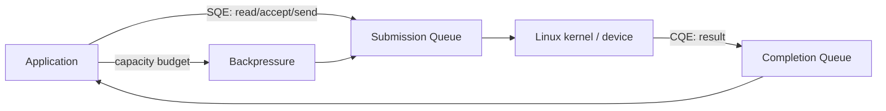
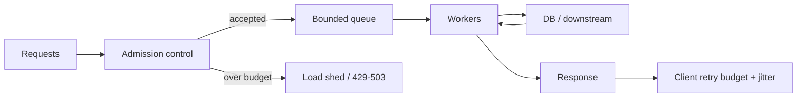

# 2026-09-21 01:00 — Interview Study Packages

README ve yakın `daily/2026-09-21/00-00.md` kontrol edildi. Garbage collection ile load testing/coordinated omission tekrar edilmedi. Repo aramasında Linux `io_uring` / completion-based async I/O için canonical paket bulunmadı; ikinci paket mülakat pratiği olarak backpressure/admission-control tasarımına ayrıldı.

## Paket 1 — Mid → Staff Foundations/Backend: Linux Async I/O — epoll, io_uring, SQ/CQ ve Backpressure
**Süre:** 20–30 dk

### Konu anlatımı
`epoll`, çok sayıda file descriptor için readiness bildirir: kernel interest list içindeki descriptor'lardan I/O'ya hazır olanları ready list'e taşır; uygulama hazır descriptor üzerinde `read`/`write` gibi işi ayrıca yapar. `io_uring` ise shared submission queue (SQ) ve completion queue (CQ) üzerinden operation submission/completion modeli sunar. Uygulama SQE hazırlar, kernel operation'ı işler, sonuç CQE olarak döner.

Bu ayrım mülakatta önemlidir: readiness ile completion aynı mental model değildir. `io_uring` batching ve bazı kernel/user transition maliyetlerini azaltabilir; ancak ring doluluğu, buffer lifetime, completion draining ve downstream kapasitesi için backpressure hâlâ gerekir. Zero-copy de ücretsiz değildir: pinning/accounting/completion maliyetleri ve hardware/operation kısıtları vardır.

### İçeride ne oluyor?
- `epoll`: interest list + ready list; level-triggered veya edge-triggered olabilir.
- `io_uring`: SQ/CQ userspace ile kernel arasında shared ring buffers'dır.
- Birden fazla SQE batch edilip submit edilebilir; completion'lar CQE olarak tüketilir.
- Queue depth yükseltmek throughput sağlayabilir ama memory, tail latency ve downstream pressure'ı artırabilir.
- Buffer/request state gerekli lifetime boyunca geçerli tutulmalıdır.
- Completion queue düzenli drain edilmezse uygulama ilerlemesi ve kapasite bozulur.
- Zero-copy yalnız copy maliyetini hedefler; page pinning/accounting ve completion bookkeeping maliyetleri devam eder.
- Güncel Linux'ta io_uring zero-copy receive, payload'ı kernel TCP stack'i koruyarak userspace memory'ye doğrudan alabilen özel bir yoldur; NIC queue/steering gereksinimleri vardır.

### Yüksek getirili mülakat soruları
1. Blocking I/O, readiness ve completion modellerini ayır.
2. `epoll` interest list ve ready list ne işe yarar?
3. `io_uring` SQE ve CQE nedir?
4. Batching neden syscall/context-switch maliyetini azaltabilir?
5. Queue depth'i sürekli büyütmek neden çözüm değildir?
6. Senior: buffer lifetime bug'ları hangi failure mode'ları üretir?
7. Staff: io_uring tabanlı server'da admission control/backpressure'ı nereye koyarsın?
8. Staff: zero-copy'nin gerçekten kazanç sağladığını nasıl benchmark edersin?

### Seviyeye göre cevap derinliği
- **Mid:** blocking vs readiness vs completion; SQ/CQ temel modeli.
- **Senior:** batching, buffer lifetime, queue depth, cancellation/timeout ve backpressure.
- **Staff:** CPU/cache locality, ring-per-thread, downstream budgets, zero-copy ve production rollout.

### Kısa alıştırma
Bir HTTP proxy için aynı request path'ini iki kez çiz: `epoll` readiness loop ve `io_uring` submission/completion loop. Her iki modelde queue/backpressure noktasını ve timeout/cancellation sınırını işaretle.

### Proje fikri
`async-io-lab`: aynı echo/file server'ı blocking threads, epoll ve liburing ile uygula. 1/32/256 concurrency seviyelerinde throughput, p50/p99, syscalls, context switches, CPU ve RSS ölç. Queue depth'i kontrollü değiştir.

### Failure modes / trade-off / production bağlantısı
`io_uring = her zaman daha hızlı` varsayımı, sınırsız in-flight operation, CQ'yu geç drain etmek, buffer lifetime hataları ve benchmark'ı gerçek workload'dan koparmak tipik hatalardır. Production'da in-flight count, SQ/CQ pressure, completion latency, syscall/context-switch sayısı, CPU, memory ve downstream saturation birlikte izlenmelidir.

### Kaynaklar
- Linux man-pages — epoll(7): https://man7.org/linux/man-pages/man7/epoll.7.html
- Linux man-pages — io_uring(7): https://man7.org/linux/man-pages/man7/io_uring.7.html
- Linux man-pages — io_uring_enter(2): https://man7.org/linux/man-pages/man2/io_uring_enter.2.html
- Linux kernel — io_uring zero-copy Rx: https://kernel.org/doc/html/latest/networking/iou-zcrx.html

---

## Paket 2 — Senior → Principal System Design Practice: Admission Control, Bounded Concurrency & Overload Collapse
**Süre:** 20–30 dk

### Konu anlatımı
Backpressure yalnız queue dolunca hata dönmek değildir; sistemin kabul ettiği work miktarını kapasite ve latency budget'ına göre sınırlama problemidir. Bir service request kabul ettikten sonra thread/goroutine, memory, connection pool, DB transaction, downstream QPS ve retry budget tüketebilir. Sınırsız queue kısa spike'ı absorbe eder gibi görünür fakat bekleme süresini büyütüp timeout ve retry dalgası yaratarak overload collapse'a dönüşebilir.

Temel tasarım: kapasiteyi ölç, bounded concurrency/queue kullan, timeout budget'ını uçtan uca taşı, retry'ları sınırlı ve jitter'lı yap, kritik/nonkritik işi ayır ve saturation başlamadan load shed et.

### Mülakat senaryosu
Bir API normalde 5k RPS, kampanyada 15k RPS görüyor. DB 300 concurrent query sonrasında p99'u keskin yükseltiyor. Uygulama 2.000 request queue tutuyor ve client'lar 1 saniye timeout sonrası 3 kez retry ediyor. Sistemi overload collapse'a girmeden nasıl tasarlarsın?

### Beklenen reasoning
- Bottleneck'i DB concurrency/latency curve ile tanımla; app worker sayısını rastgele büyütme.
- DB pool'u resource semaphore olarak gör; request concurrency'yi pool önünde sınırla.
- Bounded queue ve queue-wait deadline kullan; iş artık SLO içinde tamamlanamayacaksa erken reject et.
- Retry budget, exponential backoff+jitter ve idempotency kullan; retry amplification'ı ölç.
- Endpoint/tenant/priority bazlı admission veya fairness gerekebilir.
- Load shedding'i circuit breaker'dan ayır: biri overload kabulünü, diğeri unhealthy dependency çağrılarını yönetebilir.
- Autoscaling'i tek başına çözüm sayma; DB bottleneck ise app replica artışı DB'yi daha çok sıkıştırabilir.

### Yüksek getirili sorular
1. Queue neden kapasite değildir?
2. Semaphore ile rate limiter neyi farklı sınırlar?
3. Connection pool neden yalnız performance optimization değildir?
4. Retry storm nasıl oluşur?
5. Timeout budget neden hop başına bağımsız seçilmemelidir?
6. Staff: tenant fairness nasıl eklenir?
7. Principal: overload policy'yi ürün tier/SLO/cost ile nasıl bağlarsın?

### Kısa alıştırma
DB'nin güvenli concurrency'si 250, average query süresi 40 ms ise kaba throughput sınırını Little's Law sezgisiyle hesapla. Sonra query süresi saturation altında 200 ms olduğunda aynı concurrency'nin throughput ve queue etkisini tartış.

### Proje fikri
`overload-lab`: API + sınırlı DB simulator kur. Unbounded queue, bounded queue, semaphore admission ve load shedding varyantlarını aynı open-loop load altında karşılaştır. p99, rejection rate, useful throughput ve retry amplification ölç.

### Failure modes / production bağlantısı
Queue length'i sonsuz artırmak, timeout sonrası server-side işi iptal etmemek, tüm request'lere aynı priority vermek, retry budget kullanmamak ve autoscaling'i downstream limitlerinden bağımsız ayarlamak tipik failure mode'lardır. Production'da admitted/rejected rate, queue wait, in-flight, pool utilization, downstream p99, timeout ve retry amplification birlikte izlenmelidir.

### Kaynaklar
- Google SRE Book — Handling Overload: https://sre.google/sre-book/handling-overload/
- Google SRE Book — Addressing Cascading Failures: https://sre.google/sre-book/addressing-cascading-failures/
- AWS Builders' Library — Timeouts, retries and backoff with jitter: https://aws.amazon.com/builders-library/timeouts-retries-and-backoff-with-jitter/
