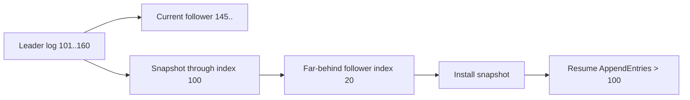
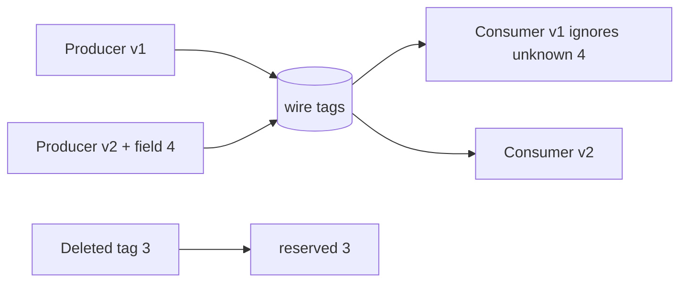

# 2026-09-21 01:00 — Interview Study Packages

README ve yakın `daily/2026-09-21/00-00.md` kontrol edildi. Garbage collection ile load testing tekrar edilmedi. Repo çapı aramada `io_uring` için daha eski canonical içerik bulunduğu için ilk taslak elendi. Raft log compaction/snapshotting ile Protobuf schema evolution/wire compatibility için eşleşme bulunmadı.

## Paket 1 — Mid → Principal Distributed Systems: Raft Log Compaction, Snapshots & Recovery
**Süre:** 20–30 dk

### Konu anlatımı
Raft'ın replicated log'u sınırsız büyüyemez. State machine belirli bir log index'ine kadar uygulanmış durumu snapshot olarak kalıcılaştırabilir; snapshot'ın kapsadığı eski log prefix'i normal operation için tutulmak zorunda değildir. Kritik invariant snapshot'ın hangi `lastIncludedIndex` ve `lastIncludedTerm` noktasına ait olduğunun bilinmesidir.

Follower çok gerideyse leader'ın retained log'u follower'ın ihtiyaç duyduğu prefix'i artık içermeyebilir. Bu durumda tek tek `AppendEntries` yerine snapshot transferi gerekir. Snapshot install sonrası follower state machine'i snapshot'a getirir ve daha yeni suffix ile replication'a devam eder.

### İçeride ne oluyor?
- Snapshot state machine state + `lastIncludedIndex/Term` metadata'sını taşır.
- Compaction disk kullanımını ve restart/replay süresini sınırlar.
- Çok geride follower için snapshot transferi eski prefix'i replay etmekten daha verimli olabilir.
- Snapshot oluşturma I/O/CPU baskısı yaratabilir; implementation copy-on-write/incremental teknikler kullanabilir.
- Snapshot atomik/durable yayınlanmadan eski log'u silmek recovery riskidir.
- Membership/configuration state recovery sırasında kaybolmamalıdır.

### Yüksek getirili mülakat soruları
1. Raft log neden compact edilir?
2. Snapshot hangi index/term metadata'sını taşımalıdır?
3. Follower retained log'dan daha gerideyse ne olur?
4. Snapshot ile WAL/log aynı şey midir?
5. Senior: snapshot crash sırasında yarım kalırsa güvenli recovery nasıl tasarlanır?
6. Staff: snapshot frequency için disk, network, recovery time ve write amplification nasıl dengelenir?
7. Principal: çok büyük state'te snapshot transferinin cluster availability etkisini nasıl sınırlarsın?

### Seviyeye göre cevap derinliği
- **Mid:** replicated log, snapshot ve compaction amacı.
- **Senior:** install-snapshot, durability ve crash recovery.
- **Staff:** cadence, I/O isolation, lagging replica ve operational metrics.
- **Principal:** RTO, fleet economics ve snapshot-format upgrade compatibility.

### Kısa alıştırma
Leader snapshot'ı index 100'e kadar aldı ve log'da 101–160 var. Follower matchIndex=35. Normal `AppendEntries` neden yetmeyebilir? Snapshot install sonrası replication'ın nereden devam edeceğini çiz.

### Proje fikri
`mini-raft-snapshot-lab`: replicated key/value state machine'e threshold-based snapshot ekle. Bir follower'ı uzun süre kapat; log compact edildikten sonra snapshot ile catch-up yaptır. Crash sırasında temp snapshot bırakıp recovery davranışını test et.

### Failure modes / trade-off / production bağlantısı
Snapshot durable olmadan log prefix'ini silmek, metadata'yı state ile atomik tutmamak, transferin network/I/O'yu doyurmasına izin vermek ve yalnız log byte size'a bakıp recovery süresini ölçmemek tipik hatalardır. Production'da retained-log bytes, snapshot duration/size, install duration, replica lag ve restart recovery time birlikte izlenir.

### Kaynaklar
- Raft paper: https://raft.github.io/raft.pdf
- Raft website: https://raft.github.io/

---

## Paket 2 — Mid → Staff Backend/Data Engineering: Schema Evolution & Protobuf Wire Compatibility
**Süre:** 20–30 dk

### Konu anlatımı
Producer ve consumer aynı anda deploy olmaz; rollback de mümkündür. Schema evolution bu yüzden yalnız yeni field eklemek değil, eski ve yeni binary'lerin aynı wire data ile birlikte yaşayabilmesini tasarlamaktır. Protocol Buffers binary wire format'ta field name yerine field number/tag kullanır; eski parser bilmediği yeni field'ı atlayabilir. Additive değişiklikler bu nedenle güçlüdür ama her schema değişikliği güvenli değildir.

Kullanımdaki field number değiştirilmemeli ve eski tag yeni anlamla tekrar kullanılmamalıdır. Field silinirse numarasını `reserved` yapmak gelecekte yanlış reuse'u engeller. Wire-compatible olmak semantic-compatible olmakla aynı değildir: parser veriyi okuyabilir ama uygulama anlamı, defaults, enum davranışı veya validation değişmiş olabilir.

### İçeride ne oluyor?
- Binary key field number + wire type taşır; field name wire identity değildir.
- Existing field number değiştirmek wire-unsafe'tır.
- Yeni field eski binary tarafından unknown field olarak tolere edilebilir.
- Silinen field'ın tag'ini yeniden kullanmamak ve reserve etmek gerekir.
- Bazı type değişiklikleri wire-compatible olsa bile lossy/semantic risk taşıyabilir.
- JSON/TextFormat compatibility kuralları binary wire kurallarından farklı olabilir.
- Rolling deploy ve rollback testleri schema review'un parçası olmalıdır.

### Yüksek getirili mülakat soruları
1. Backward ve forward compatibility ne demektir?
2. Protobuf field number neden değiştirilemez?
3. Silinen tag neden reserve edilir?
4. Unknown fields rolling deploy'u nasıl kolaylaştırır?
5. Senior: wire-compatible ama semantic-breaking değişikliğe örnek ver.
6. Staff: event schema registry/deploy gate nasıl tasarlanır?
7. Staff: producer-first ve consumer-first rollout hangi değişikliklerde güvenlidir?

### Seviyeye göre cevap derinliği
- **Mid:** tags, additive field, unknown field ve reserve.
- **Senior:** wire-safe/compatible/unsafe, defaults/presence ve rollback.
- **Staff:** compatibility policy, contract tests, schema registry ve multi-team governance.

### Kısa alıştırma
`User { string name = 1; int32 age = 2; }` şemasında `age` kaldırılıp `birth_year` eklenecek. `2` neden reuse edilmemeli? `reserved` kullanan güvenli v2 şemasını ve v1/v2 producer-consumer matrisini yaz.

### Proje fikri
`schema-evolution-lab`: v1/v2/v3 Protobuf mesajları üret. Eski/yeni producer-consumer kombinasyonlarını golden bytes ile test et; CI'da field-number reuse ve breaking schema değişikliklerini fail ettiren compatibility kontrolü ekle.

### Failure modes / trade-off / production bağlantısı
Field number reuse, yalnız latest/latest kombinasyonunu test etmek, binary compatibility'yi JSON compatibility sanmak ve semantic validation değişikliklerini schema-safe kabul etmek tipik hatalardır. Production'da decode failures, unknown/invalid enum davranışı, schema-version adoption ve rollback başarısı izlenir.

### Kaynaklar
- Protocol Buffers — Updating a Message Type: https://protobuf.dev/programming-guides/proto3/#updating
- Protocol Buffers — Encoding: https://protobuf.dev/programming-guides/encoding/
- Protocol Buffers — Best Practices: https://protobuf.dev/best-practices/dos-donts/
