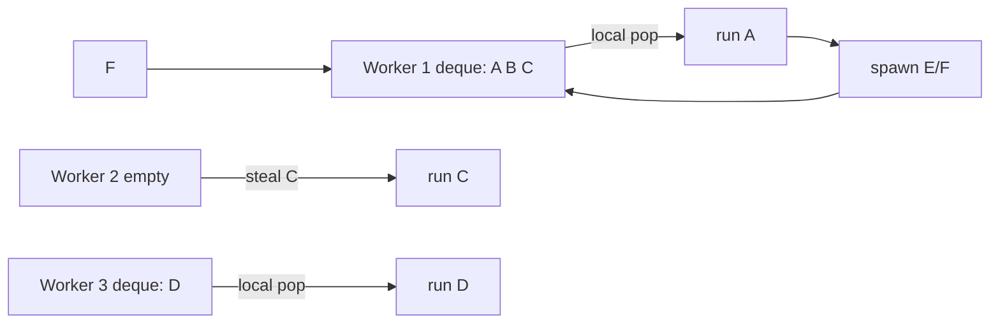
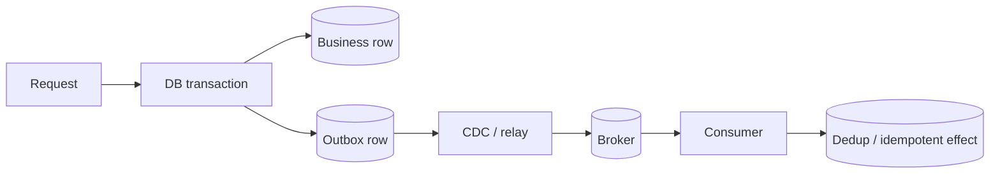

# 2026-09-21 02:00 — Interview Study Packages

README ve yakın `daily/2026-09-21/01-00.md` kontrol edildi. Raft snapshotting ve Protobuf schema evolution tekrar edilmedi. Repo çapı aramada eBPF ile LSM-tree konularının zaten canonical işlendiği görüldü ve elendi. Work stealing scheduler ile transactional outbox için eşleşme bulunmadı.

## Paket 1 — Mid → Staff Foundations/Algorithms: Work-Stealing Schedulers, Deques & Parallelism Economics
**Süre:** 20–30 dk

### Konu anlatımı
Sabit bir global task queue basit olsa da çok çekirdekte contention ve load imbalance yaratabilir. Work stealing yaklaşımında her worker çoğunlukla kendi local deque'undan iş tüketir; işi biten worker başka worker'ın kuyruğundan task çalmaya çalışır. Amaç merkezi scheduler hot spot'ını azaltırken düzensiz parallel workload'u dinamik dengelemektir.

Fork/join workload'larında çalışan worker yeni işi local queue'ya bırakır ve bir branch'i kendisi yürütür. Idle worker diğer branch'i steal edebilir. Bu model parallel recursive algorithms, build systems ve data-parallel runtimes için güçlüdür; fakat blocking I/O, nested pools, oversubscription ve lock interaction performans/correctness sürprizleri yaratabilir.

### İçeride ne oluyor?
- Her worker'ın local deque'u common-path contention'ı azaltır.
- Worker local işi varken locality avantajıyla onu yürütür; boş kalınca victim seçip steal dener.
- Fork/join'de task granularity çok küçükse scheduling overhead faydayı yiyebilir.
- Çok büyük task'lar ise bir worker'ı uzun süre meşgul edip parallelism'i düşürür.
- CPU count gerçek usable parallelism ile aynı değildir; container/cgroup, affinity, SMT ve heterogeneous cores etkiler.
- Blocking task worker pool'u tüketebilir; CPU-bound ve blocking workload'ları ayırmak gerekebilir.
- Nested parallel runtimes oversubscription ve lock-order sorunları yaratabilir.

### Yüksek getirili mülakat soruları
1. Work stealing neden tek global queue'dan daha ölçeklenebilir olabilir?
2. Deque neden scheduler için yararlıdır?
3. Task granularity çok küçük veya çok büyük olursa ne olur?
4. CPU sayısı ile ideal worker sayısı neden her zaman aynı değildir?
5. Senior: blocking I/O work-stealing pool'u nasıl bozabilir?
6. Staff: nested thread pool + lock kombinasyonunda deadlock/oversubscription riskini nasıl analiz edersin?
7. Staff: NUMA ve heterogeneous cores varsa scheduler politikasını nasıl ölçersin?

### Seviyeye göre cevap derinliği
- **Mid:** local queues, steal, fork/join ve load balance.
- **Senior:** granularity, blocking, locality, oversubscription ve instrumentation.
- **Staff:** NUMA/topology, nested runtime contracts, fairness ve fleet-level CPU economics.

### Kısa alıştırma
8 worker'lı pool'da 1.000 adet 50 µs task ile 10 adet 5 ms task'ı karşılaştır. Scheduling overhead, load balance ve tail latency açısından hangi batching/granularity stratejisini denersin? Ölçeceğin üç metriği yaz.

### Proje fikri
`work-steal-lab`: per-worker deque'lu küçük bir executor kur. Global-queue baseline ile recursive parallel sum ve düzensiz task-duration workload'larında throughput, steal count, queue depth ve p99 completion time karşılaştır.

### Failure modes / trade-off / production bağlantısı
Oversubscription, blocking task'ların CPU pool'unu işgal etmesi, aşırı küçük task, nested pool deadlock'u ve yalnız average CPU utilization'a bakmak tipik hatalardır. Production'da runnable task count, local/steal ratio, steal failures, worker park time, task duration distribution, CPU throttling ve context-switch rate birlikte izlenir.

### Kaynaklar
- Rayon FAQ — work stealing: https://github.com/rayon-rs/rayon/blob/main/FAQ.md
- Rayon `join`: https://docs.rs/rayon/latest/rayon/fn.join.html
- Rust `available_parallelism`: https://doc.rust-lang.org/std/thread/fn.available_parallelism.html

---

## Paket 2 — Mid → Principal Backend/Distributed Systems: Transactional Outbox, CDC & Exactly-Once Boundaries
**Süre:** 20–30 dk

### Konu anlatımı
Bir request hem relational database state'ini değiştirip hem message broker'a event publish ediyorsa klasik dual-write problemi doğar: DB commit olup publish başarısız olabilir veya event publish olup DB rollback olabilir. Transactional outbox bu iki side effect'i tek distributed transaction'a zorlamak yerine business row ile outbox row'u aynı local database transaction'ında yazar. Ayrı relay/CDC katmanı committed outbox kayıtlarını broker'a taşır.

Bu pattern “dünyada exactly once” sağlamaz. Relay crash/retry nedeniyle event duplicate olabilir; consumer'ın idempotent/dedup davranması gerekir. Kafka transaction'ları Kafka içindeki output records + consumed offsets gibi belirli sınırları atomik hale getirebilir, fakat harici database/API side effect'lerini otomatik olarak aynı transaction'a katmaz.

### İçeride ne oluyor?
- Business mutation + outbox INSERT aynı ACID transaction'da commit edilir.
- CDC/relay yalnız committed outbox change'lerini publish eder.
- Stable event ID duplicate detection için kullanılabilir.
- Aggregate ID'nin message key olması per-aggregate ordering'e yardımcı olabilir.
- Relay at-least-once davranabilir; publish sonrası crash aynı event'in yeniden gönderilmesine yol açabilir.
- Consumer side effect'i idempotent değilse inbox/dedup table veya natural idempotency key gerekir.
- Outbox retention/cleanup CDC lag ve replay ihtiyacıyla koordine edilmelidir.

### Yüksek getirili mülakat soruları
1. Dual-write problemi nedir?
2. Transactional outbox neden 2PC gerektirmez?
3. Outbox duplicate event'i tamamen engeller mi?
4. Event ID ve aggregate ID'nin rolleri nasıl ayrılır?
5. Senior: publish başarılı fakat relay checkpoint yazamadan crash olursa ne olur?
6. Staff: outbox cleanup ile CDC lag arasında hangi invariant gerekir?
7. Principal: “exactly once” iddiasının transaction boundary'sini nasıl açıkça tanımlarsın?

### Seviyeye göre cevap derinliği
- **Mid:** local transaction + outbox + relay mental modeli.
- **Senior:** duplicates, idempotency, ordering, retries ve cleanup.
- **Staff:** CDC operations, schema evolution, lag/backpressure ve replay.
- **Principal:** cross-system correctness contract, exactly-once boundary, compliance/audit ve platform standardization.

### Kısa alıştırma
Order service DB'ye `PAID` yazıyor ve `OrderPaid` event'i yayımlıyor. Şu crash noktalarını tek tek analiz et: transaction commit öncesi; commit sonrası CDC görmeden; broker ack sonrası relay checkpoint öncesi; consumer effect sonrası offset commit öncesi. Her biri için expected retry/dedup davranışını yaz.

### Proje fikri
`outbox-cdc-lab`: PostgreSQL'de `orders` + `outbox` tablolarını aynı transaction'da güncelle. Relay'e intentional crash points ekle. Event ID ile consumer dedup uygula; duplicate rate, publish lag ve outbox backlog metriklerini çıkar.

### Failure modes / trade-off / production bağlantısı
Outbox ile exactly-once'u eşitlemek, unstable event IDs, aggregate ordering'i yok saymak, cleanup'ın lagging CDC'den veri silmesi, poison event'in relay'i durdurması ve consumer idempotency'sini test etmemek tipik hatalardır. Production'da oldest-outbox age, CDC lag, publish retry/duplicate count, dead-letter rate, consumer dedup hits ve end-to-end event latency izlenir.

### Kaynaklar
- Debezium Outbox Event Router: https://debezium.io/documentation/reference/transformations/outbox-event-router.html
- Apache Kafka Design — transactions/exactly-once boundary: https://kafka.apache.org/41/design/design/
