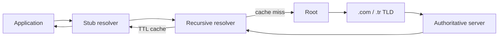
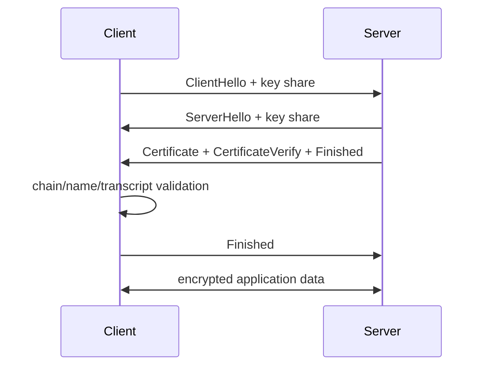

# 2026-09-21 03:00 — Interview Study Packages

README ve yakın `daily/2026-09-21/02-00.md` kontrol edildi. Work-stealing scheduler ve transactional outbox tekrar edilmedi. Repo çapı aramada DNS resolver internals ile TLS 1.3 handshake/PKI için doğrudan canonical paket bulunmadı; bu tur Foundations + Networking/Security eksiklerine ayrıldı.

## Paket 1 — Junior → Staff Networking: DNS Resolution, Caching, Negative Answers & DNSSEC
**Süre:** 20–30 dk

### Konu anlatımı
DNS bir hostname→IP sözlüğünden fazlasıdır: namespace delegasyonu, recursive resolution, caching ve failure semantics içeren dağıtık bir veritabanıdır. Stub resolver çoğunlukla recursive resolver'a soru yollar. Cache miss olduğunda recursive resolver root → TLD → authoritative zincirini takip ederek cevabı bulur ve TTL süresince cache'ler.

Pozitif cevap kadar negatif cevap da önemlidir. `NXDOMAIN` ismin var olmadığını; `NOERROR/NODATA` ise isim var olsa da sorulan record type'ın bulunmadığını ifade edebilir. Negatif caching, aynı başarısız sorguların authoritative altyapıya tekrar tekrar gitmesini engeller. DNSSEC gizlilik sağlamaz; DNS verisinin origin authentication ve integrity doğrulamasını amaçlar. Resolver zincirinde latency, cache-hit ratio ve delegation correctness production davranışını belirler.

### İçeride ne oluyor?
- Stub resolver genellikle recursion işini recursive resolver'a bırakır.
- Resolver cache miss'te delegation zincirini iteratif sorgularla takip eder.
- A/AAAA doğrudan address; CNAME alias; NS delegation; SOA zone metadata taşır.
- TTL freshness ile authoritative query yükü arasında trade-off'tur.
- NXDOMAIN ile NODATA aynı failure değildir; troubleshooting ve caching semantics farklıdır.
- Negative caching SOA bilgisinden türetilen süreyle tekrar başarısız sorguları azaltır.
- DNSSEC DNSKEY/DS ve imzalı RRset zinciriyle trust chain kurar; confidentiality sağlamaz.
- UDP yaygın transport olsa da truncation, büyük cevaplar ve modern encrypted DNS transport seçenekleri transport varsayımlarını önemli kılar.

### Yüksek getirili mülakat soruları
1. Browser'a bir hostname yazdığında DNS çözümleme zinciri nasıl ilerler?
2. Recursive ve authoritative DNS server farkı nedir?
3. TTL çok düşük veya çok yüksek olursa ne kazanır/kaybedersin?
4. NXDOMAIN ile NODATA farkı nedir?
5. CNAME neden zone apex gibi bazı yerlerde problem yaratabilir?
6. Senior: DNS cache stampede / TTL expiry dalgasını nasıl azaltırsın?
7. Staff: multi-region failover için DNS'i tek kontrol mekanizması yapmak neden risklidir?
8. Staff: DNSSEC hangi saldırı sınıfını azaltır, hangilerini çözmez?

### Seviyeye göre cevap derinliği
- **Junior:** A/AAAA, resolver, authoritative server ve TTL.
- **Mid:** delegation, CNAME/NS/SOA, cache ve negative answers.
- **Senior:** failure semantics, retry amplification, DNSSEC ve operational debugging.
- **Staff:** multi-region routing, propagation windows, resolver diversity, blast radius ve failover economics.

### Kısa alıştırma
`api.example.com` için 300 saniye TTL varsay. 10.000 client aynı recursive resolver'ı kullanıyor. Record değişiminden sonraki 10 dakikada eski/yeni cevabın görülebileceği pencereleri çiz. Ardından authoritative server 2 dakika unreachable olursa warm cache ve cold cache davranışını karşılaştır.

### Proje fikri
`dns-walk-lab`: root'tan başlayarak NS delegation'larını takip eden küçük bir iterative resolver gözlem aracı yaz. Her hop için response code, authoritative flag, TTL, CNAME chain ve toplam latency kaydet; cache açık/kapalı deneyini karşılaştır.

### Failure modes / trade-off / production bağlantısı
TTL'yi deploy propagation süresi sanmak, NXDOMAIN'i generic timeout gibi retry etmek, recursive resolver dependency'sini göz ardı etmek, DNS failover'ı health-aware load balancer sanmak ve DNSSEC'i encryption ile karıştırmak tipik hatalardır. Production'da resolver latency, cache hit ratio, SERVFAIL/NXDOMAIN rate, authoritative availability, record age ve propagation gözlemleri birlikte izlenir.

### Kaynaklar
- RFC 1034 — Domain Names Concepts and Facilities: https://www.rfc-editor.org/rfc/rfc1034
- RFC 1035 — Domain Names Implementation and Specification: https://www.rfc-editor.org/rfc/rfc1035
- RFC 2308 — Negative Caching of DNS Queries: https://www.rfc-editor.org/rfc/rfc2308
- RFC 4033 — DNS Security Introduction and Requirements: https://www.rfc-editor.org/rfc/rfc4033

---

## Paket 2 — Mid → Principal Security/Networking: TLS 1.3 Handshake, PKI, Resumption & 0-RTT
**Süre:** 20–30 dk

### Konu anlatımı
TLS'in amacı yalnız trafiği şifrelemek değildir: endpoint authentication, confidentiality ve integrity sağlar. TLS 1.3 handshake'inde client ve server ortak cryptographic parameters/key share üzerinde anlaşır; server certificate chain ile kimliğini kanıtlar; handshake transcript doğrulandıktan sonra application traffic keys ile veri taşınır. Forward secrecy modern ephemeral key exchange'in temel faydalarındandır.

PKI tarafında client yalnız certificate içindeki hostname'e bakmaz: certificate chain'i güvenilen trust anchor'a kadar doğrular, validity/usage/name kontrollerini yapar. Session resumption önceki bağlantıdan türetilen PSK ile handshake maliyetini azaltabilir. 0-RTT ise resumed connection'da application data'yı daha erken gönderebilir fakat replay riski taşır; bu nedenle non-idempotent side effect'lerde varsayılan güvenli seçim değildir.

### İçeride ne oluyor?
- ClientHello supported versions, cipher suites/extensions ve key share bilgisini taşır.
- Ephemeral Diffie-Hellman key agreement forward secrecy sağlar; certificate private key doğrudan bulk traffic'i şifrelemez.
- Certificate chain leaf → intermediate → trusted root doğrulama modelidir.
- SNI server'ın aynı endpoint'te doğru certificate/site seçmesine yardım eder; ALPN HTTP/2 gibi application protocol negotiation yapar.
- Finished mesajları handshake transcript'inin bütünlüğünü doğrular.
- Resumption PSK/session ticket ile round-trip ve public-key maliyetini azaltabilir.
- TLS 1.3 0-RTT early data replay edilebilir; application protocol replay riskini yönetmelidir.
- TLS termination noktası trust boundary'dir; proxy/service-mesh mimarisinde plaintext'in nerede bulunduğu açıkça modellenmelidir.

### Yüksek getirili mülakat soruları
1. TLS hangi üç temel güvenlik özelliğini sağlar?
2. Certificate ile symmetric session key aynı şey midir?
3. Certificate chain doğrulaması nasıl çalışır?
4. Forward secrecy nedir ve neden önemlidir?
5. SNI ile ALPN ne işe yarar?
6. Senior: session resumption ne kazandırır?
7. Staff: 0-RTT neden POST/payment gibi işlemlerde risklidir?
8. Principal: edge TLS termination, internal mTLS ve certificate rotation politikasını nasıl tasarlarsın?

### Seviyeye göre cevap derinliği
- **Mid:** handshake, certificate, symmetric encryption ve hostname validation.
- **Senior:** ephemeral key exchange, transcript integrity, resumption, SNI/ALPN ve rotation.
- **Staff:** 0-RTT replay, mTLS identity, termination boundaries, observability ve failure modes.
- **Principal:** enterprise PKI, trust-domain segmentation, cryptographic agility, incident response ve compliance ownership.

### Kısa alıştırma
Bir API gateway'de TLS edge'de terminate ediliyor, gateway→service trafiği plaintext. Threat model çıkar: network observer, compromised gateway, compromised service node ve stolen certificate key senaryolarında hangi güvenlik özelliklerinin kaldığını yaz. Sonra internal mTLS eklenince değişen trust boundary'leri işaretle.

### Proje fikri
`tls-inspector-lab`: bir hostname'e bağlanıp negotiated TLS version/cipher, ALPN, leaf certificate SAN'ları, issuer, validity window ve chain bilgisini raporlayan CLI yaz. Expiry threshold alarmı ve handshake latency histogramı ekle.

### Failure modes / trade-off / production bağlantısı
TLS'i yalnız encryption sanmak, certificate private key'in session traffic'i doğrudan şifrelediğini düşünmek, hostname validation'ı atlamak, certificate expiry/rotation'ı manuel bırakmak, 0-RTT'yi replay-safe olmayan endpoint'lerde açmak ve termination sonrası plaintext trust boundary'sini belgelememek tipik hatalardır. Production'da handshake failure rate, negotiated protocol/version, certificate expiry horizon, resumption ratio, handshake latency ve mTLS auth failures izlenir.

### Kaynaklar
- RFC 8446 — TLS 1.3: https://www.rfc-editor.org/rfc/rfc8446
- RFC 5280 — X.509 PKI Certificate and CRL Profile: https://www.rfc-editor.org/rfc/rfc5280
- RFC 6066 — TLS Extensions / SNI: https://www.rfc-editor.org/rfc/rfc6066
- RFC 7301 — ALPN: https://www.rfc-editor.org/rfc/rfc7301
