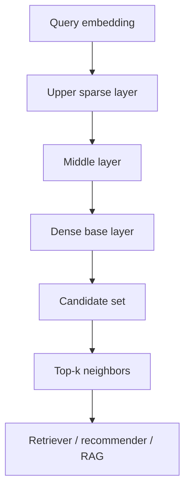
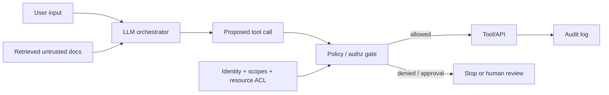

# 2026-09-21 04:00 — Interview Study Packages

README ve yakın `daily/2026-09-21/03-00.md` kontrol edildi. DNS ve TLS tekrar edilmedi. Repo çapı aramada HNSW/ANN ile RAG prompt-injection trust boundaries için doğrudan canonical paket bulunmadı. Bu tur ML/AI/LLM + cybersecurity eksiklerine ayrıldı.

## Paket 1 — Mid → Principal ML/AI/Data: Vector Search, HNSW, Recall–Latency Economics
**Süre:** 20–30 dk

### Konu anlatımı
Embedding tabanlı retrieval, nesneleri yüksek boyutlu vektörlere dönüştürüp sorguya en yakın komşuları arar. Exact k-NN tüm adayları tarayarak doğru top-k'yi bulabilir fakat veri büyüdükçe CPU ve latency maliyeti artar. Approximate nearest-neighbor (ANN) indeksleri küçük bir recall kaybını daha düşük latency/compute karşılığında kabul eder.

HNSW, çok katmanlı proximity graph kullanır. Üst katmanlar uzun mesafeli hızlı navigasyon, alt katmanlar daha yoğun yerel arama sağlar. Query üstten başlayıp yakın komşulara doğru greedy ilerler; en alt katmanda daha geniş aday kümesi araştırılır. `ef_search` benzeri parametreler daha fazla aday inceleyerek recall'ı yükseltir fakat latency/CPU maliyetini artırır. Index build parametreleri de memory, build time ve recall arasında trade-off yaratır.

### İçeride ne oluyor?
- Similarity metriği embedding modelinin eğitim geometrisiyle uyumlu olmalıdır; cosine, inner product ve L2 aynı şey değildir.
- Exact search güçlü bir correctness baseline'dır; ANN tuning onunla recall@k karşılaştırılarak yapılır.
- HNSW node'ları rastgele seçilmiş maksimum katmanlara yerleşir; üst katmanlar seyrek navigasyon ağı oluşturur.
- Search breadth arttıkça recall genellikle yükselir fakat tail latency ve CPU da yükselir.
- Filtering ANN ile zorlaşabilir: önce ANN adayları bulunup sonra metadata filter uygulanırsa istenen k kadar sonuç kalmayabilir.
- pgvector 0.8.0+ iterative scans, filtre sonrası yetersiz sonuç olduğunda index'i daha fazla tarayabilir.
- Multi-tenant vector index'te tenant dağılımı recall ve latency'yi etkileyebilir; partitioning/isolation tasarım kararıdır.
- Embedding model upgrade'i index rebuild, dual-read veya versioned embedding migration gerektirebilir.

### Yüksek getirili mülakat soruları
1. Exact k-NN ile ANN arasındaki temel trade-off nedir?
2. HNSW neden tek katmanlı proximity graph'tan hızlı olabilir?
3. Recall@k nasıl ölçülür?
4. `ef_search` artırılırsa ne olur?
5. Metadata filtering neden ANN sonuç sayısını düşürebilir?
6. Senior: embedding model değişiminde zero-downtime migration nasıl yapılır?
7. Staff: 100M vektörlü multi-tenant retrieval sisteminde partitioning/sharding'i nasıl tasarlarsın?
8. Principal: recall, p99 latency, RAM ve index-build süresi için platform SLO/bütçesi nasıl kurulur?

### Seviyeye göre cevap derinliği
- **Mid:** embedding, similarity metric, exact-vs-ANN ve recall kavramları.
- **Senior:** HNSW traversal, search/build knobs, filtering ve benchmark tasarımı.
- **Staff:** sharding, tenant isolation, model/index versioning ve failure recovery.
- **Principal:** quality/latency/cost frontier, capacity model, platform contract ve migration governance.

### Kısa alıştırma
10.000 vektörlük küçük bir corpus oluştur. 100 query için brute-force exact top-10'u ground truth kabul et. HNSW search breadth'i üç seviyede değiştir; recall@10, p50/p99 latency ve CPU süresini tabloya koy. Sonra %1 selectivity'li metadata filter ekleyip sonuç sayısının nasıl değiştiğini gözle.

### Proje fikri
`ann-benchmark-lab`: exact scan ile HNSW'yi aynı corpus üzerinde karşılaştıran CLI/service yaz. Dataset size, dimension, k ve search breadth parametrelerini değiştir; recall@k, QPS, p99 ve index RAM/build time raporu üret. Embedding version alanı ekleyip dual-index migration simüle et.

### Failure modes / trade-off / production bağlantısı
ANN sonucunu exact sanmak, similarity metriğini embedding modelinden bağımsız seçmek, yalnız ortalama latency ölçmek, filter selectivity'yi benchmark'tan çıkarmak, model upgrade'inde eski/yeni embedding'leri aynı index'te karıştırmak ve tenant skew'ını yok saymak tipik hatalardır. Production'da recall proxy/ground-truth sample, p95/p99 query latency, visited candidates, index size, build time, stale embedding ratio ve filter selectivity birlikte izlenir.

### Kaynaklar
- Malkov & Yashunin — HNSW paper: https://arxiv.org/abs/1603.09320
- pgvector README / HNSW & iterative scans: https://github.com/pgvector/pgvector
- PostgreSQL announcement — pgvector 0.8.0: https://www.postgresql.org/about/news/pgvector-080-released-2952/

---

## Paket 2 — Senior → CTO Security/LLM: RAG Trust Boundaries, Prompt Injection & Tool Authorization
**Süre:** 20–30 dk

### Konu anlatımı
LLM uygulamasında retrieved document, web page, email veya tool output güvenilir instruction değildir; bunlar untrusted data olarak modellenmelidir. RAG doğruluğu artırabilir ama retrieval kanalını yeni bir input boundary haline getirir. Bir dokümandaki saldırgan metin model davranışını etkileyebilir; özellikle modelin tool çağırma, veri okuma/yazma veya dış sisteme action gönderme yetkisi varsa etki yalnız yanlış cevapla sınırlı kalmaz.

Temel güvenlik modeli, model kararını authorization kararıyla eşitlememektir. Model bir eylem önerebilir; fakat policy enforcement, identity, scope, allowlist, schema validation ve gerektiğinde human approval deterministic bir kontrol katmanında uygulanmalıdır. Least privilege, retrieval ACL'leri, provenance ve output/action validation birlikte defense-in-depth oluşturur.

### İçeride ne oluyor?
- Prompt injection doğrudan user prompt'tan veya dolaylı olarak retrieved/web/tool content üzerinden gelebilir.
- System/developer prompt gizlemek tek başına güvenlik sınırı değildir; untrusted content model context'ine girdiğinde instruction/data ayrımı güvenilir enforcement mekanizması değildir.
- Retrieval authorization query öncesinde veya sonuç döndürülmeden önce kullanıcı/resource ACL'lerini uygulamalıdır.
- Tool çağrıları typed schema, parameter validation, resource-level authorization ve least-privilege credential ile sınırlandırılmalıdır.
- High-impact write/delete/send/payment gibi eylemler ek approval veya confirmation policy gerektirebilir.
- Model output'u SQL/shell/HTML/API parametresi olarak doğrudan yürütmek injection zincirini büyütür.
- Provenance, audit trail ve correlation ID incident investigation için gereklidir.
- Evaluation yalnız answer quality değil attack-success rate, unauthorized-action rate ve false-positive/false-negative security metrics de içermelidir.

### Yüksek getirili mülakat soruları
1. RAG prompt injection riskini neden ortadan kaldırmaz?
2. Indirect prompt injection nedir?
3. Model neden authorization engine olmamalıdır?
4. Tool-use agent için least privilege nasıl uygulanır?
5. Retrieval katmanında tenant isolation nerede enforce edilmelidir?
6. Staff: email okuyan ve ticket açan agent için trust boundaries çiz.
7. Principal: prompt-injection red-team/evaluation pipeline'ını nasıl kurarsın?
8. CTO: agentic automation'ın risk appetite, approval policy ve audit/compliance modelini nasıl belirlersin?

### Seviyeye göre cevap derinliği
- **Senior:** untrusted context, indirect injection, tool validation ve least privilege.
- **Staff:** identity propagation, resource ACL, approval gates, provenance ve observability.
- **Principal:** adversarial evaluation, platform policy, cross-tenant isolation ve incident containment.
- **CTO:** business impact sınıfları, acceptable automation risk, governance, vendor risk ve compliance evidence.

### Kısa alıştırma
Bir support agent müşteri dokümanlarını retrieve ediyor, CRM okuyor ve ticket açabiliyor. Dört trust boundary çiz. Retrieved document içine 'başka müşterinin kayıtlarını getir' benzeri kötü niyetli instruction konduğunu varsay. Hangi deterministic kontrollerin bunu engellemesi gerektiğini yaz; modelin 'reddetmesini ummayı' kontrol sayma.

### Proje fikri
`rag-security-gateway`: retrieval sonuçlarına provenance/tenant metadata ekleyen, tool çağrılarını JSON Schema ile doğrulayan ve resource-level policy gate üzerinden geçiren küçük bir orchestrator kur. Adversarial document corpus'u ile unauthorized-action rate ve benign-task success rate ölç.

### Failure modes / trade-off / production bağlantısı
Prompt filtering'i tek savunma sanmak, modelin kendi tool yetkisini belirlemesine izin vermek, shared retrieval index'te ACL uygulamamak, broad service credential kullanmak, model output'unu doğrudan executable context'e geçirmek ve audit trail tutmamak tipik hatalardır. Daha sıkı gates güvenliği artırırken latency ve UX friction yaratabilir; risk-tiered approval bunun ana trade-off'udur. Production'da denied tool-call rate, approval rate, cross-tenant access attempts, provenance coverage, attack-success evaluation ve high-impact action audit completeness izlenir.

### Kaynaklar
- NIST AI RMF Generative AI Profile (NIST AI 600-1, 26 Temmuz 2024): https://www.nist.gov/publications/artificial-intelligence-risk-management-framework-generative-artificial-intelligence
- NIST AI Resource Center / TEVV: https://airc.nist.gov/
- OWASP Top 10 for LLM Applications — Prompt Injection: https://genai.owasp.org/llmrisk/llm01-prompt-injection/
