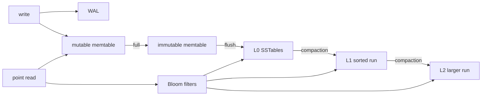
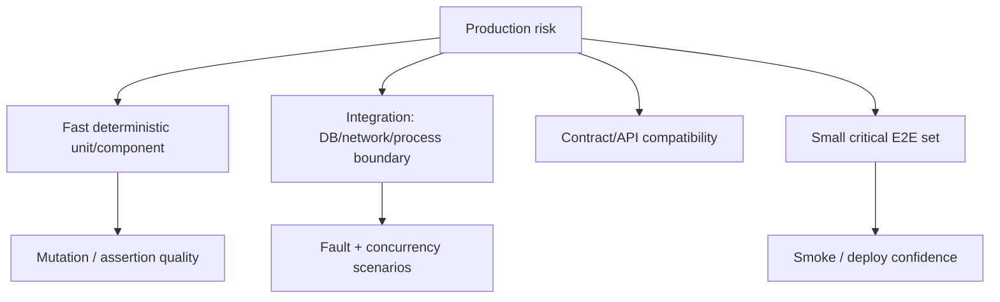

# 2026-09-21 04:00 — Interview Study Packages

README ve yakın `daily/2026-09-21/03-00.md` kontrol edildi. DNS/TLS tekrar edilmedi. İlk aday HNSW/ANN repo geçmişindeki Redis Vector Sets + HNSW paketine belirgin biçimde çakıştığı için elendi. Repo çapı aramada LSM-tree/compaction ile systematic testing strategy için doğrudan canonical paket bulunmadı. Bu tur database storage internals + testing engineering eksiklerine ayrıldı.

## Paket 1 — Mid → Staff Databases: LSM Trees, SSTables, Bloom Filters & Compaction
**Süre:** 20–30 dk

### Konu anlatımı
LSM-tree yazma yolunu sequential I/O lehine düzenleyen bir storage-engine ailesidir. Tipik write path WAL + mutable memtable ile başlar; memtable dolunca immutable hale gelir ve sorted SSTable olarak diske flush edilir. Foreground write böylece random in-place page update yerine çoğunlukla append/sequential work üretir. Bedeli read amplification, space amplification ve background compaction'dır.

Point read önce memtable/immutable memtable'lara, sonra SSTable katmanlarına bakabilir. Bloom filter bir key'in dosyada kesinlikle olmadığını ucuzca söyleyerek gereksiz I/O'yu azaltır; false positive olabilir ama false negative olmamalıdır. Compaction overlapping sorted run'ları merge eder, eski/tombstone version'ları uygun olduğunda temizler ve read amplification'ı kontrol eder; aynı byte'ların tekrar yazılması write amplification üretir.

### İçeride ne oluyor?
- WAL crash recovery; memtable fast ordered in-memory writes sağlar.
- Flush yeni immutable SSTable üretir; L0 dosyaları overlapping key range'lere sahip olabilir.
- Leveled compaction'da alt seviyelerde sorted files tipik olarak non-overlapping range'lerdir.
- Bloom filters negative point lookup'larda read amplification'ı düşürür; range scan'i aynı ölçüde çözmez.
- Leveled compaction read/space amplification'ı sınırlar fakat write amplification yaratır.
- Tiered/universal compaction write amplification'ı azaltabilir; daha fazla overlapping run nedeniyle read/space amplification artabilir.
- Compaction yetişemezse L0 dosyaları birikir; storage engine write slowdown/stall uygulayabilir.
- Tombstone hemen fiziksel silme değildir; compaction ve snapshot/version visibility nedeniyle yaşamaya devam edebilir.

### Yüksek getirili mülakat soruları
1. LSM-tree neden write-heavy workload'larda çekicidir?
2. WAL ile memtable'ın görevleri neden farklıdır?
3. SSTable neden immutable tutulur?
4. Bloom filter hangi sorguları hızlandırır, hangilerini hızlandırmaz?
5. Read, write ve space amplification nedir?
6. Senior: leveled vs tiered compaction trade-off'unu anlat.
7. Staff: compaction debt p99 write latency'yi nasıl bozabilir?
8. Staff: B+Tree ile LSM arasında workload bazlı storage-engine seçimini nasıl yaparsın?

### Seviyeye göre cevap derinliği
- **Mid:** WAL → memtable → SSTable → compaction write path'i.
- **Senior:** Bloom filter, tombstone, leveled/tiered ve üç amplification türü.
- **Staff:** compaction scheduling, write stalls, SSD endurance, cache ve workload economics.

### Kısa alıştırma
Üç L0 SSTable'ın key aralıklarını `[a-f]`, `[d-k]`, `[m-z]`; L1'i non-overlapping `[a-h]`, `[i-r]`, `[s-z]` olarak çiz. `key=q` miss lookup'ında Bloom filter yokken ve varken olası file probes'u say. Ardından `[e-n]` range scan'inde Bloom filter'ın neden aynı faydayı vermediğini açıkla.

### Proje fikri
`mini-lsm-lab`: WAL, sorted in-memory map, immutable SSTable ve basit compaction içeren küçük KV store yaz. Point lookup için Bloom filter ekle. Random writes altında bytes-written/user-byte, files-probed/read ve compaction duration ölç.

### Failure modes / trade-off / production bağlantısı
LSM'i sadece hızlı write diye özetlemek, compaction'ı maintenance işi sanmak, Bloom filter'ı range-index zannetmek, tombstone retention'ı unutmak ve disk bandwidth'in foreground + compaction arasında paylaşıldığını görmemek tipik hatalardır. Production'da L0 file count, compaction pending bytes/debt, write stalls, compaction throughput, Bloom usefulness, read/write amplification, disk utilization ve p99 birlikte izlenir.

### Kaynaklar
- RocksDB — Leveled Compaction: https://github.com/facebook/rocksdb/wiki/Leveled-Compaction
- RocksDB — Compaction: https://github.com/facebook/rocksdb/wiki/Compaction
- RocksDB — Tuning Guide: https://github.com/facebook/rocksdb/wiki/RocksDB-Tuning-Guide
- RocksDB — Block-based Table Format: https://github.com/facebook/rocksdb/wiki/Rocksdb-BlockBasedTable-Format

---

## Paket 2 — Junior → Principal Testing Engineering: Test Portfolio, Determinism, Mutation & Concurrency Tests
**Süre:** 20–30 dk

### Konu anlatımı
Testing engineering'in amacı mümkün olan en çok testi yazmak değil, failure riskini en düşük geri bildirim maliyetiyle yakalamaktır. Unit/integration/contract/E2E ayrımı yalnız kapsam değil; isolation, realism, speed, ownership ve diagnosis trade-off'udur. Sağlam bir test portfolio deterministic unit/component testlerini taban yapar; gerçek database/network sınırlarını integration testlerle doğrular; az sayıda kritik user journey'yi E2E ile kapsar.

Coverage tek başına oracle kalitesini ölçmez. Mutation testing küçük davranış değişiklikleri yapıp testlerin bunları öldürüp öldürmediğini ölçerek assertion gücünü sorgular. Concurrency testlerinde sleep tabanlı timing assertion'ları flaky'dir; barrier/latch/fake clock/deterministic scheduler gibi kontrol noktaları tercih edilir. Property-based testing ve fuzzing daha önce işlendi; burada odak bunların test portfolio içinde nereye oturduğudur.

### İçeride ne oluyor?
- Unit test implementation boundary'sini dar tutar; hızlı failure localization sağlar.
- Integration test serialization, SQL/schema, filesystem, network veya process boundary gibi gerçek adapter davranışını sınar.
- Contract test iki servis arasındaki compatibility'yi E2E environment olmadan doğrulayabilir.
- E2E en gerçekçi path'i kapsar ama setup, diagnosis ve flakiness maliyeti yüksektir.
- Mutation score coverage'dan farklıdır: satır çalışmış olsa bile assertion davranışı korumuyor olabilir.
- Fake clock zaman bağımlı kodu deterministik yapar; wall-clock sleep test suite'i yavaş ve flaky yapar.
- Concurrency testinde interleaving'i kontrol etmek veya invariant test etmek tek bir timing sonucuna güvenmekten daha değerlidir.
- Test isolation state leakage'i engeller; shared DB/queue fixtures parallel testlerde order dependency yaratabilir.

### Yüksek getirili mülakat soruları
1. Unit ve integration test sınırını nasıl seçersin?
2. Neden %100 code coverage güvenilirlik garantisi değildir?
3. Flaky test nedir ve neden production defect kadar ciddiye alınmalıdır?
4. Mock ne zaman faydalı, ne zaman implementation'a aşırı bağlar?
5. Mutation testing neyi ölçmeye çalışır?
6. Senior: retry/backoff kodunu sleep kullanmadan nasıl test edersin?
7. Staff: microservice platformunda test portfolio ve ownership standardını nasıl tasarlarsın?
8. Principal: CI süresi, confidence ve developer throughput arasında hangi metriklerle trade-off yaparsın?

### Seviyeye göre cevap derinliği
- **Junior:** arrange/act/assert, unit boundary, happy/error path.
- **Mid:** integration boundary, fixture isolation, deterministic clock ve mocking trade-off'u.
- **Senior:** concurrency/fault tests, mutation, flaky-test diagnosis ve CI parallelism.
- **Staff/Principal:** risk-based portfolio, platform tooling, ownership, release gates ve developer economics.

### Kısa alıştırma
`charge(order)` fonksiyonunun DB transaction açtığını, payment provider çağırdığını ve retry yaptığını varsay. Hangi davranışların unit, integration, contract ve E2E test olacağını tabloya ayır. Sonra `sleep(1)` kullanan retry testini fake clock + injected scheduler ile deterministik hale getir.

### Proje fikri
`test-quality-lab`: küçük bir order service kur. Unit + PostgreSQL integration + provider contract + tek kritik E2E test ekle. Mutation tool ile surviving mutant'ları incele; flaky timing testi ekleyip ardından fake clock/barrier ile düzelt. CI'da duration, retry count ve flaky rate raporla.

### Failure modes / trade-off / production bağlantısı
Test pyramid'i dogma gibi uygulamak, her dependency'yi mock'lamak, coverage hedefini kalite metriği sanmak, flaky testleri otomatik retry ile gizlemek, production-benzeri integration boundary'lerini hiç test etmemek ve test data isolation'ını ihmal etmek tipik hatalardır. Production bağlantısı incident-derived regression tests, canary/smoke checks ve failure-mode bazlı release gates'tir; CI'da duration, flaky rate, failure localization süresi ve escaped defect trend'i birlikte izlenir.

### Kaynaklar
- PostgreSQL — Regression Tests: https://www.postgresql.org/docs/current/regress.html
- PostgreSQL source — Isolation tests: https://github.com/postgres/postgres/tree/master/src/test/isolation
- LLVM — Testing Infrastructure Guide: https://llvm.org/docs/TestingGuide.html
- GoogleTest — Advanced Guide: https://google.github.io/googletest/advanced.html
