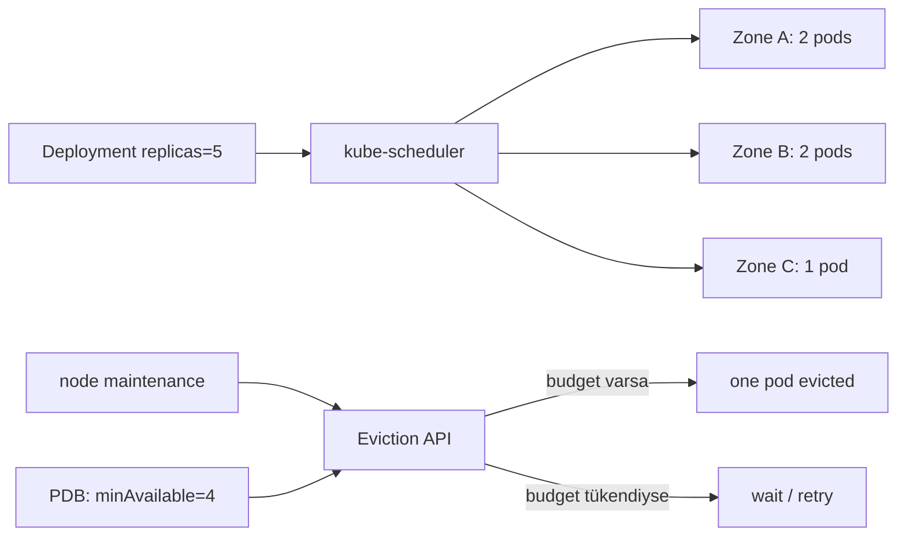
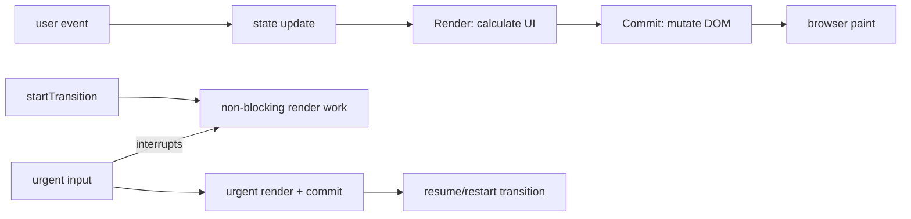

# 2026-09-21 05:00 — Interview Study Packages

README ve yakın `daily/2026-09-21/04-00.md` kontrol edildi. LSM-tree/compaction ve testing portfolio tekrar edilmedi. Repo aramasında offline-first mobile daha önce işlendiği için elendi. Bu tur Cloud/SRE ile Frontend boşluklarına ayrıldı.

## Paket 1 — Mid → Principal Cloud/SRE: Kubernetes Failure Domains, Topology Spread & PodDisruptionBudget
**Süre:** 20–30 dk

### Konu anlatımı
Yüksek erişilebilirlik yalnız `replicas: 3` yazmak değildir. Üç replica aynı node veya zone'daysa tek failure domain üç kopyayı da kaybettirebilir. Kubernetes'te topology spread constraints replica'ların node/zone gibi domain'lere dağılımını kontrol eder; PodDisruptionBudget (PDB) ise Eviction API üzerinden yapılan voluntary disruption sırasında aynı anda kaç replica'nın unavailable olabileceğini sınırlar.

PDB bir placement mekanizması değildir; scheduler'a pod'u nereye koyacağını söylemez. Topology spread de disruption budget değildir. Sağlam tasarım placement + capacity + readiness + graceful termination + disruption policy'yi birlikte düşünür.

### İçeride ne oluyor?
- `topologySpreadConstraints` matching pod sayılarını topology domain'leri arasında dengeler; `maxSkew` izin verilen dengesizliği sınırlar.
- `DoNotSchedule` hard constraint; `ScheduleAnyway` soft preference davranışı verir.
- PDB `minAvailable` veya `maxUnavailable` ile voluntary eviction concurrency'sini sınırlar.
- PDB involuntary node/cloud failure'ını önleyemez; bu kayıplar budget hesabını etkileyebilir.
- Doğrudan Pod/Deployment silmek PDB'yi bypass edebilir; cluster operasyonunun Eviction API kullanması gerekir.
- Quorum tabanlı stateful sistemde budget quorum matematiğine göre seçilmelidir.
- Aşırı katı PDB node drain/upgrade'i kilitleyebilir; unhealthy pod eviction policy operasyonel önem taşır.

### Yüksek getirili mülakat soruları
1. Üç replica neden tek başına HA garantisi değildir?
2. Pod anti-affinity ile topology spread arasındaki fark nedir?
3. PDB hangi failure'ları kapsar, hangilerini kapsamaz?
4. `minAvailable` ile `maxUnavailable` nasıl seçilir?
5. Senior: 5 üyeli quorum sisteminde node drain politikasını tasarla.
6. Staff: autoscaler, PDB ve topology spread nasıl deadlock/unschedulable durum üretebilir?
7. Principal: multi-zone kapasiteyi N+1 failure domain kaybına göre nasıl bütçelersin?

### Seviyeye göre cevap derinliği
- **Mid:** replica, node/zone failure domain, spread ve PDB ayrımı.
- **Senior:** readiness, drain, quorum, capacity headroom ve graceful termination.
- **Staff/Principal:** scheduler constraints, autoscaler etkileşimi, maintenance throughput, blast radius ve availability economics.

### Kısa alıştırma
3 zone'da 5 replica için `maxSkew: 1` dağılımını çiz. Ardından `minAvailable: 4` ile aynı anda kaç voluntary eviction yapılabileceğini hesapla. Zone'lardan biri kaybolduğunda PDB'nin neden sistemi kurtaramadığını açıkla.

### Proje fikri
`k8s-disruption-lab`: 5 replica'lı küçük HTTP servis kur; topology spread + PDB ekle. Node drain simülasyonunda ready replica, eviction wait süresi ve request error rate ölç. Sonra bir zone kapasitesini kaldırıp scheduler/availability davranışını karşılaştır.

### Failure modes / trade-off / production bağlantısı
PDB'yi HA garantisi sanmak, tüm replica'ları aynı zone'a bırakmak, `maxUnavailable: 0` ile maintenance'ı sonsuza dek engellemek, readiness'i gerçek serving capacity'den koparmak ve replacement pod için boş kapasite bırakmamak tipik hatalardır. Production'da available/ready replicas, PDB `disruptionsAllowed`, pending pods, zone dağılımı, drain süresi, eviction rejection ve SLO error budget birlikte izlenir.

### Kaynaklar
- Kubernetes — Disruptions: https://kubernetes.io/docs/concepts/workloads/pods/disruptions/
- Kubernetes — Pod Topology Spread Constraints: https://kubernetes.io/docs/concepts/scheduling-eviction/topology-spread-constraints/
- Kubernetes — Configure a PodDisruptionBudget: https://kubernetes.io/docs/tasks/run-application/configure-pdb/
- Kubernetes API — PodDisruptionBudget: https://kubernetes.io/docs/reference/kubernetes-api/policy/pod-disruption-budget-v1/

---

## Paket 2 — Junior → Staff Frontend: React Render/Commit, Transitions & Responsiveness
**Süre:** 20–30 dk

### Konu anlatımı
React'te render ile DOM mutation aynı şey değildir. Bir update render work'ünü tetikler; React component tree'den yeni UI sonucunu hesaplar, ardından commit aşamasında gereken DOM değişikliklerini uygular. Bu ayrım performans ve correctness için kritiktir: render saf ve tekrar çalıştırılabilir olmalı; dış dünya side effect'leri render içine taşınmamalıdır.

Transition, bazı state update'lerini urgent olmayan iş olarak işaretleyerek kullanıcı etkileşimini bloklamadan background render yapılmasını sağlar. Transition update'i daha acil bir update tarafından interrupt edilebilir ve yeniden başlatılabilir. Bu yüzden render sırasında side effect yapmak concurrency altında daha da tehlikelidir.

### İçeride ne oluyor?
- Render component fonksiyonlarını çalıştırıp UI sonucunu hesaplar; commit gerçek DOM değişikliklerini uygular.
- Aynı render sonucu DOM'da değişiklik gerektirmeyebilir.
- `useTransition` `isPending` ve `startTransition` sağlar; transition state update'leri non-blocking'dir.
- Transition work urgent input tarafından interrupt edilip yeniden render edilebilir.
- Controlled text input update'i transition içine konmamalıdır; input state senkron kalmalıdır.
- Async Action/request sonuçlarında ordering problemi oluşabilir; stale response guard, abort/queue veya daha yüksek seviye abstraction gerekebilir.
- React 19.3, 9 Eylül 2026'da yayımlandı; `<ViewTransition>` bu sürümde stable oldu. View transition görsel animasyon katmanıdır; scheduling transition kavramıyla aynı şey değildir.

### Yüksek getirili mülakat soruları
1. Render ile commit arasındaki fark nedir?
2. Re-render neden mutlaka DOM update demek değildir?
3. Render fonksiyonunun pure olması neden önemlidir?
4. `useTransition` neyi çözer; debounce ile aynı şey midir?
5. Neden controlled input state transition olmamalıdır?
6. Senior: pahalı chart/filter update'inde urgent ve non-urgent state'i nasıl ayırırsın?
7. Staff: async transition sonuçlarının out-of-order gelmesini nasıl tasarlarsın?

### Seviyeye göre cevap derinliği
- **Junior:** state update → render → commit → paint mental modeli.
- **Mid:** purity, effects, transition ve pending UI.
- **Senior:** interruption, stale async result, Suspense ve profiling.
- **Staff:** interaction latency budget, scheduling boundaries, framework/router integration ve UX trade-off'ları.

### Kısa alıştırma
10.000 satırlık filtrelenebilir liste düşün. Input değerini synchronous state'te tut; ağır filtre sonucunu transition ile güncelle. Hızlı yazarken eski request/render sonucunun yeni sonucu ezmesini engelleyecek bir version veya abort stratejisi tasarla.

### Proje fikri
`react-responsiveness-lab`: büyük dataset + arama + chart içeren sayfa yap. Normal update ile transition sürümünü karşılaştır; React Profiler ve browser performance timeline ile interaction latency, commit duration ve dropped-frame davranışını ölç.

### Failure modes / trade-off / production bağlantısı
Her update'i transition yapmak, transition'ı network cancellation sanmak, render içine analytics/network side effect koymak, stale async response'u state'e yazmak ve `isPending` ile kullanıcıya feedback vermemek tipik hatalardır. Production'da INP/interaction latency, long tasks, render/commit duration, error rate ve kullanıcı aksiyonlarının ordering correctness'i birlikte değerlendirilir.

### Kaynaklar
- React — Render and Commit: https://react.dev/learn/render-and-commit
- React — useTransition: https://react.dev/reference/react/useTransition
- React — startTransition: https://react.dev/reference/react/startTransition
- React 19.3 release, 9 Sep 2026: https://react.dev/blog/2026/09/09/react-19-3
