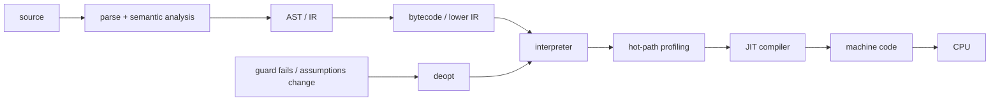
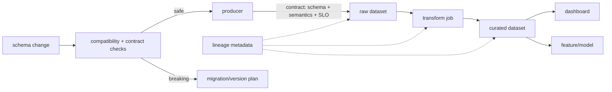

# 2026-09-21 06:00 — Interview Study Packages

README ve yakın `daily/2026-09-21/05-00.md` kontrol edildi. Kubernetes failure domains/PDB ve React render/transition tekrar edilmedi. Repo aramasında bytecode/interpreter/JIT runtime zinciri ile data contracts/lineage/schema evolution için doğrudan canonical paket bulunmadı. Bu tur compiler/runtime temel boşluğunu ilerletip Data Engineering alanına döner.

## Paket 1 — Junior → Staff Foundations: Bytecode, Interpreter, JIT & Runtime Pipeline
**Süre:** 20–30 dk

### Konu anlatımı
Kaynak kodun CPU'da çalışmasına giden yol tek bir `compile` adımı değildir. Dil implementation'ına göre source önce lexer/parser ve semantic analysis'ten geçebilir; AST veya başka bir IR üretilebilir; buradan bytecode/native code çıkabilir. Bytecode kullanan runtime'da interpreter instruction dispatch yapar. Profiling/adaptive runtime'lar sıcak yolları tespit edip daha özelleşmiş instruction'lara veya JIT-compiled machine code'a taşıyabilir.

AOT ile JIT karşıt iki din değildir. AOT startup ve deployment öngörülebilirliği sağlar; JIT runtime profiling bilgisiyle speculative optimization yapabilir. JIT'in bedeli warm-up, compiler CPU/memory maliyeti, code cache ve deoptimization karmaşıklığıdır.

### İçeride ne oluyor?
- Parser syntax structure üretir; semantic analysis name/type/scope gibi kuralları doğrular.
- Bytecode fiziksel CPU ISA'sı olmak zorunda değildir; VM/interpreter için compact instruction set olabilir.
- Interpreter dispatch loop opcode'u decode edip handler çalıştırır; implementation switch, threaded dispatch veya başka teknik kullanabilir.
- Adaptive specialization runtime type/shape bilgisiyle generic operation'ı daha dar fast path'e çevirebilir.
- JIT hot method/loop'u native code'a derleyebilir; inline, constant folding, escape analysis gibi optimizasyonlar runtime profile'dan yararlanabilir.
- Speculative optimization guard ile korunur; varsayım bozulursa deoptimization daha generic execution tier'ına dönebilir.
- GC, allocator, exception handling, stack walking ve safepoint mekanizmaları generated code ile runtime arasında ABI-benzeri kontratlar oluşturur.

### Yüksek getirili mülakat soruları
1. Interpreter ile compiler farkı nedir?
2. Bytecode neden doğrudan machine code değildir?
3. JIT neden AOT'tan daha hızlı olabilir; neden daha yavaş başlayabilir?
4. Hot path nasıl tespit edilir?
5. Deoptimization neden gereklidir?
6. Senior: inline cache / type specialization hangi workload'da fayda sağlar?
7. Staff: latency-sensitive service'te JIT warm-up ve code-cache risklerini nasıl yönetirsin?
8. Staff: runtime upgrade'i benchmark ederken throughput dışında hangi metrikleri toplarsın?

### Seviyeye göre cevap derinliği
- **Junior:** source → parse → bytecode/native → execute ayrımı.
- **Mid:** interpreter dispatch, bytecode, JIT ve warm-up.
- **Senior:** profiling, specialization, guards, deopt, GC/runtime interaction.
- **Staff:** startup/steady-state economics, code cache, fleet rollout ve workload-specific benchmarking.

### Kısa alıştırma
`x + y` ifadesi için 5–8 instruction'lık hayali stack bytecode yaz. İlk 1.000 çalıştırmada generic `ADD`, sonra iki operand sürekli integer ise `ADD_INT` specialization düşün. Bir çağrıda string geldiğinde guard failure ve deopt akışını çiz.

### Proje fikri
`tiny-tiered-vm`: küçük stack VM yaz; `LOAD_CONST`, `LOAD_LOCAL`, `ADD`, `JUMP`, `RETURN` opcode'larını destekle. Opcode counter ile hot instruction tespit et ve `ADD_INT` fast path ekle. Generic vs specialized throughput, startup ve branch sayısını karşılaştır.

### Failure modes / trade-off / production bağlantısı
JIT'i otomatik hız garantisi sanmak, yalnız steady-state benchmark yapmak, warm-up'ı production traffic'e ödetmek, deopt storm/code-cache pressure'ı gözlemlememek ve runtime upgrade'ini application benchmark olmadan rollout etmek tipik hatalardır. Production'da startup latency, throughput, p95/p99, CPU, RSS, allocation/GC, compilation time, deopt ve code-cache metrikleri birlikte değerlendirilir.

### Kaynaklar
- CPython — `dis` / Python bytecode: https://docs.python.org/3/library/dis.html
- CPython — What's New in Python 3.13, experimental JIT: https://docs.python.org/3/whatsnew/3.13.html
- OpenJDK HotSpot VM Performance Enhancements: https://docs.oracle.com/en/java/javase/24/vm/java-hotspot-virtual-machine-performance-enhancements.html
- LLVM — Kaleidoscope tutorial / JIT: https://llvm.org/docs/tutorial/BuildingAJIT1.html

---

## Paket 2 — Mid → Principal Data Engineering: Data Contracts, Schema Evolution & Lineage
**Süre:** 20–30 dk

### Konu anlatımı
Bir data pipeline'ın doğruluğu yalnız job'ın `SUCCESS` olması değildir. Producer ile consumer arasında schema, semantics, freshness, ownership ve compatibility beklentileri vardır. Data contract bu beklentileri explicit hale getirir; schema evolution değişimin nasıl yapılacağını belirler; lineage ise bir output'un hangi dataset/job/field'lardan türediğini göstererek impact analysis ve incident debugging sağlar.

Schema registry/table format tek başına data contract değildir. Contract teknik shape'in yanında semantik ve operasyonel beklentileri de kapsayabilir. Lineage da observability'nin tamamı değildir: edge'leri bilmek `customer_id` değerlerinin doğru olduğunu kanıtlamaz.

### İçeride ne oluyor?
- Contract ownership, field semantics, nullability, allowed values, freshness/volume beklentisi ve compatibility policy içerebilir.
- Additive change çoğu zaman daha güvenlidir ama consumer `SELECT *`, positional mapping veya strict deserializer kullanıyorsa yine kırılabilir.
- Rename/drop/type narrowing migration gerektirir; dual-read/dual-write veya versioned dataset gerekebilir.
- Apache Iceberg schema evolution'da column identity'yi unique field ID ile izler; add/drop/rename/update/reorder metadata değişiklikleri data file rewrite gerektirmeden yapılabilir.
- Lineage dataset/job/run graph'i ve gerektiğinde field-level edge'leri tutar.
- OpenLineage facet modeli metadata'yı Run, Job ve Dataset entity'lerine ekler; explicit lineage facet yanlış Cartesian-product dependency çıkarımlarını azaltabilir.
- Contract test CI'da breaking change'i engeller; runtime quality checks freshness/null/range/volume gibi gerçek veri davranışını izler.

### Yüksek getirili mülakat soruları
1. Schema ile data contract farkı nedir?
2. Additive schema change her zaman backward-compatible mıdır?
3. Rename/drop migration'ını nasıl yaparsın?
4. Dataset lineage ile field-level lineage ne zaman gerekir?
5. Senior: producer deploy'u downstream dashboard'u sessizce bozuyorsa nasıl önlersin?
6. Staff: yüzlerce pipeline'da contract enforcement'i platformlaştırırken adoption'ı nasıl sağlarsın?
7. Principal: lineage metadata'sının eksik/yanlış olmasının governance ve incident etkisi nedir?
8. Principal: compatibility, velocity ve storage/migration cost arasında policy nasıl tasarlanır?

### Seviyeye göre cevap derinliği
- **Mid:** schema compatibility, producer/consumer ve lineage graph.
- **Senior:** migration, runtime quality, field lineage, replay/backfill ve ownership.
- **Staff:** CI enforcement, catalog/lineage platformu, blast-radius analysis ve developer UX.
- **Principal:** organization-wide contract policy, governance, compliance, cost ve change management.

### Kısa alıştırma
`orders(order_id, user_id, total_cents)` tablosunda `user_id` → `customer_id` rename ve `total_cents` → decimal currency dönüşümü tasarla. Eski ve yeni consumer'ların birlikte çalışacağı expand/migrate/contract planını ve lineage edge'lerini çiz.

### Proje fikri
`data-contract-lab`: producer → transform → analytics pipeline kur. JSON Schema/Avro benzeri contract kontrolü, freshness/null checks ve OpenLineage-compatible event üretimi ekle. Breaking rename'i CI'da durdur; migration sonrası impact graph ile etkilenen consumer'ları raporla.

### Failure modes / trade-off / production bağlantısı
Schema registry'yi tam contract sanmak, additive değişikliği koşulsuz güvenli kabul etmek, lineage'ı yalnız dashboard görseli olarak toplamak, owner/freshness tanımlamamak ve contract enforcement'i bypass edilebilir hale getirmek tipik hatalardır. Production'da contract violations, freshness lag, null/range anomalies, lineage coverage, failed consumers, backfill cost ve mean-time-to-impact-analysis birlikte izlenir.

### Kaynaklar
- OpenLineage — specification/core model: https://openlineage.io/docs/
- OpenLineage — lineage dataset facet: https://openlineage.io/docs/spec/facets/dataset-facets/lineage/
- OpenLineage — lineage job facet: https://openlineage.io/docs/spec/facets/job-facets/lineage/
- Apache Iceberg — schema/partition evolution: https://iceberg.apache.org/docs/latest/evolution/
