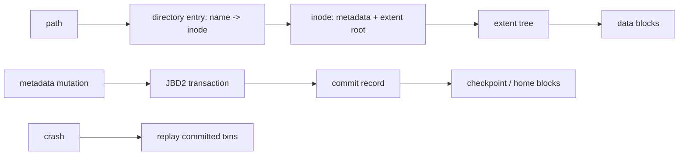
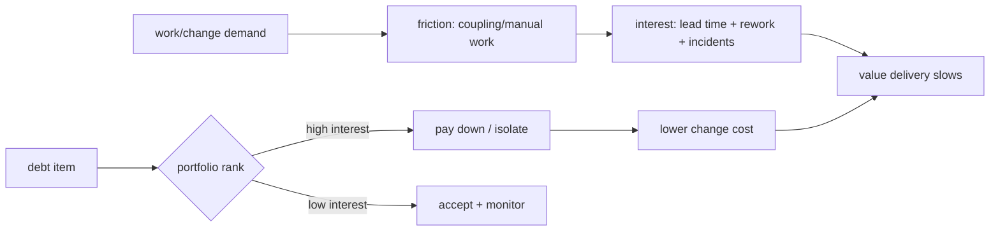

# 2026-09-21 07:00 — Interview Study Packages

README ve yakın `daily/2026-09-21/06-00.md` kontrol edildi. Bytecode/JIT runtime ve data contracts/lineage tekrar edilmedi. Filesystem temellerinde daha önce inode/page-cache/fsync işlendiği için bu tur onun bir sonraki katmanı olan ext4 on-disk yapı + JBD2 journaling'e ilerler. İlk taslakta unit economics düşünülmüş olsa da canonical chapter bulunduğu için tekrar elendi; leadership rotasyonu technical-debt portfolio economics'e kaydırıldı.

## Paket 1 — Mid → Staff Foundations: ext4 On-Disk Internals, Directories & JBD2 Journaling
**Süre:** 20–30 dk

### Konu anlatımı
Bir filesystem yalnız `open/read/write` API'si değildir; path adını kalıcı bloklara bağlayan metadata yapıları ve crash sonrası tutarlılığı koruyan protokoller vardır. ext4 diski block group'lara böler. Directory entry bir adı inode numarasına bağlar; inode dosyanın metadata'sını ve veri bloklarını/extents'i tarif eder. Bu ayrım hard link'i açıklar: iki farklı directory entry aynı inode'u gösterebilir.

Journaling'in hedefi her byte'ı otomatik olarak durable yapmak değil, özellikle metadata update'lerinin crash ortasında filesystem'i yapısal olarak tutarsız bırakmasını engellemektir. JBD2 journal'ında transaction commit record'a ulaşınca replay edilebilir. Varsayılan `data=ordered` yaklaşımında metadata journal edilir; ilgili data blokları metadata commit'inden önce yazılır. `data=journal` daha güçlü ama daha pahalıdır; `data=writeback` ordering garantisini azaltır.

### İçeride ne oluyor?
- Block group; inode table, allocation bitmap'leri ve data block'larını locality için bölgesel tutar.
- Directory entry filename → inode mapping'dir; büyük directory'lerde hashed htree index kullanılabilir.
- Inode filename taşımaz; hard link'ler aynı inode'u gösteren ayrı directory entry'lerdir.
- Extents contiguous block aralıklarını tarif ederek block-pointer metadata maliyetini azaltır.
- JBD2 descriptor/data/revocation kayıtları ve commit block ile recovery sınırı oluşturur.
- Checkpoint committed değişiklikleri final bloklara taşır; commit ile checkpoint aynı şey değildir.
- `unlink` sonrası açık fd varsa inode yaşayabilir; ext4 crash cleanup için orphan tracking kullanır.
- `fsync` uygulama durability kontratının parçasıdır; journaling yanlış uygulama update protokolünü düzeltmez.

### Yüksek getirili mülakat soruları
1. Filename inode'un içinde midir? Directory entry ne tutar?
2. Hard link neden aynı filesystem sınırındadır?
3. Inode ile extent arasındaki fark nedir?
4. Journal neden vardır; database WAL ile benzerliği/farkı nedir?
5. `data=ordered`, `data=journal`, `data=writeback` neyi değiştirir?
6. Senior: commit olmuş fakat checkpoint edilmemiş transaction crash sonrası ne olur?
7. Staff: `write temp -> fsync(temp) -> rename -> fsync(dir)` hangi failure boundary'lerini hedefler?
8. Staff: corruption, lost write ve application-level stale state'i nasıl ayırırsın?

### Seviyeye göre cevap derinliği
- **Mid:** directory entry → inode → extent → block zinciri ve journal amacı.
- **Senior:** JBD2 replay, ordering, fsync ve unlink/open-file semantics.
- **Staff:** durability contract, device-cache/barrier katmanları, failure injection ve workload trade-off'ları.

### Kısa alıştırma
`/a/x` ve `/b/y` iki hard link ile aynı inode'u göstersin. Bir link'i silerken process dosyayı açık tutsun. Directory entry, link count ve inode yaşam döngüsünü çiz. Crash'i JBD2 commit'ten hemen önce/sonra enjekte edip recovery sonucunu yaz.

### Proje fikri
`ext4-crash-lab`: loopback ext4 image üzerinde temp-file + rename update protokolü uygula. Farklı `fsync` noktalarını aç/kapat, kontrollü crash sonrası eski/yeni state'i sınıflandır; `debugfs`, `stat`, `filefrag` ile inode/extent gözlemleri topla.

### Failure modes / trade-off / production bağlantısı
Journal var diye son `write` durable sanmak; inode ile filename'i özdeşleştirmek; commit/checkpoint'i karıştırmak; `fsync(file)` sonrası directory rename durability'sini varsaymak ve device cache katmanını unutmak tipik hatalardır. Production'da writeback/journal commit latency, dirty pages, IO queue latency, ENOSPC/inode exhaustion ve filesystem errors birlikte incelenir.

### Kaynaklar
- Linux Kernel — ext4 high-level design: https://docs.kernel.org/filesystems/ext4/overview.html
- Linux Kernel — ext4 inode structures: https://docs.kernel.org/filesystems/ext4/inodes.html
- Linux Kernel — ext4 directory entries: https://docs.kernel.org/filesystems/ext4/directory.html
- Linux Kernel — JBD2 journal: https://docs.kernel.org/filesystems/ext4/journal.html
- Linux Kernel — ext4 orphan file: https://docs.kernel.org/filesystems/ext4/orphan.html

---

## Paket 2 — Senior → CTO Leadership/Product: Technical Debt Portfolio Economics & Architecture Runway
**Süre:** 20–30 dk

### Konu anlatımı
Technical debt'i tek bir backlog etiketi olarak yönetmek zayıf bir modeldir. Debt'in ekonomik etkisi, gelecekteki değişikliklerin lead time'ını, incident/rework oranını, cognitive load'u ve stratejik opsiyonları nasıl etkilediğidir. Her kötü kod parçası aynı öncelikte değildir: yüksek-change-frequency + yüksek-coupling + yüksek-business-criticality bölgeleri daha yüksek "faiz" üretir.

CTO seviyesinde hedef sıfır debt değildir. Kısa vadeli bilinçli debt bazen time-to-market satın alır; problem geri ödeme koşulu, owner ve gözlenebilir maliyet olmadan debt'in kalıcılaşmasıdır. Architecture runway ise aylarca feature durdurup yeniden yazmak değil, beklenen ürün yönünün gerektirdiği değişiklikleri küçük ve ölçülebilir enabling investments ile mümkün kılmaktır.

### İçeride ne oluyor?
- Debt principal yaklaşık düzeltme/migration maliyetidir; interest ise debt yüzünden tekrar tekrar ödenen ek change/ops maliyetidir.
- Change frequency, blast radius, coupling, incident history ve strategic criticality debt ranking için proxy olabilir.
- Rewrite çoğu zaman en riskli repayment biçimidir; strangler, facade, compatibility layer ve incremental migration opsiyon yaratır.
- Platform/architecture yatırımı outcome'a bağlanmalıdır: lead time, deployment independence, rework, failure rate veya product experiment speed.
- DORA'nın güncel yaklaşımı throughput ve instability'yi ayrı ama birlikte okumayı destekler; tek bir velocity metriğine indirgeme yanlıştır.
- Guardrail olmadan debt quota (`%20 tech debt`) mekanikleşebilir; portfolio review gerçek bottleneck ve opportunity cost üzerinden yapılmalıdır.

### Yüksek getirili mülakat soruları
1. Technical debt ile sıradan bug/kötü kod arasındaki farkı nasıl düşünürsün?
2. Debt'in "faizini" nasıl ölçersin?
3. Rewrite ne zaman yanlış seçimdir?
4. Architecture runway nedir; over-engineering'den nasıl ayrılır?
5. Senior: sürekli değişen hotspot'ta hangi refactoring'i önce seçersin?
6. Staff: birden çok takımın paylaştığı debt'in owner ve migration planını nasıl kurarsın?
7. Principal: debt portfolio'sunu feature roadmap ile nasıl karşılaştırırsın?
8. CTO: 6 aylık rewrite isteyen ekipten hangi ekonomik ve risk kanıtlarını beklersin?

### Seviyeye göre cevap derinliği
- **Senior:** hotspot, coupling, rework ve incremental refactoring.
- **Staff:** cross-team dependency, migration sequencing, observability ve platform leverage.
- **Principal:** portfolio ranking, architectural optionality ve organization-wide standards.
- **CTO:** opportunity cost, capital allocation, product strategy, risk ve time-to-market.

### Kısa alıştırma
Üç debt item'ı 1–5 arası `change frequency × coupling × incident impact` ile skorla. Her biri için principal tahmini, aylık interest proxy'si ve "pay/isolate/accept" kararı ver. Sonra feature roadmap değişirse ranking'in nasıl değiştiğini açıkla.

### Proje fikri
`debt-portfolio-radar`: git change frequency, ownership, incident tag'leri ve deployment/rework verisini birleştirip service/module hotspot'ları çıkar. Skoru karar yerine evidence olarak kullan; her yüksek skor için owner, hypothesis, intervention ve success metric tut.

### Failure modes / trade-off / production bağlantısı
Debt'i LOC/code-smell sayısına indirgemek; büyük rewrite'ı varsayılan çözüm yapmak; product outcome'dan kopuk platform programı yürütmek; debt metriğini bireysel performans hedefi yapmak ve repayment sonrası outcome ölçmemek tipik failure mode'lardır. Production bağlantısında lead time, deployment rework, change fail rate, recovery time, incident concentration ve team dependency sayısı birlikte okunur.

### Kaynaklar
- DORA — Continuous Delivery: https://dora.dev/capabilities/continuous-delivery/
- DORA — Loosely Coupled Teams: https://dora.dev/capabilities/loosely-coupled-teams/
- DORA — Software delivery metrics history (2026): https://dora.dev/insights/dora-metrics-history/
- Martin Fowler — Technical Debt Quadrant: https://martinfowler.com/bliki/TechnicalDebtQuadrant.html
