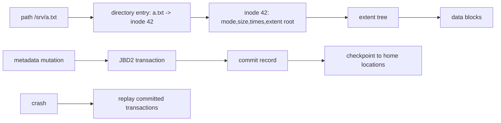
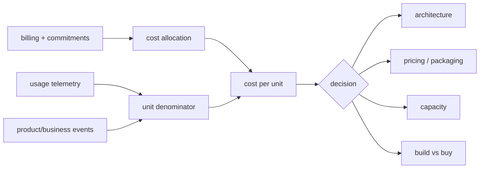

# 2026-09-21 07:00 — Interview Study Packages

README ve yakın `daily/2026-09-21/06-00.md` kontrol edildi. Bytecode/JIT runtime ve data contracts/lineage tekrar edilmedi. Filesystem temellerinde daha önce inode/page-cache/fsync işlendiği için bu tur onun bir sonraki katmanı olan ext4 on-disk yapı + JBD2 journaling'e ilerler; ikinci paket leadership/product/business rotasyonunda unit economics'tir.

## Paket 1 — Mid → Staff Foundations: ext4 On-Disk Internals, Directories & JBD2 Journaling
**Süre:** 20–30 dk

### Konu anlatımı
Bir filesystem yalnız `open/read/write` API'si değildir; path adını kalıcı bloklara bağlayan metadata yapıları ve crash sonrası tutarlılığı koruyan protokoller vardır. ext4 diski block group'lara böler. Directory entry bir adı inode numarasına bağlar; inode ise dosyanın metadata'sını ve veri bloklarını/extents'i tarif eder. Bu ayrım hard link'i açıklar: iki farklı directory entry aynı inode'u gösterebilir.

Journaling'in hedefi her byte'ı otomatik olarak durable yapmak değil, özellikle metadata update'lerinin crash ortasında filesystem'i yapısal olarak tutarsız bırakmasını engellemektir. ext4'ün JBD2 journal'ında transaction commit record'a ulaşınca replay edilebilir. Varsayılan `data=ordered` yaklaşımında metadata journal edilir; ilgili data bloklarının metadata commit'inden önce yazılması amaçlanır. `data=journal` daha güçlü ama daha pahalıdır; `data=writeback` ordering garantisini azaltır.

### İçeride ne oluyor?
- Block group; inode table, allocation bitmap'leri ve data block'larını locality için bölgesel tutar.
- Directory normal bir dosya gibi entry'ler taşır; büyük ext4 directory'leri hashed htree index kullanabilir.
- Inode filename taşımaz; filename → inode mapping directory entry'dedir.
- Extents tek tek block pointer yerine contiguous block aralıklarını tarif ederek metadata maliyetini azaltır.
- JBD2 transaction descriptor/data/revocation kayıtları ve commit block ile crash recovery sınırı oluşturur.
- Checkpoint, committed değişiklikleri journal'dan final/home bloklarına taşır; commit ile checkpoint aynı kavram değildir.
- `unlink` sonrası açık file descriptor varsa inode yaşamaya devam edebilir; ext4 crash cleanup için orphan tracking kullanır.
- `fsync` uygulama durability kontratının parçasıdır; journaling tek başına uygulamanın rename/write protokolünü doğru yapmaz.

### Yüksek getirili mülakat soruları
1. Filename inode'un içinde midir? Directory entry ne tutar?
2. Hard link neden aynı filesystem sınırındadır?
3. Inode ile extent arasındaki fark nedir?
4. Journal neden vardır; WAL ile benzerliği ve farkı nedir?
5. `data=ordered`, `data=journal`, `data=writeback` neyi değiştirir?
6. Senior: commit olmuş fakat checkpoint edilmemiş transaction crash sonrası nasıl ele alınır?
7. Staff: `write temp -> fsync(temp) -> rename -> fsync(dir)` protokolü hangi failure boundary'lerini hedefler?
8. Staff: filesystem corruption, lost write ve application-level stale state'i nasıl ayırırsın?

### Seviyeye göre cevap derinliği
- **Mid:** directory entry → inode → extent → block zinciri ve journal amacı.
- **Senior:** JBD2 transaction/replay, ordering, fsync ve unlink/open-file semantics.
- **Staff:** durability contract, storage cache/barrier katmanları, failure injection ve workload trade-off'ları.

### Kısa alıştırma
`/a/x` ve `/b/y` iki hard link ile aynı inode'u göstersin. `unlink(/a/x)` yapılırken process `/b/y` üzerinden dosyayı açık tutsun. Directory entry, link count ve inode yaşam döngüsünü çiz. Ardından crash'i JBD2 commit'ten hemen önce ve hemen sonra enjekte edip beklenen recovery'yi yaz.

### Proje fikri
`ext4-crash-lab`: loopback ext4 image oluştur; küçük bir programla temp-file + rename update protokolü uygula. Farklı `fsync` noktalarını aç/kapat, kontrollü VM/process crash'leri sonrası eski/yeni state'i sınıflandır. `debugfs`, `stat`, `filefrag` ve tracing ile inode/extent gözlemleri topla.

### Failure modes / trade-off / production bağlantısı
Journal var diye son `write` durable sanmak; inode ile filename'i özdeşleştirmek; commit/checkpoint'i karıştırmak; `fsync(file)` sonrası directory rename durability'sini varsaymak; storage controller/device cache katmanını unutmak tipik hatalardır. Production'da writeback latency, journal commit latency, dirty pages, IO queue latency, ENOSPC/inode exhaustion ve filesystem errors birlikte incelenir.

### Kaynaklar
- Linux Kernel — ext4 high-level design: https://docs.kernel.org/filesystems/ext4/overview.html
- Linux Kernel — ext4 inode structures: https://docs.kernel.org/filesystems/ext4/inodes.html
- Linux Kernel — ext4 directory entries: https://docs.kernel.org/filesystems/ext4/directory.html
- Linux Kernel — JBD2 journal: https://docs.kernel.org/filesystems/ext4/journal.html
- Linux Kernel — ext4 orphan file: https://docs.kernel.org/filesystems/ext4/orphan.html

---

## Paket 2 — Senior → CTO Leadership/Product/Business: Engineering Unit Economics & Cost-to-Serve
**Süre:** 20–30 dk

### Konu anlatımı
Toplam cloud faturası tek başına teknik karar için zayıf bir sinyaldir: müşteri ve trafik büyürken toplam maliyetin artması sağlıklı olabilir. Unit economics teknoloji harcamasını üretilen teknik veya iş birimine böler: `cost/request`, `cost/tenant`, `cost/order`, `cost/GB`, `cost/token` gibi. CTO seviyesinde amaç yalnız ucuzlatmak değil; maliyet, marj, reliability, growth ve product value arasındaki bağı görünür kılmaktır.

Doğru denominator kritik tasarım kararıdır. `cost/request` teknik verimliliği gösterebilir ama bot/retry trafiği arttığında yanıltabilir; `cost/successful-order` iş sonucuna daha yakındır fakat attribution daha zordur. Shared platform, support, observability ve commitment maliyetlerinin allocation politikası açık değilse metric güven kaybeder.

### İçeride ne oluyor?
- Numerator: direct variable spend ile başlayıp maturity arttıkça shared/fully-loaded cost eklenebilir.
- Denominator: kararın yönlendirmek istediği gerçek value/usage unit olmalıdır.
- Cost allocation için ownership/tagging/account mapping gerekir; shared cost için açık kural gerekir.
- Unit-cost trend, toplam spend trendinden farklı sinyal verir: spend +40% iken delivered units +100% ise unit efficiency iyileşmiş olabilir.
- Marginal cost yeni bir unit'in ek maliyetini; average cost mevcut toplamı unit sayısına böler. Capacity basamakları nedeniyle ikisi eşit değildir.
- Reliability maliyet değildir diye dışlanamaz: daha ucuz architecture SLO'yu bozuyorsa business outcome kötüleşebilir.
- GenAI'da `cost/token` başlangıç metriğidir; `cost/successful-assist` veya `cost/resolved-case` outcome'a daha yakındır.

### Yüksek getirili mülakat soruları
1. Cloud bill neden tek başına efficiency metriği değildir?
2. `cost/request` ile `cost/customer` ne zaman farklı karar üretir?
3. Shared platform cost'unu nasıl allocate edersin?
4. Average ve marginal cost farkı nedir?
5. Senior: bir optimizasyon p99'u bozup cost/request'i %20 düşürüyorsa nasıl karar verirsin?
6. Staff: multi-tenant platformda noisy tenant'ın cost-to-serve etkisini nasıl görünür kılarsın?
7. Principal: unit metric'in Goodhart's Law'a dönüşmesini nasıl önlersin?
8. CTO: unit economics'i pricing, architecture roadmap ve gross-margin hedefleriyle nasıl bağlarsın?

### Seviyeye göre cevap derinliği
- **Senior:** ölçülebilir numerator/denominator, attribution ve SLO guardrail.
- **Staff:** shared-cost allocation, tenant segmentation, architecture/capacity kararları.
- **Principal:** organization-wide metric governance, incentives ve portfolio trade-off'ları.
- **CTO:** margin, pricing, growth, risk, capital allocation ve build-vs-buy bağlantısı.

### Kısa alıştırma
Aylık platform maliyeti 120k$, 40M başarılı request ve 80k aktif tenant olsun. `cost/1k successful requests` ve `cost/tenant` hesapla. Sonra traffic %50, spend %20 arttığında iki metriğin yönünü yorumla; SLO %99.95'ten %99.5'e düşerse salt maliyet iyileşmesinin neden yeterli olmadığını yaz.

### Proje fikri
`cost-to-serve-dashboard`: billing export + service ownership + request/order/tenant telemetry'yi birleştir. Direct ve shared cost için iki allocation modeli göster; cost/1k requests, cost/order ve cost/tenant trendlerini SLO ve gross-margin proxy'siyle yan yana sun.

### Failure modes / trade-off / production bağlantısı
Yanlış denominator seçmek, shared cost'u görünmez yapmak, discounts/commitments amortization'ını tutarsız ele almak, unit cost'u kalite/SLO guardrail'i olmadan optimize etmek ve metric'i bireysel performans hedefi yapmak başlıca failure mode'lardır. Production kararında unit cost; utilization, p99, error rate, headroom, growth ve business outcome ile birlikte okunur.

### Kaynaklar
- FinOps Foundation — Unit Economics capability: https://www.finops.org/framework/capabilities/unit-economics/
- FinOps Foundation — Unit Economics Playbook: https://www.finops.org/pro/unit-economics-playbook-calculate-the-unit-cost/
- FinOps Foundation — FinOps terminology: https://framework.finops.org/assets/terminology/
