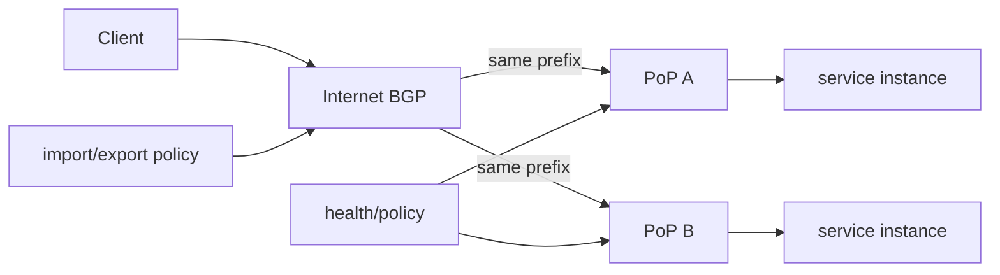
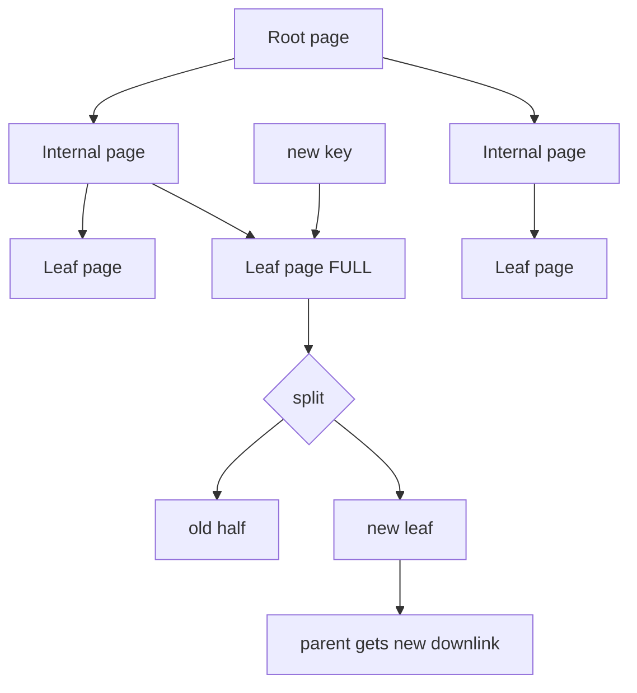

# 2026-09-21 08:00 — Interview Study Packages

README ve yakın `daily/2026-09-21/07-00.md` kontrol edildi. ext4/JBD2 ve technical-debt portfolio tekrar edilmedi. Repo aramasında BGP/Anycast ile B-tree page-split internals için doğrudan eşleşme bulunmadığından bu tur Networking ve Databases rotasyonuna ayrıldı.

## Paket 1 — Mid → Principal Networking/System Design: BGP Policy, Route Selection & Anycast
**Süre:** 20–30 dk

### Konu anlatımı
BGP, Internet'i tek bir global shortest-path grafiği gibi yönetmez. Autonomous System'lar (AS) birbirine prefix reachability ilan eder; operatörler import/export policy ile hangi rotayı kabul edip hangi komşuya duyuracağını belirler. Bu yüzden BGP'de "en iyi" rota çoğu zaman fiziksel olarak en kısa rota değil, yerel policy'nin tercih ettiği rotadır.

Temel mental model: control plane reachability + policy üretir, forwarding plane seçilmiş next-hop üzerinden paket taşır. AS_PATH loop prevention'a yardım eder; LOCAL_PREF aynı AS içindeki çıkış tercihini etkiler; MED komşuya giriş tercihi sinyali verebilir ama bağlamı sınırlıdır. Exact tie-break sırası implementation/vendor'a göre ayrıntılanabildiğinden mülakatta attribute'ların semantiğini ezber sırasından daha iyi bilmek gerekir.

Anycast'te aynı IP prefix'i birden çok lokasyondan ilan edilir. Routing sistemi istemciyi policy/topology açısından uygun görünen instance'a taşır; bu, uygulama-level "en düşük latency" garantisi değildir. Stateful session, route change veya partial withdrawal sırasında başka site'a kayabilir.

### İçeride ne oluyor?
- eBGP farklı AS'ler arasında, iBGP aynı AS içinde reachability taşır.
- Prefix için birden çok path öğrenilebilir; policy ve path attributes best-path kararını etkiler.
- AS_PATH loop detection ve policy için kullanılır; prepend inbound traffic engineering sinyali olabilir ama kesin sonuç garantilemez.
- LOCAL_PREF tipik olarak AS içindeki outbound tercihidir.
- Anycast health mekanizması yalnız process-alive kontrolü değil dependency/readiness durumunu da hesaba katmalıdır.
- Route withdrawal convergence anlık değildir; transient loss/reordering görülebilir.
- RPKI/ROV origin hijack riskinin bir kısmını azaltır; path'in tüm semantiğini doğrulamaz.

### Yüksek getirili mülakat soruları
1. BGP neden klasik shortest-path protokolü gibi düşünülmemeli?
2. eBGP ve iBGP farkı nedir?
3. AS_PATH ne işe yarar?
4. LOCAL_PREF ile MED hangi karar yönlerini etkiler?
5. Anycast neden global load balancer ile aynı şey değildir?
6. Senior: bir PoP unhealthy olduğunda prefix'i hemen withdraw etmenin trade-off'u nedir?
7. Staff: anycast altında stateful TCP/QUIC servislerini nasıl tasarlarsın?
8. Principal: route leak/hijack blast radius'unu policy, RPKI, max-prefix ve observability ile nasıl küçültürsün?

### Seviyeye göre cevap derinliği
- **Mid:** AS, prefix, eBGP/iBGP, AS_PATH ve policy kavramları.
- **Senior:** convergence, traffic engineering, anycast health ve state etkileri.
- **Staff:** multi-PoP failure domains, graceful drain, route observability ve dependency-aware withdrawal.
- **Principal:** routing governance, RPKI/ROV, leak containment, capacity ve organizational change safety.

### Kısa alıştırma
Üç PoP aynı `/24` prefix'i ilan etsin. PoP-B'nin application dependency'si bozuluyor fakat router sağlıklı. `keep advertising`, `withdraw`, `de-preference` seçenekleri için kullanıcı etkisi, convergence ve capacity riskini tabloya dök.

### Proje fikri
`mini-bgp-policy-lab`: containerlab/FRRouting ile üç AS ve iki anycast origin kur. LOCAL_PREF, AS_PATH prepend ve route withdrawal değişikliklerinde seçilen path'i, convergence süresini ve packet loss'u ölç.

### Failure modes / trade-off / production bağlantısı
"Anycast = en yakın DC" varsayımı; yalnız router health ile servis health'i eşitlemek; aggressive withdrawal ile route flap üretmek; backup PoP capacity'sini hesaba katmamak; RPKI'yi tüm path güvenliği sanmak tipik hatalardır. Production'da BGP updates/withdrawals, prefix visibility, path changes, RTT/loss, PoP saturation ve health-state birlikte korele edilir.

### Kaynaklar
- IETF RFC 4271 — BGP-4: https://www.rfc-editor.org/rfc/rfc4271
- IETF RFC 7454 — BGP Operations and Security: https://www.rfc-editor.org/rfc/rfc7454
- IETF RFC 4786 — Operation of Anycast Services: https://www.rfc-editor.org/rfc/rfc4786
- IETF RFC 6811 — BGP Prefix Origin Validation: https://www.rfc-editor.org/rfc/rfc6811
- IETF IDR — BGP YANG Model, June 2026: https://datatracker.ietf.org/doc/draft-ietf-idr-bgp-model/

---

## Paket 2 — Junior → Staff Databases: B-Tree Pages, Splits, Fillfactor & Index Bloat
**Süre:** 20–30 dk

### Konu anlatımı
B-tree'yi yalnız `O(log n)` olarak bilmek production davranışını açıklamaz. Gerçek database index'i sabit boyutlu disk/buffer pages üzerinde yaşayan, yüksek fan-out'lu bir ağaçtır. Internal page'ler separator key + child pointer taşır; leaf page'ler aranan key'leri ve row referanslarını taşır. Yüksek fan-out ağacı sığ tutar; birkaç page access milyonlarca key arasında gezinmeye yetebilir.

Bir leaf page yeni tuple'ı alamadığında split gerekir: içerik iki page'e dağıtılır ve parent'a yeni downlink eklenir. Parent da doluysa split yukarı cascade edebilir; root split ağacın yüksekliğini bir artırır. Bu yüzden random insert, monotonik insert, page occupancy ve fillfactor write amplification/fragmentation açısından farklı davranır.

PostgreSQL özelinde MVCC version churn index'te eski physical entries biriktirebilir. Bottom-up deletion ve deduplication bazı split'leri önlemeye çalışır. Fillfactor daha fazla boş alan bırakarak write-heavy workload'da split oranını yumuşatabilir; karşılığında index daha büyük olabilir ve cache locality azalabilir.

### İçeride ne oluyor?
- Complexity'deki `log n` kadar page fan-out ve cache hit ratio önemlidir.
- Leaf split yeni page allocation + tuple movement + parent update doğurur.
- Split cascade nadirdir ama latency spike ve WAL/write amplification yaratabilir.
- PostgreSQL B-tree levels doubly-linked page listeleri olarak da gezilebilir.
- MVCC nedeniyle aynı logical row'un farklı physical versions'ı index churn yaratabilir.
- Bottom-up index deletion anticipated version-churn split öncesinde garbage tuples temizlemeyi dener.
- Deduplication eşit key'leri posting-list biçiminde sıkıştırabilir.
- `INCLUDE` covering index heap erişimini azaltabilir ama index boyutunu ve write cost'u büyütür; PostgreSQL'de INCLUDE index'lerde B-tree deduplication kullanılmaz.

### Yüksek getirili mülakat soruları
1. B-tree neden binary tree değildir?
2. Page fan-out neden database index'lerinde önemlidir?
3. Leaf page split nasıl parent'a yayılır?
4. Fillfactor düşürmenin fayda/maliyeti nedir?
5. Composite index'te column order neden önemlidir?
6. Senior: MVCC index bloat'ı nasıl üretir?
7. Senior: covering index read'i hızlandırırken write'ı neden pahalılaştırır?
8. Staff: yüksek write QPS + random UUID key workload'unda hangi metrikleri ve tasarım seçeneklerini incelersin?

### Seviyeye göre cevap derinliği
- **Junior:** sorted tree, logarithmic lookup, leaf/internal ayrımı.
- **Mid:** page, fan-out, split, composite-index prefix mantığı.
- **Senior:** MVCC churn, bloat, fillfactor, cache/WAL/write amplification.
- **Staff:** workload-specific index portfolio, online rebuild, lock/IO budget ve operational observability.

### Kısa alıştırma
Bir leaf page'in 4 key alabildiğini varsay. `10,20,30,40,25,27` insert'lerini elle uygula; split sonrası separator'ın parent'a nasıl çıktığını çiz. Sonra page capacity'nin 200 key olması halinde tree height sezgisini açıkla.

### Proje fikri
`btree-split-observer`: PostgreSQL'de sequential bigint, random UUID ve time-ordered UUID benzeri üç key dağılımıyla tablo/index üret. Aynı insert hacminde index size, latency, WAL bytes ve page density değişimini ölç; farklı fillfactor değerlerini karşılaştır.

### Failure modes / trade-off / production bağlantısı
Her sorguya index eklemek; index'i RAM/cache maliyetinden bağımsız düşünmek; random key distribution'ın locality etkisini yok saymak; bloat sorununu yalnız `REINDEX` ile semptomatik çözmek ve long-running transaction/autovacuum davranışını incelememek tipik hatalardır. Production'da index size, buffer hit, page density, split/WAL baskısı, vacuum progress, query plans ve p95/p99 write latency birlikte okunur.

### Kaynaklar
- PostgreSQL 17 — B-Tree implementation: https://www.postgresql.org/docs/17/btree.html
- PostgreSQL — CREATE INDEX / fillfactor: https://www.postgresql.org/docs/current/sql-createindex.html
- PostgreSQL — Routine Reindexing: https://www.postgresql.org/docs/current/routine-reindex.html
- PostgreSQL source — `src/backend/access/nbtree/README`: https://github.com/postgres/postgres/blob/master/src/backend/access/nbtree/README
