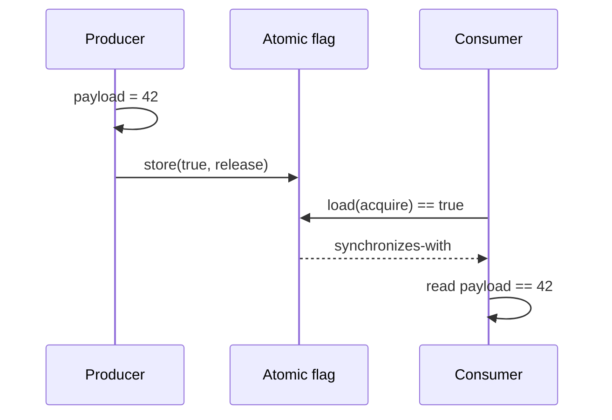
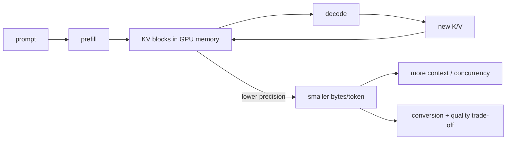

# 2026-09-21 08:00 — Interview Study Packages

README ve yakın `daily/2026-09-21/07-00.md` kontrol edildi. ext4/JBD2 ve technical-debt portfolio tekrar edilmedi. Repo çapı kontrolde ilk aday B-tree page split konusunun `20-00` ve canonical B+Tree chapter'ıyla, BGP/Anycast adayının da önceki daily notuyla çakıştığı görüldü; bu yüzden tur memory ordering temeli ile güncel LLM KV-cache serving economics'e kaydırıldı.

## Paket 1 — Mid → Staff Foundations: Memory Ordering, Atomics, Happens-Before & Fences
**Süre:** 20–30 dk

### Konu anlatımı
`payload = 42; ready = true` kaynak kodunda bu sırada görünse bile başka bir thread'in `ready` gördüğünde `payload`'ı da kesin gördüğü sonucu kendiliğinden çıkmaz. Compiler optimizasyonu, CPU ordering kuralları ve dilin memory model'i birlikte düşünülür. Doğru soyutlama "hangi instruction önce koştu?" değil, programın hangi **happens-before** ilişkilerini garanti ettiğidir.

C++ memory model'inde conflicting non-atomic erişimler arasında happens-before yoksa data race ve undefined behavior oluşabilir. Atomic olmak tek başına çevredeki tüm memory'yi sıralamaz: `relaxed` atomicity sağlar fakat synchronization sağlamaz. Producer payload yazıp atomic flag'i `release` ile publish eder; consumer aynı değeri `acquire` ile okursa tipik publication edge kurulur. `seq_cst` daha güçlü bir global ordering modeli sağlar ama correctness invariant'ı tanımlamanın yerini tutmaz.

### İçeride ne oluyor?
- **Atomicity** tek operation'ın parçalanmamasını; **ordering/visibility** diğer memory operation'ların hangi sırayla gözlenebileceğini ilgilendirir.
- `relaxed`: atomic operation atomic'tir; çevre erişimler için synchronization edge kurmaz.
- `release` store + o değeri okuyan `acquire` load `synchronizes-with` kurabilir; producer'ın önceki write'ları consumer'ın sonraki read'lerine görünür olur.
- Mutex unlock/lock da synchronization sağlar; atomics mutex'in otomatik olarak daha iyi hali değildir.
- `seq_cst`, seq_cst atomics için tek total order ekler; non-atomic data race'i sihirli biçimde düzeltmez.
- Fence'ler ordering constraint koyar; doğru atomic handshake olmadan fence eklemek kolayca yanlış olur.
- x86 çoğu acquire/release pattern'ini az instruction maliyetiyle taşırken weakly ordered ARM/Power'da barrier gereksinimleri daha görünür olabilir.

### Yüksek getirili mülakat soruları
1. Atomicity ile visibility/order farkı nedir?
2. Happens-before neyi ifade eder?
3. `relaxed` counter için ne zaman yeterlidir?
4. Release/acquire publication pattern'ini anlat.
5. Mutex neden memory-ordering primitive'idir?
6. Senior: double-checked initialization neden memory model bilinmeden risklidir?
7. Staff: x86'da çalışan lock-free kod ARM'de neden bozulabilir?
8. Staff: lock-free yerine mutex seçmek ne zaman daha doğru production kararıdır?

### Seviyeye göre cevap derinliği
- **Mid:** race, atomic, mutex, visibility ve happens-before sezgisi.
- **Senior:** acquire/release, relaxed, seq_cst ve publication invariant'ları.
- **Staff:** compiler + ISA + language memory model ayrımı; portability, testing ve lock-free lifecycle maliyeti.

### Kısa alıştırma
İki thread'li `payload + ready` örneğini önce normal değişkenlerle, sonra relaxed atomics ile, son olarak release/acquire publication ile çiz. Her versiyonda hangi sonucu dil modelinin garanti ettiğini yaz.

### Proje fikri
`memory-order-litmus-lab`: message-passing, store-buffering ve counter örneklerini C++ atomics ile kur. `relaxed`, acquire/release ve seq_cst varyantlarını ThreadSanitizer + farklı mimari CI runner'larında çalıştır; correctness invariant'ını performans ölçümünden ayrı raporla.

### Failure modes / trade-off / production bağlantısı
`volatile`'ı thread synchronization sanmak; atomic operation görünce bütün object graph'in güvenli olduğunu varsaymak; benchmark uğruna memory order zayıflatmak; reclamation/lifetime problemini ordering problemiyle karıştırmak tipik hatalardır. Production'da önce mutex/structured concurrency gibi kanıtlanabilir çözüm tercih edilir; lock-free ancak contention/latency ölçümü gerekçelendiriyorsa ve invariant test edilebiliyorsa seçilir.

### Kaynaklar
- C++ reference — memory order: https://en.cppreference.com/w/cpp/atomic/memory_order.html
- C++ reference — multithreading/data races: https://en.cppreference.com/w/cpp/language/multithread.html
- C++ reference — atomic_thread_fence: https://en.cppreference.com/w/cpp/atomic/atomic_thread_fence.html
- Linux kernel — memory barriers: https://docs.kernel.org/core-api/wrappers/memory-barriers.html

---

## Paket 2 — Mid → Principal ML/AI/LLM: KV-Cache Quantization, Context Capacity & Serving Economics
**Süre:** 20–30 dk

### Konu anlatımı
Autoregressive decode'da geçmiş token'ların key/value attention state'ini her adımda yeniden hesaplamak pahalıdır; KV cache bu state'i GPU memory'de saklar. Compute kazanılır fakat sequence length, layer sayısı, KV-head sayısı ve head dimension ile büyüyen request-dependent memory yükü oluşur. Uzun context ve yüksek concurrency'de bottleneck model weight'ten KV-cache capacity'ye kayabilir.

KV-cache quantization K/V değerlerini FP16/BF16 yerine FP8/INT8/INT4 benzeri düşük precision formatlarda tutarak token başına cache byte'ını azaltmayı hedefler. Kazanç "model hızlandı" demek değildir: daha fazla resident token/concurrent sequence veya daha uzun context için memory headroom açılır. Bedeli quantize/dequantize compute, scale metadata, kernel/backend kısıtları ve quality riskidir.

### İçeride ne oluyor?
- Decode geçmiş K/V state'ini cache'den okur; footprint context ve concurrency ile büyür.
- Paged/block-based KV allocation variable-length request ve fragmentation yönetimini kolaylaştırabilir.
- Scale granularity önemlidir: per-tensor daha az metadata; per-head/per-token daha iyi numeric fit fakat daha fazla metadata/kernel işi getirebilir.
- vLLM güncel dokümantasyonu FP8 KV cache ve per-tensor/per-attention-head scaling seçeneklerini belgeliyor.
- Weight quantization static model parameters'ı; KV-cache quantization request-dependent runtime state'i küçültür.
- Throughput artışı garanti değildir: workload memory-bound değilse conversion/kernel overhead kazanımı silebilir.
- Quality model/workload'a bağlıdır; task eval + latency/throughput birlikte ölçülmelidir.

### Yüksek getirili mülakat soruları
1. KV cache neden vardır?
2. Context length arttıkça serving memory neden büyür?
3. Weight quantization ile KV-cache quantization farkı nedir?
4. FP8 KV cache hangi kapasite avantajını hedefler?
5. Mid: prefill ile decode resource profili neden farklıdır?
6. Senior: cache block size ve fragmentation trade-off'u nedir?
7. Staff: p99 TTFT/ITL, throughput ve quality ile quantization rollout'unu nasıl değerlendirirsin?
8. Principal: daha fazla GPU ile daha agresif quantization arasında capacity/cost kararı nasıl verilir?

### Seviyeye göre cevap derinliği
- **Mid:** attention state, prefill/decode, KV cache ve context-memory ilişkisi.
- **Senior:** paged allocation, precision/scales, throughput-latency-quality trade-off'u.
- **Staff:** workload histogramı, concurrency, GPU memory budget, canary ve regression gates.
- **Principal:** $/token, capacity headroom, hardware portability ve quality-risk bütçesi.

### Kısa alıştırma
Model weights sonrası KV cache için 24 GiB kaldığını ve FP16 cache'in token başına 512 KiB kullandığını varsay. Maksimum resident token sayısını hesapla; cache byte'ı yarıya inerse teorik capacity'nin nasıl değiştiğini bul. Bunun throughput'un iki katına çıkacağını neden garanti etmediğini açıkla.

### Proje fikri
`kv-capacity-lab`: aynı model/workload için BF16/FP8 KV cache varyantlarını çalıştır. Context-length histogramı, concurrent sequences, GPU memory, TTFT, inter-token latency, tokens/s ve küçük bir quality eval setini kaydet. Capacity gain ile latency/quality regression'ı tek tabloda göster.

### Failure modes / trade-off / production bağlantısı
"Memory yarıya indi = throughput iki kat" demek; yalnız short-context benchmark kullanmak; calibration/scale seçimini atlamak; backend/hardware desteğini varsaymak; quality regression'ı yalnız perplexity ile değerlendirmek tipik hatalardır. Production rollout'ta cache occupancy, preemption/eviction, TTFT, ITL, OOM, tokens/s, request context distribution ve task-level quality birlikte izlenir.

### Kaynaklar
- vLLM — Quantized KV Cache: https://docs.vllm.ai/en/latest/features/quantization/quantized_kvcache/
- vLLM — CacheConfig: https://docs.vllm.ai/en/latest/api/vllm/config/cache/
- vLLM — Quantization overview: https://docs.vllm.ai/en/latest/features/quantization/
- PyTorch torchao — quantization: https://docs.pytorch.org/ao/stable/api_reference/api_ref_quantization.html
