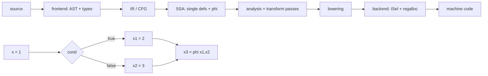
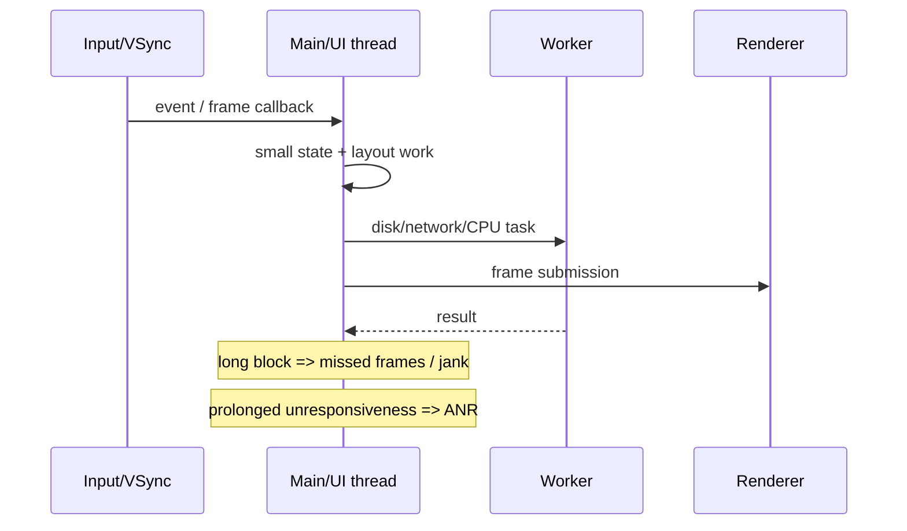

# 2026-09-21 09:00 — Interview Study Packages

README ve yakın `daily/2026-09-21/08-00.md` kontrol edildi. Memory ordering ve KV-cache quantization tekrar edilmedi. Repo çapı aramada compiler/runtime zincirinde SSA/IR optimization ve mobile tarafında main-thread/ANR/jank için doğrudan paket bulunmadı. Tur, yaklaşık %70 temel kapatma + %20 mülakat pratiği + %10 güncel production bağlantısı hedefiyle bu iki boşluğa ayrıldı.

## Paket 1 — Mid → Staff Foundations: Compiler Middle-End — SSA, CFG, PHI, Dominators & Optimization Passes
**Süre:** 20–30 dk

### Konu anlatımı
Compiler zincirinde frontend source code'u parse/type-check edip bir IR'a indirger; middle-end hedef ISA'dan büyük ölçüde bağımsız optimizasyonlar yapar; backend instruction selection, register allocation ve scheduling ile machine code üretir. Middle-end'i anlamanın anahtarı **control-flow graph (CFG)** ve **Static Single Assignment (SSA)** formudur.

SSA'da her sanal değer bir kez tanımlanır. Bir `if/else` sonrasında iki farklı tanım birleşiyorsa `phi` düğümü, kontrolün hangi predecessor'dan geldiğine göre doğru değeri seçer. Bu form def-use zincirlerini görünür hale getirir; constant propagation, dead-code elimination, GVN ve loop optimizasyonlarını kolaylaştırır. Dominator ilişkisi de "A block'una gelmeden B'ye ulaşamazsın" türü kontrol bağımlılıklarını modeller; SSA construction'da phi placement için dominator frontier kritik araçtır.

### İçeride ne oluyor?
- **CFG:** basic block'lar node, branch/fallthrough ilişkileri edge'dir.
- **SSA:** her value tek definition'a sahiptir; use'lar o definition'a bağlanır.
- **PHI:** runtime'da gerçek bir "iki değeri hesapla" operation'ı olmak zorunda değildir; predecessor edge'e göre logical value seçer ve lowering sırasında copy/move düzenine dönüşebilir.
- **Dominance:** `A`, `B`'yi dominate ediyorsa entry'den B'ye her yol A'dan geçer. Immediate dominators dominator tree'yi oluşturur.
- LLVM `mem2reg`, uygun stack slots'u SSA register values'a yükseltirken dominator frontiers üzerinden phi yerleştirir.
- Analysis pass bilgi üretir; transform pass IR'ı değiştirir. Bir transform daha önce hesaplanan analysis sonucunu invalidate edebilir.
- Örnek transform'lar: constant propagation, DCE, GVN, LICM, inlining ve vectorization.
- Optimization correctness'in önündedir: dil semantiği ve undefined behavior optimizer'ın hangi dönüşümleri yapabileceğini belirler.

### Yüksek getirili mülakat soruları
1. Compiler frontend, middle-end ve backend ne yapar?
2. Basic block ve CFG nedir?
3. SSA neden optimizasyonu kolaylaştırır?
4. PHI node neyi temsil eder?
5. Dominator nedir; phi placement ile ilişkisi nedir?
6. Senior: alias analysis LICM/GVN gibi optimizasyonları neden sınırlar?
7. Staff: optimization pass ordering neden performans ve compile-time açısından önemlidir?
8. Staff: optimizer-induced miscompile şüphesini nasıl izole edersin?

### Seviyeye göre cevap derinliği
- **Mid:** AST → IR → machine code, CFG, SSA ve phi sezgisi.
- **Senior:** dominance, alias analysis, DCE/GVN/LICM, IR invariants ve lowering.
- **Staff:** pass pipeline economics, analysis invalidation, target-independent/target-specific sınırı, debugability ve miscompile triage.

### Kısa alıştırma
Aşağıdaki kodu CFG'ye çevir ve SSA isimleri ver: `x=1; if(c) x=x+1; else x=x*2; return x+4`. Merge block'taki phi'yi yaz. Sonra `c=true` compile-time constant olsaydı constant propagation + DCE sonrasında hangi block'ların kalacağını açıkla.

### Proje fikri
`mini-ssa-lab`: küçük expression/branch dilini basic block CFG'ye indir. Dominator hesabı, basit phi insertion, constant propagation ve dead-code elimination ekle. Her pass öncesi/sonrası IR dump üret; yanlış transform'ları differential tests ile yakala.

### Failure modes / trade-off / production bağlantısı
SSA'yı source variable modeli sanmak; phi'yi normal eager function call gibi düşünmek; optimizer'ın aliasing/UB kurallarını yok saymak; tek pass benchmark'ından genel performans sonucu çıkarmak tipik hatalardır. Production'da compiler upgrade'leri binary size, build time, CPU, debug-symbol kalitesi ve correctness regression'larıyla birlikte canary edilir. JIT runtime'larda aynı fikirler profile-guided hot-path optimization ve deoptimization ile birleşir.

### Kaynaklar
- LLVM Language Reference — PHI/IR: https://llvm.org/docs/LangRef.html
- LLVM Analysis & Transform Passes: https://llvm.org/docs/Passes.html
- LLVM Loop Terminology / LCSSA: https://llvm.org/docs/LoopTerminology.html
- LLVM New Pass Manager: https://llvm.org/docs/NewPassManager.html

---

## Paket 2 — Junior → Principal Frontend/Mobile: Main Thread, Frame Budget, Jank & Android ANR Diagnosis
**Süre:** 20–30 dk

### Konu anlatımı
Interactive UI'da ana thread input, lifecycle callbacks, layout/draw ve pek çok framework callback'ini seri biçimde yürütür. Ana thread üzerinde blocking I/O, uzun CPU işi, lock contention veya çok pahalı render yapılırsa kullanıcı önce dropped/late frames yani **jank**, blokaj uzarsa Android'de **ANR (Application Not Responding)** görebilir.

Mental model "her işi background'a at" değildir. UI state mutation'ın doğru thread'de kalması, background işinin lifecycle/cancellation ile yönetilmesi ve sonuçların ana thread'e kontrollü dönmesi gerekir. Ayrıca app thread runnable olduğu halde CPU alamıyorsa problem yalnız app code'u değil scheduler/system load olabilir; trace üzerinden running/runnable/sleeping ayrımı yapılır.

### İçeride ne oluyor?
- Main thread'in uzun süre block olması input dispatch ve lifecycle responsiveness'i bozar.
- Blocking network/database I/O, synchronous Binder calls, lock contention ve expensive frame'ler yaygın ANR/jank nedenleridir.
- Jank ile ANR aynı eşik değildir: jank frame deadline kaçırılması; ANR sistemin belirli responsiveness timeout'larını aşmasıdır.
- Background work sonucunu UI'a döndürürken lifecycle/cancellation ve stale-result yarışları düşünülmelidir.
- Thread dump tek başına yanıltabilir; geç alınmış dump `nativePollOnce`/idle gösterebilir.
- Perfetto gibi timeline trace'leri main thread'in running mi runnable mı olduğunu, CPU scheduling ve Binder/lock ilişkilerini ayırmada değerlidir.
- "Daha çok thread" çözüm değildir: contention, context switching ve priority inversion yaratabilir.

### Yüksek getirili mülakat soruları
1. UI/main thread neden vardır?
2. Jank ile ANR farkı nedir?
3. Main thread'de hangi işler yapılmamalıdır?
4. Background result UI'a güvenli nasıl döner?
5. Mid: lock contention UI freeze'e nasıl dönüşür?
6. Senior: thread dump'ta main thread runnable görünüyorsa hangi hipotezleri kurarsın?
7. Staff: Perfetto trace ile app bug'ı ve system scheduling sorununu nasıl ayırırsın?
8. Principal: ANR/jank SLO'larını release gating ve cihaz segmentasyonu ile nasıl yönetirsin?

### Seviyeye göre cevap derinliği
- **Junior:** main thread, blocking I/O ve responsiveness.
- **Mid:** lifecycle, cancellation, worker/UI handoff, jank vs ANR.
- **Senior:** Binder, locks, scheduler states, traces ve root-cause attribution.
- **Staff/Principal:** fleet/device segmentation, release gates, observability budget ve UX/business impact.

### Kısa alıştırma
Bir ekran açılışında ana thread sırasıyla 40 ms JSON parse, synchronous DB read ve 25 ms image transform yapıyor. Hangi işleri taşıyacağını, hangi state'in main thread'de kalacağını ve stale-result/cancellation riskini nasıl yöneteceğini çiz.

### Proje fikri
`ui-stall-lab`: Android örnek uygulamasında kontrollü blocking I/O, lock contention ve CPU-heavy frame senaryoları oluştur. Perfetto trace + ANR/jank metrikleriyle her failure mode için ayırt edici sinyalleri kaydet; sonra işleri worker'a taşıyıp before/after karşılaştır.

### Failure modes / trade-off / production bağlantısı
Her şeyi background thread'e taşımak; UI object'lerine worker'dan dokunmak; yalnız stack dump'a bakmak; emulator sonucunu tüm cihaz filosuna genellemek; ANR oranını aggregate edip düşük seviye cihaz/OS segmentlerini saklamak tipik hatalardır. Production'da startup, frame timing/jank, ANR clusters, device/OS segmenti ve trace örnekleri birlikte değerlendirilir; regression release gate'e bağlanır.

### Kaynaklar
- Android Developers — Diagnose and fix ANRs: https://developer.android.com/topic/performance/anrs/diagnose-and-fix-anrs
- Android Developers — Slow rendering / jank: https://developer.android.com/topic/performance/vitals/render
- Android Developers — Processes and threads: https://developer.android.com/guide/components/processes-and-threads
- Perfetto documentation: https://perfetto.dev/docs/
