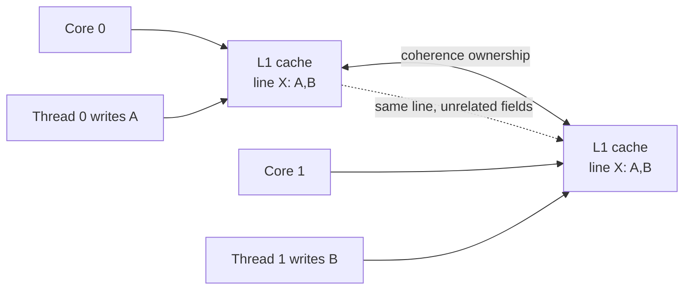
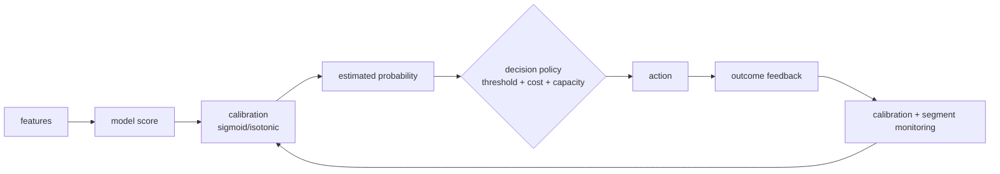

# 2026-09-21 10:00 — Interview Study Packages

README ve yakın `daily/2026-09-21/09-00.md` kontrol edildi. SSA/compiler middle-end ve mobile ANR/jank tekrar edilmedi. Repo çapı kontrolde Linux CFS/EEVDF ve B+Tree temellerinin zaten işlendiği görüldü; bu tur temel boşluk kapatma için CPU cache coherence/false sharing, ML/MLOps için probability calibration ve decision thresholds seçildi. Hedef yaklaşık %70 temel + %20 mülakat pratiği + %10 güncel production bağlantısıdır.

## Paket 1 — Mid → Staff Foundations: Cache Coherence, Cache Lines & False Sharing
**Süre:** 20–30 dk

### Konu anlatımı
Çok çekirdekli bir CPU'da her core kendi cache'lerinde aynı memory location'ın kopyasını tutabilir. **Cache coherence**, tek bir address için core'ların birbirleriyle çelişen değerleri sonsuza kadar görmesini engelleyen donanım protokolüdür. Kritik ayrım: coherence, tek bir cache line'ın görünürlüğüyle ilgilidir; programlama dilinin memory-ordering/happens-before kurallarının yerine geçmez.

Donanım coherence'i byte değil çoğunlukla **cache line** granularity'sinde izler. Bu nedenle iki thread mantıksal olarak farklı değişkenleri yazsa bile değişkenler aynı line içindeyse line ownership core'lar arasında gidip gelebilir. Buna **false sharing** denir. Kodda lock contention görünmeyebilir ama throughput core sayısıyla ölçeklenmez.

### İçeride ne oluyor?
- Cache line, coherence'in temel transfer/invalidation birimidir; yaygın makinelerde 64 B olabilir ama bunu evrensel sabit varsayma.
- Write yapan core line üzerinde uygun ownership ister; başka core'lardaki kopyalar invalidate/downgrade olabilir.
- True sharing: thread'ler aynı logical datum üzerinde haberleşir. False sharing: farklı datum'lar aynı line yüzünden coherence trafiği üretir.
- Atomics lock-free olsa bile cache-line ping-pong nedeniyle pahalı olabilir.
- Per-thread/per-CPU counters hot shared write'ı azaltabilir; sonra aggregation gerekir.
- Padding/alignment false sharing'i azaltabilir fakat memory footprint, cache/TLB pressure ve layout complexity artırır.
- Linux kernel dokümantasyonu `perf c2c`, `perf stat/report`, `pahole` gibi araçlarla false-sharing analizi önerir.

### Mental model
`shared write` maliyetini yalnız instruction sayısı olarak değil **ownership migration** olarak düşün: aynı line iki socket/core arasında sürekli el değiştiriyorsa ucuz görünen increment pahalı bir distributed coordination problemine dönüşür.

### Yüksek getirili mülakat soruları
1. Cache coherence ile memory consistency/order arasındaki fark nedir?
2. False sharing nedir; data race olmadan nasıl performans problemi yaratır?
3. Atomic counter neden core sayısı arttıkça kötü ölçeklenebilir?
4. Mid: padding ne zaman işe yarar, maliyeti nedir?
5. Senior: per-CPU counter correctness ve freshness trade-off'u nedir?
6. Staff: NUMA sistemde false sharing teşhisini hangi ölçümlerle doğrularsın?
7. Staff: lock contention ile cache-line contention'ı nasıl ayırırsın?

### Seviyeye göre cevap derinliği
- **Mid:** cache line, invalidation, true/false sharing ve padding.
- **Senior:** atomics, ownership ping-pong, per-core sharding, NUMA ve measurement.
- **Staff:** workload-driven layout, HITM/coherence sinyalleri, memory-vs-throughput economics ve architecture-level mitigation.

### Kısa alıştırma
8 worker'ın tek global atomic request counter artırdığı bir benchmark tasarla. Sonra counter'ı worker başına shard et ve periyodik aggregate et. 1/2/4/8 core için throughput ve p99 ölç; padding açık/kapalı sonuçlarını karşılaştır.

### Proje fikri
`cacheline-lab`: C/C++ veya Rust ile contiguous counters, padded counters ve shared atomic counter varyantları oluştur. Linux'ta `perf stat` ve mümkünse `perf c2c` ile cache-to-cache davranışı ölç; CPU affinity ile deneyleri tekrarla.

### Failure modes / trade-off / production bağlantısı
Her shared variable'ı padding ile ayırmak cache/TLB locality'yi bozabilir. Benchmark'ı CPU affinity olmadan çalıştırmak scheduler migration etkisini false sharing sanmaya yol açabilir. Production'da metrics counters, allocators, queues, reference counts ve lock metadata hot cache lines yaratabilir; çözüm ancak profiler/perf-counter kanıtıyla uygulanmalıdır.

### Kaynaklar
- Linux Kernel — False Sharing: https://docs.kernel.org/kernel-hacking/false-sharing.html
- Linux perf c2c: https://man7.org/linux/man-pages/man1/perf-c2c.1.html
- C++ memory order reference: https://en.cppreference.com/w/cpp/atomic/memory_order.html

---

## Paket 2 — Mid → Principal ML/MLOps: Probability Calibration, Decision Thresholds & Cost-Sensitive Serving
**Süre:** 20–30 dk

### Konu anlatımı
Bir classifier'ın `0.8` skoru iki farklı şeyi temsil edebilir: iyi sıralama yapan bir **score** veya gerçekten yaklaşık %80 olay frekansına karşılık gelen **calibrated probability**. ROC-AUC gibi ranking metrikleri modelin pozitifleri negatiflerin önüne koymasını ölçerken calibration, tahmin edilen olasılıkların gözlenen frekanslarla uyumunu sorar.

Production kararı çoğu zaman `p > 0.5` değildir. Fraud block, medical triage veya lead routing gibi sistemlerde false-positive ve false-negative maliyetleri farklıdır. Bu nedenle model skoru → calibration → decision policy → action zincirini ayrı tasarlamak gerekir.

### İçeride ne oluyor?
- Reliability diagram'da predicted-probability bin'leri ile empirical positive frequency karşılaştırılır; ideal eğri yaklaşık diagonaldir.
- Brier score ve log loss proper scoring rules'dur; fakat Brier tek başına saf calibration metriği değildir, discrimination/resolution etkisini de taşır.
- Sigmoid/Platt calibration daha kısıtlı parametrik mapping; isotonic daha esnek non-parametric mapping'dir ve az veriyle overfit riski taşır.
- Calibration verisi model-fit verisinden ayrılmalıdır; aksi halde optimistic calibration elde edilebilir.
- Threshold, model parametresi olmak zorunda değildir: business cost, review capacity, latency budget ve risk appetite ile policy katmanında seçilebilir.
- Dataset shift sonrası ranking aynı kalırken calibration bozulabilir; segment bazında reliability izle.

### Mental model
**Model sıralar, calibrator olasılık diline çevirir, policy iş kararını verir.** Bu üç katmanı tek `accuracy` sayısında eritme.

### Yüksek getirili mülakat soruları
1. Calibration nedir; accuracy/AUC'den farkı nedir?
2. Reliability diagram nasıl okunur?
3. Neden threshold her zaman 0.5 değildir?
4. Mid: sigmoid ve isotonic calibration trade-off'u nedir?
5. Senior: calibration set leakage nasıl oluşur?
6. Staff: class prevalence değişirse calibration ve threshold ne olur?
7. Principal: fraud review kapasitesi sabitken threshold'u nasıl yöneteceksin?
8. Principal: global calibration iyi görünürken kritik segment neden kötü olabilir?

### Seviyeye göre cevap derinliği
- **Mid:** probability vs score, reliability diagram, threshold seçimi.
- **Senior:** proper scoring rules, held-out calibration, prevalence/shift ve segment metrics.
- **Staff/Principal:** cost matrix, capacity constraint, policy separation, monitoring/recalibration cadence ve governance.

### Kısa alıştırma
10.000 prediction için `probability`, `label`, `segment` kolonları olduğunu varsay. 10-bin reliability table üret; iki segment için ayrı calibration error incele. False positive maliyeti 1, false negative maliyeti 8 iken 0.1–0.9 threshold sweep yapıp toplam expected cost'u karşılaştır.

### Proje fikri
`calibration-gate`: sklearn classifier eğit, held-out set üzerinde sigmoid ve isotonic calibration karşılaştır; reliability diagram, Brier/log-loss ve threshold-cost curve üret. Deployment gate'i global metrik yanında kritik segment calibration sapmasına bağla.

### Failure modes / trade-off / production bağlantısı
Training data üzerinde calibration fit etmek; yalnız AUC'ye bakmak; threshold'u model binary'sine gömmek; class prevalence drift'ini görmezden gelmek; global calibration'ın küçük ama riskli segmentleri maskelemesine izin vermek yaygın hatalardır. Production'da calibrator ve decision policy ayrı versionlanmalı; delayed labels varsa monitoring penceresi label arrival semantics'iyle tasarlanmalıdır.

### Kaynaklar
- scikit-learn — Probability calibration: https://scikit-learn.org/stable/modules/calibration.html
- scikit-learn — CalibrationDisplay: https://scikit-learn.org/stable/modules/generated/sklearn.calibration.CalibrationDisplay.html
- scikit-learn — Brier score loss: https://scikit-learn.org/stable/modules/generated/sklearn.metrics.brier_score_loss.html
