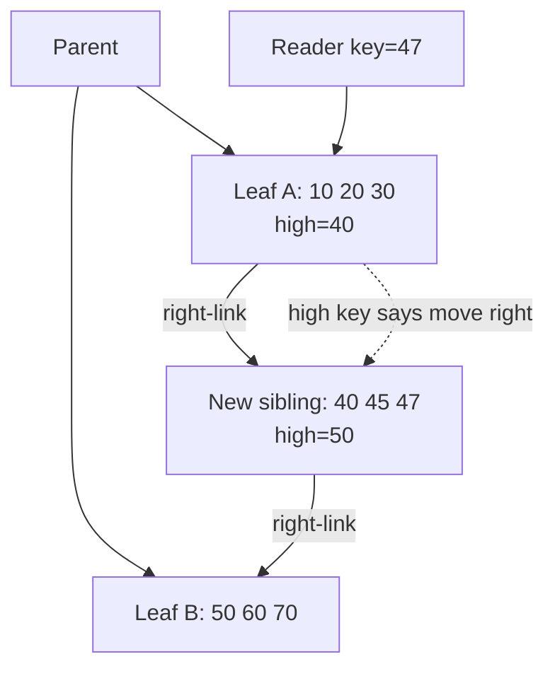
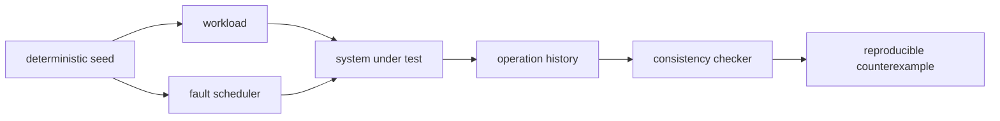

# 2026-09-21 11:00 — Interview Study Packages

README ve yakın `daily/2026-09-21/10-00.md` kontrol edildi. İlk taslaktaki allocator konusu `docs/01-foundations/17-heap-allocators-fragmentation-arenas-memory-debugging.md` ve `daily/2026-09-20/22-00.md` ile belirgin tekrar oluşturduğu için çıkarıldı. Bu tur B+Tree temelini **concurrent correctness** katmanına, testing engineering'i ise **deterministic fault injection + history checking** katmanına ilerletiyor. Hedef yaklaşık %70 temel + %20 mülakat pratiği + %10 güncel production bağlantısıdır.

## Paket 1 — Mid → Principal Databases: Concurrent B+Tree — Page Splits, Right Links, Latches & MVCC
**Süre:** 20–30 dk

### Konu anlatımı
Tek-thread B+Tree'de root'tan leaf'e iner, dolu leaf'i split edip parent'a separator eklersin. Production database'de zor soru şudur: **reader arama yaparken başka thread page split ederse ne olur?** Parent henüz güncellenmeden key yeni sibling'e taşınabilir. High-concurrency B-tree ailesinde page'ler parent-child tree yanında aynı level'da sibling linkleriyle bağlanır; page'in high key'i hedefin artık sağ sibling'e ait olduğunu gösterebilir.

**Latch**, kısa süreli in-memory page/data-structure bütünlüğünü; transaction **lock/MVCC**, logical row/key visibility ve isolation'ı; **WAL**, crash recovery'yi korur. Bunları tek "locking" kavramına indirgemek mülakatta önemli bir hata olur.

### İçeride ne oluyor?
- Search child'a iner; hedef key page range'inin dışındaysa right-link takip eder.
- Insert leaf'te yer bulamazsa cleanup/dedup gibi split'i önleyebilecek yollar denenebilir; sonra sibling allocate edilip tuples bölünür.
- Parent'a separator/downlink eklenir; parent dolarsa split yukarı cascade eder, root split tree height'ı artırır.
- Split publication ordering reader'ın eski parent pointer'ından bile doğru sibling'e ulaşabilmesini sağlamalıdır.
- MVCC version churn index'te fiziksel tuple biriktirip split pressure yaratabilir. PostgreSQL 18, anticipated version-churn split öncesinde bottom-up deletion uygulayabilir; deduplication da bazı split'leri geciktirir.
- Concurrency correctness durability değildir: page değişikliklerinin WAL/redo invariant'ları ayrıca sağlanmalıdır.

### Mental model
**Tree navigation + horizontal escape hatch.** Parent yaklaşık doğru page'i bulur; high-key/right-link concurrent structural change sırasında doğru range'e kaçış yolu verir. Latch fiziksel page'i, MVCC logical görünürlüğü, WAL crash sonrası durumu korur.

### Yüksek getirili mülakat soruları
1. Concurrent page split reader için neden zordur?
2. Latch ile transaction lock farkı nedir?
3. Right-link/high-key neyi çözer?
4. Mid: parent update gecikmişken reader yeni sibling'i nasıl bulur?
5. Senior: latch coupling/crabbing hangi contention/deadlock risklerini taşır?
6. Senior: MVCC version churn split frequency ve bloat'ı nasıl etkiler?
7. Staff: monotonik key workload neden rightmost leaf hotspot'u yaratabilir?
8. Principal: index concurrency, WAL ordering ve recovery invariant'larını nasıl ayrı test edersin?

### Seviyeye göre cevap derinliği
- **Mid:** leaf/internal page, split, sibling link, latch vs lock.
- **Senior:** publication ordering, latch coupling, MVCC churn, WAL boundary.
- **Staff:** hot-page economics, fillfactor/cleanup, observability ve benchmark.
- **Principal:** concurrency + recovery invariant'ları ve workload-specific index policy.

### Kısa alıştırma
T1 `key=47` ararken T2 aynı leaf'i split etsin ve parent separator update'i geciksin. Right-link yokken yanlış sonucu, high-key/right-link varken toparlanmayı 8–12 event'lik trace ile yaz.

### Proje fikri
`btree-concurrency-lab`: önce global mutex'li, sonra page-level RW latch + right-link kullanan memory-only B+Tree yaz. 1/4/16 worker altında random ve monotonik insert için throughput, p99, split count ve latch wait ölç; ardından mini WAL + restart invariant checker ekle.

### Failure modes / trade-off / production bağlantısı
Global lock kolay ama ölçeklenmez; aşırı ince latch granularity complexity/deadlock/retry maliyeti getirir. Düşük fillfactor split'i azaltırken footprint/cache verimini bozar. Production'da query latency yanında split rate, index bloat, buffer hit, WAL volume ve latch/lock waits birlikte okunmalıdır.

### Kaynaklar
- PostgreSQL 18 B-Tree implementation: https://www.postgresql.org/docs/18/btree.html
- PostgreSQL `nbtree` internals: https://github.com/postgres/postgres/blob/master/src/backend/access/nbtree/README
- PostgreSQL Index Locking: https://www.postgresql.org/docs/current/index-locking.html

---

## Paket 2 — Senior → Principal Testing / Distributed Systems: Deterministic Fault Injection, Histories & Consistency Checking
**Süre:** 20–30 dk

### Konu anlatımı
Distributed correctness testinde yalnız "node öldür ve servis dönüyor mu bak" yetersizdir. Güçlü harness üç şeyi ayırır: **workload**, **fault schedule**, **checker/oracle**. Concurrent operations yürütülür, faults uygulanır, operation history kaydedilir ve sonunda sistemin vaat ettiği consistency modeline göre doğrulanır.

Determinism yalnız aynı input değildir: randomness, virtual time, scheduling/message delivery ve fault seçimleri kontrol altındaysa nadir interleaving tekrar oynatılabilir. FoundationDB deterministic simulation'ı yoğun kullanır. Jepsen workload + fault/nemesis + history checker yaklaşımıyla gerçek dağıtık sistem safety iddialarını test eder.

**Linearizability** için her operation invocation-response aralığında tek bir atomic point'te gerçekleşmiş gibi bir sequential order bulunmalı ve gerçek-zaman precedence korunmalıdır. Testin başarı kriteri "crash olmadı" değil, **claimed safety property ihlal edilmedi** olmalıdır.

### İçeride ne oluyor?
- Workload read/write/CAS/transaction gibi semantic operations üretir.
- Fault injector process kill/pause, partition, clock perturbation, storage fault veya resource pressure uygular.
- History invoke/ok/fail/info sonuçlarını kaydeder; timeout olmuş write'ın gerçekten uygulanıp uygulanmadığı bilinmeyebilir.
- Checker vaat edilen modele göre history'yi test eder. Linearizability single-object için güçlüdür; multi-object transaction iddiaları serializability/strict serializability gibi farklı model ister.
- Deterministic seed reproducibility sağlar ama coverage sağlamaz; seed diversity, schedule exploration ve counterexample minimization gerekir.
- Jepsen 0.3.10 (2025-12-01) controllable entropy/deterministic RNG desteğini genişletip Antithesis entegrasyonu ekledi.

### Mental model
**Chaos ≠ correctness test.** Fault stimulus'tur; değer, fault sonrası history'nin explicit invariant/model ile kontrol edilmesinden gelir. İyi harness "hangi seed + operation sequence + fault schedule invariant'ı bozdu?" sorusunu cevaplar.

### Yüksek getirili mülakat soruları
1. Fault injection ile chaos engineering farkı nedir?
2. Deterministic simulation neden debugging'i kolaylaştırır?
3. Linearizability ile serializability farkı nedir?
4. Senior: timeout olmuş write history'de nasıl modellenir?
5. Senior: partition testinde yalnız availability neden yetersizdir?
6. Staff: simulator production kernel/network/storage davranışından nerede sapabilir?
7. Staff: combinatorial fault matrix'i nasıl önceliklendirirsin?
8. Principal: consistency claim'lerini executable release gates'e nasıl çevirirsin?

### Seviyeye göre cevap derinliği
- **Senior:** workload/fault/checker, history, unknown outcome, linearizability intuition.
- **Staff:** deterministic scheduling, fault composition, shrinking, coverage/fidelity.
- **Principal:** consistency contract, release governance, risk-based fault portfolio ve customer-visible guarantees.

### Kısa alıştırma
3-node replicated KV için 12 operation'lık history yaz: `write(x,1)`, concurrent reads, leader isolation, timeout'lu `write(x,2)`, heal ve final read. Linearizable olabilecek sonuçları işaretle; sonra `timeout = definitely failed` varsayımının checker'ı nasıl bozduğunu göster.

### Proje fikri
`fault-history-lab`: üç process'li replicated register kur. Proxy'de deterministic seed ile delay/drop/partition uygula; invocation/response history kaydet. Önce basit invariant checker, sonra gerçek model-checking/library entegrasyonu ekle.

### Failure modes / trade-off / production bağlantısı
Random sleep testleri flaky olabilir; yalnız happy path split-brain/data-loss sınıfını kaçırır. Simulator gerçek sistem semantics'ini eksik modelleyebilir; production chaos ise pahalı ve nondeterministic olabilir. Katmanlı strateji: deterministic simulation + targeted integration faults + az sayıda production-safe game day + incident'lardan regression seeds.

### Kaynaklar
- Jepsen — Linearizability: https://jepsen.io/consistency/models/linearizable
- Jepsen — Distributed Systems Safety Research: https://jepsen.io/
- FoundationDB deterministic simulation background: https://www.foundationdb.org/blog/fdb-paper/
- FoundationDB source/tests: https://github.com/apple/foundationdb
