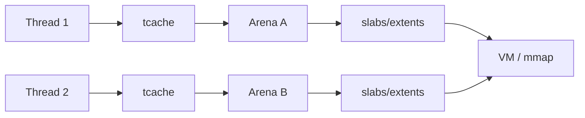
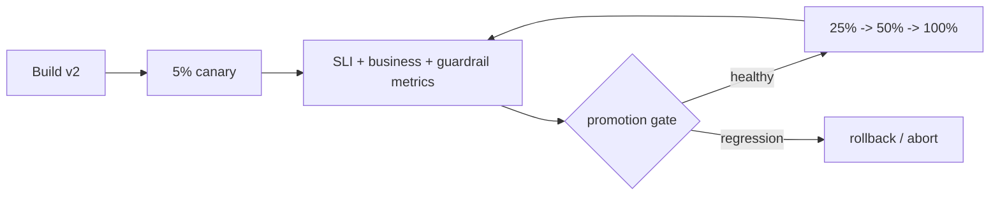

# 2026-09-21 11:00 — Interview Study Packages

README ve yakın `daily/2026-09-21/10-00.md` kontrol edildi. Cache coherence/false sharing ve probability calibration tekrar edilmedi. Repo çapı aramada consistent hashing, PostgreSQL SSI, OAuth/OIDC/PKCE, QUIC, Bloom filter, feature flags gibi adayların zaten işlendiği görüldü. Bu tur daha az kapsanmış iki alana ayrıldı: runtime memory allocation internals ve SRE release engineering.

## Paket 1 — Mid → Staff Foundations/Backend: Memory Allocators, Arenas, Thread Caches & Fragmentation
**Süre:** 20–30 dk

### Konu anlatımı
`malloc(128)` doğrudan işletim sisteminden 128 byte istemek değildir. General-purpose allocator, OS'tan daha büyük virtual-memory bölgeleri alır; küçük allocation'ları size class/slab/bin benzeri yapılardan servis eder. Amaç her allocation'da syscall ve global lock maliyetinden kaçınmaktır.

Concurrency için allocator'lar birden fazla **arena** ve thread-local cache kullanabilir. Bu throughput'u artırır çünkü birçok allocation global coordination olmadan tamamlanır. Bedeli ise memory footprint ve fragmentation'dır: farklı arena/cache'lerde boş alan varken yeni sayfa/extent gerekebilir.

### İçeride ne oluyor?
- **Internal fragmentation:** request size ile allocator size class arasındaki boşluk.
- **External fragmentation:** toplam boş memory yeterli görünse de uygun contiguous/layout bölgesi bulunamaması veya boş sayfaların tamamen serbestleşememesi.
- jemalloc küçük object'leri slab içinde, büyük object'leri extent'lerle yönetir; birden fazla arena concurrency'yi artırır.
- Thread cache hot allocation/free yolunda synchronization'ı azaltır; fakat cache'de tutulan object'ler memory kullanımını artırabilir.
- `free()` çağrılması RSS'in hemen düşeceği anlamına gelmez. Sayfa allocator içinde reusable olabilir ama kernel'e purge/decay henüz gerçekleşmemiş olabilir.
- Daha fazla arena lock contention'ı azaltabilir fakat fragmentation/cache locality maliyetini büyütebilir.
- OOM teşhisinde yalnız live-object bytes'a değil `allocated`, `active`, `resident/RSS`, mapped memory, arena/tcache ve allocation profile'a bak.

### Mental model
Allocator'ı bir depo ağı gibi düşün: thread cache küçük raf, arena bölgesel depo, OS büyük tedarikçi. Daha çok depo eşzamanlılığı artırır; fakat her depoda yarım boş raf bırakmak toplam footprint'i büyütür.

### Yüksek getirili mülakat soruları
1. `malloc/free` neden her çağrıda syscall yapmaz?
2. Internal ve external fragmentation farkı nedir?
3. Thread cache allocation throughput'unu neden artırır?
4. `free()` sonrası RSS neden düşmeyebilir?
5. Senior: arena sayısını artırmanın throughput/memory trade-off'u nedir?
6. Senior: memory leak ile allocator fragmentation'ı nasıl ayırırsın?
7. Staff: container OOM olurken heap live-set sabitse hangi metrik ve deneyleri toplarsın?
8. Staff: allocator tuning'i neden benchmark + production profile olmadan yapmamalısın?

### Seviyeye göre cevap derinliği
- **Mid:** heap allocator, size class, fragmentation, cache kavramlarını doğru ayır.
- **Senior:** arenas/tcache, RSS-vs-live bytes, purge/decay ve workload shape'i bağla.
- **Staff:** NUMA/container limitleri, profiling, allocator swap/tuning deneyi ve latency-vs-footprint ekonomisini tartış.

### Kısa alıştırma
Bir programda 8 thread ile 64 B, 1 KiB ve 64 KiB allocation/free döngüleri çalıştır. Peak RSS, throughput ve allocator stats ölç. Thread sayısını ve allocation lifetime dağılımını değiştir; live object miktarı aynıyken RSS'in nasıl değiştiğini gözle.

### Proje fikri
`allocator-lab`: glibc malloc ve jemalloc ile aynı synthetic workload'u çalıştır. Allocation-rate, p99 request latency, RSS/allocated oranı ve thread count ilişkisini raporla; sonuçları flamegraph/heap profile ile destekle.

### Failure modes / trade-off / production bağlantısı
RSS artışını otomatik olarak leak sanmak; allocator'ın reusable ama OS'a dönmemiş memory'sini gözden kaçırmak; arena sayısını körlemesine artırmak; benchmark'ta production allocation-size/lifetime dağılımını temsil etmemek tipik hatalardır. High-QPS server, database, proxy ve language runtime'larında allocator contention veya fragmentation doğrudan latency ve container OOM riskine dönüşebilir.

### Kaynaklar
- jemalloc resmi manual: https://jemalloc.net/jemalloc.3.html
- jemalloc project: https://jemalloc.net/
- GNU libc allocator: https://sourceware.org/glibc/manual/latest/html_node/The-GNU-Allocator.html
- GNU libc malloc tunables: https://sourceware.org/glibc/manual/latest/html_node/Memory-Allocation-Tunables.html

---

## Paket 2 — Mid → Principal Cloud/DevOps/SRE: Canary Analysis, Rollback Signals & Progressive Delivery
**Süre:** 20–30 dk

### Konu anlatımı
Rolling deployment yalnız yeni binary'yi kademeli dağıtır; **progressive delivery** ise exposure'ı ölçüm ve karar döngüsüyle yönetir. Canary'nin amacı “%5 trafik ver ve bekle” değil, küçük blast radius altında yeni versiyonun baseline'a göre güvenli olup olmadığını test etmektir.

### İçeride ne oluyor?
- **Deployment** artifact dağıtımıdır; **release/exposure** kullanıcı davranışının açılmasıdır. Bunlar feature flag veya traffic routing ile ayrılabilir.
- Canary cohort mümkünse baseline ile aynı failure domain/workload dağılımını temsil etmelidir; aksi halde karşılaştırma bias üretir.
- Gate yalnız HTTP 5xx'e bakmamalı: latency quantiles, saturation, queue depth, dependency errors ve domain-specific business KPI gerekebilir.
- Çok kısa pencere rare failure'ları kaçırır; çok uzun pencere delivery hızını düşürür. Minimum sample + observation window birlikte düşünülmelidir.
- Rollback her zaman schema/data side-effect'lerini geri almaz. Forward/backward-compatible migration ve expand/contract rollout gerekebilir.
- Feature flag control plane bozulduğunda request-time evaluation için güvenli default önemlidir. OpenFeature spec abnormal evaluation'da default value dönülmesini tanımlar.
- Targeting key/cohort deterministik olmalıdır; rastgele her request'te cohort değiştirmek kullanıcı deneyimini ve ölçümü bozar.

### Mental model
Canary bir **küçük production deneyi + otomatik risk bütçesi**dir. Traffic percentage tek başına güvenlik değildir; temsil gücü, sinyal kalitesi, rollback kabiliyeti ve state compatibility birlikte gerekir.

### Yüksek getirili mülakat soruları
1. Rolling deployment ile canary release farkı nedir?
2. Canary promotion için hangi metrikleri seçersin?
3. p50 iyi ama p99 kötüleşirse ne yaparsın?
4. Senior: canary cohort bias nasıl oluşur?
5. Senior: database migration rollback'i neden zorlaştırır?
6. Staff: noisy metric nedeniyle rollout oscillation'ını nasıl önlersin?
7. Principal: organizasyon çapında promotion policy ve exception governance nasıl tasarlanır?
8. Principal: reliability, delivery velocity ve false rollback maliyetini nasıl dengelersin?

### Seviyeye göre cevap derinliği
- **Mid:** canary, rollback, health metric, traffic split.
- **Senior:** baseline comparison, sample/window, dependency ve schema compatibility.
- **Staff:** automated analysis, blast radius, guardrails, metric quality ve rollback semantics.
- **Principal:** organization-wide policy, auditability, platform abstraction, cost ve developer velocity.

### Kısa alıştırma
Bir checkout servisi için 5%→25%→50%→100% rollout planı yaz. Her aşamada minimum observation window, p99 latency, error rate ve payment-success guardrail belirle. “Latency iyi ama payment success %0.7 düştü” durumunda promotion kararını gerekçelendir.

### Proje fikri
`progressive-delivery-lab`: iki service version'ı deploy et; route weight ile canary traffic üret. Prometheus benzeri metriklerden baseline/canary error-rate ve latency karşılaştırıp otomatik promote/abort kararı veren küçük controller yaz. Schema change için expand/contract senaryosu ekle.

### Failure modes / trade-off / production bağlantısı
Canary node'larını farklı zone/hardware'a koyup sonucu version etkisi sanmak; yalnız aggregate metric kullanmak; düşük sample'da otomatik karar vermek; rollback'in data mutation'larını geri aldığını varsaymak; stale flag'leri temizlememek ve kill switch'i hiç tatbik etmemek yaygın failure mode'lardır. Production'da progressive delivery ancak observability, compatibility ve incident-response süreçleriyle birlikte güvenlik mekanizmasına dönüşür.

### Kaynaklar
- OpenFeature Specification — Flag Evaluation: https://openfeature.dev/specification/sections/flag-evaluation/
- OpenFeature — Evaluation Context: https://openfeature.dev/specification/sections/evaluation-context/
- OpenFeature — Hooks: https://openfeature.dev/specification/sections/hooks/
- Argo Rollouts — Canary: https://argoproj.github.io/argo-rollouts/features/canary/
