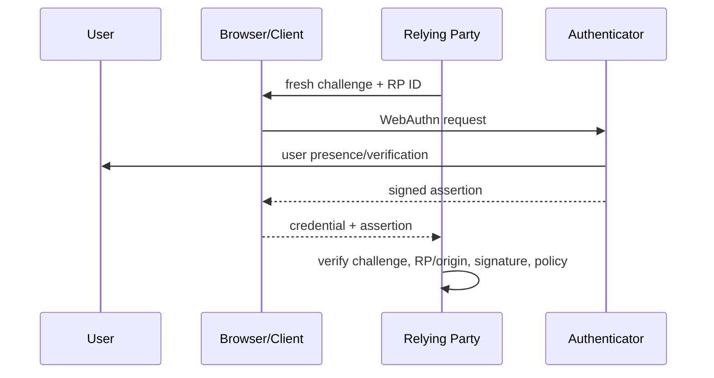
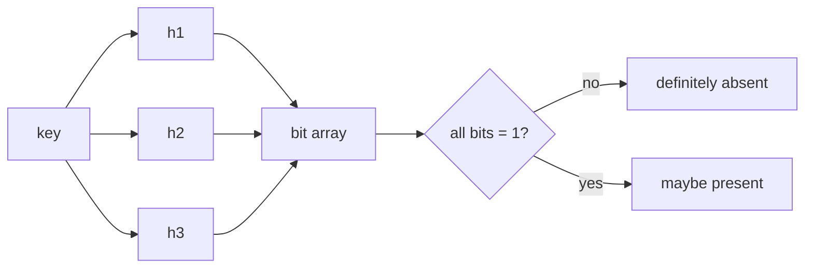

# 2026-09-21 12:00 — Interview Study Packages

README ve yakın `daily/2026-09-21/11-00.md` kontrol edildi. Concurrent B+Tree ve deterministic fault-injection/history-checking tekrar edilmedi. Repo aramasında WebAuthn/passkey için canonical bölüm bulunmadığından güvenlik; ikinci pakette ise algorithms/data structures rotasyonunu güçlendirmek için probabilistic membership structures seçildi.

## Paket 1 — Junior → Principal Cybersecurity: WebAuthn, Passkeys, RP Binding & Account Recovery
**Süre:** 20–30 dk

### Konu anlatımı
Password authentication'da server doğrulanabilir bir secret taşır; phishing ve credential stuffing riskleri bu secret'ın kullanıcı tarafından yanlış origin'e verilmesi veya yeniden kullanılmasıyla büyür. WebAuthn public-key credential kullanır: private key authenticator/passkey provider tarafında kalır, relying party (RP) public key'i saklar. Authentication sırasında server fresh challenge üretir; authenticator RP/origin bağlamında imza üretir; server challenge, origin/RP binding ve signature'ı doğrular.

Passkey'i yalnız "biometric login" diye açıklamak yanlıştır. Biometric/PIN çoğunlukla authenticator'ı local unlock eder; remote RP'ye biometric template gönderilmez. Güvenlik özelliğinin çekirdeği asymmetric challenge-response ve verifier/RP binding'dir. W3C, WebAuthn Level 3'ü 25 Ağustos 2026'da Recommendation olarak yayımladı.

### Mental model
**Password: kullanıcı secret'ı siteye taşır. Passkey: site challenge gönderir, doğru RP'ye bağlı private key kanıt üretir.** Ancak authentication ne kadar güçlü olursa olsun zayıf recovery flow bütün assurance'ı düşürebilir.

### İçeride ne oluyor?
- Registration'da RP challenge üretir; authenticator RP'ye scoped credential key pair oluşturur; RP credential ID + public key saklar.
- Authentication'da fresh challenge replay'i engeller; client/authenticator RP bağlamını imzalanan veriye bağlar.
- User presence ile user verification aynı kavram değildir; policy assurance ihtiyacına göre seçilir.
- Synced passkey usability/recovery avantajı getirir; device-bound credential daha yüksek device assurance sağlayabilir.
- Attestation, authenticator özellikleri hakkında ek kanıt sağlayabilir ama privacy, ecosystem ve deployment trade-off'ları vardır.
- Account recovery, device replacement, credential revocation ve multiple-passkey lifecycle tasarımın parçasıdır.

### Yüksek getirili mülakat soruları
1. WebAuthn password'dan hangi trust boundary açısından farklıdır?
2. Passkey neden phishing-resistant kabul edilir?
3. Challenge neyi önler; RP/origin binding neyi önler?
4. Senior: synced ve device-bound passkey arasında hangi assurance/usability trade-off'u vardır?
5. Senior: biometric data server'a gider mi?
6. Staff: recovery flow passkey assurance'ını nasıl düşürebilir?
7. Staff: attestation ne zaman değerlidir, ne zaman privacy/ops maliyetidir?
8. Principal: workforce, consumer ve privileged-admin authentication policy'lerini nasıl farklılaştırırsın?

### Seviyeye göre cevap derinliği
- **Junior:** public/private key, challenge-response, password taşımama.
- **Mid/Senior:** RP/origin binding, replay, user verification, credential lifecycle.
- **Staff:** recovery, attestation, synced/device-bound policy, telemetry ve migration.
- **Principal:** assurance tiers, regulatory/risk model, fleet/ecosystem strategy ve fallback governance.

### Kısa alıştırma
Password+TOTP login ile passkey login için trust-boundary tablosu çıkar: server breach, phishing proxy, device loss, account recovery ve replay saldırısı. Her satırda hangi kontrolün riski azalttığını yaz.

### Proje fikri
`passkey-lab`: küçük bir RP kur; registration/login, multiple credentials, revoke, recovery-code fallback ve audit log ekle. Challenge reuse, yanlış RP/origin ve revoked credential için negatif testler yaz.

### Failure modes / trade-off / production bağlantısı
Zayıf recovery, legacy password fallback veya help-desk social engineering passkey'in phishing resistance'ını bypass edebilir. Challenge reuse/replay kontrolleri, credential lifecycle eksikleri ve yanlış RP configuration güvenlik açığı yaratır. Production'da login success/failure, recovery usage, credential enrollment, fallback rate ve suspicious recovery sinyalleri izlenmelidir.

### Kaynaklar
- W3C WebAuthn Level 3 Recommendation (25 Ağustos 2026): https://www.w3.org/TR/webauthn-3/
- W3C duyurusu: https://www.w3.org/news/2026/web-authentication-an-api-for-accessing-public-key-credentials-level-3-is-now-a-w3c-recommendation/
- FIDO specifications: https://fidoalliance.org/specifications/
- FIDO passkeys: https://fidoalliance.org/passkeys/

---

## Paket 2 — Junior → Staff Algorithms/Data Structures: Bloom Filters, False Positives & Production Sizing
**Süre:** 20–30 dk

### Konu anlatımı
Bloom filter, bir elemanın sette **kesinlikle olmadığını** veya **muhtemelen olduğunu** söyleyen probabilistic membership structure'dır. Bit array ve birden çok hash kullanır. Insert sırasında k hash pozisyonu 1 yapılır; lookup'ta bu bitlerden herhangi biri 0 ise eleman kesin yoktur, hepsi 1 ise false positive ihtimaliyle "olabilir" denir.

Standart Bloom filter false negative üretmez — ancak implementation bug, yanlış persistence/versioning veya unsupported delete gibi sistem hataları bu garantiyi bozabilir. False-positive probability yaklaşık `p ≈ (1 - e^(-kn/m))^k`; burada `m` bit sayısı, `n` inserted item, `k` hash sayısıdır. Optimal `k ≈ (m/n) ln 2`.

### Mental model
**Bloom filter cevap cache'i değildir; pahalı negative lookup'u ucuzlatan kapı bekçisidir.** "Yok" cevabı kesin; "var olabilir" cevabı authoritative store'a git demektir.

### İçeride ne oluyor?
- Daha fazla bit/item false positive'i azaltır ama memory artırır.
- Çok az veya çok fazla hash CPU ve collision/bit-saturation ekonomisini bozar.
- Capacity aşılırsa false-positive rate tasarım hedefinden sapar.
- Normal Bloom filter delete desteklemez; shared bits başka key'lere ait olabilir. Counting Bloom filter sayaçla delete sağlayabilir ama memory maliyeti yükselir.
- LSM/SSTable sistemlerinde filter, disk read yapmadan önce key'in segmentte kesin bulunmadığını söyleyerek read amplification'ı düşürür.

### Yüksek getirili mülakat soruları
1. Bloom filter hangi iki cevabı verir?
2. Neden false positive olabilir ama normal koşullarda false negative olmaz?
3. `m`, `n`, `k` arttığında ne olur?
4. Mid: neden normal Bloom filter'da bit temizleyerek delete yapamazsın?
5. Senior: target false-positive rate'ten memory budget nasıl çıkarılır?
6. Senior: Bloom filter ne zaman performansı kötüleştirebilir?
7. Staff: per-SSTable filter, cache ve storage I/O metriklerini nasıl birlikte optimize edersin?
8. Staff: filter format/version migration sırasında correctness'i nasıl korursun?

### Seviyeye göre cevap derinliği
- **Junior:** bit array + hashes, definitely-not vs maybe-present.
- **Mid:** false positive, delete problemi, basic sizing.
- **Senior:** probability/sizing, CPU-memory-I/O trade-off, saturation.
- **Staff:** workload-aware filter policy, observability, versioning ve storage-engine integration.

### Kısa alıştırma
1 milyon key için 10 bit/key bütçesi seç. `k≈7` ile teorik false-positive oranını hesapla; ardından 2 milyon key aynı filtreye konursa neden hedefin bozulduğunu açıklayıp yeniden boyutlandırma stratejisi yaz.

### Proje fikri
`bloom-lab`: configurable `m/k` Bloom filter yaz. 100k–2M key için measured vs theoretical false-positive rate, memory ve lookup CPU ölç. Sonra fake SSTable reader'a ekleyip avoided disk lookup oranını raporla.

### Failure modes / trade-off / production bağlantısı
Yanlış capacity tahmini saturation ve fazla I/O üretir; hash quality kötü ise teorik model tutmaz; unsupported delete false negative yaratabilir. Filter memory cache'den çalındığında toplam latency kötüleşebilir. Production'da false-positive estimate/measurement, bits-per-key, filter hit/miss ve avoided storage reads birlikte izlenmelidir.

### Kaynaklar
- Original Bloom paper bibliographic record: https://dl.acm.org/doi/10.1145/362686.362692
- RocksDB Bloom filter wiki: https://github.com/facebook/rocksdb/wiki/RocksDB-Bloom-Filter
- RocksDB source: https://github.com/facebook/rocksdb
