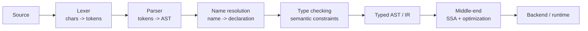
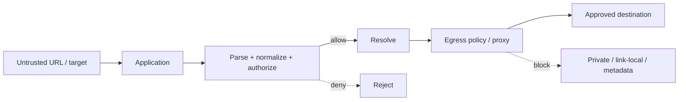

# 2026-09-21 12:00 — Interview Study Packages

README ve yakın `daily/2026-09-21/11-00.md` kontrol edildi. Concurrent B+Tree ve deterministic fault injection tekrar edilmedi. Repo çapı kontrolde WebAuthn/passkey ve Bloom filter adaylarının daha önce canonical chapter'lara ve daily paketlere işlendiği görüldüğü için elendi. Bu tur compiler/runtime zincirindeki eksik **frontend** katmanını kapatıyor; ikinci paket backend/cybersecurity rotasyonunda doğrudan canonical chapter bulunmayan **SSRF defense-in-depth** konusuna gidiyor. Hedef yaklaşık %70 temel + %20 mülakat pratiği + %10 güncel production bağlantısıdır.

## Paket 1 — Junior → Staff Foundations: Compiler Frontend — Lexer, Parser, AST, Name Resolution & Type Checking
**Süre:** 20–30 dk

### Konu anlatımı
Compiler'ı `source -> machine code` tek kutusu yerine aşamalı bir doğrulama ve anlamlandırma hattı olarak düşün.



**Lexer** karakterleri identifier, literal, keyword ve punctuation token'larına ayırır. **Parser** token dizisinin grammar'a uyup uymadığını sınar ve AST üretir. LLVM Kaleidoscope örneği recursive-descent ile operator-precedence parsing'i birlikte kullanır. AST source'un davranışsal yapısını sonraki aşamalara taşır.

Parsing yalnız syntax doğruluğudur. `x + true` parse edilebilir ama type açısından geçersiz olabilir; `foo()` parse edilebilir fakat `foo` scope'ta tanımlı olmayabilir. **Name resolution** identifier kullanımını declaration/symbol'a bağlar; **type checker** operand, call, return ve assignment constraint'lerini doğrular.

```text
source: let total: Int = price + tax

tokens: LET IDENT ':' IDENT '=' IDENT '+' IDENT

AST
LetDecl(total: Int)
└─ Binary(+)
   ├─ Name(price)
   └─ Name(tax)
```

Resolver `price`/`tax` isimlerini lexical scope'taki declaration'lara bağlar. Type checker ikisi de `Int` ise sonucu `Int` olarak doğrular. Önceki SSA/CFG paketi tam bu semantik frontend çıktısından sonra devralır.

### Mental model
**Lexer kelimeleri ayırır; parser cümle ağacını kurar; resolver isimlerin kimi gösterdiğini bulur; type checker cümlenin anlam kurallarına uyup uymadığını sınar.**

- `1 + * 2` → syntax/parser hatası.
- `unknown + 2` → parse olabilir, resolution hatası.
- `"a" - 2` → parse olabilir, type hatası.

### İçeride ne oluyor?
1. Lexer source cursor ile ilerler; whitespace/comment atlar, token ve source span üretir.
2. Recursive-descent parser grammar nonterminal'larını fonksiyonlara dönüştürür; expression precedence için Pratt/precedence-climbing benzeri teknik kullanılabilir.
3. AST source location taşır; kaliteli diagnostic doğru range'i gösterir ve mümkünse parser recovery ile sonraki hataları da bulur.
4. Resolver scope stack/symbol table kullanır; shadowing, imports ve overload kuralları dil semantiğine bağlıdır.
5. Type checker annotation ve inferred type'ları uzlaştırır; daha gelişmiş diller constraint solving/unification kullanabilir.
6. Typed AST/IR middle-end'e geçer; optimizer artık raw text değil semantik temsil üzerinde çalışır.

### Yüksek getirili mülakat soruları
1. Lexer ve parser neden ayrı katmanlardır?
2. Token stream, parse tree ve AST farkı nedir?
3. Operator precedence neden özel handling ister?
4. Mid: lexical scope ve symbol table nasıl modellenir?
5. Mid: parser error recovery neden değerlidir?
6. Senior: type inference ile type checking farkı nedir?
7. Senior: source spans ve incremental compilation hangi invalidation problemlerini getirir?
8. Staff: yeni bir language feature lexer/parser/AST/resolver/type checker/IR ve IDE tooling'i nasıl etkiler?

### Seviyeye göre cevap derinliği
- **Junior:** token, grammar, AST ve syntax-vs-semantic error ayrımı.
- **Mid:** recursive descent, precedence, symbol table ve temel type checking.
- **Senior:** recovery, inference/constraints, incremental compilation ve diagnostic quality.
- **Staff:** frontend representation'larının LSP/IDE, build latency, compatibility ve optimizer üzerindeki etkisi.

### Kısa alıştırma
`expr := term (('+'|'-') term)*`, `term := NUMBER | IDENT | '(' expr ')'` grammar'ı için `price + 2 - tax` girdisini tokenize et, AST çiz. `price:String`, `tax:Int` scope'unda type error'ın hangi node'da oluşacağını ve diagnostic source span'ini yaz.

### Proje fikri
`tiny-compiler-frontend`: küçük expression dili için lexer + recursive-descent parser + AST + nested-scope symbol table + `Int/Bool/String` checker yaz. Sonra AST interpreter veya LLVM IR emitter ekle. Golden parser tests ve malformed-input corpus ile test et.

### Failure modes / trade-off / production bağlantısı
Unicode/escape handling hataları security ve diagnostic sorunları yaratabilir. Ambiguous grammar complexity'yi artırır. AST'yi source syntax'a aşırı bağlamak optimizer'ı; aşırı normalize etmek source mapping'i zorlaştırır. Incremental resolver cache yanlış invalidation yaparsa stale semantics oluşabilir. Bu kavramlar compiler dışında IDE, linter, SQL parser, template engine ve policy/config language'larında da production problemidir.

### Kaynaklar
- LLVM Kaleidoscope — Lexer: https://llvm.org/docs/tutorial/MyFirstLanguageFrontend/LangImpl01.html
- LLVM Kaleidoscope — Parser and AST: https://llvm.org/docs/tutorial/MyFirstLanguageFrontend/LangImpl02.html
- LLVM Kaleidoscope — LLVM IR generation: https://llvm.org/docs/tutorial/MyFirstLanguageFrontend/LangImpl03.html
- Clang AST: https://clang.llvm.org/docs/IntroductionToTheClangAST.html

---

## Paket 2 — Mid → Principal Backend/Cybersecurity: SSRF — URL Parsing, DNS Rebinding, Egress Policy & Cloud Metadata
**Süre:** 20–30 dk

### Konu anlatımı
SSRF, saldırganın server'ın outbound request yeteneğini kendi etkilediği hedefe yönlendirmesidir. Hedef yalnız `localhost` değildir: internal control plane, admin endpoint, private API, service identity ile erişilebilen servisler ve cloud metadata blast radius'a girer.



Ana mental shift: **SSRF string-validation değil request-capability + network-policy problemidir.** `startsWith("https://trusted.example")` gibi kontroller parser farklılıkları, redirects, alternate address forms ve DNS değişimleri nedeniyle güvenlik sınırı olamaz.

OWASP hedeflerin bilindiği durumda allowlist'i ve DNS pinning/rebinding riskini vurgular. Validation ile gerçek connect arasında isim yeniden resolve edilirse kontrol edilen IP ile bağlanılan IP farklı olabilir. AWS EC2 IMDS IPv4'te `169.254.169.254` link-local endpoint'ini kullanır; IMDSv2 session token akışı sunar ve `HttpTokens=required` ile IMDSv1 kapatılabilir. Bu defense-in-depth'tir; uygulamadaki SSRF açığını düzeltmenin yerine geçmez.

### Mental model
**Parse → canonicalize → authorize destination → resolve → validate resolved addresses → connect under egress policy → redirects için tekrar authorize.**

İki bağımsız katman:
1. **Application capability:** kullanıcı hangi scheme/host/port hedefini seçebilir?
2. **Network capability:** process/container gerçekte hangi IP/CIDR/service'lere çıkabilir?

Birincisi bypass edilse bile default-deny egress blast radius'u sınırlar.

### İçeride ne oluyor?
- URL'yi battle-tested parser ile ayrıştır; scheme/host/port'u ayrı policy girdileri yap.
- Mümkünse arbitrary URL yerine predefined destination ID veya strict allowlist kullan.
- Redirect her hop'ta yeniden authorize edilmelidir.
- A/AAAA sonuçlarının tümünü değerlendir; loopback, link-local, private/internal ve özel-use ranges için explicit policy uygula.
- Validation ile socket connect arasındaki DNS re-resolution/TOCTOU sınırını kapat; merkezi egress proxy bu modeli sadeleştirebilir.
- Default-deny egress, segmentation ve least privilege uygula. Internal servis de authentication/authorization istemeli; `private network = trusted` varsayımı güvenlik sınırı değildir.
- Metadata kullanılmıyorsa kapat; gerekiyorsa provider'ın hardened mode'unu zorunlu kıl. AWS'de IMDSv2 requirement ve hop-limit defense-in-depth seçenekleridir.
- Destination host/IP, redirects ve deny reason gibi sinyalleri hassas veri sızdırmadan logla.

### Yüksek getirili mülakat soruları
1. SSRF neden yalnız URL validation problemi değildir?
2. Allowlist neden denylist'ten daha güçlüdür?
3. DNS rebinding/pinning bypass nedir?
4. Mid: redirects kontrolü nasıl bypass edebilir?
5. Senior: `resolve -> validate -> HTTP client connects` akışındaki TOCTOU problemi nedir?
6. Senior: egress policy/proxy blast radius'u nasıl azaltır?
7. Staff: arbitrary external URL gerektiren webhook/image fetcher'ı nasıl tasarlarsın?
8. Principal: metadata, egress, workload identity, internal auth ve observability'yi organization-wide guardrail'e nasıl dönüştürürsün?

### Seviyeye göre cevap derinliği
- **Mid:** SSRF, private/link-local risk, allowlist, redirect ve metadata tehdidi.
- **Senior:** parser canonicalization, DNS rebinding/TOCTOU, IPv4/IPv6 ve egress enforcement.
- **Staff:** reusable outbound-fetch service, tenant policy, auditability ve failure behavior.
- **Principal:** secure-by-default networking, metadata hardening, policy-as-code ve exception governance.

### Kısa alıştırma
Bir image proxy `GET /proxy?url=...` kabul ediyor ve yalnız `https://` prefix'i ile `hostname != localhost` kontrolü yapıyor. En az altı bypass/failure mode çıkar; application allowlist + DNS/IP validation + redirect policy + egress firewall katmanlı yeni akışı çiz.

### Proje fikri
`safe-fetch-gateway`: yalnız `https`, explicit port/destination policy, DNS result validation, redirect revalidation, response-size/time budget ve structured audit log içeren outbound gateway yaz. IPv4/IPv6 loopback, link-local/private ranges, redirect chain ve DNS-answer-change testleri ekle; deployment'ta default-deny egress kullan.

### Failure modes / trade-off / production bağlantısı
Regex/substring URL kontrolü parser edge-case'lerinde kırılır. Hostname allowlist tek başına DNS rebinding'i çözmez. Private-IP blocklist IPv6/özel ranges ve encoding edge-case'lerinde eksik kalabilir. Redirect'i kapatmak güvenliği sadeleştirir ama entegrasyon uyumluluğunu azaltabilir. Egress proxy merkezi kontrol/audit sağlar fakat latency ve availability dependency'si getirir. Webhook, URL preview, PDF/image fetch, import-from-URL ve callback/discovery özellikleri ortak SSRF yüzeyidir.

### Kaynaklar
- OWASP SSRF Prevention Cheat Sheet: https://cheatsheetseries.owasp.org/cheatsheets/Server_Side_Request_Forgery_Prevention_Cheat_Sheet.html
- AWS EC2 IMDS: https://docs.aws.amazon.com/AWSEC2/latest/UserGuide/configuring-instance-metadata-service.html
- AWS EC2 metadata options: https://docs.aws.amazon.com/AWSEC2/latest/UserGuide/configuring-instance-metadata-options.html
- AWS API InstanceMetadataOptionsRequest: https://docs.aws.amazon.com/AWSEC2/latest/APIReference/API_InstanceMetadataOptionsRequest.html
