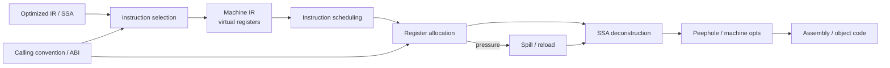
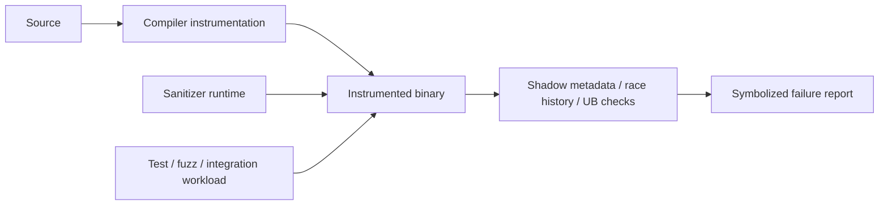

# 2026-09-21 13:00 — Interview Study Packages

README ve yakın `daily/2026-09-21/12-00.md` kontrol edildi. Compiler frontend ve SSRF tekrar edilmedi. Repo aramasında compiler backend kavramlarının yalnız genel pipeline özetinde geçtiği, instruction selection/register allocation için ayrı canonical bölüm bulunmadığı görüldü. Testing engineering tarafında deterministic/fault-injection paketleri mevcut; ASan/TSan/UBSan tabanlı dynamic instrumentation için ayrı paket bulunmadı. Bu tur yaklaşık %70 temel boşluk kapatma + %20 mülakat pratiği + %10 güncel production bağlantısı hedefler.

## Paket 1 — Mid → Staff Foundations: Compiler Backend — Instruction Selection, Register Allocation, Calling Convention & Spills
**Süre:** 20–30 dk

### Konu anlatımı
Frontend source'u anlamlandırır, middle-end SSA/IR üzerinde target-independent optimizasyon yapar; backend ise aynı semantiği gerçek ISA'nın register, instruction ve ABI kısıtlarına indirger.



**Instruction selection**, IR operationlarını hedef ISA'daki instruction/pattern'lara eşler. Tek IR operation her zaman tek machine instruction değildir; tersine FMA gibi bir instruction birden fazla IR operation'ı birleştirebilir. LLVM code generator SelectionDAG ve GlobalISel gibi seçim altyapıları sunar.

Seçimden sonra compiler çoğunlukla sınırsızmış gibi görünen **virtual register**'larla çalışır. Gerçek CPU'da fiziksel register sayısı ve register class kısıtları vardır. **Register allocation**, live range'leri fiziksel register'lara yerleştirir. Aynı anda canlı değer sayısı kapasiteyi aşarsa bazı değerler stack'e **spill** edilir ve gerektiğinde reload edilir. Bu correctness'i korur ama load/store, cache traffic ve latency üretir.

Calling convention backend'in dış dünyayla sözleşmesidir: argüman/return register'ları, caller-saved/callee-saved register'lar, stack alignment ve call-clobber bilgisi allocation'ı kısıtlar. LLVM dokümantasyonu fixed/pre-colored register'ların ISA ve calling convention nedeniyle oluştuğunu açıkça belirtir.

### Mental model
**Backend bir “semantik → sınırlı makine kaynakları” çevirmenidir.**

```text
IR value            virtual register         physical reality
%sum  ----------->  %v17  ---------------->  rax / x0 / stack slot
                                          ^
                              ABI + liveness + pressure
```

Register allocator'ı otel odası planlayıcısı gibi düşün: live range konaklama aralığı, fiziksel register oda, çakışan live range'ler aynı odayı kullanamaz; oda kalmazsa spill “uzaktaki ek bina”dır.

### İçeride ne oluyor?
1. Target legalization, ISA'nın doğrudan desteklemediği type/operation'ları parçalar veya helper'a indirger.
2. Instruction selector target pattern'larını seçer; latency/throughput/code-size maliyeti hedefe göre değişebilir.
3. Machine IR hâlâ virtual register ve SSA formunda olabilir.
4. Liveness analizi hangi değerlerin aynı anda canlı olduğunu çıkarır; interference ilişkisi allocation kararını belirler.
5. Allocator graph coloring, greedy veya linear-scan ailesinden stratejiler kullanabilir. JIT'te compile latency nedeniyle hızlı allocator daha değerli olabilir; AOT'ta code quality için daha pahalı analiz kabul edilebilir.
6. Register pressure yüksekse spill/reload eklenir. Spill cost hot loop'ta çok yüksek olabilir.
7. PHI semantics gerçek ISA'da PHI instruction olmadığı için edge copy/move'lara dönüştürülür; parallel-copy cycle'ları dikkat ister.
8. Calling convention pre-colored/fixed register ve clobber constraint'leri getirir; machine passes ve peephole optimizasyonları son biçimi düzeltir.

### Yüksek getirili mülakat soruları
1. Instruction selection ile register allocation neden ayrı problemlerdir?
2. Virtual register neden kullanılır?
3. Live range ve register pressure nedir?
4. Mid: spill/reload hangi performans maliyetlerini doğurur?
5. Mid: caller-saved ve callee-saved farkı allocation'ı nasıl etkiler?
6. Senior: SSA PHI node'u machine code'a nasıl indirilir?
7. Senior: graph-coloring ile linear-scan allocator trade-off'u nedir?
8. Staff: JIT ve AOT compiler neden farklı codegen kalite/latency noktaları seçebilir?
9. Staff: profile-guided optimization register allocation ve instruction placement kararlarını nasıl etkileyebilir?

### Seviyeye göre cevap derinliği
- **Junior/Mid:** IR → instruction → virtual register → physical register → spill zincirini doğru anlat.
- **Senior:** liveness, interference, calling convention, PHI lowering ve hot-loop spill maliyetini bağla.
- **Staff:** compile-time budget, target microarchitecture, code size, PGO ve JIT/AOT economics arasında trade-off kur.

### Kısa alıştırma
Dört fiziksel register olduğunu varsay. `a,b,c,d,e` değerlerinin live range'lerini zaman çizgisinde çiz ve aynı anda beş değer canlı olacak bir örnek oluştur. Hangi değeri spill edeceğini seç; seçim kriterini loop frequency, next-use distance ve reload sayısıyla savun. Ardından bir function call ekleyip caller-saved register'lardaki kararını yeniden değerlendir.

### Proje fikri
`tiny-regalloc`: küçük üç-address IR için basic-block liveness hesapla, linear-scan register allocator yaz, spill slot üret ve allocation öncesi/sonrası IR dump et. Ardından synthetic register-pressure benchmark'ı ekleyip spill sayısı ve generated instruction count ölç.

### Failure modes / trade-off / production bağlantısı
Yanlış liveness analizi silent miscompile üretir. Aşırı spilling memory traffic'i artırır. Calling convention ihlali başka function'ın state'ini bozabilir. Aggressive instruction combining code size veya register pressure'ı büyütebilir. Backend kararları database hot loop'larından ML kernel'larına, browser JIT'lerinden mobile binary size'a kadar production latency ve CPU maliyetine doğrudan yansır.

### Kaynaklar
- LLVM Target-Independent Code Generator: https://llvm.org/docs/CodeGenerator.html
- LLVM — Writing an LLVM Backend: https://llvm.org/docs/WritingAnLLVMBackend.html
- LLVM GlobalISel: https://llvm.org/docs/GlobalISel/index.html
- System V AMD64 ABI: https://gitlab.com/x86-psABIs/x86-64-ABI

---

## Paket 2 — Junior → Senior Testing Engineering: Sanitizers — ASan, TSan, UBSan & Instrumented CI
**Süre:** 20–30 dk

### Konu anlatımı
Unit test “beklenen output geldi mi?” sorusunu sorar. Sanitizer ise çalışan programın **runtime invariants**'larını gözleyerek test oracle'ının doğrudan görmediği memory/race/undefined-behavior hatalarını yakalar. Sanitizer testin yerine geçmez; test workload'una daha güçlü bir gözlem katmanı ekler.



**AddressSanitizer (ASan)** out-of-bounds, use-after-free ve invalid/double free gibi memory hatalarını compiler instrumentation + runtime ile bulur. Clang dokümantasyonu tipik slowdown'u yaklaşık 2x olarak verir.

**ThreadSanitizer (TSan)** data race tespitine odaklanır. Race yalnız “iki thread aynı değişkene dokundu” değildir: en az bir write bulunan conflicting access'ler uygun happens-before/synchronization ilişkisi olmadan yarışır. TSan daha pahalıdır; Clang güncel dokümantasyonu tipik 5–15x slowdown ve ciddi memory overhead belirtir.

**UndefinedBehaviorSanitizer (UBSan)** signed overflow, misaligned/null dereference ve geçersiz shift gibi C/C++ undefined behavior sınıflarına runtime check ekler. Bu üç araç farklı bug class'larını hedeflediği için tek bir sanitizer job'u bütün correctness'i kanıtlamaz.

### Mental model
**Test input üretir; sanitizer execution'ın görünmeyen kurallarını denetler.**

```text
normal test:       input -> program -> asserted output
sanitized test:    input -> instrumented program -> output
                                  |
                       memory/race/UB invariants
                                  |
                               report
```

Fuzzer + sanitizer özellikle güçlü kombinasyondur: fuzzer yeni execution path üretir, sanitizer o path'teki memory/UB ihlalini görünür yapar.

### İçeride ne oluyor?
- ASan compiler memory access'lerine check ekler; runtime shadow metadata ile addressability durumunu izler ve allocator quarantine gibi tekniklerle use-after-free yakalama penceresini büyütür.
- TSan memory access ve synchronization event'lerini instrument eder; happens-before ilişkilerini takip ederek race raporlar.
- UBSan seçili language-level UB noktalarına check ekler; recovery veya trap davranışı konfigüre edilebilir.
- Symbolization, debug info ve stack trace actionable rapor için kritiktir.
- Instrumentation overhead nedeniyle production binary yerine CI/nightly/fuzz build yaygındır. Clang, ASan ve TSan runtime'larının production executable için tasarlanmadığını özellikle belirtir.

### Yüksek getirili mülakat soruları
1. Sanitizer ile unit/integration test arasındaki fark nedir?
2. ASan hangi bug sınıflarını yakalar, hangilerini garanti etmez?
3. TSan race ile deadlock'u aynı şey olarak mı görür?
4. Mid: neden sanitizer build normal build'den yavaştır?
5. Mid: neden bütün dependency'lerin instrument edilmemesi blind spot yaratabilir?
6. Senior: ASan + fuzzing neden yüksek getirili kombinasyondur?
7. Senior: flaky concurrency test ile TSan bulgusu nasıl triage edilir?
8. Senior: sanitizer suppression/ignorelist neden minimum tutulmalıdır?

### Seviyeye göre cevap derinliği
- **Junior:** ASan=memory safety bug detection, TSan=data race, UBSan=undefined behavior ayrımını bil.
- **Mid:** compiler instrumentation, runtime metadata, symbolization ve CI placement anlat.
- **Senior:** happens-before, partial instrumentation, false-negative yüzeyi, overhead ve fuzzing/sanitizer portfolio tasarımını tartış.

### Kısa alıştırma
Üç küçük program yaz: heap use-after-free, unsynchronized shared counter ve signed-overflow edge case. Sırasıyla `-fsanitize=address`, `-fsanitize=thread`, `-fsanitize=undefined` build'leriyle çalıştır. Her raporda bug site ile symptom site'ın aynı olup olmadığını not et ve normal testin neden kaçırabileceğini yaz.

### Proje fikri
`sanitizer-ci-lab`: küçük C/C++ servisine üç ayrı CI job ekle: ASan+UBSan integration suite, TSan concurrency suite ve ASan-backed fuzz target. Artifact olarak symbolized log ve minimized reproducer sakla; wall-clock ve memory overhead'i normal build ile karşılaştır.

### Failure modes / trade-off / production bağlantısı
Sanitizer temizliği correctness kanıtı değildir; yalnız çalıştırılan path'leri gözler. Partial instrumentation false-negative yaratabilir. TSan overhead'i büyük suite'lerde maliyetlidir. Suppression listesi zamanla gerçek bug'ları gizleyen borca dönüşebilir. Optimized production binary sanitizer build'den farklı davranabilir; bu nedenle release-like flags ve ayrı reproducibility stratejisi gerekir. Native backend, database engine, browser, mobile runtime ve high-performance service ekiplerinde sanitizer CI, memory corruption ve race'i müşteriye ulaşmadan yakalamak için yüksek getirili bir katmandır.

### Kaynaklar
- Clang AddressSanitizer: https://clang.llvm.org/docs/AddressSanitizer.html
- Clang ThreadSanitizer: https://clang.llvm.org/docs/ThreadSanitizer.html
- Clang UndefinedBehaviorSanitizer: https://clang.llvm.org/docs/UndefinedBehaviorSanitizer.html
- Clang Sanitizer special case list: https://clang.llvm.org/docs/SanitizerSpecialCaseList.html
- LLVM compiler-rt: https://compiler-rt.llvm.org/