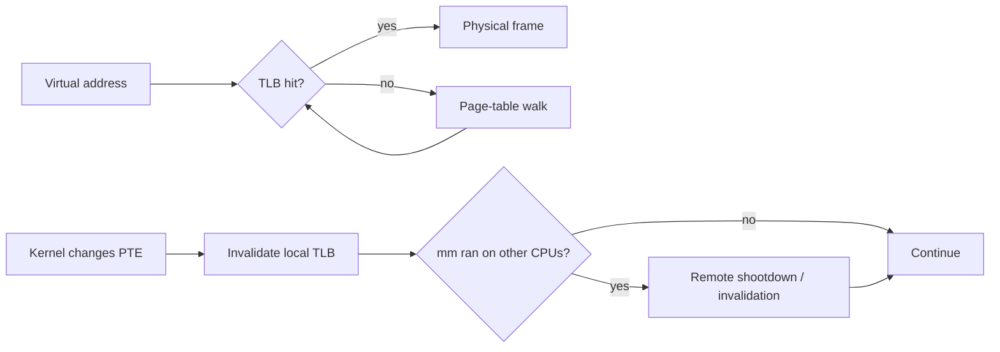
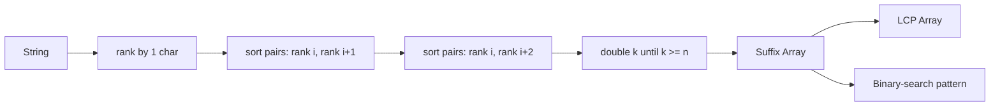

# 2026-09-21 14:00 — Interview Study Packages

README ve yakın `daily/2026-09-21/13-00.md` kontrol edildi. Compiler backend ve sanitizer testing tekrar edilmedi. Repo çapı aramada `TLB shootdown` için doğrudan paket bulunmadı; suffix array ise yalnız suffix automaton karşılaştırmalarında anılmış, kendi temel paketi olarak işlenmemişti. Bu tur yaklaşık %70 temel boşluk kapatma + %20 mülakat pratiği + %10 production/güncel bağlantı hedefler.

## Paket 1 — Mid → Principal Foundations/Linux: TLB, Page Walks, Shootdowns, PCID & Huge Pages
**Süre:** 20–30 dk

### Konu anlatımı
Virtual memory erişiminde CPU her load/store için çok seviyeli page table'ı RAM'den yürütse maliyet büyük olurdu. **TLB (Translation Lookaside Buffer)** yakın zamanda kullanılan virtual-page → physical-frame çevirilerini cache'ler. TLB hit ucuzdur; TLB miss page-table walk doğurabilir. Page table entry değiştirildiğinde ise CPU'nun cache'lediği eski translation artık tehlikelidir: kernel ilgili TLB entry'lerini invalidate etmelidir.

Tek CPU'da invalidation yereldir. Aynı address space birden fazla CPU'da çalışmışsa diğer CPU'larda da stale entry olabilir; gerekli CPU'lara invalidation bildirimi göndermek **TLB shootdown** problemidir. Linux dokümantasyonu page-table değişikliklerinden sonra `flush_tlb_mm`, `flush_tlb_range` ve `flush_tlb_page` gibi arayüzlerle eski translation'ların görünmez hale getirilmesini tanımlar ve `mm_cpumask()` ile address space'i hiç çalıştırmamış CPU'lara flush göndermeme optimizasyonunu örnekler.



### Mental model
TLB'yi page table'ın kendisi değil, **page table için CPU-side memoization** olarak düşün. Page table source of truth'tur; TLB hızlandırıcı kopyadır. Source of truth değişince kopyaların invalidation'ı gerekir.

```text
page table = authoritative mapping
TLB        = per-CPU cached mapping
PTE update = cache-coherence problem for translations
```

### İçeride ne oluyor?
1. CPU virtual address'in virtual-page kısmını TLB'de arar.
2. Miss'te hardware page walker çok seviyeli paging structures üzerinden PTE'yi bulur; sonuç TLB'ye alınabilir.
3. Kernel `munmap`, permission change, COW/fault handling veya mapping replacement sırasında PTE değiştirir.
4. Stale TLB entry kullanılmamalıdır. Linux değişiklik kapsamına göre page/range/mm flush seçer.
5. SMP'de address space'i kullanmış remote CPU'lar da invalidate etmelidir. Shootdown CPU sayısı ve mapping churn arttıkça scalability maliyetine dönüşebilir.
6. x86'da `INVLPG` tek linear-address translation'ını invalidate edebilir. Intel SDM, paging-structure değişse bile cached translation'ın kalabileceğini ve software'in invalidation yapması gerektiğini açıklar.
7. **PCID** gibi address-space tagging mekanizmaları context switch'te bütün TLB'yi körlemesine boşaltma ihtiyacını azaltabilir; correctness için uygun invalidation yine gerekir.
8. **Huge pages** daha büyük virtual aralığı tek translation ile kapsayarak TLB reach'i artırabilir; fakat fragmentation, allocation/compaction ve coarse-grained memory-management trade-off'ları getirir.

### Yüksek getirili mülakat soruları
1. TLB ile CPU data cache arasındaki temel fark nedir?
2. TLB miss neden page fault ile aynı şey değildir?
3. PTE değişince neden TLB invalidate edilir?
4. Mid: `munmap()` neden remote CPU maliyeti yaratabilir?
5. Senior: TLB shootdown neden many-core sistemlerde scalability bottleneck olabilir?
6. Senior: huge page hangi workload'da TLB performansını iyileştirir, neyi kötüleştirebilir?
7. Staff: PCID/ASID tagging context-switch maliyetini nasıl değiştirir?
8. Principal: allocator/runtime tasarımında sık `mmap/munmap/mprotect` çağrılarının tail latency ve cross-core interference etkisini nasıl ölçersin?

### Seviyeye göre cevap derinliği
- **Junior/Mid:** virtual page → TLB → page-table walk → physical frame zincirini ve miss/page-fault ayrımını anlat.
- **Senior:** stale translation, page/range/mm invalidation, remote CPU shootdown ve huge-page TLB reach ilişkisini bağla.
- **Staff/Principal:** CPU topology, address-space CPU maskesi, batching, PCID/ASID, mapping churn ve p99 latency arasındaki trade-off'u ölçüm planıyla tartış.

### Kısa alıştırma
Bir process'in 4 KiB page ile 2 GiB working set taradığını varsay. Aynı working set'in 2 MiB huge page ile kaç translation gerektireceğini hesapla. Ardından 32 CPU'da çalışan process'in saniyede binlerce küçük `munmap` yaptığı durumda hangi metrikleri (`dTLB-load-misses`, page faults, context switches, shootdown/IPI göstergeleri, p99 latency) karşılaştıracağını yaz.

### Proje fikri
`tlb-lab`: Linux'ta aynı toplam byte miktarını farklı page size ve mapping-churn stratejileriyle tarayan benchmark yaz. `perf stat` ile TLB miss, cycles ve page-fault sayılarını; latency histogramıyla p50/p99'u ölç. İkinci deneyde worker thread sayısını artırıp `mmap/munmap` churn'ünün scaling eğrisini çıkar.

### Failure modes / trade-off / production bağlantısı
TLB miss'i page fault sanmak yanlış teşhistir. Huge page'i evrensel çözüm saymak memory waste/fragmentation ve latency riskini gizler. Mapping churn allocator, JIT, database buffer manager ve sandbox/runtime'larda remote invalidation maliyeti yaratabilir. NUMA ve many-core sunucularda “memory access ucuz mu?” sorusu yalnız cache hit rate değil translation locality ve shootdown davranışını da içerir. Güncel Intel SDM de paging-structure cache/TLB entry'lerinin page table değişiminden sonra kalabileceğini ve explicit invalidation gerektirdiğini belgeliyor.

### Kaynaklar
- Linux Kernel — Cache and TLB Flushing Under Linux: https://www.kernel.org/doc/html/latest/core-api/cachetlb.html
- Intel 64 and IA-32 SDM Vol. 3A — Paging / TLB invalidation: https://cdrdv2-public.intel.com/874249/253668-090-sdm-vol-3a.pdf
- Linux Kernel — Transparent Hugepage Support: https://www.kernel.org/doc/html/latest/admin-guide/mm/transhuge.html

---

## Paket 2 — Junior → Staff Algorithms: Suffix Array, LCP & Substring Search
**Süre:** 20–30 dk

### Konu anlatımı
Bir string'in bütün suffix'lerini lexicographic sıraya koyduğumuzu düşün. **Suffix array (SA)** bu suffix'lerin kendisini değil, başlangıç index'lerini sıralı tutar. Böylece pattern araması, sorted suffix'ler üzerinde binary search'e dönüşür. Naif biçimde bütün suffix string'lerini materialize etmek `O(n²)` memory'ye yaklaşabilir; suffix array yalnız `O(n)` index saklar.

Örnek `banana`:

```text
index  suffix
5      a
3      ana
1      anana
0      banana
4      na
2      nana

SA = [5, 3, 1, 0, 4, 2]
```

Komşu sıralı suffix'lerin ortak prefix uzunluğunu tutan **LCP array**, repeated substring ve benzeri soruları hızlandırır. Temel interview versiyonunda prefix-doubling ile suffix'lere önce 1 karakterlik rank, sonra 2, 4, 8... karakterlik rank çiftleri verilir.



### Mental model
Suffix array = **“string'in bütün başlangıç noktalarının alfabetik index'i.”** B-tree'nin key order'ı range lookup'a nasıl yardım ediyorsa, suffix'lerin lexicographic order'ı substring/prefix lookup'a yardım eder.

### İçeride ne oluyor?
1. Her suffix başlangıç index'i için ilk karakter rank'i oluşturulur.
2. Uzunluğu `2k` olan prefix rank'i, `(rank[i], rank[i+k])` çiftiyle temsil edilir.
3. Bu çiftler sıralanır ve eşit çiftler aynı yeni rank'i alır.
4. `k` her tur iki katına çıkar; bütün suffix'ler unique rank alınca SA oluşur. Standart comparison-sort yaklaşımı yaklaşık `O(n log² n)` olabilir; rank'ler integer olduğundan counting/radix teknikleriyle `O(n log n)` varyantı elde edilir.
5. Pattern araması SA üzerinde lower/upper-bound benzeri iki binary search ile yapılabilir; karşılaştırma maliyeti pattern uzunluğuna bağlıdır.
6. **LCP** komşu suffix'lerin longest common prefix uzunluğunu tutar. Kasai algoritması suffix rank'lerini ters index'leyip önceki LCP bilgisinden yararlanarak LCP array'i `O(n)` zamanda kurar.

### Yüksek getirili mülakat soruları
1. Suffix array ne saklar; suffix tree'den farkı nedir?
2. `banana` için SA'yı elle çıkar.
3. Pattern lookup neden binary search olabilir?
4. Mid: prefix-doubling'de `(rank[i], rank[i+k])` neden yeterlidir?
5. Mid: LCP array neyi temsil eder?
6. Senior: longest repeated substring SA+LCP ile nasıl bulunur?
7. Senior: suffix array ile suffix automaton arasında immutable corpus, memory locality ve online update açısından nasıl seçim yaparsın?
8. Staff: büyük text index'inde Unicode normalization, byte/code-point semantics ve memory mapping hangi correctness/performance risklerini doğurur?

### Seviyeye göre cevap derinliği
- **Junior:** suffix kavramı, lexicographic sıralama ve binary-search fikrini doğru anlat.
- **Mid:** prefix-doubling rank invariant'ını ve complexity'yi savun.
- **Senior/Staff:** LCP, cache locality, construction cost, immutable-vs-online workload ve encoding trade-off'larını production index tasarımına bağla.

### Kısa alıştırma
`mississippi` için ilk iki prefix-doubling turundaki rank çiftlerini çıkar. Sonra hazır SA üzerinde `issi` pattern'inin eşleştiği interval'i iki binary search ile bulacak pseudocode yaz. Bonus: LCP array'deki maksimum değerin neden longest repeated substring uzunluğunu verdiğini kanıtla.

### Proje fikri
`tiny-text-index`: UTF-8 input'u açıkça byte semantics ile ele alan suffix-array index yaz. Prefix-doubling SA, Kasai LCP ve `find(pattern)` ekle. Naif substring scan ile correctness differential test'i yap; build time, bytes/character ve query p50/p99 ölç.

### Failure modes / trade-off / production bağlantısı
Suffix'leri gerçek string olarak kopyalamak memory'yi patlatır. Comparator içinde uzun ortak prefix'leri tekrar tekrar taramak construction maliyetini büyütebilir. Unicode normalization/byte-vs-code-point kararı tanımlanmazsa semantic bug çıkar. Suffix array static/immutable corpus'ta kompakt ve cache-friendly olabilir; sık online update gereken sistemlerde rebuild maliyeti nedeniyle farklı index yapıları daha uygundur. Genomics, text search, dedup/similarity yardımcı yapıları ve compressed full-text index'ler suffix-order fikrinden yararlanır.

### Kaynaklar
- Udi Manber, Gene Myers — Suffix Arrays: A New Method for On-Line String Searches (1990): https://www.cs.cmu.edu/~guyb/realworld/papersS04/ManberMyers.pdf
- MUMmer4 paper/project — large-genome alignment with suffix arrays: https://www.cs.cmu.edu/~gmarcais/publication/mummer4/
- Kasai et al. — Linear-Time Longest-Common-Prefix Computation: https://doi.org/10.1007/3-540-48194-X_17
