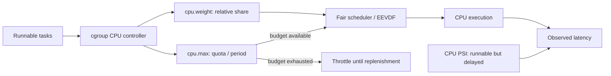
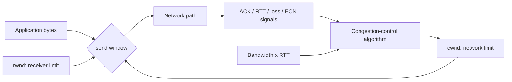

# 2026-09-21 15:00 — Interview Study Packages

README ve yakın `daily/2026-09-21/14-00.md` kontrol edildi. TLB/suffix-array tekrar edilmedi. Repo aramasında cgroup CPU bandwidth + PSI ve TCP congestion-control için doğrudan çalışma paketi bulunmadı. Bu tur yaklaşık %70 temel boşluk kapatma + %20 mülakat pratiği + %10 güncel/production bağlantı hedefler.

## Paket 1 — Mid → Principal Linux/SRE: cgroup CPU Control, Throttling, PSI & Scheduler Latency
**Süre:** 20–30 dk

### Konu anlatımı
Linux scheduler runnable task'lar arasında CPU zamanı dağıtır; **cgroup v2 CPU controller** ise bir workload grubunun CPU payını ve üst sınırını ayrıca şekillendirir. Bu ayrım production debugging'de kritiktir: process runnable olabilir, host'ta boş CPU görülebilir, fakat cgroup kendi bandwidth limitine ulaştığı için task yine de gecikebilir.

`cpu.weight` sibling cgroup'lar arasında göreli, work-conserving paylaştırma sinyalidir. `cpu.max` ise `$MAX $PERIOD` biçiminde mutlak bandwidth sınırı koyar; örneğin `50000 100000`, her 100 ms periyotta en fazla 50 ms CPU zamanı demektir. Limit tüketildiğinde workload period yenilenene kadar throttling görebilir. Linux'un fair scheduler hattı güncel kernel'lerde CFS'den EEVDF'ye geçmektedir; EEVDF runnable task'lar için lag/eligibility ve virtual deadline kullanır. Cgroup bandwidth control ile task scheduler seçimini aynı şey sanmamak gerekir.

### Mental model
İki kapılı sistem düşün: **scheduler kapısı** hangi runnable task'ın sıradaki CPU'yu alacağını belirler; **cgroup budget kapısı** grubun CPU kullanmasına izin verip vermediğini sınırlar. `100% CPU` tek başına gecikmenin kaynağını söylemez.

### İçeride ne oluyor?
1. Task runnable olur ve scheduler runqueue'suna girer.
2. Fair scheduling sınıfı task'ların CPU zamanını öncelik/weight ve sanal zaman mantığıyla dağıtır; modern Linux EEVDF yönüne geçmiştir.
3. Cgroup v2 `cpu.weight` aktif sibling'lar arasında göreli CPU payı verir; boş kapasite varsa work-conserving davranır.
4. `cpu.max` quota/period ile bandwidth ceiling uygular. Quota tükenirse workload runnable olsa bile throttle edilebilir.
5. `cpu.stat` içindeki throttling sayaçları limit etkisini görünür kılar; ancestor cgroup limitleri de descendant workload'u etkileyebilir.
6. **PSI (Pressure Stall Information)** CPU, memory ve I/O contention'ın workload'u ne kadar süre beklettiğini ölçer. CPU `some`, en az bazı task'ların CPU beklediği zamanı gösterir; per-cgroup `cpu.pressure` da vardır.
7. Debugging'de utilization, runqueue/runnable delay, cgroup quota, throttled time ve PSI birlikte okunmalıdır.

### Yüksek getirili mülakat soruları
1. `nice`, `cpu.weight` ve `cpu.max` aynı problemi mi çözer?
2. Container neden node CPU'su %50 görünürken CPU-throttled olabilir?
3. Mid: quota/period neden yalnız “kaç core” demek değildir?
4. Senior: p99 latency spike sırasında CPU utilization düşükse hangi scheduler/cgroup sinyallerine bakarsın?
5. Senior: CPU PSI ile load average arasındaki fark nedir?
6. Staff: request-serving workload ile batch workload'u aynı node'da nasıl izole edersin?
7. Principal: çok katmanlı cgroup hiyerarşisinde ancestor quota'nın blast radius'unu nasıl teşhis eder ve capacity policy'ye dönüştürürsün?

### Seviyeye göre cevap derinliği
- **Junior/Mid:** runnable, scheduling, relative weight ve hard quota ayrımını doğru kur.
- **Senior:** throttling, quota-period burstiness, PSI ve tail latency korelasyonunu anlat.
- **Staff/Principal:** hierarchy, noisy neighbor, SLO, utilization-vs-stall ayrımı, workload class'ları ve ölçüm/rollout politikasını tartış.

### Kısa alıştırma
Bir service için `cpu.max = 200000 100000` verildiğini varsay. Bunun teorik bandwidth tavanını CPU-core eşdeğeri olarak hesapla. Ardından p99 artarken node CPU %55, `cpu.stat` throttled time hızla artıyor ve `cpu.pressure` yükseliyorsa üç olası açıklama ve üç doğrulama metriği yaz.

### Proje fikri
`cpu-pressure-lab`: cgroup v2 altında latency-sensitive HTTP worker ve CPU-bound batch worker çalıştır. `cpu.weight` ve `cpu.max` kombinasyonlarını değiştir; throughput, p50/p99, `cpu.stat`, `/proc/pressure/cpu` ve per-cgroup `cpu.pressure` ölç. Sonuçları “utilization yüksek” ile “workload stalled” ayrımını gösterecek şekilde raporla.

### Failure modes / trade-off / production bağlantısı
CPU limitini yalnız average utilization'a göre küçültmek bursty request workload'larında tail latency'yi bozabilir. Çok gevşek limit noisy-neighbor riskini artırır; çok sıkı quota ise runnable işi yapay olarak bekletir. `cpu.weight` garanti edilmiş CPU değildir; sibling contention yoksa daha fazla kapasite kullanılabilir. PSI semptomu ölçer, root cause'u tek başına söylemez. Kubernetes/container platformlarında CPU request/limit kararlarının altında bu kernel mekanizmaları bulunduğundan SRE teşhisinde cgroup seviyesine inebilmek yüksek getiridir.

### Kaynaklar
- Linux Kernel — Control Group v2: https://docs.kernel.org/admin-guide/cgroup-v2.html
- Linux Kernel — PSI: https://docs.kernel.org/accounting/psi.html
- Linux Kernel — EEVDF Scheduler: https://docs.kernel.org/scheduler/sched-eevdf.html

---

## Paket 2 — Junior → Staff Networking: TCP Congestion Control, cwnd, BDP & CUBIC
**Süre:** 20–30 dk

### Konu anlatımı
TCP reliability ile congestion control aynı şey değildir. Reliability kayıp veriyi yeniden iletmeyi hedefler; congestion control ise sender'ın ağa aynı anda ne kadar veri sokabileceğini sınırlar. Sender tarafındaki **congestion window (`cwnd`)** ağ kapasitesine ilişkin dinamik sınır, receiver'ın **`rwnd`** değeri ise alıcının buffer/flow-control sınırıdır. Gönderilebilir outstanding data kabaca `min(cwnd, rwnd)` ile sınırlanır.

Yeni/yeniden başlayan bağlantı ağ kapasitesini bilmez. Slow start kapasiteyi hızla probe eder; congestion avoidance daha kontrollü büyür. Loss/ECN gibi congestion sinyalleri pencereyi etkiler. High-bandwidth/high-RTT path'lerde klasik Reno'nun lineer büyümesi yavaş kalabilir. IETF Standards Track RFC 9438'de tanımlanan **CUBIC**, pencere büyümesini zamana bağlı cubic fonksiyonla şekillendirir ve Linux dahil yaygın stack'lerde kullanılır.

### Mental model
Pipe düşün: **BDP = bandwidth × RTT**, pipe'ın uçuşta tutulabilecek yaklaşık byte hacmidir. `cwnd` sender'ın pipe'a kaç byte bırakacağına ilişkin dinamik izindir. `rwnd` ise karşı uçtaki deponun boş alanıdır. Küçük olan sınır kazanır.

### İçeride ne oluyor?
1. Sender ACK gelmeden uçuşta tutabileceği veriyi `cwnd` ile sınırlar.
2. Receiver advertised window (`rwnd`) flow control uygular; congestion control'den farklıdır.
3. Slow start bilinmeyen path kapasitesini probe eder; `ssthresh` sonrasında congestion-avoidance davranışı devreye girer.
4. Duplicate ACK/SACK veya timeout kaybı farklı recovery yollarını tetikleyebilir; RTO genellikle daha ağır bir congestion sinyalidir.
5. RTT yükselirken loss görülmeden önce queue büyüyebilir: bufferbloat tail latency yaratır.
6. BDP yüksekse küçük `cwnd` link'i dolduramaz. Örneğin 1 Gbit/s ve 80 ms path yaklaşık 10 MB BDP'ye sahiptir.
7. CUBIC, Reno'nun RTT başına lineer pencere artışından farklı olarak cubic büyüme fonksiyonu kullanarak fast/long-distance path'lerde ölçeklenmeyi hedefler.

### Yüksek getirili mülakat soruları
1. Flow control ile congestion control farkı nedir?
2. `cwnd` ile `rwnd` hangisi sender, hangisi receiver kaynaklıdır?
3. Mid: BDP neden yüksek hızlı WAN throughput'unu anlamada önemlidir?
4. Mid: packet loss neden her zaman application bug değildir?
5. Senior: throughput düşük, CPU boş, RTT yüksek ve retransmission artıyorsa nasıl teşhis edersin?
6. Senior: bufferbloat nasıl yüksek throughput ile kötü p99'u aynı anda üretebilir?
7. Staff: CUBIC/Reno davranışı, pacing, ECN ve queue management arasında hangi trade-off'ları beklersin?
8. Staff: cross-region replication veya object transfer için connection concurrency'yi artırmak ne zaman faydalı, ne zaman congestion'ı kötüleştirir?

### Seviyeye göre cevap derinliği
- **Junior:** ACK, retransmission, `cwnd`/`rwnd` ve slow-start fikrini ayır.
- **Mid:** BDP, `ssthresh`, congestion avoidance ve loss recovery ilişkisini kur.
- **Senior/Staff:** queueing, RTT fairness, CUBIC, pacing/ECN, multiple-flow behavior ve application concurrency'yi production telemetry ile bağla.

### Kısa alıştırma
1 Gbit/s, 80 ms RTT path için BDP'yi byte cinsinden hesapla. `cwnd` yalnız 1 MiB ise idealize edilmiş durumda link'in neden tam dolamayacağını açıkla. Sonra `ss -ti`, retransmission, RTT ve throughput ölçümlerinden hangi hipotezleri sınayacağını yaz.

### Proje fikri
`tcp-cc-lab`: Linux network namespace + `tc netem` ile farklı RTT/loss profilleri oluştur. Aynı bulk-transfer workload'unu mevcut congestion-control algoritmalarıyla karşılaştır; throughput, RTT, retransmission ve p99 completion time ölç. Deneyi tek flow ve çoklu paralel flow için tekrarla.

### Failure modes / trade-off / production bağlantısı
Her throughput problemini bandwidth eksikliği sanmak yanlış teşhistir: receive window, congestion window, loss, RTT, queueing veya application pacing sınır olabilir. Paralel connection sayısını körlemesine artırmak tek-flow limitini gizleyebilir ama shared bottleneck'te queue/loss'u büyütebilir. Büyük buffer loss'u azaltırken latency'yi şişirebilir. Cross-region API, replication, CDN origin fetch ve büyük object transfer'lerinde transport-level sinyalleri application latency metrikleriyle birlikte okumak gerekir.

### Kaynaklar
- IETF RFC 9293 — Transmission Control Protocol: https://www.rfc-editor.org/rfc/rfc9293.html
- IETF RFC 5681 — TCP Congestion Control: https://www.rfc-editor.org/rfc/rfc5681.html
- IETF RFC 9438 — CUBIC for Fast and Long-Distance Networks: https://www.rfc-editor.org/rfc/rfc9438.html
